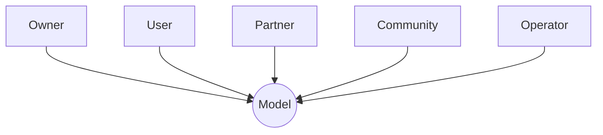

# 1. AI development lifecycle

```mermaid

  graph TD
  owner["Owner"] --> model(("Model"))
  user["User"] --> model
  partner["Partner"] --> model
  community["Community"] --> model
  operator["Operator"] --> model
  

```

# 2. Security in AI

# 3. Usecase: Data Poisoning
