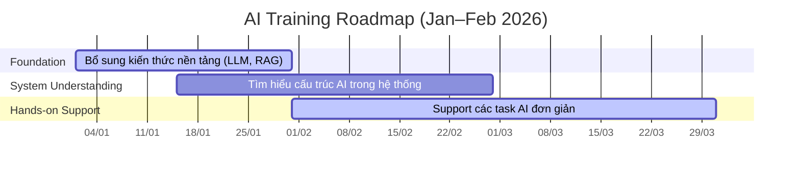

# Bổ sung kiến thức nền tảng cơ bản: (Due date: 31/1/2026)
- **Mentor**: @anhtt3
- Overview: Liên kết hiểu biết giữa BE và AIE (tập trung vào LLM)
- Concept cơ bản cần biết:
  - Tokenization
  - Text embedding
  - Context window
  - top-k, top-p
  - Similarity search
  - Prompt Engineering
  - Context Engineering
- Các công cụ cơ bản:
  - Vector Database: Milvus
  - RAG: Langchain

# Tìm hiểu cấu trúc của phần AI trong hệ thống: (Due date: 28/2/2026)
- **Mentor**: @minhbc1

# Support các task đơn giản: (Start Date: 31/1/2026)
- Mentor: @minhbc1, @tamnm

