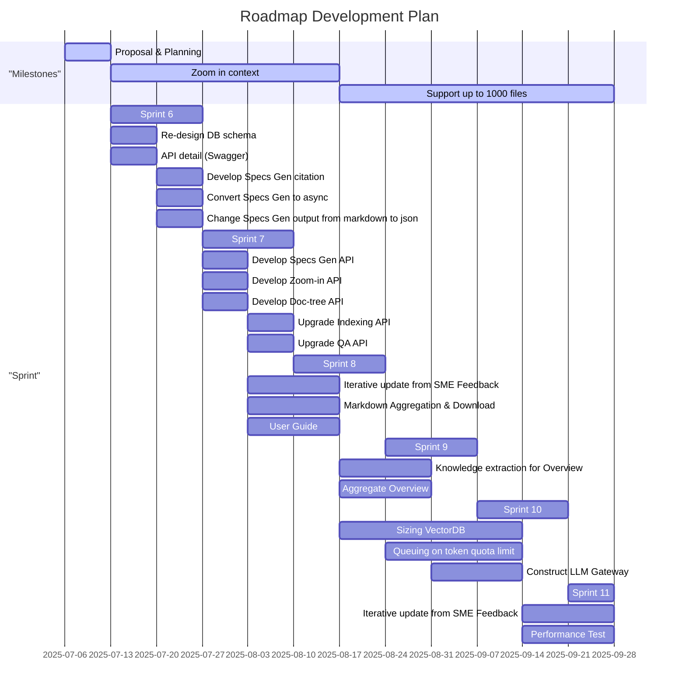

# Roadmap

```mermaid

gantt
    title Roadmap Development Plan
    dateFormat  YYYY-MM-DD
    axisFormat  %Y-%m-%d

    section "Milestones"
    Proposal & Planning                     :active, zoom, 2025-07-06, 2025-07-13
    Zoom in context                     :active, zoom, 2025-07-13, 2025-08-17
    Support up to 1000 files           :active, scale_up, 2025-08-17, 2025-09-28

    section "Sprint"
    Sprint 6                        :sprint_6, 2025-07-13, 2025-07-27
    Re-design DB schema                :db_schema, 2025-07-13, 2025-07-20
    API detail (Swagger)            :doc_api, 2025-07-13, 2025-07-20

    Develop Specs Gen citation             :citation_api, 2025-07-20, 2025-07-27
    Convert Specs Gen to async         :specs_async, 2025-07-20, 2025-07-27
    Change Specs Gen output from markdown to json             :convert_json, 2025-07-20, 2025-07-27

    Sprint 7                        :sprint_7, 2025-07-27, 2025-08-10
    Develop Specs Gen API   :gen_specs, 2025-07-27, 2025-08-03
    Develop Zoom-in API   :zoom-in, 2025-07-27, 2025-08-03
    Develop Doc-tree API   :doc-tree, 2025-07-27, 2025-08-03

    Upgrade Indexing API    :index_api, 2025-08-03, 2025-08-10
    Upgrade QA API    :qa_api, 2025-08-03, 2025-08-10

    Sprint 8                        :sprint_8, 2025-08-10, 2025-08-24
    Iterative update from SME Feedback  :optimize, 2025-08-03, 2025-08-17
    Markdown Aggregation & Download   :markdown, 2025-08-03, 2025-08-17
    User Guide          :user-guide, 2025-08-03, 2025-08-17

    Sprint 9                        :sprint_9, 2025-08-24, 2025-09-07
    Knowledge extraction for Overview    :knowledge_extract, 2025-08-17, 2025-08-31
    Aggregate Overview    :aggregate_overview, 2025-08-17, 2025-08-31

    Sprint 10                        :sprint_10, 2025-09-07, 2025-09-21
    Sizing VectorDB    :sizing_vectordb, 2025-08-17, 2025-09-14
    Queuing on token quota limit    :queue_on_limit, 2025-08-24, 2025-09-14
    Construct LLM Gateway    :llm_gateway, 2025-08-31, 2025-09-14

    Sprint 11                        :sprint_11, 2025-09-21, 2025-09-28
    Iterative update from SME Feedback  :optimize, 2025-09-14, 2025-09-28
    Performance Test  :optimize, 2025-09-14, 2025-09-28


```
