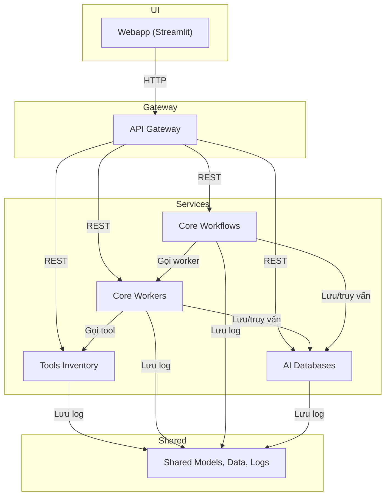

# COBOL AI Assistant - Tổng quan hệ thống

## Kiến trúc tổng thể

Hệ thống gồm nhiều microservice, mỗi service đảm nhiệm một vai trò riêng biệt, giao tiếp qua API Gateway và chia sẻ dữ liệu qua thư mục `shared`.

## Các thành phần chính

- **Webapp**: Giao diện người dùng (Streamlit), cho phép upload, index, chat với code COBOL/COPY/JCL.
- **API Gateway**: Cửa ngõ duy nhất, route request đến các service phù hợp, merge OpenAPI spec.
- **Core Workers**: Xử lý parser, embedding, LLM, rerank, vector search.
- **Core Workflows**: Orchestrate các workflow phức tạp: indexing, retrieval, QA, specs.
- **AI Databases**: Quản lý vector DB (Milvus) và metadata DB (Postgres), lưu trữ embedding, specs, feedback.
- **Tools Inventory**: API hóa các tool parser, embedding, LLM, rerank, chunker, ...
- **Shared**: Chứa models, log, file tạm, upload, cấu hình dùng chung giữa các service.

## Data Flow cơ bản

1. Người dùng upload file/code qua Webapp.
2. Webapp gửi request lên API Gateway.
3. Gateway route đến Core Workers để parse/index/embedding hoặc Core Workflows để orchestrate.
4. Core Workers gọi Tools Inventory để chunk/embedding hoặc lưu/truy vấn AI Databases.
5. Kết quả trả về Gateway, rồi về Webapp hiển thị cho user.

## Công nghệ sử dụng
- Python 3.8+, FastAPI, Streamlit, Celery
- Milvus (vector DB), PostgreSQL (metadata)
- Docker, docker-compose
- Pydantic (models), httpx, uvicorn

## Thư mục chính
- `microservices/` - Chứa toàn bộ source code các service
- `shared/` - Models, log, file tạm, upload, cấu hình dùng chung
- `BotDocs/` - Tài liệu dự án (thư mục này)

---

> Xem tiếp các file trong BotDocs để biết chi tiết từng service, hướng dẫn dev, specs DB, ... 