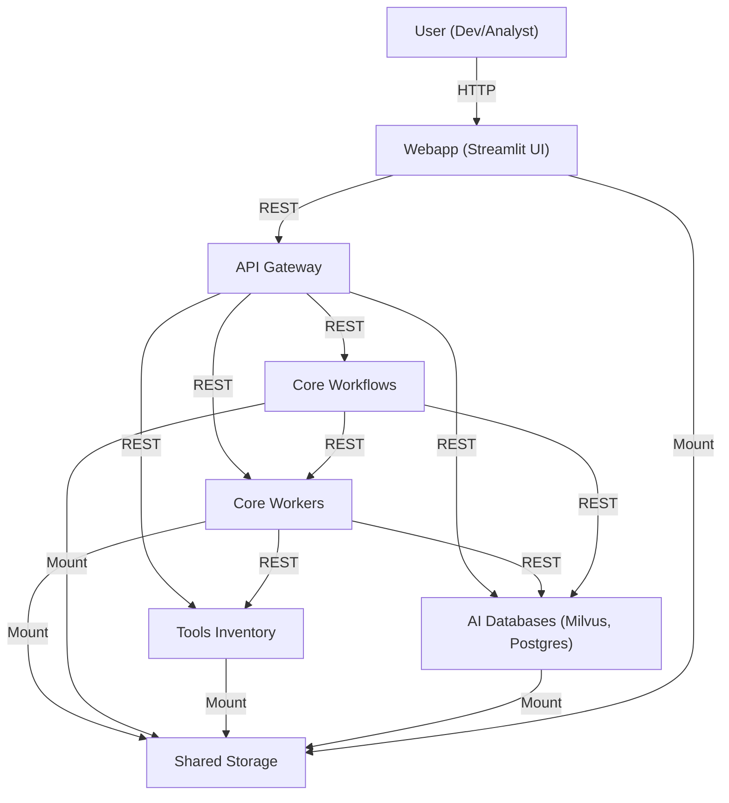
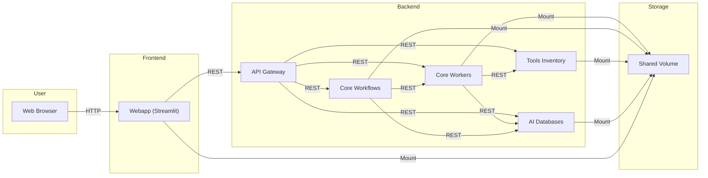
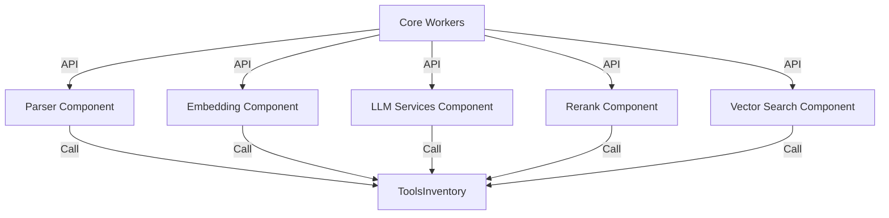
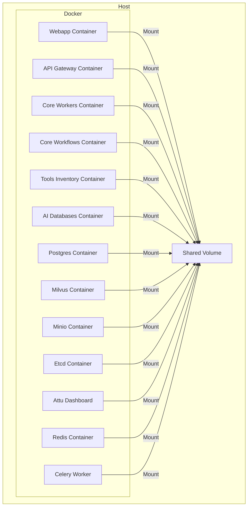

# C4 Architecture - COBOL AI Assistant (Microservices)

## 1. Context Diagram
Hệ thống COBOL AI Assistant phục vụ người dùng cuối (developer, analyst) thao tác với code COBOL/COPY/JCL qua giao diện web, sử dụng các dịch vụ AI, lưu trữ, và workflow tự động.

---

## 2. Container Diagram
Các container chính trong hệ thống:
- **Webapp**: Giao diện người dùng, upload, chat, xem kết quả.
- **API Gateway**: Route request, bảo vệ, hợp nhất API.
- **Core Workers**: Xử lý parser, embedding, LLM, rerank, vector search.
- **Core Workflows**: Orchestrate các workflow phức tạp (indexing, retrieval, QA, specs).
- **Tools Inventory**: API hóa các tool parser, embedding, LLM, rerank, chunker.
- **AI Databases**: Milvus (vector DB), Postgres (metadata, specs, feedback).
- **Shared Storage**: Mount chung cho log, models, file tạm, upload.

---

## 3. Component Diagram (ví dụ: Core Workers)
Các component chính trong Core Workers:
- **Parser**: Phân tích file COBOL, COPY, JCL, TEXT thành các chunk.
- **Embedding**: Sinh embedding cho chunk/text.
- **LLM Services**: Gọi LLM sinh summary, QA, specs.
- **Rerank**: Rerank kết quả search.
- **Vector Search**: Tìm kiếm vector DB.

---

## 4. Deployment Diagram
Triển khai hệ thống bằng Docker Compose, mỗi service là một container độc lập, mount chung shared volume.

---

> Tài liệu này mô tả kiến trúc C4 cho hệ thống COBOL AI Assistant dựa trên microservices. Xem thêm chi tiết các flow, API, models trong các file khác của BotDocs. 