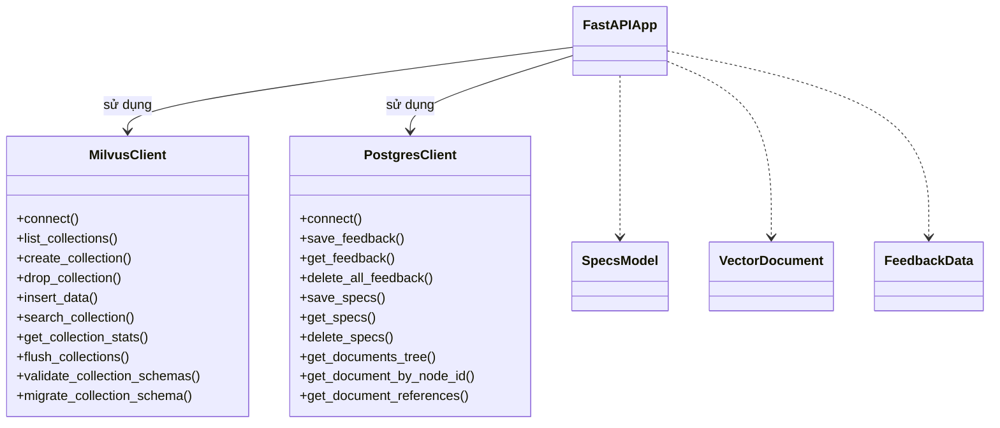

# C4 Level 4 - AI Databases Component

## 1. Main API Structure

- `FastAPIApp` là entrypoint, định nghĩa các route API cho vector DB (Milvus) và metadata DB (Postgres).
- `MilvusClient` wrap các thao tác với vector DB.
- `PostgresClient` wrap các thao tác với metadata, specs, feedback.
- Models chuẩn hóa input/output.

## 2. API chính
- `/vector/collections/*`: CRUD collection, insert/search vector, stats, schema.
- `/metadata/feedback`: Lưu/truy vấn/xóa feedback.
- `/specs_v2/*`: Lưu/truy vấn/xóa specs dạng tree, truy vấn tree/citation.

## 3. Liên kết với các component khác
- Được gọi bởi **Core Workers**, **Core Workflows**, **Tools Inventory** qua REST API.
- Là nơi lưu trữ trung tâm cho embedding, specs, feedback, citation, tree section.
- Kết quả trả về cho các workflow QA, retrieval, specs, ...

---

> Xem thêm các file C4 Level 4 khác cho LLM, Parser, Embedding, Rerank, Vector Search để hiểu toàn bộ kiến trúc code. 