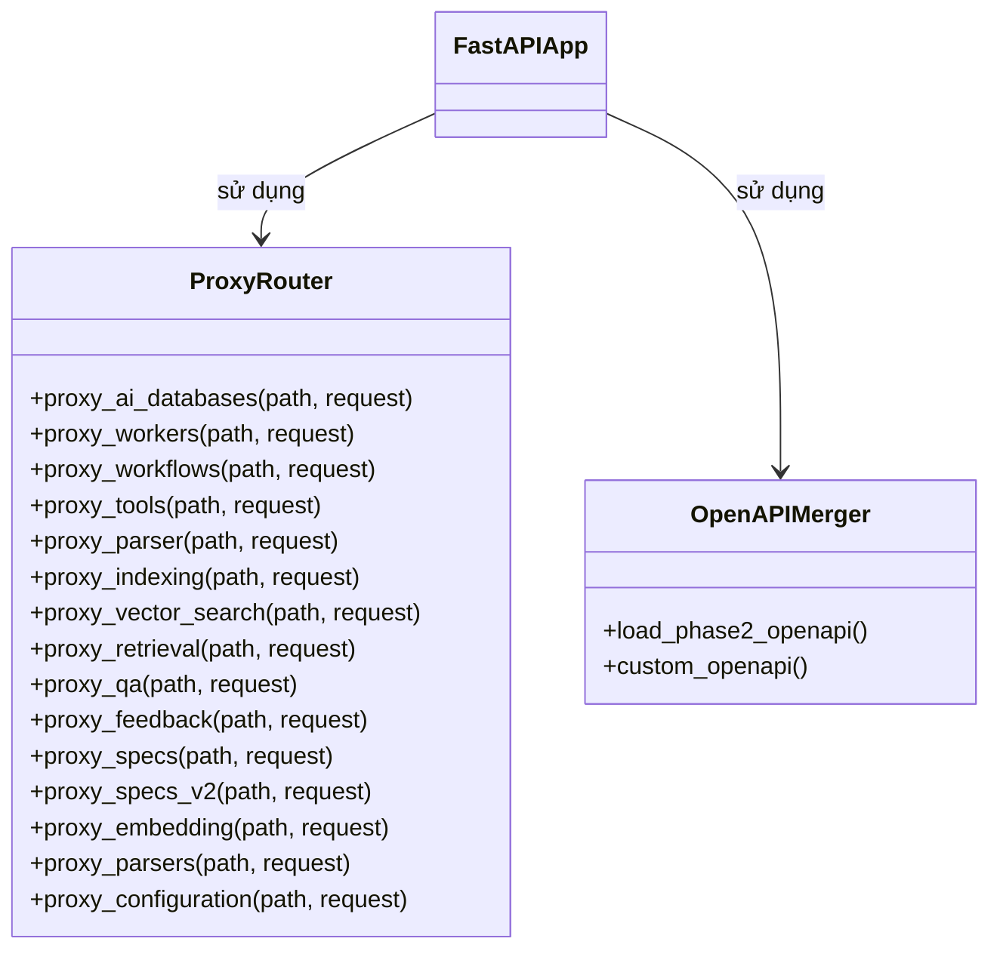

# C4 Level 4 - API Gateway Component

## 1. Main API Structure

- `FastAPIApp` là entrypoint, định nghĩa các route API, health check, config.
- `ProxyRouter` định nghĩa các hàm proxy cho từng service, nhận request từ webapp hoặc client, forward sang service backend.
- `OpenAPIMerger` merge spec OpenAPI từ nhiều phase.

## 2. API chính
- `/ai-databases/*`, `/workers/*`, `/workflows/*`, `/tools/*`, ...: Proxy request đến các service tương ứng.
- `/health`, `/config`, `/services`: Health check, config, service discovery.

## 3. Liên kết với các component khác
- Là entrypoint duy nhất cho webapp và client bên ngoài.
- Route request đến các service backend: Core Workers, Core Workflows, Tools Inventory, AI Databases.
- Merge OpenAPI spec để hỗ trợ doc, test, mở rộng API.

---

> Xem thêm các file C4 Level 4 khác cho LLM, Parser, Embedding, Rerank, Vector Search, AI Databases để hiểu toàn bộ kiến trúc code. 