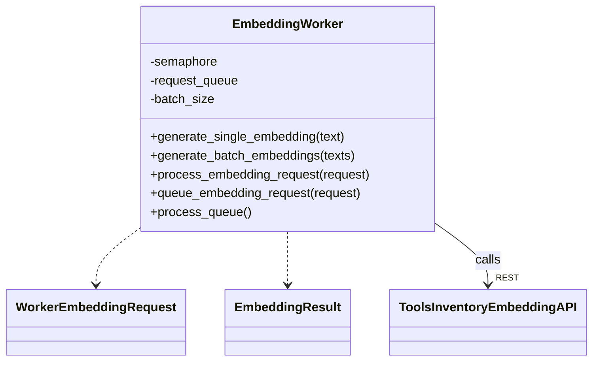
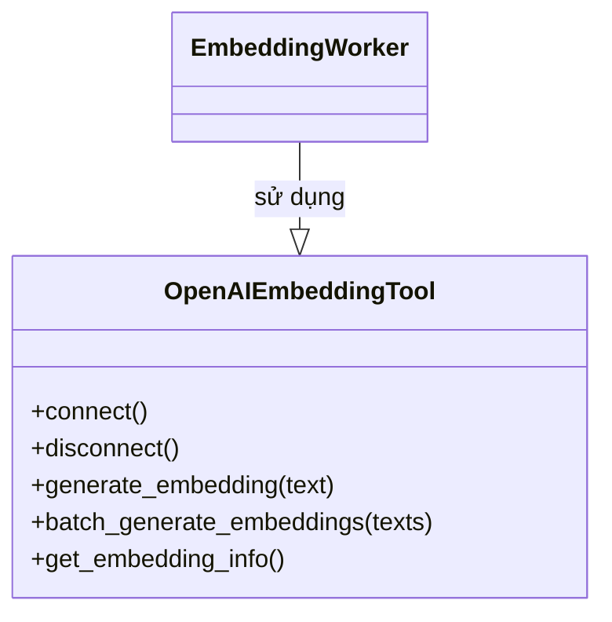

# C4 Level 4 - Embedding Component (Core Workers & Tools Inventory)

## 1. EmbeddingWorker (Core Workers)

- `EmbeddingWorker` là entrypoint phía Core Workers, nhận request embedding, gọi API sang Tools Inventory.
- Có thể xử lý batch, queue, trả về kết quả chuẩn hóa.
- Giao tiếp với Tools Inventory qua HTTP REST.

## 2. Tools Inventory Embedding Services

- `OpenAIEmbeddingTool` wrap API OpenAI embedding, hỗ trợ batch, retry, info.
- Có thể mở rộng thêm các provider embedding khác.

## 3. Liên kết với các component khác
- EmbeddingWorker được gọi bởi **Core Workflows** (indexing, retrieval workflow), hoặc sau khi parse.
- Embedding là đầu vào cho Vector Search, LLM, Rerank.
- Các tool embedding phía Tools Inventory cũng được các worker khác gọi tương tự.

---

> Xem thêm các file C4 Level 4 khác cho LLM, Parser, Rerank, Vector Search để hiểu toàn bộ kiến trúc code. 