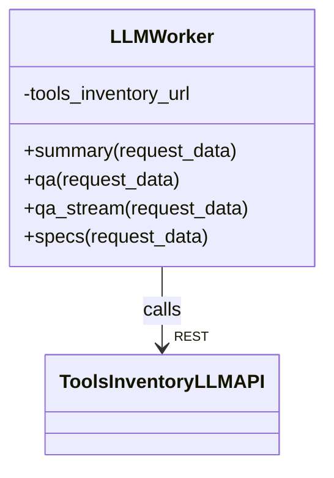

# C4 Level 4 - LLM Component (Core Workers & Tools Inventory)

## 1. LLMWorker (Core Workers)


- `LLMWorker` là entrypoint phía Core Workers, nhận request từ workflow, gọi API sang Tools Inventory.
- Giao tiếp qua HTTP REST.

## 2. Tools Inventory LLM Services
```mermaid
classDiagram
    class QAToolRequest
    class QAResponse
    class QATool {
        +response(QAToolRequest) : QAResponse
        +stream_response(QAToolRequest) : AsyncGenerator
    }
    class SummaryRequest
    class SummaryResult
    class SummaryTool {
        +response(SummaryRequest) : SummaryResult
        +generate_summary(chunks)
    }
    class SpecsRequest
    class SpecsTool {
        +generate_specs(repo_path, content)
        +generate_comprehensive_documentation(...)
    }
    QATool ..> QAToolRequest
    QATool ..> QAResponse
    SummaryTool ..> SummaryRequest
    SummaryTool ..> SummaryResult
    SpecsTool ..> SpecsRequest
    QATool --|> OpenAI/AsyncOpenAI : sử dụng
    SummaryTool --|> OpenAI/AsyncOpenAI : sử dụng
    SpecsTool --|> OpenAI/AsyncOpenAI : sử dụng
```

- `QATool`, `SummaryTool`, `SpecsTool` là các class chính phía Tools Inventory, wrap API LLM (OpenAI).
- Các class request/response dùng dataclass để chuẩn hóa input/output.
- Có thể mở rộng thêm các LLM provider khác.

## 3. Liên kết với các component khác
- LLMWorker được gọi bởi **Core Workflows** (QA, summary, specs workflow).
- LLMWorker có thể gọi lại **Tools Inventory** để chunk, embedding, rerank (qua các API khác).
- Các tools phía Tools Inventory cũng được các worker khác (Parser, Embedding, Rerank) gọi tương tự.

---

> Xem thêm các file C4 Level 4 khác cho Parser, Embedding, Rerank, Vector Search để hiểu toàn bộ kiến trúc code. 