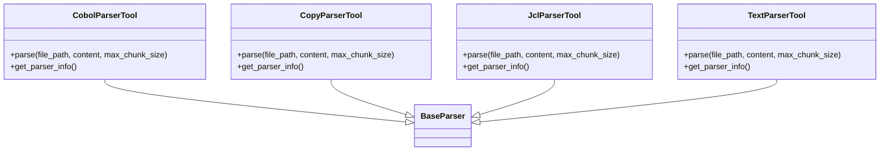

# C4 Level 4 - Parser Component (Core Workers & Tools Inventory)

## 1. ParserWorker (Core Workers)

- `ParserWorker` là entrypoint phía Core Workers, nhận request parse, gọi API sang Tools Inventory.
- Có thể parse file, folder, zip, queue request, trả về kết quả chuẩn hóa.
- Giao tiếp với Tools Inventory qua HTTP REST.

## 2. Tools Inventory Parser Services

- Mỗi loại file có một tool parser riêng, đều implement hàm `parse` và `get_parser_info`.
- Có thể mở rộng thêm parser cho loại file khác.

## 3. Liên kết với các component khác
- ParserWorker được gọi bởi **Core Workflows** (indexing workflow).
- Kết quả parse được dùng cho Embedding, LLM, Vector Search, Specs.
- Các tool parser phía Tools Inventory cũng được các worker khác gọi tương tự.

---

> Xem thêm các file C4 Level 4 khác cho LLM, Embedding, Rerank, Vector Search để hiểu toàn bộ kiến trúc code. 