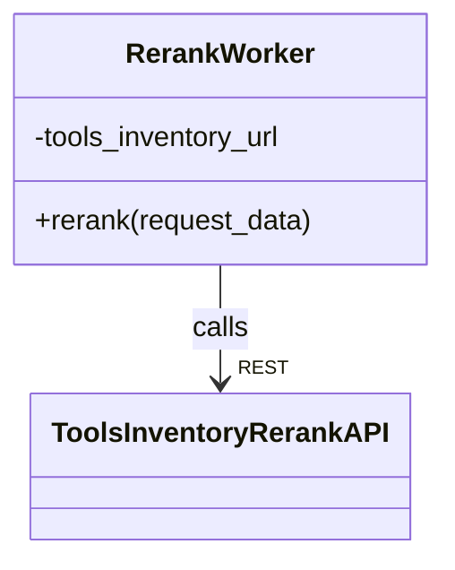
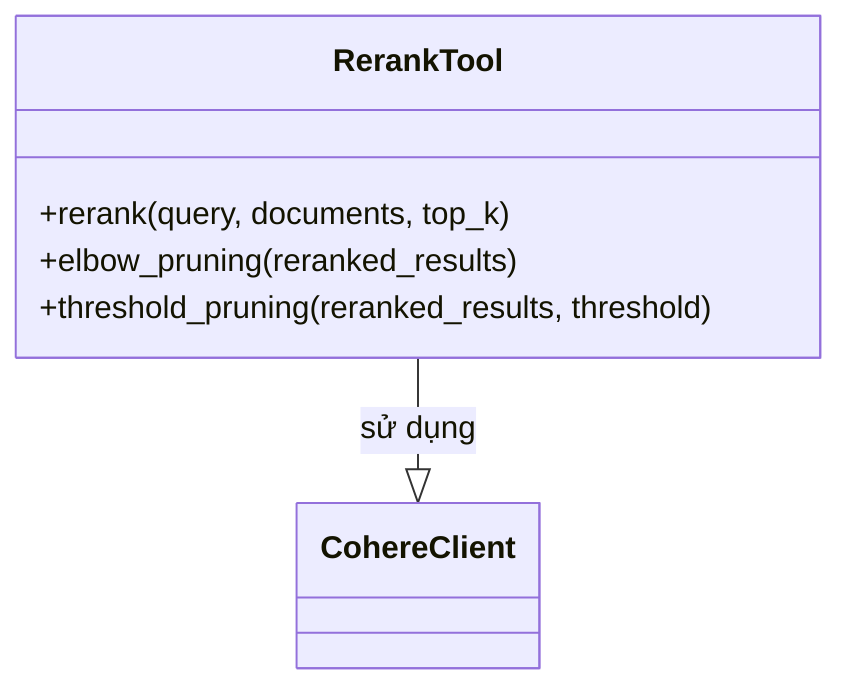

# C4 Level 4 - Rerank Component (Core Workers & Tools Inventory)

## 1. RerankWorker (Core Workers)

- `RerankWorker` là entrypoint phía Core Workers, nhận request rerank, gọi API sang Tools Inventory.
- Giao tiếp với Tools Inventory qua HTTP REST.

## 2. Tools Inventory Rerank Services

- `RerankTool` wrap API Cohere rerank, hỗ trợ các phương pháp pruning.
- Có thể mở rộng thêm các provider rerank khác.

## 3. Liên kết với các component khác
- RerankWorker được gọi bởi **Core Workflows** (retrieval workflow), hoặc sau Vector Search.
- Kết quả rerank là đầu vào cho LLM QA, Specs, hoặc trả về user.
- Các tool rerank phía Tools Inventory cũng được các worker khác gọi tương tự.

---

> Xem thêm các file C4 Level 4 khác cho LLM, Parser, Embedding, Vector Search để hiểu toàn bộ kiến trúc code. 