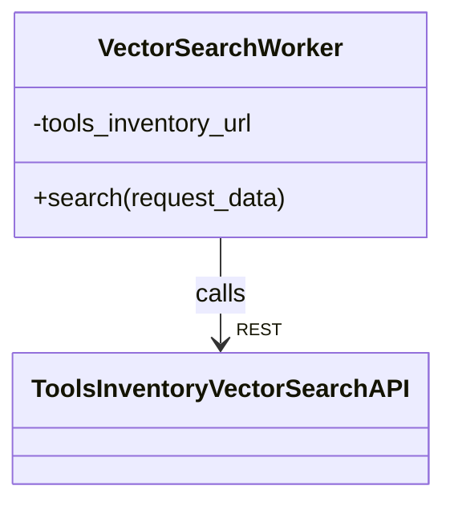
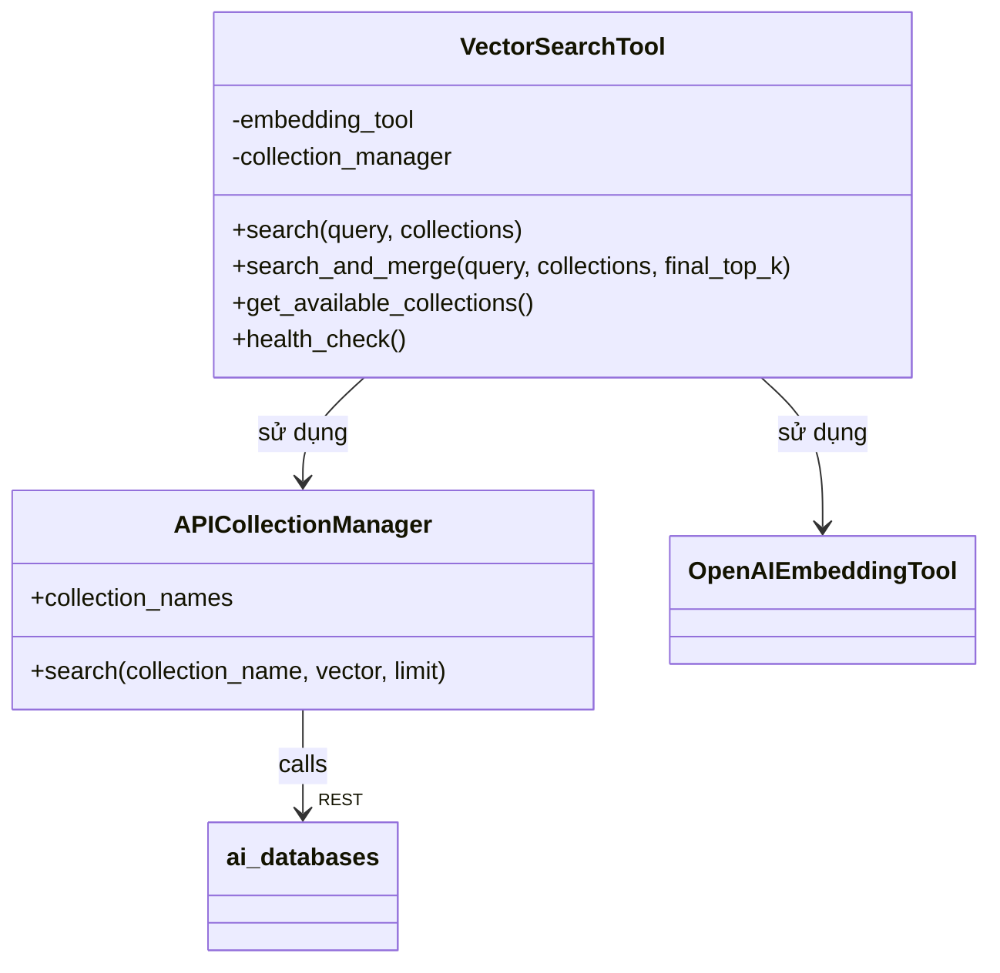

# C4 Level 4 - Vector Search Component (Core Workers & Tools Inventory)

## 1. VectorSearchWorker (Core Workers)

- `VectorSearchWorker` là entrypoint phía Core Workers, nhận request search, gọi API sang Tools Inventory.
- Giao tiếp với Tools Inventory qua HTTP REST.

## 2. Tools Inventory Vector Search Services

- `VectorSearchTool` wrap logic search, merge, mapping collection, gọi embedding, gọi ai_databases.
- Có thể mở rộng thêm các provider vector search khác.

## 3. Liên kết với các component khác
- VectorSearchWorker được gọi bởi **Core Workflows** (retrieval workflow), hoặc sau Embedding.
- Kết quả search là đầu vào cho Rerank, LLM QA, Specs, hoặc trả về user.
- Các tool vector search phía Tools Inventory cũng được các worker khác gọi tương tự.

---

> Xem thêm các file C4 Level 4 khác cho LLM, Parser, Embedding, Rerank để hiểu toàn bộ kiến trúc code. 