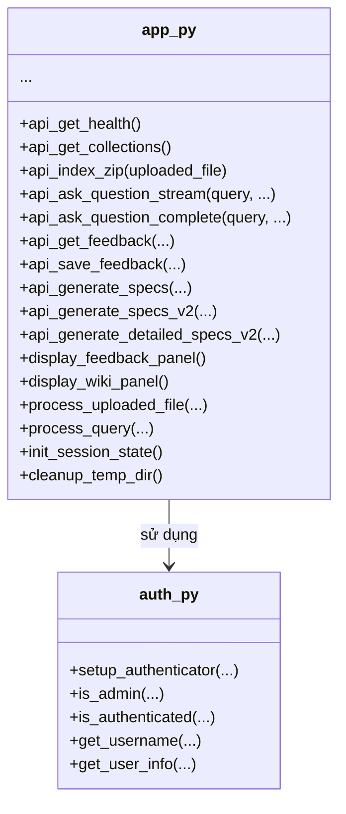

# C4 Level 4 - Webapp Component

## 1. Main Module Structure

- `app.py` là entrypoint, định nghĩa toàn bộ UI, các hàm gọi API backend, xử lý upload, chat, specs, feedback.
- `auth.py` quản lý xác thực, phân quyền, thông tin user.
- Các hàm `api_*` wrap call đến API Gateway.

## 2. Liên kết với các component khác
- Giao tiếp với **API Gateway** qua HTTP REST (API_BASE_URL).
- Nhận dữ liệu từ user, upload file, gửi câu hỏi, nhận kết quả QA/specs/feedback.
- Hiển thị kết quả, feedback, specs cho user.

---

> Xem thêm các file C4 Level 4 khác cho LLM, Parser, Embedding, Rerank, Vector Search, AI Databases, API Gateway để hiểu toàn bộ kiến trúc code. 