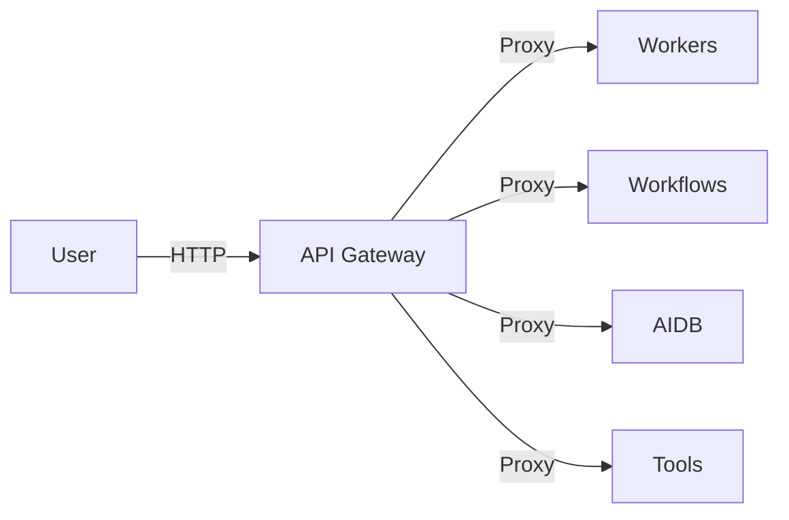

# Microservices - Chi tiết các thành phần

## 1. API Gateway
- **Chức năng:**
  - Là entrypoint duy nhất, route request đến các service phù hợp.
  - Merge OpenAPI spec từ các phase, hỗ trợ mở rộng API.
- **API chính:**
  - `/health`: Kiểm tra trạng thái gateway và các service phụ thuộc.
  - `/ai-databases/*`, `/workers/*`, `/workflows/*`, `/tools/*`, ...: Proxy request đến các service tương ứng.
- **Config:**
  - Đọc file `swagger_phase2.yaml` để merge API spec.
  - Mount shared volume để ghi log, dùng models chung.
- **Flow mermaid:**

---

## 2. Core Workers
- **Chức năng:**
  - Xử lý parser (COBOL, COPY, JCL, TEXT), embedding, LLM, rerank, vector search.
  - Đóng vai trò worker thực thi các tác vụ nặng.
- **API chính:**
  - `/parser/parse-zip`, `/parser/parse-file`: Parse file/zip thành các chunk.
  - `/embedding/generate`: Sinh embedding cho text/chunk.
  - `/llm/summary`, `/llm/qa`: Gọi LLM sinh summary, trả lời QA.
  - `/rerank/rerank`: Rerank kết quả search.
  - `/vector-search/vector`: Search vector DB.
- **Config:**
  - Đọc API key từ env (OpenAI, Cohere).
  - Mount shared volume để dùng models, log, file tạm.
- **Dependency:**
  - Gọi Tools Inventory để chunk/embedding nếu cần.
  - Gọi AI Databases để lưu/truy vấn embedding, vector.

---

## 3. Core Workflows
- **Chức năng:**
  - Orchestrate các workflow phức tạp: indexing, retrieval, QA, specs.
  - Sử dụng Celery để quản lý task async.
- **API chính:**
  - `/indexing/index-zip`: Index toàn bộ zip file.
  - `/retrieval/search`: Search tài liệu đa nguồn.
  - `/qa/ask`: Hỏi đáp tự động.
  - `/specs/generate-specs`, `/specs-v2/generate-specs`: Sinh specs tự động.
- **Config:**
  - Đọc URL các service khác từ env.
  - Mount shared volume để dùng models, log, file tạm.
- **Dependency:**
  - Gọi Core Workers, AI Databases, Tools Inventory qua API.

---

## 4. AI Databases
- **Chức năng:**
  - Quản lý vector DB (Milvus) và metadata DB (Postgres).
  - Lưu trữ embedding, specs, feedback, citation, tree section.
- **API chính:**
  - `/vector/collections/*`: CRUD collection, insert/search vector.
  - `/metadata/feedback`: Lưu/truy vấn feedback.
  - `/specs_v2/*`: Lưu/truy vấn/xóa specs dạng tree.
- **Config:**
  - Đọc thông tin DB từ env hoặc docker-compose.
  - Mount shared volume để log, models.
- **Dependency:**
  - Milvus, PostgreSQL.

---

## 5. Tools Inventory
- **Chức năng:**
  - API hóa các tool parser, embedding, LLM, rerank, chunker, ...
  - Đóng vai trò "toolbox" cho các service khác gọi.
- **API chính:**
  - `/chunkers/*`: Chunk file COBOL, COPY, JCL, TEXT.
  - `/embedding/generate`: Sinh embedding.
  - `/llm/summary`, `/llm/qa`: LLM summary, QA.
  - `/rerank/rerank`: Rerank kết quả search.
  - `/specs/generate-specs`, `/specs-v2/generate-specs`: Sinh specs.
- **Config:**
  - Mount shared volume để models, log, file tạm.
- **Dependency:**
  - Gọi các tool nội bộ, không phụ thuộc service ngoài.

---

## 6. Webapp
- **Chức năng:**
  - Giao diện người dùng (Streamlit), upload file, index, chat, xem kết quả.
  - Gọi API Gateway để thực hiện các thao tác.
- **Flow chính:**
  1. User upload file/zip.
  2. Webapp gọi API Gateway để index/parse.
  3. User chat, webapp gửi câu hỏi lên Gateway, nhận kết quả QA, hiển thị.
- **Config:**
  - Đọc API endpoint từ env.
  - Mount shared volume để log, file tạm.

---

## 7. Shared
- **Chức năng:**
  - Chứa models, log, file tạm, upload, cấu hình dùng chung giữa các service.
  - Được mount vào tất cả container.

---

> Xem tiếp các file trong BotDocs để biết chi tiết models, hướng dẫn dev, specs DB, ... 