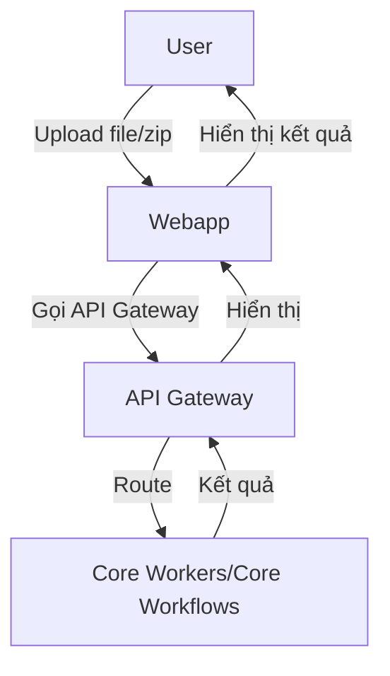

# Webapp Guide - Hướng dẫn sử dụng & phát triển giao diện web

## 1. Chức năng chính
- Upload file/zip COBOL, COPY, JCL
- Index, parse, sinh specs tự động
- Chat hỏi đáp với codebase (QA)
- Xem, tải specs/wiki, feedback

## 2. Flow sử dụng

## 3. Cấu hình
- Sửa file `.env` hoặc biến môi trường:
  - `API_BASE_URL` (mặc định: http://api-gateway:8000)
- Có thể đổi port webapp trong docker-compose hoặc khi chạy local

## 4. Phát triển mở rộng
- Code chính ở `webapp/app.py` (Streamlit)
- Auth ở `webapp/auth.py`
- Khi thêm chức năng mới:
  - Thêm hàm gọi API mới (dùng requests)
  - Thêm UI component (st.button, st.file_uploader, ...)
  - Đảm bảo xử lý lỗi, hiển thị log rõ ràng
- Có thể custom theme, thêm CSS trong app.py

## 5. Lưu ý
- Khi upload file lớn, nên kiểm tra log để debug lỗi
- Nếu API Gateway đổi port, cần sửa lại `API_BASE_URL`
- Có thể chạy webapp độc lập để test UI, chỉ cần API Gateway chạy

## 6. Ví dụ sử dụng
- Truy cập http://localhost:8501
- Upload file zip COBOL, nhấn Index
- Chờ kết quả, sau đó chat hỏi đáp với codebase
- Xem specs sinh tự động ở panel bên phải

---

> Xem lại các file khác trong BotDocs để hiểu kiến trúc, specs, dev, deploy ... 