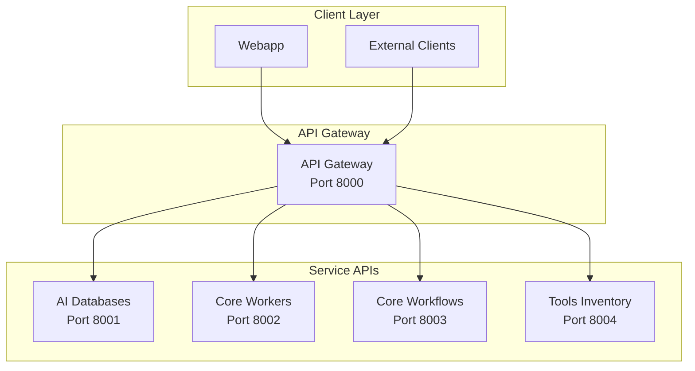

# API Design

## 🎯 Mục đích

Tài liệu này mô tả thiết kế API của hệ thống COBOL Assistant, bao gồm API patterns, endpoints, và best practices.

## 🏗️ API Architecture

### API Overview



### API Design Principles

1. **RESTful Design**: Follow REST conventions
2. **Consistent Response Format**: Standardized response structure
3. **Error Handling**: Comprehensive error responses
4. **Documentation**: OpenAPI/Swagger documentation
5. **Versioning**: API versioning strategy

## 🔧 API Gateway

### Base URL
```
http://localhost:8000
```

### Health Check
```http
GET /health
```

**Response**:
```json
{
  "success": true,
  "status": "HEALTHY",
  "service": "api_gateway",
  "timestamp": "2024-01-01T00:00:00Z"
}
```

### Service Proxies

#### AI Databases Proxy
```http
# Vector operations
POST /ai-databases/vector/insert
POST /ai-databases/vector/search
GET /ai-databases/vector/collections

# Metadata operations
POST /ai-databases/metadata/insert
GET /ai-databases/metadata/files
PUT /ai-databases/metadata/update

# Specs operations
POST /ai-databases/specs/save
GET /ai-databases/specs/get
DELETE /ai-databases/specs/delete
```

#### Core Workers Proxy
```http
# Parser operations
POST /core-workers/parser/parse-zip
POST /core-workers/parser/parse-file

# Embedding operations
POST /core-workers/embedding/generate
POST /core-workers/embedding/batch-generate

# LLM operations
POST /core-workers/llm/summary
POST /core-workers/llm/qa
POST /core-workers/llm/specs

# Vector search operations
POST /core-workers/vector-search/search
POST /core-workers/vector-search/multi-collection

# Rerank operations
POST /core-workers/rerank/rerank
```

#### Core Workflows Proxy
```http
# Indexing workflow
POST /core-workflows/indexing/index-zip
GET /core-workflows/indexing/status/{task_id}

# QA workflow
POST /core-workflows/qa/ask
POST /core-workflows/qa/ask-stream

# Specs workflow
POST /core-workflows/specs-v2/generate-specs
POST /core-workflows/specs-v2/delete-specs
POST /core-workflows/specs-v2/zoom-in

# Retrieval workflow
POST /core-workflows/retrieval/search
```

#### Tools Inventory Proxy
```http
# Tool operations
POST /tools-inventory/parsers/cobol
POST /tools-inventory/parsers/copy
POST /tools-inventory/parsers/jcl
POST /tools-inventory/parsers/text

# Embedding tools
POST /tools-inventory/embedding/generate
POST /tools-inventory/embedding/batch

# LLM tools
POST /tools-inventory/llm/summary
POST /tools-inventory/llm/qa
POST /tools-inventory/llm/specs

# Vector search tools
POST /tools-inventory/vector-search/search
POST /tools-inventory/vector-search/multi-collection

# Rerank tools
POST /tools-inventory/rerank/rerank
```

## 📡 Service APIs

### AI Databases API

#### Vector Operations
```http
POST /vector/insert
Content-Type: application/json

{
  "collection_name": "sections",
  "documents": [
    {
      "id": "doc_1",
      "content": "COBOL code content",
      "embedding": [0.1, 0.2, ...],
      "metadata": {
        "file_path": "/path/to/file.cbl",
        "file_type": "COBOL"
      }
    }
  ]
}
```

```http
POST /vector/search
Content-Type: application/json

{
  "collection_name": "sections",
  "query_embedding": [0.1, 0.2, ...],
  "top_k": 10,
  "search_params": {
    "metric_type": "COSINE",
    "params": {"nprobe": 10}
  }
}
```

#### Metadata Operations
```http
POST /metadata/insert
Content-Type: application/json

{
  "table_name": "files",
  "data": {
    "file_path": "/path/to/file.cbl",
    "file_name": "file.cbl",
    "file_type": "COBOL",
    "file_size": 1024,
    "hash_value": "abc123"
  }
}
```

### Core Workers API

#### Parser Operations
```http
POST /parser/parse-zip
Content-Type: multipart/form-data

zip_file: [binary data]
max_chunk_size: 6000
hash_dir: optional_hash
```

**Response**:
```json
{
  "success": true,
  "data": {
    "files_processed": 5,
    "chunks_created": 25,
    "processing_time": 30.5,
    "files": [
      {
        "file_path": "file1.cbl",
        "file_type": "COBOL",
        "chunks": 5,
        "summary": "File summary"
      }
    ]
  }
}
```

#### Embedding Operations
```http
POST /embedding/generate
Content-Type: application/json

{
  "content": "Text to embed",
  "file_path": "/path/to/file.cbl",
  "model_name": "text-embedding-3-small"
}
```

**Response**:
```json
{
  "success": true,
  "data": {
    "embedding": [0.1, 0.2, ...],
    "model_name": "text-embedding-3-small",
    "dimensions": 1536
  }
}
```

#### LLM Operations
```http
POST /llm/qa
Content-Type: application/json

{
  "question": "What does this COBOL program do?",
  "context": [
    {
      "content": "COBOL code content",
      "metadata": {"file_path": "file.cbl"}
    }
  ],
  "model_name": "gpt-4",
  "temperature": 0.7,
  "max_tokens": 1000
}
```

**Response**:
```json
{
  "success": true,
  "data": {
    "answer": "This COBOL program processes customer data...",
    "references": [
      {
        "file_path": "file.cbl",
        "line_start": 10,
        "line_end": 20
      }
    ],
    "model_name": "gpt-4",
    "tokens_used": 150
  }
}
```

### Core Workflows API

#### Indexing Workflow
```http
POST /indexing/index-zip
Content-Type: multipart/form-data

zip_file: [binary data]
chunk_size: 6000
batch_size: 100
hash_dir: optional_hash
```

**Response**:
```json
{
  "success": true,
  "data": {
    "task_id": "task_123",
    "status": "PENDING",
    "message": "Indexing started"
  }
}
```

#### QA Workflow
```http
POST /qa/ask
Content-Type: application/json

{
  "question": "What does this COBOL program do?",
  "collections": ["sections", "wiki"],
  "top_k": 10,
  "rerank": true
}
```

**Response**:
```json
{
  "success": true,
  "data": {
    "answer": "This COBOL program processes customer data...",
    "references": [
      {
        "content": "COBOL code snippet",
        "file_path": "file.cbl",
        "score": 0.95
      }
    ],
    "processing_time": 2.5
  }
}
```

## 📊 Response Format

### Success Response
```json
{
  "success": true,
  "data": {
    // Response data
  },
  "timestamp": "2024-01-01T00:00:00Z",
  "service": "api_gateway"
}
```

### Error Response
```json
{
  "success": false,
  "error": "Error message",
  "error_code": "VALIDATION_ERROR",
  "details": {
    "field": "file_path",
    "message": "File path is required"
  },
  "timestamp": "2024-01-01T00:00:00Z",
  "service": "api_gateway"
}
```

### Pagination Response
```json
{
  "success": true,
  "data": {
    "items": [...],
    "pagination": {
      "page": 1,
      "per_page": 20,
      "total": 100,
      "total_pages": 5
    }
  }
}
```

## 🔍 Error Handling

### HTTP Status Codes

| Code | Description | Usage |
|------|-------------|-------|
| 200 | OK | Successful request |
| 201 | Created | Resource created |
| 400 | Bad Request | Invalid request data |
| 401 | Unauthorized | Authentication required |
| 403 | Forbidden | Access denied |
| 404 | Not Found | Resource not found |
| 422 | Unprocessable Entity | Validation error |
| 500 | Internal Server Error | Server error |
| 503 | Service Unavailable | Service down |

### Error Types

#### Validation Errors
```json
{
  "success": false,
  "error": "Validation failed",
  "error_code": "VALIDATION_ERROR",
  "details": [
    {
      "field": "file_path",
      "message": "File path is required"
    },
    {
      "field": "file_type",
      "message": "Invalid file type"
    }
  ]
}
```

#### Service Errors
```json
{
  "success": false,
  "error": "Service unavailable",
  "error_code": "SERVICE_UNAVAILABLE",
  "details": {
    "service": "ai-databases",
    "message": "Database connection failed"
  }
}
```

#### Timeout Errors
```json
{
  "success": false,
  "error": "Request timeout",
  "error_code": "TIMEOUT_ERROR",
  "details": {
    "timeout": 30,
    "message": "Request exceeded timeout limit"
  }
}
```

## 🔒 Security

### Authentication
```http
# API Key authentication
Authorization: Bearer your_api_key

# Service-to-service authentication
X-Service-Token: service_token
```

### CORS Configuration
```python
app.add_middleware(
    CORSMiddleware,
    allow_origins=["http://localhost:8501"],
    allow_credentials=True,
    allow_methods=["GET", "POST", "PUT", "DELETE"],
    allow_headers=["*"],
)
```

### Rate Limiting
```python
# Rate limiting configuration
RATE_LIMIT = {
    "requests_per_minute": 100,
    "burst_limit": 20
}
```

## 📚 API Documentation

### OpenAPI/Swagger
- **URL**: `http://localhost:8000/docs`
- **Format**: OpenAPI 3.0
- **Interactive**: Yes, with try-it-out functionality

### API Versioning
```http
# Version 1 (default)
POST /api/v1/qa/ask

# Version 2
POST /api/v2/qa/ask
```

### SDK Generation
```bash
# Generate Python SDK
openapi-generator generate -i http://localhost:8000/openapi.json -g python -o ./sdk/python

# Generate JavaScript SDK
openapi-generator generate -i http://localhost:8000/openapi.json -g javascript -o ./sdk/javascript
```

## 🔗 Liên kết

- [Microservices Architecture](./microservices.md)
- [Database Design](./databases.md)
- [Security Architecture](./security.md)
- [Services Documentation](../services/README.md)
