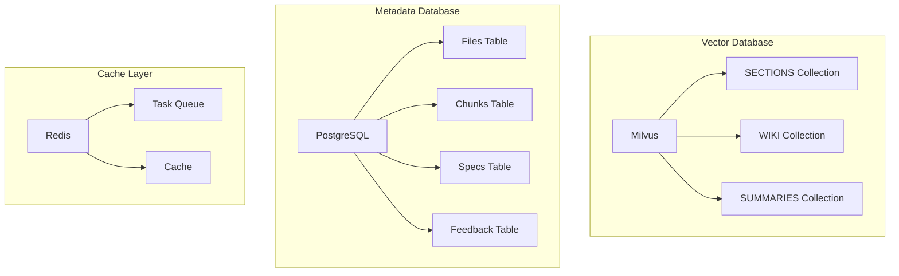
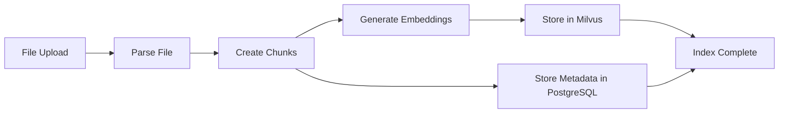

# Database Design

## 🎯 Mục đích

Tài liệu này mô tả thiết kế database của hệ thống COBOL Assistant, bao gồm Milvus vector database và PostgreSQL metadata database.

## 🏗️ Database Architecture

### Database Overview



## 🗄️ Milvus Vector Database

### Collections

#### 1. SECTIONS Collection
**Purpose**: Store code chunks with embeddings

**Schema**:
```python
{
    "id": "string",           # Unique identifier
    "content": "string",      # Code content
    "embedding": "vector",    # 1536-dimensional vector
    "metadata": {
        "file_path": "string",
        "file_type": "string",
        "chunk_index": "int",
        "division": "string",
        "section": "string",
        "line_start": "int",
        "line_end": "int"
    }
}
```

**Index Configuration**:
- **Index Type**: IVF_FLAT
- **Metric Type**: COSINE
- **Vector Dimension**: 1536
- **Index Parameters**: {"nlist": 1024}

#### 2. WIKI Collection
**Purpose**: Store generated documentation with embeddings

**Schema**:
```python
{
    "id": "string",
    "content": "string",
    "embedding": "vector",
    "metadata": {
        "section_id": "string",
        "section_title": "string",
        "wiki_type": "string",
        "created_at": "string",
        "updated_at": "string"
    }
}
```

#### 3. SUMMARIES Collection
**Purpose**: Store file summaries with embeddings

**Schema**:
```python
{
    "id": "string",
    "content": "string",
    "embedding": "vector",
    "metadata": {
        "file_path": "string",
        "file_type": "string",
        "summary_type": "string",
        "created_at": "string"
    }
}
```

### Search Configuration

#### Vector Search Parameters
```python
search_params = {
    "metric_type": "COSINE",
    "params": {"nprobe": 10}
}
```

#### Query Processing
```python
def search_vectors(query_embedding, collection_name, top_k=10):
    """Search vectors in specified collection"""
    results = collection.search(
        data=[query_embedding],
        anns_field="embedding",
        param=search_params,
        limit=top_k,
        output_fields=["content", "metadata"]
    )
    return results
```

## 🗃️ PostgreSQL Metadata Database

### Tables

#### 1. Files Table
**Purpose**: Store file metadata

```sql
CREATE TABLE files (
    id SERIAL PRIMARY KEY,
    file_path VARCHAR(500) NOT NULL,
    file_name VARCHAR(255) NOT NULL,
    file_type VARCHAR(50) NOT NULL,
    file_size BIGINT,
    hash_value VARCHAR(64),
    created_at TIMESTAMP DEFAULT CURRENT_TIMESTAMP,
    updated_at TIMESTAMP DEFAULT CURRENT_TIMESTAMP
);
```

#### 2. Chunks Table
**Purpose**: Store chunk metadata

```sql
CREATE TABLE chunks (
    id SERIAL PRIMARY KEY,
    file_id INTEGER REFERENCES files(id),
    chunk_index INTEGER NOT NULL,
    content TEXT,
    metadata JSONB,
    created_at TIMESTAMP DEFAULT CURRENT_TIMESTAMP
);
```

#### 3. Specs Table
**Purpose**: Store generated specifications

```sql
CREATE TABLE specs (
    id SERIAL PRIMARY KEY,
    file_id INTEGER REFERENCES files(id),
    spec_type VARCHAR(100) NOT NULL,
    content TEXT,
    metadata JSONB,
    created_at TIMESTAMP DEFAULT CURRENT_TIMESTAMP,
    updated_at TIMESTAMP DEFAULT CURRENT_TIMESTAMP
);
```

#### 4. Feedback Table
**Purpose**: Store user feedback

```sql
CREATE TABLE feedback (
    id SERIAL PRIMARY KEY,
    user_id VARCHAR(100),
    question TEXT,
    answer TEXT,
    rating INTEGER CHECK (rating >= 1 AND rating <= 5),
    feedback_text TEXT,
    created_at TIMESTAMP DEFAULT CURRENT_TIMESTAMP
);
```

### Indexes

#### Performance Indexes
```sql
-- Files table indexes
CREATE INDEX idx_files_file_path ON files(file_path);
CREATE INDEX idx_files_file_type ON files(file_type);
CREATE INDEX idx_files_created_at ON files(created_at);

-- Chunks table indexes
CREATE INDEX idx_chunks_file_id ON chunks(file_id);
CREATE INDEX idx_chunks_chunk_index ON chunks(chunk_index);

-- Specs table indexes
CREATE INDEX idx_specs_file_id ON specs(file_id);
CREATE INDEX idx_specs_spec_type ON specs(spec_type);

-- Feedback table indexes
CREATE INDEX idx_feedback_user_id ON feedback(user_id);
CREATE INDEX idx_feedback_created_at ON feedback(created_at);
```

#### JSONB Indexes
```sql
-- Metadata indexes for JSONB fields
CREATE INDEX idx_chunks_metadata_gin ON chunks USING GIN(metadata);
CREATE INDEX idx_specs_metadata_gin ON specs USING GIN(metadata);
```

## 🔄 Data Flow

### 1. Indexing Flow


### 2. Search Flow


### 3. Specs Generation Flow


## 🔧 Database Operations

### Connection Management

#### Milvus Connection
```python
from pymilvus import connections, Collection

def connect_milvus():
    """Connect to Milvus database"""
    connections.connect(
        alias="default",
        host=MILVUS_HOST,
        port=MILVUS_PORT
    )
    return True

def get_collection(collection_name):
    """Get collection instance"""
    return Collection(collection_name)
```

#### PostgreSQL Connection
```python
import psycopg2
from psycopg2.extras import RealDictCursor

def connect_postgres():
    """Connect to PostgreSQL database"""
    conn = psycopg2.connect(
        host=POSTGRES_HOST,
        port=POSTGRES_PORT,
        user=POSTGRES_USER,
        password=POSTGRES_PASSWORD,
        database=POSTGRES_DB
    )
    return conn

def get_cursor(conn):
    """Get database cursor"""
    return conn.cursor(cursor_factory=RealDictCursor)
```

### CRUD Operations

#### Milvus Operations
```python
def insert_documents(collection, documents):
    """Insert documents into Milvus collection"""
    collection.insert(documents)
    collection.flush()
    return True

def search_documents(collection, query_embedding, top_k=10):
    """Search documents in Milvus collection"""
    results = collection.search(
        data=[query_embedding],
        anns_field="embedding",
        param=search_params,
        limit=top_k,
        output_fields=["content", "metadata"]
    )
    return results[0]

def delete_documents(collection, ids):
    """Delete documents from Milvus collection"""
    collection.delete(f"id in {ids}")
    collection.flush()
    return True
```

#### PostgreSQL Operations
```python
def insert_file(conn, file_data):
    """Insert file metadata"""
    cursor = conn.cursor()
    cursor.execute("""
        INSERT INTO files (file_path, file_name, file_type, file_size, hash_value)
        VALUES (%s, %s, %s, %s, %s)
        RETURNING id
    """, (file_data['file_path'], file_data['file_name'], 
          file_data['file_type'], file_data['file_size'], 
          file_data['hash_value']))
    file_id = cursor.fetchone()[0]
    conn.commit()
    return file_id

def get_file_by_path(conn, file_path):
    """Get file by path"""
    cursor = conn.cursor()
    cursor.execute("SELECT * FROM files WHERE file_path = %s", (file_path,))
    return cursor.fetchone()

def insert_chunks(conn, file_id, chunks):
    """Insert chunks metadata"""
    cursor = conn.cursor()
    for chunk in chunks:
        cursor.execute("""
            INSERT INTO chunks (file_id, chunk_index, content, metadata)
            VALUES (%s, %s, %s, %s)
        """, (file_id, chunk['index'], chunk['content'], 
              json.dumps(chunk['metadata'])))
    conn.commit()
    return True
```

## 📊 Performance Optimization

### Milvus Optimization

#### Index Configuration
```python
# Create index for better search performance
index_params = {
    "metric_type": "COSINE",
    "index_type": "IVF_FLAT",
    "params": {"nlist": 1024}
}
collection.create_index("embedding", index_params)
```

#### Search Optimization
```python
# Load collection into memory for faster search
collection.load()

# Use appropriate search parameters
search_params = {
    "metric_type": "COSINE",
    "params": {"nprobe": 10}
}
```

### PostgreSQL Optimization

#### Query Optimization
```sql
-- Use EXPLAIN ANALYZE to analyze query performance
EXPLAIN ANALYZE SELECT * FROM files WHERE file_type = 'COBOL';

-- Use appropriate indexes
CREATE INDEX idx_files_file_type ON files(file_type);
```

#### Connection Pooling
```python
from psycopg2 import pool

# Create connection pool
connection_pool = psycopg2.pool.SimpleConnectionPool(
    1, 20,  # min and max connections
    host=POSTGRES_HOST,
    port=POSTGRES_PORT,
    user=POSTGRES_USER,
    password=POSTGRES_PASSWORD,
    database=POSTGRES_DB
)

def get_connection():
    """Get connection from pool"""
    return connection_pool.getconn()

def return_connection(conn):
    """Return connection to pool"""
    connection_pool.putconn(conn)
```

## 🔒 Security Considerations

### Database Security

#### Connection Security
```python
# Use SSL connections
conn = psycopg2.connect(
    host=POSTGRES_HOST,
    port=POSTGRES_PORT,
    user=POSTGRES_USER,
    password=POSTGRES_PASSWORD,
    database=POSTGRES_DB,
    sslmode='require'
)
```

#### Access Control
```sql
-- Create specific users for different services
CREATE USER api_gateway_user WITH PASSWORD 'secure_password';
CREATE USER core_workers_user WITH PASSWORD 'secure_password';

-- Grant appropriate permissions
GRANT SELECT, INSERT, UPDATE ON files TO api_gateway_user;
GRANT ALL PRIVILEGES ON chunks TO core_workers_user;
```

### Data Encryption

#### At Rest
- Database files encrypted
- Backup files encrypted
- Log files encrypted

#### In Transit
- SSL/TLS for all connections
- Encrypted API communications
- Secure inter-service communication

## 🔗 Liên kết

- [Microservices Architecture](./microservices.md)
- [API Design](./apis.md)
- [Security Architecture](./security.md)
- [Technical Implementation](../technical/README.md)
