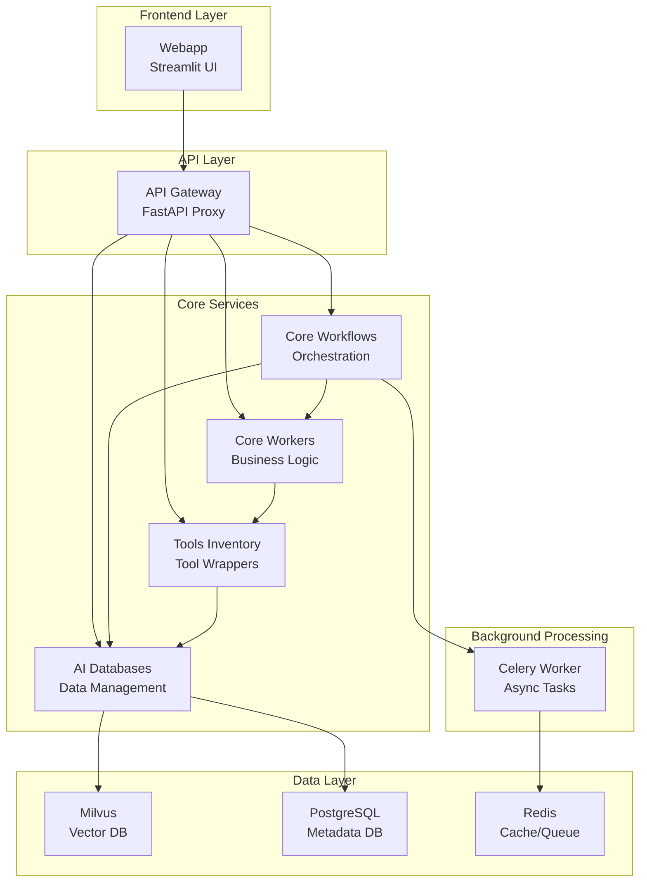
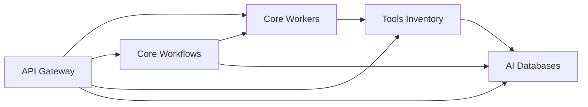

# Microservices Architecture

## 🎯 Mục đích

Tài liệu này mô tả chi tiết kiến trúc microservices của hệ thống COBOL Assistant, bao gồm từng service và cách chúng tương tác.

## 🏗️ Service Overview

### Service Map



## 🔧 Service Details

### 1. API Gateway
- **Port**: 8000
- **Purpose**: Central entry point, request routing
- **Responsibilities**:
  - Route requests to appropriate services
  - Handle CORS
  - Provide health checks
  - Load balancing

### 2. AI Databases
- **Port**: 8001
- **Purpose**: Database management
- **Responsibilities**:
  - Milvus vector database operations
  - PostgreSQL metadata operations
  - Database connection management
  - Data consistency

### 3. Core Workers
- **Port**: 8002
- **Purpose**: Core business logic
- **Responsibilities**:
  - File parsing (COBOL, COPY, JCL)
  - Embedding generation
  - LLM operations (summary, QA, specs)
  - Vector search
  - Reranking

### 4. Core Workflows
- **Port**: 8003
- **Purpose**: Workflow orchestration
- **Responsibilities**:
  - Indexing workflows
  - QA workflows
  - Specs generation workflows
  - Celery task management

### 5. Tools Inventory
- **Port**: 8004
- **Purpose**: Tool implementations
- **Responsibilities**:
  - Parser implementations
  - Embedding tools
  - LLM service wrappers
  - Vector search tools
  - Reranking tools

### 6. Webapp
- **Port**: 8501
- **Purpose**: User interface
- **Responsibilities**:
  - User authentication
  - File upload interface
  - Chat interface
  - Task management
  - Feedback system

## 🔄 Service Communication

### Communication Patterns

#### 1. Synchronous Communication
```python
# API Gateway → Core Services
async with httpx.AsyncClient() as client:
    response = await client.post(
        f"{SERVICE_URL}/endpoint",
        json=request_data
    )
```

#### 2. Asynchronous Communication
```python
# Core Workflows → Celery Tasks
task = generate_specs_v2_with_index_task.delay(
    zip_file_path=file_path,
    spec_type=spec_type
)
```

#### 3. Database Communication
```python
# Services → Databases
# Milvus operations
collection.insert(data)

# PostgreSQL operations
cursor.execute(query, params)
```

### Service Dependencies



## 📊 Service Characteristics

### API Gateway
- **Type**: Stateless
- **Scaling**: Horizontal
- **Dependencies**: All services
- **Health**: Health check endpoint

### AI Databases
- **Type**: Stateful
- **Scaling**: Vertical (database connections)
- **Dependencies**: Milvus, PostgreSQL
- **Health**: Database connection checks

### Core Workers
- **Type**: Stateless
- **Scaling**: Horizontal
- **Dependencies**: Tools Inventory, AI Databases
- **Health**: Service health endpoint

### Core Workflows
- **Type**: Stateless
- **Scaling**: Horizontal
- **Dependencies**: Core Workers, AI Databases, Redis
- **Health**: Service health endpoint

### Tools Inventory
- **Type**: Stateless
- **Scaling**: Horizontal
- **Dependencies**: AI Databases, External APIs
- **Health**: Service health endpoint

### Webapp
- **Type**: Stateless
- **Scaling**: Horizontal
- **Dependencies**: API Gateway
- **Health**: Streamlit health check

## 🔒 Service Security

### Internal Communication
- **Protocol**: HTTP/HTTPS
- **Authentication**: None (internal network)
- **Authorization**: Service-level access control

### External Communication
- **Protocol**: HTTPS
- **Authentication**: API keys
- **Authorization**: User roles

### Database Access
- **Connection**: Encrypted
- **Authentication**: Database credentials
- **Authorization**: Service-specific permissions

## 🚀 Deployment Considerations

### Service Discovery
- **Method**: Docker Compose service names
- **Configuration**: Environment variables
- **Health Checks**: Service endpoints

### Load Balancing
- **Method**: API Gateway routing
- **Strategy**: Round-robin
- **Health**: Service health checks

### Scaling
- **Horizontal**: Add more service instances
- **Vertical**: Increase container resources
- **Database**: Milvus clustering, PostgreSQL read replicas

## 🔗 Liên kết

- [API Gateway Service](../services/api-gateway.md)
- [AI Databases Service](../services/ai-databases.md)
- [Core Workers Service](../services/core-workers.md)
- [Core Workflows Service](../services/core-workflows.md)
- [Tools Inventory Service](../services/tools-inventory.md)
- [Webapp Service](../services/webapp.md)
