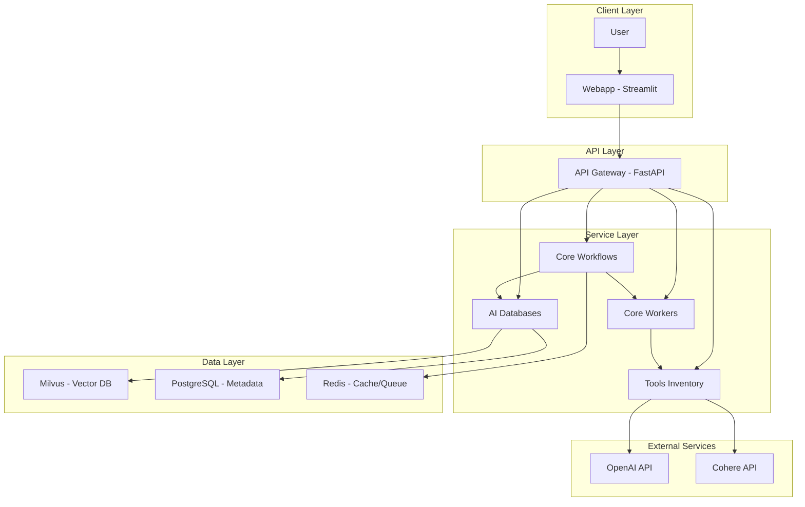
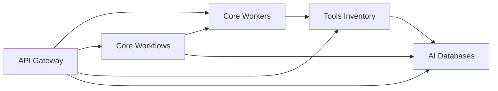

# Tổng quan kiến trúc

## 🎯 Mục đích

Tài liệu này mô tả kiến trúc tổng thể của hệ thống COBOL Assistant, cung cấp cái nhìn toàn diện về cách các thành phần tương tác với nhau.

## 🏗️ Kiến trúc tổng thể

### High-Level Architecture



### Service Dependencies



## 🔄 Data Flow Patterns

### 1. Indexing Flow
```
User Upload → API Gateway → Core Workflows → Core Workers → Tools Inventory → AI Databases
```

### 2. QA Flow
```
User Question → API Gateway → Core Workflows → Core Workers → AI Databases → Response
```

### 3. Specs Generation Flow
```
User Request → API Gateway → Core Workflows → Tools Inventory → AI Databases → Response
```

## 🏛️ Architectural Principles

### 1. Microservices Architecture
- **Single Responsibility**: Mỗi service có một responsibility rõ ràng
- **Loose Coupling**: Services độc lập, giao tiếp qua APIs
- **High Cohesion**: Related functionality được group lại

### 2. API-First Design
- **RESTful APIs**: Sử dụng REST conventions
- **Async Communication**: Sử dụng async/await patterns
- **Error Handling**: Consistent error response format

### 3. Data Management
- **Vector Storage**: Milvus cho embeddings
- **Metadata Storage**: PostgreSQL cho structured data
- **Caching**: Redis cho performance

### 4. Scalability
- **Horizontal Scaling**: Có thể scale từng service độc lập
- **Load Balancing**: API Gateway làm load balancer
- **Async Processing**: Celery cho long-running tasks

## 🔧 Technology Choices

### Backend Framework
- **FastAPI**: High performance, automatic API docs
- **Python 3.8+**: Modern Python features
- **Async/Await**: Non-blocking I/O

### Databases
- **Milvus**: Vector database cho embeddings
- **PostgreSQL**: Relational database cho metadata
- **Redis**: In-memory cache và message queue

### AI Services
- **OpenAI API**: Embeddings và LLM
- **Cohere API**: Reranking

### Frontend
- **Streamlit**: Rapid prototyping và data apps
- **Python**: Consistent với backend

### Infrastructure
- **Docker**: Containerization
- **Docker Compose**: Local development
- **Microservices**: Scalable architecture

## 📊 Performance Characteristics

### Throughput
- **API Gateway**: ~1000 requests/second
- **Vector Search**: ~100 queries/second
- **Embedding Generation**: ~50 requests/second

### Latency
- **API Response**: <100ms (cached)
- **Vector Search**: <500ms
- **Embedding Generation**: <2s

### Scalability
- **Horizontal**: Scale services independently
- **Vertical**: Scale individual containers
- **Database**: Milvus clustering support

## 🔒 Security Considerations

### Authentication
- **User Authentication**: Streamlit authenticator
- **Service Authentication**: Internal service calls
- **API Security**: CORS, rate limiting

### Data Security
- **Encryption**: HTTPS for all communications
- **Secrets Management**: Environment variables
- **Access Control**: Role-based access

## 🚀 Deployment Architecture

### Development
```
Local Machine → Docker Compose → All Services
```

### Production
```
Load Balancer → API Gateway → Services → Databases
```

## 🔗 Liên kết

- [Microservices Architecture](./microservices.md) - Chi tiết về từng service
- [Database Design](./databases.md) - Thiết kế database
- [API Design](./apis.md) - API design patterns
- [Security Architecture](./security.md) - Security implementation
