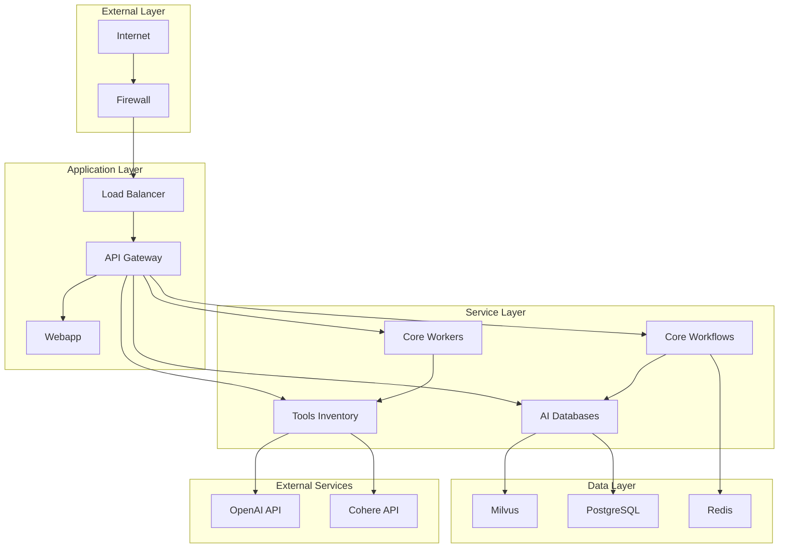

# Security Architecture

## 🎯 Mục đích

Tài liệu này mô tả kiến trúc bảo mật của hệ thống COBOL Assistant, bao gồm authentication, authorization, data protection, và security best practices.

## 🏗️ Security Overview

### Security Layers



## 🔐 Authentication & Authorization

### User Authentication

#### Streamlit Authentication
```python
import streamlit_authenticator as stauth
import bcrypt

def setup_authenticator():
    """Setup Streamlit authenticator"""
    credentials = {
        "usernames": {
            "admin": {
                "email": "admin@example.com",
                "name": "Admin User",
                "password": bcrypt.hashpw("admin123".encode(), bcrypt.gensalt()).decode(),
                "role": "admin"
            },
            "user": {
                "email": "user@example.com", 
                "name": "Regular User",
                "password": bcrypt.hashpw("user123".encode(), bcrypt.gensalt()).decode(),
                "role": "user"
            }
        }
    }
    
    authenticator = stauth.Authenticate(
        credentials,
        "cobol_assistant_auth",
        "cobol_assistant_cookie",
        cookie_expiry_days=30
    )
    
    return authenticator
```

#### Role-Based Access Control
```python
def check_permissions(user_role: str, required_role: str) -> bool:
    """Check if user has required permissions"""
    role_hierarchy = {
        "admin": 3,
        "user": 2,
        "guest": 1
    }
    
    return role_hierarchy.get(user_role, 0) >= role_hierarchy.get(required_role, 0)

def require_admin(func):
    """Decorator to require admin role"""
    def wrapper(*args, **kwargs):
        if not is_admin():
            raise HTTPException(status_code=403, detail="Admin access required")
        return func(*args, **kwargs)
    return wrapper
```

### Service Authentication

#### Internal Service Communication
```python
# Service-to-service authentication
SERVICE_TOKEN = os.getenv("SERVICE_TOKEN", "internal_service_token")

def verify_service_token(token: str) -> bool:
    """Verify service token"""
    return token == SERVICE_TOKEN

@app.middleware("http")
async def service_auth_middleware(request: Request, call_next):
    """Middleware for service authentication"""
    if request.url.path.startswith("/internal/"):
        token = request.headers.get("X-Service-Token")
        if not verify_service_token(token):
            return JSONResponse(
                status_code=401,
                content={"error": "Invalid service token"}
            )
    
    response = await call_next(request)
    return response
```

#### API Key Authentication
```python
API_KEYS = {
    "client_1": "key_abc123",
    "client_2": "key_def456"
}

def verify_api_key(api_key: str) -> bool:
    """Verify API key"""
    return api_key in API_KEYS.values()

@app.middleware("http")
async def api_key_middleware(request: Request, call_next):
    """Middleware for API key authentication"""
    if request.url.path.startswith("/api/"):
        api_key = request.headers.get("Authorization", "").replace("Bearer ", "")
        if not verify_api_key(api_key):
            return JSONResponse(
                status_code=401,
                content={"error": "Invalid API key"}
            )
    
    response = await call_next(request)
    return response
```

## 🔒 Data Protection

### Encryption

#### Data at Rest
```python
from cryptography.fernet import Fernet

class DataEncryption:
    def __init__(self, key: bytes):
        self.cipher = Fernet(key)
    
    def encrypt(self, data: str) -> str:
        """Encrypt data"""
        return self.cipher.encrypt(data.encode()).decode()
    
    def decrypt(self, encrypted_data: str) -> str:
        """Decrypt data"""
        return self.cipher.decrypt(encrypted_data.encode()).decode()

# Generate encryption key
encryption_key = Fernet.generate_key()
data_encryption = DataEncryption(encryption_key)
```

#### Data in Transit
```python
# HTTPS configuration
import ssl

ssl_context = ssl.create_default_context(ssl.Purpose.CLIENT_AUTH)
ssl_context.load_cert_chain("cert.pem", "key.pem")

# FastAPI with SSL
app = FastAPI()
uvicorn.run(app, ssl_context=ssl_context)
```

### Database Security

#### Connection Encryption
```python
# PostgreSQL SSL connection
DATABASE_URL = f"postgresql+psycopg2://{user}:{password}@{host}:{port}/{database}?sslmode=require"

# Milvus connection with authentication
connections.connect(
    alias="default",
    host=MILVUS_HOST,
    port=MILVUS_PORT,
    user=MILVUS_USER,
    password=MILVUS_PASSWORD
)
```

#### Data Masking
```python
def mask_sensitive_data(data: dict) -> dict:
    """Mask sensitive data in logs"""
    sensitive_fields = ["password", "api_key", "token", "secret"]
    
    masked_data = data.copy()
    for field in sensitive_fields:
        if field in masked_data:
            masked_data[field] = "***"
    
    return masked_data
```

## 🛡️ Input Validation

### Request Validation
```python
from pydantic import BaseModel, validator
import re

class FileUploadRequest(BaseModel):
    file_name: str
    file_type: str
    file_size: int
    
    @validator('file_name')
    def validate_file_name(cls, v):
        if not re.match(r'^[a-zA-Z0-9._-]+$', v):
            raise ValueError('Invalid file name')
        return v
    
    @validator('file_type')
    def validate_file_type(cls, v):
        allowed_types = ['COBOL', 'COPY', 'JCL', 'TEXT']
        if v not in allowed_types:
            raise ValueError('Invalid file type')
        return v
    
    @validator('file_size')
    def validate_file_size(cls, v):
        if v > 100 * 1024 * 1024:  # 100MB limit
            raise ValueError('File too large')
        return v
```

### SQL Injection Prevention
```python
# Use parameterized queries
def get_file_by_path(conn, file_path: str):
    """Get file by path with SQL injection prevention"""
    cursor = conn.cursor()
    cursor.execute("SELECT * FROM files WHERE file_path = %s", (file_path,))
    return cursor.fetchone()

# Avoid string concatenation
# BAD: cursor.execute(f"SELECT * FROM files WHERE file_path = '{file_path}'")
# GOOD: cursor.execute("SELECT * FROM files WHERE file_path = %s", (file_path,))
```

### XSS Prevention
```python
import html

def sanitize_html(content: str) -> str:
    """Sanitize HTML content to prevent XSS"""
    return html.escape(content)

def validate_user_input(input_data: str) -> str:
    """Validate and sanitize user input"""
    # Remove potentially dangerous characters
    sanitized = re.sub(r'[<>"\']', '', input_data)
    return sanitized.strip()
```

## 🔍 Security Monitoring

### Logging Security Events
```python
import logging

security_logger = logging.getLogger("security")

def log_security_event(event_type: str, user_id: str, details: dict):
    """Log security events"""
    security_logger.warning(f"Security Event: {event_type}", extra={
        "user_id": user_id,
        "event_type": event_type,
        "details": details,
        "timestamp": datetime.now().isoformat()
    })

# Log authentication failures
def log_auth_failure(user_id: str, reason: str):
    log_security_event("AUTH_FAILURE", user_id, {"reason": reason})

# Log suspicious activity
def log_suspicious_activity(user_id: str, activity: str):
    log_security_event("SUSPICIOUS_ACTIVITY", user_id, {"activity": activity})
```

### Rate Limiting
```python
from slowapi import Limiter, _rate_limit_exceeded_handler
from slowapi.util import get_remote_address
from slowapi.errors import RateLimitExceeded

limiter = Limiter(key_func=get_remote_address)
app.state.limiter = limiter
app.add_exception_handler(RateLimitExceeded, _rate_limit_exceeded_handler)

@app.post("/api/upload")
@limiter.limit("10/minute")
async def upload_file(request: Request):
    """Rate limited file upload"""
    pass

@app.post("/api/qa")
@limiter.limit("30/minute")
async def ask_question(request: Request):
    """Rate limited QA endpoint"""
    pass
```

### Intrusion Detection
```python
def detect_suspicious_patterns(request: Request) -> bool:
    """Detect suspicious request patterns"""
    suspicious_patterns = [
        r'\.\./',  # Path traversal
        r'<script',  # XSS attempt
        r'union\s+select',  # SQL injection
        r'exec\s*\(',  # Command injection
    ]
    
    request_data = str(request.url) + str(request.headers)
    
    for pattern in suspicious_patterns:
        if re.search(pattern, request_data, re.IGNORECASE):
            log_security_event("SUSPICIOUS_PATTERN", "unknown", {
                "pattern": pattern,
                "request": str(request.url)
            })
            return True
    
    return False
```

## 🔐 Secret Management

### Environment Variables
```bash
# Production environment variables
export OPENAI_API_KEY="sk-..."
export COHERE_API_KEY="..."
export POSTGRES_PASSWORD="strong_random_password"
export REDIS_PASSWORD="strong_random_password"
export SERVICE_TOKEN="internal_service_token"
export ENCRYPTION_KEY="base64_encoded_key"
```

### Secret Rotation
```python
class SecretManager:
    def __init__(self):
        self.secrets = {}
        self.rotation_schedule = {}
    
    def get_secret(self, secret_name: str) -> str:
        """Get secret value"""
        if secret_name in self.secrets:
            return self.secrets[secret_name]
        
        # Load from environment or secret store
        secret_value = os.getenv(secret_name)
        if secret_value:
            self.secrets[secret_name] = secret_value
            return secret_value
        
        raise ValueError(f"Secret {secret_name} not found")
    
    def rotate_secret(self, secret_name: str, new_value: str):
        """Rotate secret value"""
        self.secrets[secret_name] = new_value
        self.rotation_schedule[secret_name] = datetime.now()
```

## 🚨 Incident Response

### Security Incident Response Plan

#### 1. Detection
- Automated monitoring alerts
- User reports
- Security scans

#### 2. Assessment
- Determine severity
- Identify affected systems
- Assess data exposure

#### 3. Containment
- Isolate affected systems
- Block malicious IPs
- Revoke compromised credentials

#### 4. Eradication
- Remove malware
- Patch vulnerabilities
- Update security measures

#### 5. Recovery
- Restore systems
- Verify security
- Monitor for recurrence

### Incident Response Procedures
```python
def handle_security_incident(incident_type: str, severity: str, details: dict):
    """Handle security incident"""
    # Log incident
    log_security_event("INCIDENT", "system", {
        "type": incident_type,
        "severity": severity,
        "details": details
    })
    
    # Notify security team
    notify_security_team(incident_type, severity)
    
    # Take containment actions
    if severity == "HIGH":
        block_suspicious_ips(details.get("ip_addresses", []))
        revoke_compromised_tokens(details.get("tokens", []))
    
    # Generate incident report
    generate_incident_report(incident_type, severity, details)
```

## 🔗 Liên kết

- [Microservices Architecture](./microservices.md)
- [Database Design](./databases.md)
- [API Design](./apis.md)
- [Development Setup](../development/setup.md)
