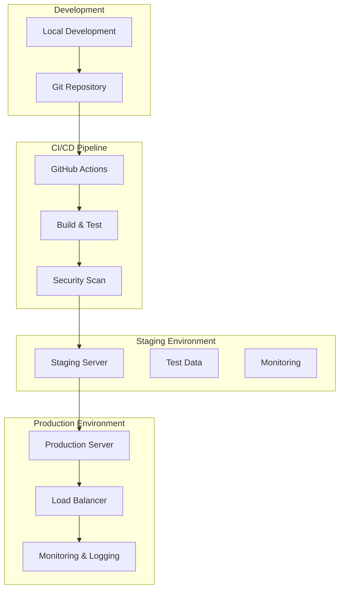

# Deployment

## 🎯 Mục đích

Tài liệu này mô tả quy trình triển khai hệ thống COBOL Assistant, bao gồm environment setup, Docker configuration, và deployment strategies.

## 🏗️ Deployment Architecture

### Deployment Overview



### Environment Strategy

| Environment | Purpose | Data | Access | Monitoring |
|-------------|---------|------|--------|------------|
| **Development** | Local development | Mock data | Developers | Basic logging |
| **Staging** | Pre-production testing | Test data | QA team | Full monitoring |
| **Production** | Live system | Real data | Users | Full monitoring + alerts |

## 🔧 Environment Setup

### Development Environment

#### Local Setup
```bash
# Clone repository
git clone https://github.com/your-org/cobol-assistant.git
cd cobol-assistant

# Create virtual environment
python -m venv venv
source venv/bin/activate  # On Windows: venv\Scripts\activate

# Install dependencies
pip install -r requirements.txt

# Set environment variables
cp .env.example .env
# Edit .env with your configuration

# Start services
docker-compose up -d

# Run application
python main.py
```

#### Development Configuration
```bash
# .env.development
ENV=development
DEBUG=true
LOG_LEVEL=DEBUG

# Database
POSTGRES_HOST=localhost
POSTGRES_PORT=5432
POSTGRES_USER=cobol
POSTGRES_PASSWORD=cobol12345
POSTGRES_DB=cobol_assistant

# Redis
REDIS_URL=redis://localhost:6379/0

# Milvus
MILVUS_HOST=localhost
MILVUS_PORT=19530

# API Keys
OPENAI_API_KEY=your_openai_key
COHERE_API_KEY=your_cohere_key
```

### Staging Environment

#### Staging Configuration
```bash
# .env.staging
ENV=staging
DEBUG=false
LOG_LEVEL=INFO

# Database
POSTGRES_HOST=staging-postgres
POSTGRES_PORT=5432
POSTGRES_USER=cobol
POSTGRES_PASSWORD=staging_password
POSTGRES_DB=cobol_assistant_staging

# Redis
REDIS_URL=redis://staging-redis:6379/0

# Milvus
MILVUS_HOST=staging-milvus
MILVUS_PORT=19530

# API Keys
OPENAI_API_KEY=your_openai_key
COHERE_API_KEY=your_cohere_key
```

#### Staging Deployment
```bash
# Deploy to staging
./deploy.sh staging

# Verify deployment
curl http://staging-server:8000/health

# Run tests
pytest tests/integration/ -v
```

### Production Environment

#### Production Configuration
```bash
# .env.production
ENV=production
DEBUG=false
LOG_LEVEL=WARNING

# Database
POSTGRES_HOST=prod-postgres
POSTGRES_PORT=5432
POSTGRES_USER=cobol
POSTGRES_PASSWORD=secure_production_password
POSTGRES_DB=cobol_assistant

# Redis
REDIS_URL=redis://prod-redis:6379/0

# Milvus
MILVUS_HOST=prod-milvus
MILVUS_PORT=19530

# API Keys
OPENAI_API_KEY=your_production_openai_key
COHERE_API_KEY=your_production_cohere_key
```

## 🐳 Docker Configuration

### Docker Compose Setup

#### Development Docker Compose
```yaml
# docker-compose.dev.yml
version: '3.8'

services:
  postgres:
    image: postgres:13
    environment:
      POSTGRES_USER: cobol
      POSTGRES_PASSWORD: cobol12345
      POSTGRES_DB: cobol_assistant
    ports:
      - "5432:5432"
    volumes:
      - postgres_data:/var/lib/postgresql/data

  redis:
    image: redis:6
    ports:
      - "6379:6379"
    volumes:
      - redis_data:/data

  standalone:
    image: milvusdb/milvus:latest
    command: ["milvus", "run", "standalone"]
    environment:
      ETCD_ENDPOINTS: etcd:2379
      MINIO_ADDRESS: minio:9000
    ports:
      - "19530:19530"
    volumes:
      - milvus_data:/var/lib/milvus

  api-gateway:
    build: ./api_gateway
    ports:
      - "8000:8000"
    depends_on:
      - postgres
      - redis
    environment:
      - POSTGRES_HOST=postgres
      - REDIS_URL=redis://redis:6379/0
    volumes:
      - ./shared:/app/shared

  ai-databases:
    build: ./ai_databases
    ports:
      - "8001:8000"
    depends_on:
      - postgres
      - standalone
    environment:
      - POSTGRES_HOST=postgres
      - MILVUS_HOST=standalone
    volumes:
      - ./shared:/app/shared

  core-workers:
    build: ./core_workers
    ports:
      - "8002:8000"
    depends_on:
      - ai-databases
    environment:
      - AI_DATABASES_URL=http://ai-databases:8000
    volumes:
      - ./shared:/app/shared

  core-workflows:
    build: ./core_workflows
    ports:
      - "8003:8000"
    depends_on:
      - core-workers
      - redis
    environment:
      - CORE_WORKERS_URL=http://core-workers:8000
      - REDIS_URL=redis://redis:6379/0
    volumes:
      - ./shared:/app/shared

  tools-inventory:
    build: ./tools_inventory
    ports:
      - "8004:8000"
    depends_on:
      - ai-databases
    environment:
      - AI_DATABASES_URL=http://ai-databases:8000
    volumes:
      - ./shared:/app/shared

  webapp:
    build: ./webapp
    ports:
      - "8501:8501"
    depends_on:
      - api-gateway
    environment:
      - API_BASE_URL=http://api-gateway:8000
    volumes:
      - ./shared:/app/shared

volumes:
  postgres_data:
  redis_data:
  milvus_data:
```

#### Production Docker Compose
```yaml
# docker-compose.prod.yml
version: '3.8'

services:
  postgres:
    image: postgres:13
    environment:
      POSTGRES_USER: ${POSTGRES_USER}
      POSTGRES_PASSWORD: ${POSTGRES_PASSWORD}
      POSTGRES_DB: ${POSTGRES_DB}
    volumes:
      - postgres_data:/var/lib/postgresql/data
    networks:
      - backend
    restart: unless-stopped

  redis:
    image: redis:6
    volumes:
      - redis_data:/data
    networks:
      - backend
    restart: unless-stopped

  milvus:
    image: milvusdb/milvus:latest
    command: ["milvus", "run", "standalone"]
    environment:
      ETCD_ENDPOINTS: etcd:2379
      MINIO_ADDRESS: minio:9000
    volumes:
      - milvus_data:/var/lib/milvus
    networks:
      - backend
    restart: unless-stopped

  api-gateway:
    build: ./api_gateway
    ports:
      - "8000:8000"
    depends_on:
      - postgres
      - redis
    environment:
      - POSTGRES_HOST=postgres
      - REDIS_URL=redis://redis:6379/0
    volumes:
      - ./shared:/app/shared
    networks:
      - backend
    restart: unless-stopped

  # ... other services

networks:
  backend:
    driver: bridge

volumes:
  postgres_data:
  redis_data:
  milvus_data:
```

### Dockerfile Examples

#### API Gateway Dockerfile
```dockerfile
# api_gateway/Dockerfile
FROM python:3.9-slim

WORKDIR /app

# Install system dependencies
RUN apt-get update && apt-get install -y \
    gcc \
    && rm -rf /var/lib/apt/lists/*

# Install Python dependencies
COPY requirements.txt .
RUN pip install --no-cache-dir -r requirements.txt

# Copy application code
COPY . .

# Create shared directory
RUN mkdir -p /app/shared

# Set environment variables
ENV PYTHONPATH=/app
ENV PYTHONUNBUFFERED=1

# Expose port
EXPOSE 8000

# Health check
HEALTHCHECK --interval=30s --timeout=30s --start-period=5s --retries=3 \
    CMD curl -f http://localhost:8000/health || exit 1

# Run application
CMD ["python", "main.py"]
```

#### Webapp Dockerfile
```dockerfile
# webapp/Dockerfile
FROM python:3.9-slim

WORKDIR /app

# Install system dependencies
RUN apt-get update && apt-get install -y \
    curl \
    && rm -rf /var/lib/apt/lists/*

# Install Python dependencies
COPY requirements.txt .
RUN pip install --no-cache-dir -r requirements.txt

# Copy application code
COPY . .

# Create shared directory
RUN mkdir -p /app/shared

# Set environment variables
ENV PYTHONPATH=/app
ENV PYTHONUNBUFFERED=1

# Expose port
EXPOSE 8501

# Health check
HEALTHCHECK --interval=30s --timeout=30s --start-period=5s --retries=3 \
    CMD curl -f http://localhost:8501/_stcore/health || exit 1

# Run application
CMD ["streamlit", "run", "app.py", "--server.port=8501", "--server.address=0.0.0.0"]
```

## 🚀 Deployment Process

### Automated Deployment

#### GitHub Actions Workflow
```yaml
# .github/workflows/deploy.yml
name: Deploy

on:
  push:
    branches: [main, develop]
  pull_request:
    branches: [main]

env:
  REGISTRY: ghcr.io
  IMAGE_NAME: ${{ github.repository }}

jobs:
  test:
    runs-on: ubuntu-latest
    steps:
      - uses: actions/checkout@v3
      
      - name: Set up Python
        uses: actions/setup-python@v4
        with:
          python-version: '3.9'
      
      - name: Install dependencies
        run: |
          pip install -r requirements.txt
          pip install pytest pytest-cov
      
      - name: Run tests
        run: |
          pytest tests/ --cov=. --cov-report=xml
      
      - name: Upload coverage
        uses: codecov/codecov-action@v3
        with:
          file: ./coverage.xml

  build:
    needs: test
    runs-on: ubuntu-latest
    if: github.ref == 'refs/heads/main' || github.ref == 'refs/heads/develop'
    steps:
      - uses: actions/checkout@v3
      
      - name: Set up Docker Buildx
        uses: docker/setup-buildx-action@v2
      
      - name: Login to Container Registry
        uses: docker/login-action@v2
        with:
          registry: ${{ env.REGISTRY }}
          username: ${{ github.actor }}
          password: ${{ secrets.GITHUB_TOKEN }}
      
      - name: Build and push images
        uses: docker/build-push-action@v4
        with:
          context: .
          push: true
          tags: |
            ${{ env.REGISTRY }}/${{ env.IMAGE_NAME }}:latest
            ${{ env.REGISTRY }}/${{ env.IMAGE_NAME }}:${{ github.sha }}

  deploy-staging:
    needs: build
    runs-on: ubuntu-latest
    if: github.ref == 'refs/heads/develop'
    environment: staging
    steps:
      - uses: actions/checkout@v3
      
      - name: Deploy to staging
        run: |
          echo "Deploying to staging..."
          # Add staging deployment commands here
      
      - name: Run smoke tests
        run: |
          echo "Running smoke tests..."
          # Add smoke test commands here

  deploy-production:
    needs: build
    runs-on: ubuntu-latest
    if: github.ref == 'refs/heads/main'
    environment: production
    steps:
      - uses: actions/checkout@v3
      
      - name: Deploy to production
        run: |
          echo "Deploying to production..."
          # Add production deployment commands here
      
      - name: Run health checks
        run: |
          echo "Running health checks..."
          # Add health check commands here
```

#### Deployment Scripts
```bash
#!/bin/bash
# deploy.sh

set -e

ENVIRONMENT=$1
VERSION=$2

if [ -z "$ENVIRONMENT" ]; then
    echo "Usage: $0 <environment> [version]"
    echo "Environments: development, staging, production"
    exit 1
fi

echo "Deploying to $ENVIRONMENT environment..."

# Set environment variables
export ENV=$ENVIRONMENT
export COMPOSE_FILE="docker-compose.$ENVIRONMENT.yml"

# Pull latest images
echo "Pulling latest images..."
docker-compose -f $COMPOSE_FILE pull

# Start services
echo "Starting services..."
docker-compose -f $COMPOSE_FILE up -d

# Wait for services to be ready
echo "Waiting for services to be ready..."
sleep 30

# Run health checks
echo "Running health checks..."
./scripts/health-check.sh $ENVIRONMENT

# Run smoke tests
echo "Running smoke tests..."
./scripts/smoke-tests.sh $ENVIRONMENT

echo "Deployment to $ENVIRONMENT completed successfully!"
```

### Manual Deployment

#### Staging Deployment
```bash
# 1. Build images
docker-compose -f docker-compose.staging.yml build

# 2. Start services
docker-compose -f docker-compose.staging.yml up -d

# 3. Verify deployment
curl http://staging-server:8000/health

# 4. Run tests
pytest tests/integration/ -v
```

#### Production Deployment
```bash
# 1. Backup current deployment
./scripts/backup.sh

# 2. Deploy new version
docker-compose -f docker-compose.prod.yml up -d

# 3. Verify deployment
curl http://production-server:8000/health

# 4. Monitor logs
docker-compose -f docker-compose.prod.yml logs -f
```

## 📊 Monitoring & Logging

### Health Checks

#### Service Health Checks
```bash
#!/bin/bash
# health-check.sh

ENVIRONMENT=$1
BASE_URL="http://localhost:8000"

if [ "$ENVIRONMENT" = "staging" ]; then
    BASE_URL="http://staging-server:8000"
elif [ "$ENVIRONMENT" = "production" ]; then
    BASE_URL="http://production-server:8000"
fi

echo "Running health checks for $ENVIRONMENT..."

# Check API Gateway
curl -f "$BASE_URL/health" || exit 1

# Check AI Databases
curl -f "$BASE_URL/ai-databases/health" || exit 1

# Check Core Workers
curl -f "$BASE_URL/core-workers/health" || exit 1

# Check Core Workflows
curl -f "$BASE_URL/core-workflows/health" || exit 1

# Check Tools Inventory
curl -f "$BASE_URL/tools-inventory/health" || exit 1

echo "All health checks passed!"
```

### Logging Configuration

#### Centralized Logging
```yaml
# docker-compose.logging.yml
version: '3.8'

services:
  elasticsearch:
    image: docker.elastic.co/elasticsearch/elasticsearch:7.15.0
    environment:
      - discovery.type=single-node
      - "ES_JAVA_OPTS=-Xms512m -Xmx512m"
    ports:
      - "9200:9200"
    volumes:
      - elasticsearch_data:/usr/share/elasticsearch/data

  kibana:
    image: docker.elastic.co/kibana/kibana:7.15.0
    ports:
      - "5601:5601"
    depends_on:
      - elasticsearch
    environment:
      - ELASTICSEARCH_HOSTS=http://elasticsearch:9200

  logstash:
    image: docker.elastic.co/logstash/logstash:7.15.0
    volumes:
      - ./logstash.conf:/usr/share/logstash/pipeline/logstash.conf
    depends_on:
      - elasticsearch
    ports:
      - "5044:5044"

volumes:
  elasticsearch_data:
```

### Performance Monitoring

#### Metrics Collection
```python
# monitoring/metrics.py
import time
import psutil
from prometheus_client import Counter, Histogram, Gauge, start_http_server

# Request metrics
REQUEST_COUNT = Counter('http_requests_total', 'Total HTTP requests', ['method', 'endpoint'])
REQUEST_DURATION = Histogram('http_request_duration_seconds', 'HTTP request duration')

# System metrics
CPU_USAGE = Gauge('system_cpu_usage_percent', 'CPU usage percentage')
MEMORY_USAGE = Gauge('system_memory_usage_bytes', 'Memory usage in bytes')
DISK_USAGE = Gauge('system_disk_usage_bytes', 'Disk usage in bytes')

def collect_system_metrics():
    """Collect system metrics"""
    CPU_USAGE.set(psutil.cpu_percent())
    MEMORY_USAGE.set(psutil.virtual_memory().used)
    DISK_USAGE.set(psutil.disk_usage('/').used)

# Start metrics server
start_http_server(8000)
```

## 🔒 Security

### Security Configuration

#### SSL/TLS Setup
```nginx
# nginx.conf
server {
    listen 443 ssl http2;
    server_name your-domain.com;
    
    ssl_certificate /etc/ssl/certs/your-domain.crt;
    ssl_certificate_key /etc/ssl/private/your-domain.key;
    
    ssl_protocols TLSv1.2 TLSv1.3;
    ssl_ciphers ECDHE-RSA-AES256-GCM-SHA512:DHE-RSA-AES256-GCM-SHA512;
    ssl_prefer_server_ciphers off;
    
    location / {
        proxy_pass http://api-gateway:8000;
        proxy_set_header Host $host;
        proxy_set_header X-Real-IP $remote_addr;
        proxy_set_header X-Forwarded-For $proxy_add_x_forwarded_for;
        proxy_set_header X-Forwarded-Proto $scheme;
    }
}
```

#### Security Headers
```python
# security.py
from fastapi import FastAPI
from fastapi.middleware.cors import CORSMiddleware
from fastapi.middleware.trustedhost import TrustedHostMiddleware

app = FastAPI()

# CORS configuration
app.add_middleware(
    CORSMiddleware,
    allow_origins=["https://your-domain.com"],
    allow_credentials=True,
    allow_methods=["GET", "POST"],
    allow_headers=["*"],
)

# Trusted host middleware
app.add_middleware(
    TrustedHostMiddleware,
    allowed_hosts=["your-domain.com", "*.your-domain.com"]
)
```

## 🔗 Liên kết

- [Setup & Installation](./setup.md)
- [Development Workflow](./workflow.md)
- [Testing](./testing.md)
- [Troubleshooting](./troubleshooting.md)
- [Operations Documentation](../operations/README.md)
