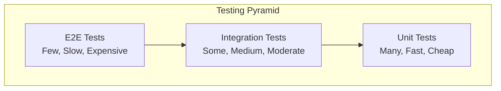

# Testing

## 🎯 Mục đích

Tài liệu này mô tả chiến lược testing cho hệ thống COBOL Assistant, bao gồm unit tests, integration tests, và end-to-end tests.

## 🧪 Testing Strategy

### Testing Pyramid



### Test Types

| Test Type | Coverage | Speed | Cost | Purpose |
|-----------|----------|-------|------|---------|
| **Unit Tests** | High | Fast | Low | Test individual functions |
| **Integration Tests** | Medium | Medium | Medium | Test service interactions |
| **E2E Tests** | Low | Slow | High | Test complete workflows |

## 🔧 Unit Testing

### Test Structure

#### Test Directory Structure
```
tests/
├── unit/
│   ├── test_parsers.py
│   ├── test_embeddings.py
│   ├── test_llm_services.py
│   └── test_utils.py
├── integration/
│   ├── test_api_endpoints.py
│   ├── test_database_operations.py
│   └── test_service_communication.py
└── e2e/
    ├── test_full_workflow.py
    └── test_user_scenarios.py
```

#### Pytest Configuration
```python
# pytest.ini
[tool:pytest]
testpaths = tests
python_files = test_*.py
python_classes = Test*
python_functions = test_*
addopts = 
    -v
    --tb=short
    --strict-markers
    --disable-warnings
    --cov=.
    --cov-report=html
    --cov-report=term-missing
markers =
    unit: Unit tests
    integration: Integration tests
    e2e: End-to-end tests
    slow: Slow tests
```

### Parser Tests

#### COBOL Parser Tests
```python
import pytest
from tools_inventory.parsers.cobol_parser import CobolParserTool

class TestCobolParser:
    def setup_method(self):
        self.parser = CobolParserTool()
    
    def test_parse_cobol_file(self):
        """Test parsing COBOL file"""
        content = """
        IDENTIFICATION DIVISION.
        PROGRAM-ID. TEST-PROGRAM.
        
        DATA DIVISION.
        WORKING-STORAGE SECTION.
        01 WS-VARIABLE PIC X(10).
        
        PROCEDURE DIVISION.
        MAIN-PARAGRAPH.
            DISPLAY "Hello World".
            STOP RUN.
        """
        
        result = self.parser.parse("test.cbl", content)
        
        assert len(result) > 0
        assert all("content" in chunk for chunk in result)
        assert all("metadata" in chunk for chunk in result)
    
    def test_parse_empty_file(self):
        """Test parsing empty file"""
        result = self.parser.parse("empty.cbl", "")
        assert result == []
    
    def test_parse_invalid_content(self):
        """Test parsing invalid content"""
        result = self.parser.parse("invalid.cbl", "Invalid content")
        assert len(result) > 0  # Should still create chunks
    
    def test_chunk_size_limit(self):
        """Test chunk size limit"""
        large_content = "A" * 10000
        result = self.parser.parse("large.cbl", large_content, max_chunk_size=1000)
        
        for chunk in result:
            assert len(chunk["content"]) <= 1000
```

#### COPY Parser Tests
```python
class TestCopyParser:
    def setup_method(self):
        self.parser = CopyParserTool()
    
    def test_parse_copy_file(self):
        """Test parsing COPY file"""
        content = """
        01 CUSTOMER-RECORD.
           05 CUSTOMER-ID PIC 9(10).
           05 CUSTOMER-NAME PIC X(50).
           05 CUSTOMER-ADDRESS PIC X(100).
        """
        
        result = self.parser.parse("customer.cpy", content)
        
        assert len(result) > 0
        assert all(chunk["metadata"]["file_type"] == "COPY" for chunk in result)
```

### Embedding Tests

#### Embedding Generation Tests
```python
import pytest
from unittest.mock import Mock, patch
from tools_inventory.embedding.embedding_tool import OpenAIEmbeddingTool

class TestEmbeddingTool:
    def setup_method(self):
        self.embedding_tool = OpenAIEmbeddingTool()
    
    @patch('openai.OpenAI')
    def test_generate_embedding(self, mock_openai):
        """Test embedding generation"""
        mock_client = Mock()
        mock_openai.return_value = mock_client
        mock_client.embeddings.create.return_value = Mock(
            data=[Mock(embedding=[0.1, 0.2, 0.3])]
        )
        
        result = self.embedding_tool.generate_embedding("Test content")
        
        assert result == [0.1, 0.2, 0.3]
        mock_client.embeddings.create.assert_called_once()
    
    def test_embedding_dimensions(self):
        """Test embedding dimensions"""
        assert self.embedding_tool.embedding_dim == 1536
    
    def test_max_input_length(self):
        """Test max input length"""
        assert self.embedding_tool.max_input_length == 8191
```

### LLM Service Tests

#### Summary Generation Tests
```python
import pytest
from unittest.mock import Mock, patch
from tools_inventory.llm_services.summary_tool import SummaryTool

class TestSummaryTool:
    def setup_method(self):
        self.summary_tool = SummaryTool()
    
    @patch('openai.AsyncOpenAI')
    async def test_generate_summary(self, mock_openai):
        """Test summary generation"""
        mock_client = Mock()
        mock_openai.return_value = mock_client
        mock_client.chat.completions.create.return_value = Mock(
            choices=[Mock(message=Mock(content="Generated summary"))]
        )
        
        result = await self.summary_tool.generate_summary("Test content", "file.cbl")
        
        assert result == "Generated summary"
        mock_client.chat.completions.create.assert_called_once()
    
    def test_validate_content(self):
        """Test content validation"""
        assert self.summary_tool.validate_content("Valid content") == True
        assert self.summary_tool.validate_content("") == False
        assert self.summary_tool.validate_content(None) == False
```

## 🔗 Integration Testing

### API Endpoint Tests

#### Test Setup
```python
import pytest
import httpx
from fastapi.testclient import TestClient
from api_gateway.main import app

@pytest.fixture
def client():
    """Create test client"""
    return TestClient(app)

@pytest.fixture
async def async_client():
    """Create async test client"""
    async with httpx.AsyncClient(app=app, base_url="http://test") as ac:
        yield ac
```

#### Health Check Tests
```python
class TestHealthChecks:
    def test_api_gateway_health(self, client):
        """Test API Gateway health check"""
        response = client.get("/health")
        
        assert response.status_code == 200
        data = response.json()
        assert data["success"] == True
        assert data["status"] == "HEALTHY"
        assert data["service"] == "api_gateway"
    
    def test_ai_databases_health(self, client):
        """Test AI Databases health check"""
        response = client.get("/ai-databases/health")
        
        assert response.status_code == 200
        data = response.json()
        assert data["success"] == True
        assert data["service"] == "ai_databases"
```

#### Parser Endpoint Tests
```python
class TestParserEndpoints:
    def test_parse_zip_endpoint(self, client):
        """Test parse ZIP endpoint"""
        # Create test ZIP file
        test_zip_content = create_test_zip()
        
        response = client.post(
            "/core-workers/parser/parse-zip",
            files={"zip_file": ("test.zip", test_zip_content, "application/zip")},
            data={"max_chunk_size": 6000}
        )
        
        assert response.status_code == 200
        data = response.json()
        assert data["success"] == True
        assert "files_processed" in data["data"]
    
    def test_parse_file_endpoint(self, client):
        """Test parse file endpoint"""
        test_data = {
            "file_path": "test.cbl",
            "content": "IDENTIFICATION DIVISION.\nPROGRAM-ID. TEST.",
            "file_type": "COBOL",
            "max_chunk_size": 6000
        }
        
        response = client.post(
            "/core-workers/parser/parse-file",
            json=test_data
        )
        
        assert response.status_code == 200
        data = response.json()
        assert data["success"] == True
        assert "chunks" in data["data"]
```

### Database Integration Tests

#### Milvus Tests
```python
import pytest
from pymilvus import connections, Collection

class TestMilvusIntegration:
    def setup_method(self):
        """Setup Milvus connection"""
        connections.connect("test", host="localhost", port="19530")
    
    def teardown_method(self):
        """Cleanup Milvus connection"""
        connections.disconnect("test")
    
    def test_collection_operations(self):
        """Test Milvus collection operations"""
        collection_name = "test_collection"
        
        # Create collection
        collection = Collection(collection_name)
        
        # Insert test data
        test_data = [
            {"id": "1", "content": "Test content", "embedding": [0.1, 0.2, 0.3]}
        ]
        collection.insert(test_data)
        collection.flush()
        
        # Search test data
        results = collection.search(
            data=[[0.1, 0.2, 0.3]],
            anns_field="embedding",
            param={"metric_type": "COSINE"},
            limit=1
        )
        
        assert len(results[0]) > 0
        
        # Cleanup
        collection.drop()
```

#### PostgreSQL Tests
```python
import pytest
import psycopg2
from psycopg2.extras import RealDictCursor

class TestPostgreSQLIntegration:
    def setup_method(self):
        """Setup PostgreSQL connection"""
        self.conn = psycopg2.connect(
            host="localhost",
            port="5432",
            user="cobol",
            password="cobol12345",
            database="cobol_assistant"
        )
    
    def teardown_method(self):
        """Cleanup PostgreSQL connection"""
        self.conn.close()
    
    def test_file_operations(self):
        """Test file operations"""
        cursor = self.conn.cursor(cursor_factory=RealDictCursor)
        
        # Insert test file
        cursor.execute("""
            INSERT INTO files (file_path, file_name, file_type, file_size, hash_value)
            VALUES (%s, %s, %s, %s, %s)
            RETURNING id
        """, ("test.cbl", "test.cbl", "COBOL", 1024, "abc123"))
        
        file_id = cursor.fetchone()["id"]
        
        # Query test file
        cursor.execute("SELECT * FROM files WHERE id = %s", (file_id,))
        result = cursor.fetchone()
        
        assert result["file_path"] == "test.cbl"
        assert result["file_type"] == "COBOL"
        
        # Cleanup
        cursor.execute("DELETE FROM files WHERE id = %s", (file_id,))
        self.conn.commit()
```

## 🌐 End-to-End Testing

### Full Workflow Tests

#### Indexing Workflow Test
```python
import pytest
import asyncio
from pathlib import Path

class TestIndexingWorkflow:
    @pytest.mark.e2e
    @pytest.mark.slow
    async def test_full_indexing_workflow(self):
        """Test complete indexing workflow"""
        # Create test ZIP file
        test_zip_path = create_test_zip_with_cobol_files()
        
        # Start indexing
        async with httpx.AsyncClient() as client:
            response = await client.post(
                "http://localhost:8000/core-workflows/indexing/index-zip",
                files={"zip_file": open(test_zip_path, "rb")},
                data={"chunk_size": 6000, "batch_size": 100}
            )
        
        assert response.status_code == 200
        data = response.json()
        assert data["success"] == True
        assert "task_id" in data["data"]
        
        # Wait for completion
        task_id = data["data"]["task_id"]
        await wait_for_task_completion(task_id)
        
        # Verify results
        await verify_indexing_results(task_id)
    
    async def test_qa_workflow(self):
        """Test complete QA workflow"""
        # Index test files first
        await self.test_full_indexing_workflow()
        
        # Ask question
        async with httpx.AsyncClient() as client:
            response = await client.post(
                "http://localhost:8000/core-workflows/qa/ask",
                json={
                    "question": "What does this COBOL program do?",
                    "collections": ["sections"],
                    "top_k": 5
                }
            )
        
        assert response.status_code == 200
        data = response.json()
        assert data["success"] == True
        assert "answer" in data["data"]
        assert "references" in data["data"]
```

### User Scenario Tests

#### Admin User Scenarios
```python
class TestAdminUserScenarios:
    @pytest.mark.e2e
    def test_admin_upload_and_index(self):
        """Test admin user uploading and indexing files"""
        # Login as admin
        admin_session = login_as_admin()
        
        # Upload file
        upload_response = admin_session.post(
            "http://localhost:8501/upload",
            files={"file": ("test.cbl", "COBOL content", "text/plain")}
        )
        
        assert upload_response.status_code == 200
        
        # Trigger indexing
        index_response = admin_session.post(
            "http://localhost:8501/index",
            json={"chunk_size": 6000}
        )
        
        assert index_response.status_code == 200
    
    def test_admin_generate_specs(self):
        """Test admin user generating specs"""
        admin_session = login_as_admin()
        
        # Generate specs
        specs_response = admin_session.post(
            "http://localhost:8501/generate-specs",
            json={"spec_type": "Repository Overview"}
        )
        
        assert specs_response.status_code == 200
```

## 📊 Test Coverage

### Coverage Configuration
```python
# .coveragerc
[run]
source = .
omit = 
    tests/*
    venv/*
    */migrations/*
    */venv/*
    */env/*

[report]
exclude_lines =
    pragma: no cover
    def __repr__
    raise AssertionError
    raise NotImplementedError
```

### Coverage Targets
- **Unit Tests**: >90% coverage
- **Integration Tests**: >70% coverage
- **E2E Tests**: >50% coverage
- **Overall**: >80% coverage

## 🚀 Test Execution

### Running Tests

#### Unit Tests
```bash
# Run all unit tests
pytest tests/unit/ -v

# Run specific test file
pytest tests/unit/test_parsers.py -v

# Run with coverage
pytest tests/unit/ --cov=. --cov-report=html
```

#### Integration Tests
```bash
# Run integration tests
pytest tests/integration/ -v -m integration

# Run with services running
docker-compose up -d
pytest tests/integration/ -v
```

#### End-to-End Tests
```bash
# Run E2E tests
pytest tests/e2e/ -v -m e2e

# Run slow tests
pytest tests/e2e/ -v -m slow
```

### CI/CD Integration

#### GitHub Actions
```yaml
name: Tests

on: [push, pull_request]

jobs:
  test:
    runs-on: ubuntu-latest
    
    services:
      postgres:
        image: postgres:13
        env:
          POSTGRES_PASSWORD: postgres
        options: >-
          --health-cmd pg_isready
          --health-interval 10s
          --health-timeout 5s
          --health-retries 5
      
      redis:
        image: redis:6
        options: >-
          --health-cmd "redis-cli ping"
          --health-interval 10s
          --health-timeout 5s
          --health-retries 5
    
    steps:
    - uses: actions/checkout@v2
    
    - name: Set up Python
      uses: actions/setup-python@v2
      with:
        python-version: 3.8
    
    - name: Install dependencies
      run: |
        pip install -r requirements.txt
        pip install pytest pytest-cov
    
    - name: Run unit tests
      run: pytest tests/unit/ --cov=. --cov-report=xml
    
    - name: Run integration tests
      run: pytest tests/integration/ -m integration
    
    - name: Upload coverage
      uses: codecov/codecov-action@v1
```

## 🔗 Liên kết

- [Setup & Installation](./setup.md)
- [Development Workflow](./workflow.md)
- [Deployment](./deployment.md)
- [Troubleshooting](./troubleshooting.md)
