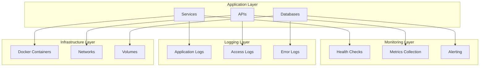

# Operations Documentation

## 📋 Mục lục

- [Monitoring](./monitoring.md)
- [Logging](./logging.md)
- [Performance](./performance.md)
- [Maintenance](./maintenance.md)

## 🎯 Mục đích

Tài liệu này mô tả các hoạt động vận hành hệ thống COBOL Assistant, bao gồm monitoring, logging, performance optimization, và maintenance.

## 🏗️ Operations Overview

### Operations Stack

### Key Operations Areas

1. **Monitoring**: System health, performance metrics, alerts
2. **Logging**: Centralized logging, log analysis, troubleshooting
3. **Performance**: Optimization, scaling, resource management
4. **Maintenance**: Updates, backups, disaster recovery

## 📊 Monitoring

### Health Checks
- **API Gateway**: `GET /health`
- **AI Databases**: `GET /ai-databases/health`
- **Core Workers**: `GET /core-workers/health`
- **Core Workflows**: `GET /core-workflows/health`
- **Tools Inventory**: `GET /tools-inventory/health`

### Key Metrics
- **Response Time**: API response times
- **Throughput**: Requests per second
- **Error Rate**: Error percentage
- **Resource Usage**: CPU, memory, disk
- **Database Performance**: Query times, connections

### Alerting
- **Critical**: Service down, database unavailable
- **Warning**: High error rate, slow response
- **Info**: Service restarts, configuration changes

## 📝 Logging

### Log Levels
- **ERROR**: System errors, exceptions
- **WARNING**: Potential issues, deprecated usage
- **INFO**: General information, user actions
- **DEBUG**: Detailed debugging information

### Log Sources
- **Application Logs**: Service-specific logs
- **Access Logs**: API requests and responses
- **Database Logs**: Query logs, connection logs
- **System Logs**: Docker, OS logs

### Log Analysis
- **Error Tracking**: Identify and resolve errors
- **Performance Analysis**: Find bottlenecks
- **User Behavior**: Understand usage patterns
- **Security Monitoring**: Detect suspicious activity

## ⚡ Performance

### Performance Targets
- **API Response Time**: <100ms (95th percentile)
- **File Processing**: <30s per file
- **Vector Search**: <500ms
- **Embedding Generation**: <2s
- **Uptime**: >99.9%

### Optimization Strategies
- **Caching**: Redis for frequently accessed data
- **Connection Pooling**: Database connection reuse
- **Async Processing**: Non-blocking I/O
- **Load Balancing**: Distribute requests
- **Resource Scaling**: Auto-scaling based on load

### Performance Monitoring
- **Real-time Metrics**: Live performance data
- **Historical Analysis**: Trend analysis
- **Capacity Planning**: Resource requirements
- **Bottleneck Identification**: Performance issues

## 🔧 Maintenance

### Regular Maintenance
- **Daily**: Health checks, log review
- **Weekly**: Performance analysis, backup verification
- **Monthly**: Security updates, dependency updates
- **Quarterly**: Capacity planning, disaster recovery testing

### Backup Strategy
- **Database Backups**: Daily automated backups
- **Configuration Backups**: Version-controlled configs
- **Log Backups**: Centralized log storage
- **Disaster Recovery**: Multi-region backups

### Update Procedures
- **Service Updates**: Rolling updates
- **Database Migrations**: Zero-downtime migrations
- **Configuration Changes**: Gradual rollout
- **Security Patches**: Immediate application

## 🔗 Liên kết

- [Monitoring](./monitoring.md) - System monitoring và alerting
- [Logging](./logging.md) - Logging strategy và analysis
- [Performance](./performance.md) - Performance optimization
- [Maintenance](./maintenance.md) - Maintenance procedures
