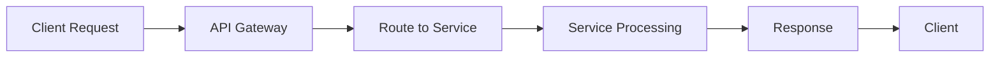
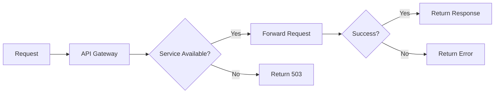

# API Gateway Service

## 🎯 Mục đích

API Gateway là entry point chính của hệ thống, chịu trách nhiệm routing requests đến các microservices phù hợp và cung cấp các tính năng như CORS, health checks, và load balancing.

## 🏗️ Kiến trúc

### Service Overview
- **Port**: 8000
- **Framework**: FastAPI
- **Type**: Stateless
- **Scaling**: Horizontal

### Responsibilities
1. **Request Routing**: Route requests đến appropriate services
2. **CORS Handling**: Manage cross-origin requests
3. **Health Checks**: Provide system health status
4. **Load Balancing**: Distribute requests across services
5. **Error Handling**: Centralized error handling

## 🔧 Implementation

### Main Components

#### 1. FastAPI Application
```python
app = FastAPI(
    title="COBOL AI Assistant - API Gateway",
    description="Main API Gateway for routing requests to microservices",
    version="1.0.0"
)
```

#### 2. Service Configuration
```python
SERVICES = {
    "ai_databases": "http://ai-databases:8000",
    "core_workers": "http://core-workers:8000", 
    "core_workflows": "http://core-workflows:8000",
    "tools_inventory": "http://tools-inventory:8000"
}
```

#### 3. CORS Middleware
```python
app.add_middleware(
    CORSMiddleware,
    allow_origins=["*"],
    allow_credentials=True,
    allow_methods=["*"],
    allow_headers=["*"],
)
```

## 📡 API Endpoints

### Health Check
```http
GET /health
```
**Response**:
```json
{
  "success": true,
  "status": "HEALTHY",
  "service": "api_gateway",
  "timestamp": "2024-01-01T00:00:00Z"
}
```

### Service Proxies

#### AI Databases Proxy
```http
POST /ai-databases/{path}
GET /ai-databases/{path}
PUT /ai-databases/{path}
DELETE /ai-databases/{path}
```

#### Core Workers Proxy
```http
POST /core-workers/{path}
GET /core-workers/{path}
PUT /core-workers/{path}
DELETE /core-workers/{path}
```

#### Core Workflows Proxy
```http
POST /core-workflows/{path}
GET /core-workflows/{path}
PUT /core-workflows/{path}
DELETE /core-workflows/{path}
```

#### Tools Inventory Proxy
```http
POST /tools-inventory/{path}
GET /tools-inventory/{path}
PUT /tools-inventory/{path}
DELETE /tools-inventory/{path}
```

## 🔄 Request Flow

### 1. Request Processing


### 2. Error Handling


## 🛠️ Configuration

### Environment Variables
```bash
# Service URLs (optional, uses defaults)
AI_DATABASES_URL=http://ai-databases:8000
CORE_WORKERS_URL=http://core-workers:8000
CORE_WORKFLOWS_URL=http://core-workflows:8000
TOOLS_INVENTORY_URL=http://tools-inventory:8000

# Logging
LOG_LEVEL=INFO
LOG_FILE=/app/shared/api_gateway.log
```

### Docker Configuration
```yaml
api-gateway:
  build: ./api_gateway
  container_name: api-gateway
  ports:
    - "8000:8000"
  depends_on:
    - core-workers
    - core-workflows
    - tools-inventory
    - ai-databases
  environment:
    - PYTHONUNBUFFERED=1
  networks:
    - backend
  volumes:
    - ./shared:/app/shared
```

## 🔍 Monitoring & Logging

### Health Checks
- **Endpoint**: `/health`
- **Response Time**: <100ms
- **Dependencies**: All services

### Logging
- **Format**: Structured JSON
- **Level**: INFO, ERROR, DEBUG
- **Location**: `/app/shared/api_gateway.log`

### Metrics
- **Request Count**: Total requests per service
- **Response Time**: Average response time
- **Error Rate**: Error percentage per service
- **Throughput**: Requests per second

## 🚀 Deployment

### Local Development
```bash
cd api_gateway
pip install -r requirements.txt
uvicorn main:app --host 0.0.0.0 --port 8000
```

### Docker
```bash
docker build -t api-gateway .
docker run -p 8000:8000 api-gateway
```

### Docker Compose
```bash
docker-compose up api-gateway
```

## 🔧 Troubleshooting

### Common Issues

#### 1. Service Unavailable (503)
**Cause**: Target service is down
**Solution**: Check service health and restart if needed

#### 2. Connection Timeout
**Cause**: Service response too slow
**Solution**: Check service performance and scaling

#### 3. CORS Errors
**Cause**: CORS configuration issues
**Solution**: Check CORS middleware configuration

### Debug Commands
```bash
# Check service health
curl http://localhost:8000/health

# Check service logs
docker-compose logs api-gateway

# Test service connectivity
curl http://localhost:8000/ai-databases/health
```

## 🔗 Liên kết

- [AI Databases Service](./ai-databases.md)
- [Core Workers Service](./core-workers.md)
- [Core Workflows Service](./core-workflows.md)
- [Tools Inventory Service](./tools-inventory.md)
- [Webapp Service](./webapp.md)
