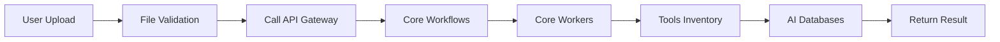
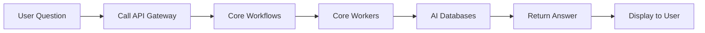
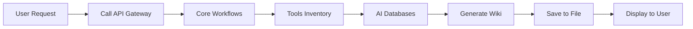

# Webapp Service

## 🎯 Mục đích

Webapp Service cung cấp giao diện người dùng cho hệ thống COBOL Assistant, được xây dựng bằng Streamlit với các tính năng upload, chat, và quản lý tài liệu.

## 🏗️ Service Overview

- **Port**: 8501
- **Framework**: Streamlit
- **Type**: Stateless
- **Dependencies**: API Gateway

### Responsibilities
1. **User Interface**: Streamlit web interface
2. **Authentication**: User authentication và authorization
3. **File Management**: File upload và processing
4. **Chat Interface**: Q&A interface
5. **Task Management**: Background task monitoring
6. **Feedback System**: User feedback collection

## 🔧 Implementation

### Main Components

#### 1. Streamlit Application
```python
import streamlit as st
from auth import setup_authenticator, is_admin, is_authenticated

# Page configuration
st.set_page_config(
    page_title="COBOL AI Assistant",
    page_icon="🤖",
    layout="wide",
    initial_sidebar_state="expanded"
)
```

#### 2. Authentication System
```python
from auth import setup_authenticator, is_admin, is_authenticated, get_username

# Setup authenticator
authenticator = setup_authenticator()

# Login form
name, authentication_status, username = authenticator.login('Login', 'main')

if authentication_status == False:
    st.error('Username/password is incorrect')
elif authentication_status == None:
    st.warning('Please enter your username and password')
elif authentication_status:
    # Main application
    pass
```

#### 3. API Integration
```python
import requests
import httpx

# API configuration
API_BASE_URL = os.getenv("API_BASE_URL", "http://api-gateway:8000")

async def call_api(endpoint: str, data: dict = None, files: dict = None):
    """Call API endpoint"""
    url = f"{API_BASE_URL}{endpoint}"
    
    if files:
        response = requests.post(url, files=files, data=data)
    else:
        response = requests.post(url, json=data)
    
    return response.json()
```

## 📱 User Interface

### Main Layout

#### Sidebar Navigation
```python
def render_sidebar():
    """Render sidebar navigation"""
    with st.sidebar:
        st.title("COBOL AI Assistant")
        
        # Navigation
        page = st.selectbox(
            "Navigate",
            ["Home", "Upload & Index", "Chat", "Wiki", "Admin"]
        )
        
        # User info
        if is_authenticated():
            st.write(f"Welcome, {get_username()}!")
            if st.button("Logout"):
                authenticator.logout('Logout', 'sidebar')
        
        # Admin section
        if is_admin():
            st.write("---")
            st.subheader("Admin Panel")
            if st.button("View Logs"):
                st.session_state.admin_page = "logs"
            if st.button("System Status"):
                st.session_state.admin_page = "status"
```

#### Main Content Area
```python
def render_main_content():
    """Render main content based on selected page"""
    page = st.session_state.get("page", "Home")
    
    if page == "Home":
        render_home_page()
    elif page == "Upload & Index":
        render_upload_page()
    elif page == "Chat":
        render_chat_page()
    elif page == "Wiki":
        render_wiki_page()
    elif page == "Admin":
        render_admin_page()
```

### 1. Home Page

#### Welcome Section
```python
def render_home_page():
    """Render home page"""
    st.title("Welcome to COBOL AI Assistant")
    
    col1, col2 = st.columns(2)
    
    with col1:
        st.subheader("🚀 Quick Start")
        st.write("1. Upload your COBOL files")
        st.write("2. Index them for search")
        st.write("3. Ask questions about your code")
        st.write("4. Generate documentation")
        
        if st.button("Get Started", type="primary"):
            st.session_state.page = "Upload & Index"
    
    with col2:
        st.subheader("📊 System Status")
        status = get_system_status()
        if status["healthy"]:
            st.success("All systems operational")
        else:
            st.error("Some systems are down")
        
        st.write(f"**Files Indexed:** {status['files_count']}")
        st.write(f"**Questions Asked:** {status['questions_count']}")
```

### 2. Upload & Index Page

#### File Upload Section
```python
def render_upload_page():
    """Render upload and indexing page"""
    st.title("Upload & Index Files")
    
    # File upload
    uploaded_file = st.file_uploader(
        "Choose a ZIP file containing COBOL code",
        type="zip",
        help="Upload a ZIP file containing your COBOL, COPY, JCL, or text files"
    )
    
    if uploaded_file:
        st.success(f"File uploaded: {uploaded_file.name}")
        
        # Indexing options
        col1, col2 = st.columns(2)
        
        with col1:
            chunk_size = st.number_input(
                "Chunk Size",
                min_value=1000,
                max_value=10000,
                value=6000,
                help="Size of text chunks for processing"
            )
        
        with col2:
            batch_size = st.number_input(
                "Batch Size",
                min_value=10,
                max_value=200,
                value=100,
                help="Number of chunks to process in each batch"
            )
        
        # Index button
        if st.button("🚀 Start Indexing", type="primary"):
            with st.spinner("Indexing files..."):
                result = index_files(uploaded_file, chunk_size, batch_size)
                
                if result["success"]:
                    st.success("Files indexed successfully!")
                    st.json(result["data"])
                else:
                    st.error(f"Indexing failed: {result['error']}")
```

#### Indexing Progress
```python
def show_indexing_progress(task_id: str):
    """Show indexing progress"""
    progress_bar = st.progress(0)
    status_text = st.empty()
    
    while True:
        status = get_task_status(task_id)
        
        if status["status"] == "SUCCESS":
            progress_bar.progress(100)
            status_text.text("Indexing completed!")
            break
        elif status["status"] == "FAILURE":
            status_text.text("Indexing failed!")
            break
        else:
            progress = status.get("progress", 0)
            progress_bar.progress(progress)
            status_text.text(f"Indexing... {progress}%")
            time.sleep(1)
```

### 3. Chat Page

#### Chat Interface
```python
def render_chat_page():
    """Render chat interface"""
    st.title("Chat with COBOL AI")
    
    # Initialize chat history
    if "messages" not in st.session_state:
        st.session_state.messages = []
    
    # Display chat messages
    for message in st.session_state.messages:
        with st.chat_message(message["role"]):
            st.markdown(message["content"])
    
    # Chat input
    if prompt := st.chat_input("Ask a question about your COBOL code..."):
        # Add user message
        st.session_state.messages.append({"role": "user", "content": prompt})
        
        # Display user message
        with st.chat_message("user"):
            st.markdown(prompt)
        
        # Generate AI response
        with st.chat_message("assistant"):
            with st.spinner("Thinking..."):
                response = ask_question(prompt)
                
                if response["success"]:
                    st.markdown(response["data"]["answer"])
                    
                    # Show references
                    if response["data"]["references"]:
                        with st.expander("References"):
                            for ref in response["data"]["references"]:
                                st.write(f"**File:** {ref['file_path']}")
                                st.write(f"**Score:** {ref['score']:.2f}")
                                st.write("---")
                else:
                    st.error(f"Error: {response['error']}")
        
        # Add AI message
        st.session_state.messages.append({
            "role": "assistant", 
            "content": response["data"]["answer"] if response["success"] else response["error"]
        })
```

#### Question History
```python
def render_question_history():
    """Render question history"""
    st.subheader("Question History")
    
    if "question_history" in st.session_state:
        for i, qa in enumerate(st.session_state.question_history):
            with st.expander(f"Q: {qa['question'][:50]}..."):
                st.write(f"**Question:** {qa['question']}")
                st.write(f"**Answer:** {qa['answer']}")
                st.write(f"**Time:** {qa['timestamp']}")
                
                if st.button(f"Delete", key=f"delete_{i}"):
                    del st.session_state.question_history[i]
                    st.rerun()
```

### 4. Wiki Page

#### Wiki Management
```python
def render_wiki_page():
    """Render wiki management page"""
    st.title("Documentation Wiki")
    
    # Check if wiki exists
    wiki_path = get_wiki_path()
    
    if os.path.exists(wiki_path):
        # Display existing wiki
        with open(wiki_path, 'r', encoding='utf-8') as f:
            wiki_content = f.read()
        
        st.markdown(wiki_content)
        
        # Wiki actions
        col1, col2, col3 = st.columns(3)
        
        with col1:
            if st.button("🔄 Regenerate Wiki"):
                regenerate_wiki()
        
        with col2:
            if st.button("📥 Download Wiki"):
                download_wiki(wiki_content)
        
        with col3:
            if st.button("🗑️ Delete Wiki"):
                delete_wiki()
    else:
        # Generate wiki
        st.info("No wiki found. Generate one from your indexed files.")
        
        if st.button("🚀 Generate Wiki", type="primary"):
            with st.spinner("Generating wiki..."):
                result = generate_wiki()
                
                if result["success"]:
                    st.success("Wiki generated successfully!")
                    st.rerun()
                else:
                    st.error(f"Wiki generation failed: {result['error']}")
```

#### Wiki Generation Options
```python
def render_wiki_generation_options():
    """Render wiki generation options"""
    st.subheader("Wiki Generation Options")
    
    spec_type = st.selectbox(
        "Specification Type",
        ["Repository Overview", "Detailed Analysis", "Code Structure"]
    )
    
    include_diagrams = st.checkbox("Include Diagrams", value=True)
    include_examples = st.checkbox("Include Code Examples", value=True)
    
    if st.button("Generate Wiki"):
        options = {
            "spec_type": spec_type,
            "include_diagrams": include_diagrams,
            "include_examples": include_examples
        }
        
        result = generate_wiki_with_options(options)
        return result
```

### 5. Admin Page

#### Admin Dashboard
```python
def render_admin_page():
    """Render admin dashboard"""
    if not is_admin():
        st.error("Access denied. Admin privileges required.")
        return
    
    st.title("Admin Dashboard")
    
    # System status
    st.subheader("System Status")
    status = get_system_status()
    
    col1, col2, col3, col4 = st.columns(4)
    
    with col1:
        st.metric("API Gateway", "Healthy" if status["api_gateway"] else "Down")
    
    with col2:
        st.metric("AI Databases", "Healthy" if status["ai_databases"] else "Down")
    
    with col3:
        st.metric("Core Workers", "Healthy" if status["core_workers"] else "Down")
    
    with col4:
        st.metric("Core Workflows", "Healthy" if status["core_workflows"] else "Down")
    
    # Task management
    st.subheader("Task Management")
    tasks = get_active_tasks()
    
    if tasks:
        for task in tasks:
            with st.expander(f"Task {task['id']} - {task['status']}"):
                st.json(task)
    else:
        st.info("No active tasks")
    
    # User management
    st.subheader("User Management")
    users = get_users()
    
    for user in users:
        col1, col2, col3 = st.columns([2, 1, 1])
        
        with col1:
            st.write(f"**{user['username']}** ({user['role']})")
        
        with col2:
            if st.button(f"Edit", key=f"edit_{user['username']}"):
                edit_user(user)
        
        with col3:
            if st.button(f"Delete", key=f"delete_{user['username']}"):
                delete_user(user)
```

## 🔄 Data Flow

### 1. File Upload Flow


### 2. Chat Flow


### 3. Wiki Generation Flow


## 🛠️ Configuration

### Environment Variables
```bash
# API Configuration
API_BASE_URL=http://api-gateway:8000

# Authentication
AUTH_SECRET_KEY=your_secret_key

# Logging
LOG_LEVEL=INFO
LOG_FILE=/app/shared/webapp.log

# Streamlit Configuration
STREAMLIT_SERVER_PORT=8501
STREAMLIT_SERVER_ADDRESS=0.0.0.0
```

### Docker Configuration
```yaml
webapp:
  build: ./webapp
  container_name: webapp
  ports:
    - "8501:8501"
  depends_on:
    - api-gateway
  environment:
    - API_BASE_URL=http://api-gateway:8000
    - AUTH_SECRET_KEY=your_secret_key
  networks:
    - backend
  volumes:
    - ./shared:/app/shared
```

## 🔍 Error Handling

### API Error Handling
```python
def handle_api_error(response):
    """Handle API response errors"""
    if response.status_code == 200:
        return response.json()
    elif response.status_code == 404:
        st.error("Service not found")
    elif response.status_code == 500:
        st.error("Internal server error")
    elif response.status_code == 503:
        st.error("Service unavailable")
    else:
        st.error(f"Error: {response.status_code}")
    
    return None
```

### User Input Validation
```python
def validate_file_upload(file):
    """Validate uploaded file"""
    if not file:
        st.error("Please select a file")
        return False
    
    if not file.name.endswith('.zip'):
        st.error("Please upload a ZIP file")
        return False
    
    if file.size > 100 * 1024 * 1024:  # 100MB limit
        st.error("File too large. Maximum size is 100MB")
        return False
    
    return True
```

## 📊 Performance Optimization

### Caching
```python
@st.cache_data
def get_system_status():
    """Cache system status"""
    return call_api("/health")

@st.cache_data
def get_wiki_content():
    """Cache wiki content"""
    wiki_path = get_wiki_path()
    if os.path.exists(wiki_path):
        with open(wiki_path, 'r', encoding='utf-8') as f:
            return f.read()
    return None
```

### Async Operations
```python
import asyncio
import httpx

async def call_api_async(endpoint: str, data: dict = None):
    """Call API asynchronously"""
    async with httpx.AsyncClient() as client:
        response = await client.post(f"{API_BASE_URL}{endpoint}", json=data)
        return response.json()
```

## 🔒 Security

### Authentication
```python
def check_authentication():
    """Check if user is authenticated"""
    if not is_authenticated():
        st.error("Please log in to access this page")
        st.stop()
```

### Input Sanitization
```python
def sanitize_input(text: str) -> str:
    """Sanitize user input"""
    # Remove potentially dangerous characters
    sanitized = re.sub(r'[<>"\']', '', text)
    return sanitized.strip()
```

### Session Management
```python
def init_session_state():
    """Initialize session state"""
    if "authenticated" not in st.session_state:
        st.session_state.authenticated = False
    if "username" not in st.session_state:
        st.session_state.username = None
    if "messages" not in st.session_state:
        st.session_state.messages = []
```

## 🔗 Liên kết

- [API Gateway Service](./api-gateway.md)
- [Core Workflows Service](./core-workflows.md)
- [Authentication System](../development/setup.md)
- [User Interface Design](../development/workflow.md)
