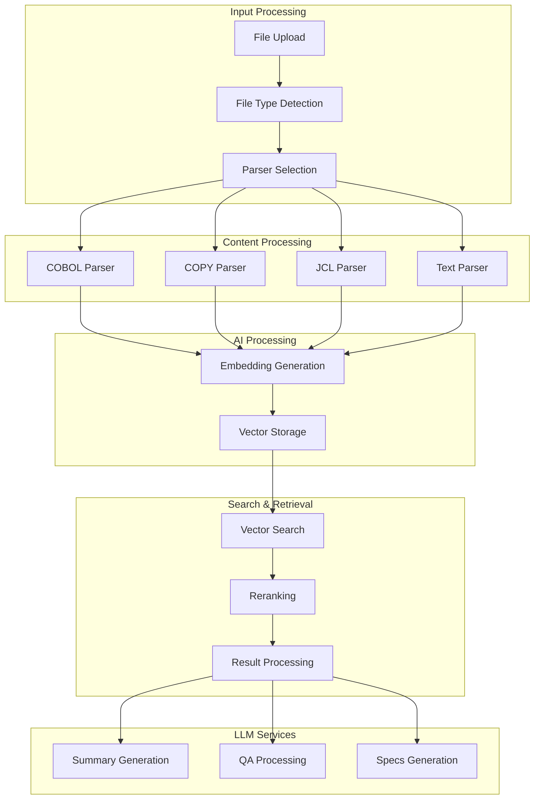

# Technical Implementation

## 📋 Mục lục

- [Parsers](./parsers.md)
- [Embedding System](./embeddings.md)
- [Vector Search](./vector-search.md)
- [LLM Services](./llm-services.md)
- [Database Operations](./database-ops.md)

## 🎯 Mục đích

Tài liệu này mô tả chi tiết về technical implementation của hệ thống COBOL Assistant, bao gồm:
- Core algorithms và data structures
- Performance optimizations
- Error handling strategies
- Integration patterns

## 🏗️ Technical Architecture

### Core Components

## 🔧 Implementation Patterns

### 1. Parser Pattern
- **Strategy Pattern**: Different parsers for different file types
- **Factory Pattern**: Parser creation based on file type
- **Template Method**: Common parsing workflow

### 2. Embedding Pattern
- **Singleton Pattern**: Single embedding service instance
- **Batch Processing**: Process multiple items together
- **Caching**: Cache embeddings for performance

### 3. Vector Search Pattern
- **Query Processing**: Transform queries to embeddings
- **Multi-collection Search**: Search across multiple collections
- **Result Aggregation**: Combine results from different sources

### 4. LLM Pattern
- **Adapter Pattern**: Wrap different LLM services
- **Retry Pattern**: Handle API failures
- **Streaming Pattern**: Stream responses for better UX

## 📊 Performance Considerations

### Memory Management
- **Chunking Strategy**: Process large files in chunks
- **Memory Pooling**: Reuse memory for similar operations
- **Garbage Collection**: Proper cleanup of resources

### Caching Strategy
- **Embedding Cache**: Cache generated embeddings
- **Result Cache**: Cache search results
- **Metadata Cache**: Cache file metadata

### Async Processing
- **Non-blocking I/O**: Use async/await patterns
- **Concurrent Processing**: Process multiple items simultaneously
- **Background Tasks**: Use Celery for long-running operations

## 🔍 Error Handling

### Error Types
1. **Input Errors**: Invalid files, malformed data
2. **Processing Errors**: Parser failures, API errors
3. **Storage Errors**: Database connection issues
4. **Network Errors**: External API failures

### Error Recovery
1. **Retry Logic**: Automatic retry for transient errors
2. **Fallback Mechanisms**: Alternative processing paths
3. **Circuit Breaker**: Prevent cascade failures
4. **Graceful Degradation**: Continue with reduced functionality

## 🔗 Liên kết

- [Parsers](./parsers.md) - File parsing implementations
- [Embedding System](./embeddings.md) - Vector embedding generation
- [Vector Search](./vector-search.md) - Vector similarity search
- [LLM Services](./llm-services.md) - Language model services
- [Database Operations](./database-ops.md) - Database interactions
