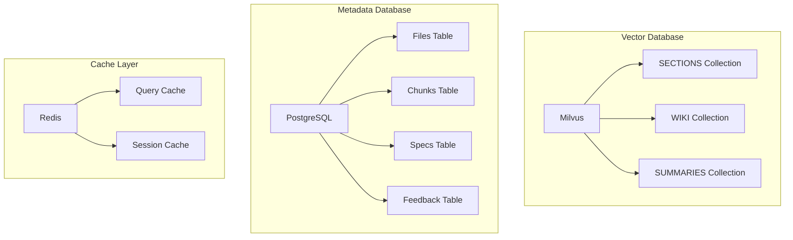

# Database Operations

## 🎯 Mục đích

Tài liệu này mô tả các operations database trong COBOL Assistant, bao gồm Milvus vector database và PostgreSQL metadata database.

## 🏗️ Database Architecture

### Database Overview



### Database Types

| Database | Purpose | Technology | Data Type |
|----------|---------|------------|-----------|
| **Milvus** | Vector storage | Vector DB | Embeddings + metadata |
| **PostgreSQL** | Metadata storage | Relational DB | Structured data |
| **Redis** | Caching | In-memory DB | Key-value pairs |

## 🔧 Milvus Operations

### 1. Collection Management

#### Create Collection
```python
from pymilvus import Collection, CollectionSchema, FieldSchema, DataType

def create_collection(collection_name: str, description: str = None):
    """Create Milvus collection"""
    try:
        # Define schema
        fields = [
            FieldSchema(name="id", dtype=DataType.VARCHAR, is_primary=True, max_length=100),
            FieldSchema(name="content", dtype=DataType.VARCHAR, max_length=65535),
            FieldSchema(name="embedding", dtype=DataType.FLOAT_VECTOR, dim=1536),
            FieldSchema(name="metadata", dtype=DataType.JSON)
        ]
        
        schema = CollectionSchema(
            fields=fields,
            description=description or f"Collection for {collection_name}"
        )
        
        # Create collection
        collection = Collection(
            name=collection_name,
            schema=schema,
            using='default',
            shards_num=2
        )
        
        logger.info(f"Created collection: {collection_name}")
        return collection
        
    except Exception as e:
        logger.error(f"Error creating collection {collection_name}: {e}")
        raise

def create_index(collection_name: str, field_name: str = "embedding"):
    """Create index for collection"""
    try:
        collection = Collection(collection_name)
        
        # Index parameters
        index_params = {
            "metric_type": "COSINE",
            "index_type": "IVF_FLAT",
            "params": {"nlist": 1024}
        }
        
        # Create index
        collection.create_index(
            field_name=field_name,
            index_params=index_params
        )
        
        logger.info(f"Created index for collection: {collection_name}")
        
    except Exception as e:
        logger.error(f"Error creating index for {collection_name}: {e}")
        raise
```

#### Collection Operations
```python
def load_collection(collection_name: str):
    """Load collection into memory"""
    try:
        collection = Collection(collection_name)
        collection.load()
        logger.info(f"Loaded collection: {collection_name}")
    except Exception as e:
        logger.error(f"Error loading collection {collection_name}: {e}")
        raise

def drop_collection(collection_name: str):
    """Drop collection"""
    try:
        collection = Collection(collection_name)
        collection.drop()
        logger.info(f"Dropped collection: {collection_name}")
    except Exception as e:
        logger.error(f"Error dropping collection {collection_name}: {e}")
        raise

def get_collection_stats(collection_name: str) -> Dict:
    """Get collection statistics"""
    try:
        collection = Collection(collection_name)
        stats = collection.get_stats()
        return stats
    except Exception as e:
        logger.error(f"Error getting stats for {collection_name}: {e}")
        return {}
```

### 2. Vector Operations

#### Insert Vectors
```python
async def insert_vectors(
    collection_name: str,
    documents: List[Dict]
) -> bool:
    """Insert vectors into collection"""
    try:
        collection = Collection(collection_name)
        
        # Prepare data
        ids = [doc["id"] for doc in documents]
        contents = [doc["content"] for doc in documents]
        embeddings = [doc["embedding"] for doc in documents]
        metadata = [doc["metadata"] for doc in documents]
        
        # Insert data
        collection.insert([
            ids,
            contents,
            embeddings,
            metadata
        ])
        
        # Flush to ensure data is written
        collection.flush()
        
        logger.info(f"Inserted {len(documents)} documents into {collection_name}")
        return True
        
    except Exception as e:
        logger.error(f"Error inserting vectors: {e}")
        return False
```

#### Search Vectors
```python
async def search_vectors(
    collection_name: str,
    query_embedding: List[float],
    top_k: int = 10,
    search_params: Dict = None
) -> List[Dict]:
    """Search vectors in collection"""
    try:
        collection = Collection(collection_name)
        
        # Load collection if not loaded
        if not collection.has_index():
            collection.load()
        
        # Default search parameters
        if not search_params:
            search_params = {
                "metric_type": "COSINE",
                "params": {"nprobe": 10}
            }
        
        # Perform search
        results = collection.search(
            data=[query_embedding],
            anns_field="embedding",
            param=search_params,
            limit=top_k,
            output_fields=["content", "metadata"]
        )
        
        # Format results
        formatted_results = []
        for hit in results[0]:
            formatted_results.append({
                "id": hit.id,
                "content": hit.entity.get("content"),
                "metadata": hit.entity.get("metadata"),
                "score": hit.score
            })
        
        return formatted_results
        
    except Exception as e:
        logger.error(f"Error searching vectors: {e}")
        return []
```

#### Delete Vectors
```python
async def delete_vectors(
    collection_name: str,
    ids: List[str]
) -> bool:
    """Delete vectors by IDs"""
    try:
        collection = Collection(collection_name)
        
        # Delete vectors
        collection.delete(f"id in {ids}")
        
        # Flush to ensure deletion
        collection.flush()
        
        logger.info(f"Deleted {len(ids)} vectors from {collection_name}")
        return True
        
    except Exception as e:
        logger.error(f"Error deleting vectors: {e}")
        return False
```

### 3. Collection Maintenance

#### Reindex Collection
```python
def reindex_collection(collection_name: str):
    """Reindex collection for better performance"""
    try:
        collection = Collection(collection_name)
        
        # Drop existing index
        collection.drop_index()
        
        # Create new index with optimized parameters
        index_params = {
            "metric_type": "COSINE",
            "index_type": "IVF_PQ",
            "params": {
                "nlist": 1024,
                "m": 8,
                "nbits": 8
            }
        }
        
        collection.create_index(
            field_name="embedding",
            index_params=index_params
        )
        
        logger.info(f"Reindexed collection: {collection_name}")
        
    except Exception as e:
        logger.error(f"Error reindexing collection {collection_name}: {e}")
        raise
```

#### Optimize Collection
```python
def optimize_collection(collection_name: str):
    """Optimize collection for better performance"""
    try:
        collection = Collection(collection_name)
        
        # Compact collection
        collection.compact()
        
        # Load collection
        collection.load()
        
        logger.info(f"Optimized collection: {collection_name}")
        
    except Exception as e:
        logger.error(f"Error optimizing collection {collection_name}: {e}")
        raise
```

## 🔧 PostgreSQL Operations

### 1. Connection Management

#### Database Connection
```python
import psycopg2
from psycopg2.extras import RealDictCursor
from contextlib import contextmanager

@contextmanager
def get_db_connection():
    """Get database connection with context manager"""
    conn = None
    try:
        conn = psycopg2.connect(
            host=os.getenv("POSTGRES_HOST", "localhost"),
            port=os.getenv("POSTGRES_PORT", "5432"),
            user=os.getenv("POSTGRES_USER", "cobol"),
            password=os.getenv("POSTGRES_PASSWORD", "cobol12345"),
            database=os.getenv("POSTGRES_DB", "cobol_assistant")
        )
        yield conn
    except Exception as e:
        if conn:
            conn.rollback()
        logger.error(f"Database connection error: {e}")
        raise
    finally:
        if conn:
            conn.close()
```

#### Connection Pooling
```python
from psycopg2 import pool

class DatabasePool:
    def __init__(self, min_conn=1, max_conn=20):
        self.pool = psycopg2.pool.SimpleConnectionPool(
            min_conn, max_conn,
            host=os.getenv("POSTGRES_HOST", "localhost"),
            port=os.getenv("POSTGRES_PORT", "5432"),
            user=os.getenv("POSTGRES_USER", "cobol"),
            password=os.getenv("POSTGRES_PASSWORD", "cobol12345"),
            database=os.getenv("POSTGRES_DB", "cobol_assistant")
        )
    
    def get_connection(self):
        """Get connection from pool"""
        return self.pool.getconn()
    
    def return_connection(self, conn):
        """Return connection to pool"""
        self.pool.putconn(conn)
    
    def close_all(self):
        """Close all connections"""
        self.pool.closeall()

# Global connection pool
db_pool = DatabasePool()
```

### 2. CRUD Operations

#### File Operations
```python
async def insert_file(file_data: Dict) -> int:
    """Insert file record"""
    try:
        with get_db_connection() as conn:
            with conn.cursor(cursor_factory=RealDictCursor) as cursor:
                cursor.execute("""
                    INSERT INTO files (file_path, file_name, file_type, file_size, hash_value)
                    VALUES (%s, %s, %s, %s, %s)
                    RETURNING id
                """, (
                    file_data['file_path'],
                    file_data['file_name'],
                    file_data['file_type'],
                    file_data['file_size'],
                    file_data['hash_value']
                ))
                
                file_id = cursor.fetchone()['id']
                conn.commit()
                
                logger.info(f"Inserted file: {file_id}")
                return file_id
                
    except Exception as e:
        logger.error(f"Error inserting file: {e}")
        raise

async def get_file_by_path(file_path: str) -> Optional[Dict]:
    """Get file by path"""
    try:
        with get_db_connection() as conn:
            with conn.cursor(cursor_factory=RealDictCursor) as cursor:
                cursor.execute("""
                    SELECT * FROM files WHERE file_path = %s
                """, (file_path,))
                
                result = cursor.fetchone()
                return dict(result) if result else None
                
    except Exception as e:
        logger.error(f"Error getting file: {e}")
        return None

async def update_file(file_id: int, update_data: Dict) -> bool:
    """Update file record"""
    try:
        with get_db_connection() as conn:
            with conn.cursor() as cursor:
                set_clauses = []
                values = []
                
                for key, value in update_data.items():
                    set_clauses.append(f"{key} = %s")
                    values.append(value)
                
                values.append(file_id)
                
                cursor.execute(f"""
                    UPDATE files 
                    SET {', '.join(set_clauses)}
                    WHERE id = %s
                """, values)
                
                conn.commit()
                
                logger.info(f"Updated file: {file_id}")
                return True
                
    except Exception as e:
        logger.error(f"Error updating file: {e}")
        return False
```

#### Chunk Operations
```python
async def insert_chunks(file_id: int, chunks: List[Dict]) -> bool:
    """Insert chunks for file"""
    try:
        with get_db_connection() as conn:
            with conn.cursor() as cursor:
                for chunk in chunks:
                    cursor.execute("""
                        INSERT INTO chunks (file_id, chunk_index, content, metadata)
                        VALUES (%s, %s, %s, %s)
                    """, (
                        file_id,
                        chunk['chunk_index'],
                        chunk['content'],
                        json.dumps(chunk['metadata'])
                    ))
                
                conn.commit()
                
                logger.info(f"Inserted {len(chunks)} chunks for file {file_id}")
                return True
                
    except Exception as e:
        logger.error(f"Error inserting chunks: {e}")
        return False

async def get_chunks_by_file(file_id: int) -> List[Dict]:
    """Get chunks for file"""
    try:
        with get_db_connection() as conn:
            with conn.cursor(cursor_factory=RealDictCursor) as cursor:
                cursor.execute("""
                    SELECT * FROM chunks WHERE file_id = %s ORDER BY chunk_index
                """, (file_id,))
                
                results = cursor.fetchall()
                return [dict(row) for row in results]
                
    except Exception as e:
        logger.error(f"Error getting chunks: {e}")
        return []
```

#### Specs Operations
```python
async def save_specs(specs_data: Dict) -> int:
    """Save specifications"""
    try:
        with get_db_connection() as conn:
            with conn.cursor(cursor_factory=RealDictCursor) as cursor:
                cursor.execute("""
                    INSERT INTO specs (file_id, spec_type, content, metadata)
                    VALUES (%s, %s, %s, %s)
                    RETURNING id
                """, (
                    specs_data['file_id'],
                    specs_data['spec_type'],
                    specs_data['content'],
                    json.dumps(specs_data.get('metadata', {}))
                ))
                
                spec_id = cursor.fetchone()['id']
                conn.commit()
                
                logger.info(f"Saved specs: {spec_id}")
                return spec_id
                
    except Exception as e:
        logger.error(f"Error saving specs: {e}")
        raise

async def get_specs(spec_id: int) -> Optional[Dict]:
    """Get specifications by ID"""
    try:
        with get_db_connection() as conn:
            with conn.cursor(cursor_factory=RealDictCursor) as cursor:
                cursor.execute("""
                    SELECT * FROM specs WHERE id = %s
                """, (spec_id,))
                
                result = cursor.fetchone()
                return dict(result) if result else None
                
    except Exception as e:
        logger.error(f"Error getting specs: {e}")
        return None
```

### 3. Query Optimization

#### Index Management
```python
def create_database_indexes():
    """Create database indexes for better performance"""
    try:
        with get_db_connection() as conn:
            with conn.cursor() as cursor:
                # Files table indexes
                cursor.execute("CREATE INDEX IF NOT EXISTS idx_files_file_path ON files(file_path)")
                cursor.execute("CREATE INDEX IF NOT EXISTS idx_files_file_type ON files(file_type)")
                cursor.execute("CREATE INDEX IF NOT EXISTS idx_files_created_at ON files(created_at)")
                
                # Chunks table indexes
                cursor.execute("CREATE INDEX IF NOT EXISTS idx_chunks_file_id ON chunks(file_id)")
                cursor.execute("CREATE INDEX IF NOT EXISTS idx_chunks_chunk_index ON chunks(chunk_index)")
                
                # Specs table indexes
                cursor.execute("CREATE INDEX IF NOT EXISTS idx_specs_file_id ON specs(file_id)")
                cursor.execute("CREATE INDEX IF NOT EXISTS idx_specs_spec_type ON specs(spec_type)")
                
                # JSONB indexes
                cursor.execute("CREATE INDEX IF NOT EXISTS idx_chunks_metadata_gin ON chunks USING GIN(metadata)")
                cursor.execute("CREATE INDEX IF NOT EXISTS idx_specs_metadata_gin ON specs USING GIN(metadata)")
                
                conn.commit()
                
                logger.info("Created database indexes")
                
    except Exception as e:
        logger.error(f"Error creating indexes: {e}")
        raise
```

#### Query Performance
```python
def analyze_query_performance():
    """Analyze query performance"""
    try:
        with get_db_connection() as conn:
            with conn.cursor() as cursor:
                # Enable query statistics
                cursor.execute("CREATE EXTENSION IF NOT EXISTS pg_stat_statements")
                
                # Get slow queries
                cursor.execute("""
                    SELECT query, mean_time, calls 
                    FROM pg_stat_statements 
                    ORDER BY mean_time DESC 
                    LIMIT 10
                """)
                
                slow_queries = cursor.fetchall()
                
                logger.info("Slow queries:")
                for query, mean_time, calls in slow_queries:
                    logger.info(f"Query: {query[:100]}...")
                    logger.info(f"Mean time: {mean_time}ms, Calls: {calls}")
                
    except Exception as e:
        logger.error(f"Error analyzing query performance: {e}")
```

## 📊 Performance Optimization

### Caching Strategy
```python
import redis
import json

redis_client = redis.Redis(host='redis', port=6379, db=0)

def cache_query_result(query: str, result: Dict, ttl: int = 300):
    """Cache query result"""
    try:
        query_hash = hashlib.md5(query.encode()).hexdigest()
        cache_key = f"query_result:{query_hash}"
        redis_client.setex(cache_key, ttl, json.dumps(result))
    except Exception as e:
        logger.error(f"Error caching query result: {e}")

def get_cached_query_result(query: str) -> Optional[Dict]:
    """Get cached query result"""
    try:
        query_hash = hashlib.md5(query.encode()).hexdigest()
        cache_key = f"query_result:{query_hash}"
        cached = redis_client.get(cache_key)
        if cached:
            return json.loads(cached)
        return None
    except Exception as e:
        logger.error(f"Error getting cached query result: {e}")
        return None
```

### Connection Optimization
```python
def optimize_connections():
    """Optimize database connections"""
    try:
        with get_db_connection() as conn:
            with conn.cursor() as cursor:
                # Set connection parameters
                cursor.execute("SET shared_preload_libraries = 'pg_stat_statements'")
                cursor.execute("SET max_connections = 100")
                cursor.execute("SET shared_buffers = '256MB'")
                cursor.execute("SET effective_cache_size = '1GB'")
                cursor.execute("SET work_mem = '4MB'")
                cursor.execute("SET maintenance_work_mem = '64MB'")
                
                conn.commit()
                
                logger.info("Optimized database connections")
                
    except Exception as e:
        logger.error(f"Error optimizing connections: {e}")
```

## 🔍 Error Handling

### Database Error Handling
```python
def handle_database_error(error: Exception, operation: str):
    """Handle database errors"""
    logger.error(f"Database error during {operation}: {error}")
    
    # Check for specific error types
    if "connection" in str(error).lower():
        logger.error("Database connection error")
    elif "timeout" in str(error).lower():
        logger.error("Database timeout error")
    elif "constraint" in str(error).lower():
        logger.error("Database constraint error")
    else:
        logger.error("Unknown database error")
    
    # Return appropriate response
    return {
        "success": False,
        "error": f"Database error during {operation}",
        "details": str(error)
    }
```

### Transaction Management
```python
@contextmanager
def database_transaction():
    """Database transaction context manager"""
    conn = None
    try:
        conn = get_db_connection()
        yield conn
        conn.commit()
    except Exception as e:
        if conn:
            conn.rollback()
        logger.error(f"Transaction error: {e}")
        raise
    finally:
        if conn:
            conn.close()
```

## 📈 Monitoring & Metrics

### Database Metrics
```python
def track_database_metrics(operation: str, duration: float, success: bool):
    """Track database performance metrics"""
    metrics = {
        "operation": operation,
        "duration": duration,
        "success": success,
        "timestamp": datetime.now().isoformat()
    }
    
    logger.info(f"Database Metrics: {json.dumps(metrics)}")
    
    # Send to monitoring system
    send_metrics_to_monitoring(metrics)
```

### Connection Pool Metrics
```python
def get_connection_pool_stats() -> Dict:
    """Get connection pool statistics"""
    try:
        return {
            "min_connections": db_pool.pool.minconn,
            "max_connections": db_pool.pool.maxconn,
            "current_connections": len(db_pool.pool._used_connections),
            "available_connections": len(db_pool.pool._pool)
        }
    except Exception as e:
        logger.error(f"Error getting connection pool stats: {e}")
        return {}
```

## 🔗 Liên kết

- [Embeddings](./embeddings.md)
- [Vector Search](./vector-search.md)
- [LLM Services](./llm-services.md)
- [Parsers](./parsers.md)
- [AI Databases Service](../services/ai-databases.md)
