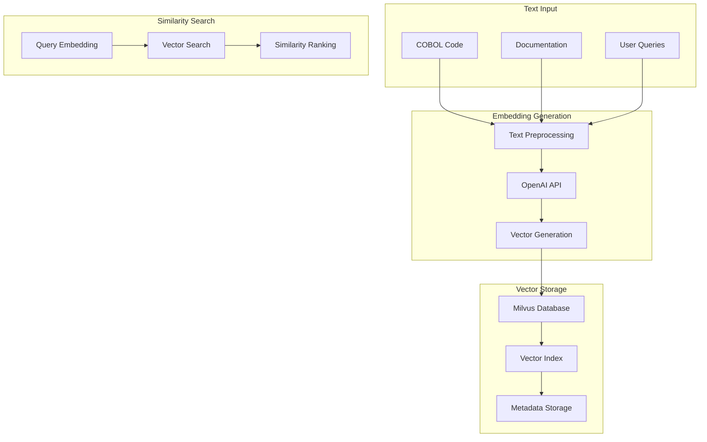

# Embeddings

## 🎯 Mục đích

Tài liệu này mô tả hệ thống embedding trong COBOL Assistant, bao gồm embedding generation, vector storage, và similarity search.

## 🏗️ Embedding Architecture

### Embedding Overview



### Embedding Types

| Type | Purpose | Model | Dimensions | Use Case |
|------|---------|-------|------------|----------|
| **Code Embeddings** | COBOL code chunks | text-embedding-3-small | 1536 | Code search |
| **Documentation Embeddings** | Generated docs | text-embedding-3-small | 1536 | Doc search |
| **Query Embeddings** | User questions | text-embedding-3-small | 1536 | Question answering |

## 🔧 Implementation

### 1. Embedding Generation

#### OpenAI Embedding Tool
```python
class OpenAIEmbeddingTool:
    def __init__(self, api_key: str = None, model_name: str = "text-embedding-3-small"):
        self.api_key = api_key or os.getenv("OPENAI_API_KEY")
        self.model_name = model_name
        self.client = OpenAI(api_key=self.api_key)
        self.embedding_dim = 1536
        self.max_input_length = 8191
    
    async def generate_embedding(self, content: str) -> List[float]:
        """Generate embedding for content"""
        try:
            # Validate input
            if not content or len(content.strip()) == 0:
                raise ValueError("Content cannot be empty")
            
            if len(content) > self.max_input_length:
                content = content[:self.max_input_length]
            
            # Generate embedding
            response = await self.client.embeddings.create(
                model=self.model_name,
                input=content
            )
            
            return response.data[0].embedding
            
        except Exception as e:
            logger.error(f"Error generating embedding: {e}")
            raise
    
    async def batch_generate_embeddings(self, contents: List[str]) -> List[List[float]]:
        """Generate embeddings for multiple contents"""
        try:
            # Validate inputs
            valid_contents = []
            for content in contents:
                if content and len(content.strip()) > 0:
                    if len(content) > self.max_input_length:
                        content = content[:self.max_input_length]
                    valid_contents.append(content)
            
            if not valid_contents:
                return []
            
            # Generate embeddings
            response = await self.client.embeddings.create(
                model=self.model_name,
                input=valid_contents
            )
            
            return [item.embedding for item in response.data]
            
        except Exception as e:
            logger.error(f"Error generating batch embeddings: {e}")
            raise
```

#### Text Preprocessing
```python
def preprocess_text_for_embedding(text: str) -> str:
    """Preprocess text for embedding generation"""
    # Remove extra whitespace
    text = re.sub(r'\s+', ' ', text.strip())
    
    # Remove special characters that might interfere
    text = re.sub(r'[^\w\s\.\,\;\:\!\?\-\(\)]', '', text)
    
    # Normalize case (optional)
    # text = text.lower()
    
    return text

def chunk_text_for_embedding(text: str, max_chunk_size: int = 6000) -> List[str]:
    """Chunk text for embedding generation"""
    if len(text) <= max_chunk_size:
        return [text]
    
    chunks = []
    sentences = text.split('. ')
    
    current_chunk = ""
    for sentence in sentences:
        if len(current_chunk) + len(sentence) + 2 <= max_chunk_size:
            current_chunk += sentence + ". "
        else:
            if current_chunk:
                chunks.append(current_chunk.strip())
            current_chunk = sentence + ". "
    
    if current_chunk:
        chunks.append(current_chunk.strip())
    
    return chunks
```

### 2. Vector Storage

#### Milvus Collection Setup
```python
from pymilvus import Collection, CollectionSchema, FieldSchema, DataType

def create_embeddings_collection(collection_name: str = "sections"):
    """Create Milvus collection for embeddings"""
    
    # Define schema
    fields = [
        FieldSchema(name="id", dtype=DataType.VARCHAR, is_primary=True, max_length=100),
        FieldSchema(name="content", dtype=DataType.VARCHAR, max_length=65535),
        FieldSchema(name="embedding", dtype=DataType.FLOAT_VECTOR, dim=1536),
        FieldSchema(name="metadata", dtype=DataType.JSON)
    ]
    
    schema = CollectionSchema(
        fields=fields,
        description=f"Collection for {collection_name} embeddings"
    )
    
    # Create collection
    collection = Collection(
        name=collection_name,
        schema=schema,
        using='default',
        shards_num=2
    )
    
    # Create index
    index_params = {
        "metric_type": "COSINE",
        "index_type": "IVF_FLAT",
        "params": {"nlist": 1024}
    }
    
    collection.create_index(
        field_name="embedding",
        index_params=index_params
    )
    
    return collection
```

#### Vector Insertion
```python
async def insert_embeddings(collection_name: str, documents: List[Dict]):
    """Insert embeddings into Milvus collection"""
    try:
        collection = Collection(collection_name)
        
        # Prepare data
        ids = [doc["id"] for doc in documents]
        contents = [doc["content"] for doc in documents]
        embeddings = [doc["embedding"] for doc in documents]
        metadata = [doc["metadata"] for doc in documents]
        
        # Insert data
        collection.insert([
            ids,
            contents,
            embeddings,
            metadata
        ])
        
        # Flush to ensure data is written
        collection.flush()
        
        logger.info(f"Inserted {len(documents)} documents into {collection_name}")
        
    except Exception as e:
        logger.error(f"Error inserting embeddings: {e}")
        raise
```

### 3. Similarity Search

#### Vector Search Implementation
```python
async def search_similar_vectors(
    collection_name: str,
    query_embedding: List[float],
    top_k: int = 10,
    search_params: Dict = None
) -> List[Dict]:
    """Search for similar vectors"""
    try:
        collection = Collection(collection_name)
        
        # Load collection into memory
        collection.load()
        
        # Default search parameters
        if not search_params:
            search_params = {
                "metric_type": "COSINE",
                "params": {"nprobe": 10}
            }
        
        # Search
        results = collection.search(
            data=[query_embedding],
            anns_field="embedding",
            param=search_params,
            limit=top_k,
            output_fields=["content", "metadata"]
        )
        
        # Format results
        formatted_results = []
        for hit in results[0]:
            formatted_results.append({
                "id": hit.id,
                "content": hit.entity.get("content"),
                "metadata": hit.entity.get("metadata"),
                "score": hit.score
            })
        
        return formatted_results
        
    except Exception as e:
        logger.error(f"Error searching vectors: {e}")
        raise
```

#### Multi-Collection Search
```python
async def search_multiple_collections(
    collections: List[str],
    query_embedding: List[float],
    top_k_per_collection: int = 10
) -> Dict[str, List[Dict]]:
    """Search across multiple collections"""
    results = {}
    
    for collection_name in collections:
        try:
            collection_results = await search_similar_vectors(
                collection_name=collection_name,
                query_embedding=query_embedding,
                top_k=top_k_per_collection
            )
            results[collection_name] = collection_results
        except Exception as e:
            logger.error(f"Error searching collection {collection_name}: {e}")
            results[collection_name] = []
    
    return results
```

### 4. Embedding Caching

#### Redis Caching
```python
import redis
import json
import hashlib

redis_client = redis.Redis(host='redis', port=6379, db=0)

def get_cached_embedding(content: str) -> Optional[List[float]]:
    """Get cached embedding for content"""
    try:
        content_hash = hashlib.md5(content.encode()).hexdigest()
        cache_key = f"embedding:{content_hash}"
        
        cached = redis_client.get(cache_key)
        if cached:
            return json.loads(cached)
        
        return None
    except Exception as e:
        logger.error(f"Error getting cached embedding: {e}")
        return None

def cache_embedding(content: str, embedding: List[float], ttl: int = 3600):
    """Cache embedding for content"""
    try:
        content_hash = hashlib.md5(content.encode()).hexdigest()
        cache_key = f"embedding:{content_hash}"
        
        redis_client.setex(cache_key, ttl, json.dumps(embedding))
    except Exception as e:
        logger.error(f"Error caching embedding: {e}")

async def get_or_generate_embedding(content: str) -> List[float]:
    """Get embedding from cache or generate new one"""
    # Try cache first
    cached_embedding = get_cached_embedding(content)
    if cached_embedding:
        return cached_embedding
    
    # Generate new embedding
    embedding_tool = OpenAIEmbeddingTool()
    embedding = await embedding_tool.generate_embedding(content)
    
    # Cache the result
    cache_embedding(content, embedding)
    
    return embedding
```

## 📊 Performance Optimization

### Batch Processing
```python
async def batch_generate_embeddings(contents: List[str], batch_size: int = 10) -> List[List[float]]:
    """Generate embeddings in batches for better performance"""
    embeddings = []
    
    for i in range(0, len(contents), batch_size):
        batch = contents[i:i + batch_size]
        
        try:
            batch_embeddings = await generate_batch_embeddings(batch)
            embeddings.extend(batch_embeddings)
        except Exception as e:
            logger.error(f"Error processing batch {i//batch_size}: {e}")
            # Add empty embeddings for failed batch
            embeddings.extend([[] for _ in batch])
    
    return embeddings
```

### Connection Pooling
```python
import httpx
from httpx import AsyncClient

class EmbeddingService:
    def __init__(self):
        self.client = AsyncClient(
            timeout=30.0,
            limits=httpx.Limits(max_keepalive_connections=20, max_connections=100)
        )
    
    async def generate_embedding(self, content: str) -> List[float]:
        """Generate embedding with connection pooling"""
        try:
            response = await self.client.post(
                "https://api.openai.com/v1/embeddings",
                headers={
                    "Authorization": f"Bearer {self.api_key}",
                    "Content-Type": "application/json"
                },
                json={
                    "model": self.model_name,
                    "input": content
                }
            )
            
            response.raise_for_status()
            data = response.json()
            
            return data["data"][0]["embedding"]
            
        except Exception as e:
            logger.error(f"Error generating embedding: {e}")
            raise
```

### Index Optimization
```python
def optimize_milvus_index(collection_name: str):
    """Optimize Milvus index for better performance"""
    collection = Collection(collection_name)
    
    # Create optimized index
    index_params = {
        "metric_type": "COSINE",
        "index_type": "IVF_PQ",  # Product Quantization for better performance
        "params": {
            "nlist": 1024,
            "m": 8,  # Number of sub-vectors
            "nbits": 8  # Number of bits per sub-vector
        }
    }
    
    collection.create_index(
        field_name="embedding",
        index_params=index_params
    )
    
    # Load collection
    collection.load()
```

## 🔍 Error Handling

### Embedding Generation Errors
```python
async def safe_generate_embedding(content: str, max_retries: int = 3) -> Optional[List[float]]:
    """Safely generate embedding with retry logic"""
    for attempt in range(max_retries):
        try:
            embedding_tool = OpenAIEmbeddingTool()
            return await embedding_tool.generate_embedding(content)
        except Exception as e:
            logger.error(f"Embedding generation attempt {attempt + 1} failed: {e}")
            if attempt == max_retries - 1:
                return None
            await asyncio.sleep(2 ** attempt)  # Exponential backoff
    
    return None
```

### Vector Search Errors
```python
async def safe_vector_search(
    collection_name: str,
    query_embedding: List[float],
    top_k: int = 10
) -> List[Dict]:
    """Safely perform vector search with error handling"""
    try:
        return await search_similar_vectors(collection_name, query_embedding, top_k)
    except Exception as e:
        logger.error(f"Vector search error: {e}")
        
        # Return empty results instead of failing
        return []
```

## 📈 Monitoring & Metrics

### Embedding Metrics
```python
def track_embedding_metrics(content_length: int, processing_time: float, success: bool):
    """Track embedding generation metrics"""
    metrics = {
        "content_length": content_length,
        "processing_time": processing_time,
        "success": success,
        "timestamp": datetime.now().isoformat()
    }
    
    logger.info(f"Embedding Metrics: {json.dumps(metrics)}")
    
    # Send to monitoring system
    send_metrics_to_monitoring(metrics)
```

### Search Metrics
```python
def track_search_metrics(
    query_length: int,
    results_count: int,
    search_time: float,
    collection_name: str
):
    """Track vector search metrics"""
    metrics = {
        "query_length": query_length,
        "results_count": results_count,
        "search_time": search_time,
        "collection_name": collection_name,
        "timestamp": datetime.now().isoformat()
    }
    
    logger.info(f"Search Metrics: {json.dumps(metrics)}")
```

## 🔗 Liên kết

- [Parsers](./parsers.md)
- [Vector Search](./vector-search.md)
- [LLM Services](./llm-services.md)
- [Database Operations](./database-ops.md)
- [Core Workers Service](../services/core-workers.md)
