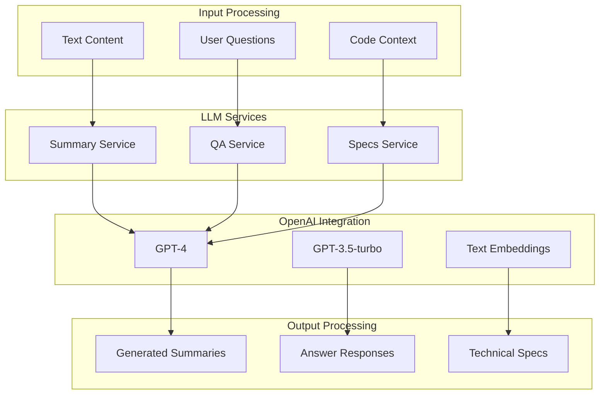

# LLM Services

## 🎯 Mục đích

Tài liệu này mô tả các LLM services trong COBOL Assistant, bao gồm summary generation, question answering, và specs generation.

## 🏗️ LLM Services Architecture

### Services Overview



### Service Types

| Service | Purpose | Model | Input | Output |
|---------|---------|-------|-------|--------|
| **Summary Service** | Generate code summaries | GPT-4 | COBOL code | Text summary |
| **QA Service** | Answer questions | GPT-4 | Question + context | Answer + references |
| **Specs Service** | Generate documentation | GPT-4 | Code + requirements | Technical specs |

## 🔧 Implementation

### 1. Summary Service

#### Summary Tool Implementation
```python
import openai
from typing import List, Dict, Optional

class SummaryTool:
    def __init__(self, api_key: str = None, model_name: str = "gpt-4"):
        self.api_key = api_key or os.getenv("OPENAI_API_KEY")
        self.model_name = model_name
        self.client = openai.AsyncOpenAI(api_key=self.api_key)
    
    async def generate_summary(
        self,
        content: str,
        file_path: str,
        summary_type: str = "file"
    ) -> str:
        """Generate summary for content"""
        try:
            # Validate input
            if not content or len(content.strip()) == 0:
                raise ValueError("Content cannot be empty")
            
            # Get prompt based on type
            prompt = self._get_summary_prompt(content, file_path, summary_type)
            
            # Generate summary
            response = await self.client.chat.completions.create(
                model=self.model_name,
                messages=[
                    {"role": "system", "content": "You are a helpful assistant that summarizes COBOL code."},
                    {"role": "user", "content": prompt}
                ],
                max_tokens=500,
                temperature=0.3
            )
            
            summary = response.choices[0].message.content
            return summary.strip()
            
        except Exception as e:
            logger.error(f"Error generating summary: {e}")
            raise
    
    def _get_summary_prompt(self, content: str, file_path: str, summary_type: str) -> str:
        """Get summary prompt based on type"""
        if summary_type == "file":
            return f"""
            Summarize this COBOL file ({file_path}):
            
            {content}
            
            Please provide:
            1. Program purpose and functionality
            2. Key data structures
            3. Main procedures
            4. Dependencies and calls
            """
        elif summary_type == "chunk":
            return f"""
            Summarize this COBOL code chunk:
            
            {content}
            
            Please provide:
            1. What this chunk does
            2. Key variables and structures
            3. Any important logic
            """
        else:
            return f"""
            Summarize this content:
            
            {content}
            
            Please provide a concise summary.
            """
```

#### Batch Summary Generation
```python
async def batch_generate_summaries(
    contents: List[Dict],
    summary_type: str = "file"
) -> List[Dict]:
    """Generate summaries for multiple contents"""
    summary_tool = SummaryTool()
    results = []
    
    for content_data in contents:
        try:
            summary = await summary_tool.generate_summary(
                content=content_data["content"],
                file_path=content_data["file_path"],
                summary_type=summary_type
            )
            
            results.append({
                "file_path": content_data["file_path"],
                "summary": summary,
                "success": True
            })
            
        except Exception as e:
            logger.error(f"Error generating summary for {content_data['file_path']}: {e}")
            results.append({
                "file_path": content_data["file_path"],
                "summary": f"Error: {str(e)}",
                "success": False
            })
    
    return results
```

### 2. QA Service

#### QA Tool Implementation
```python
class QATool:
    def __init__(self, api_key: str = None, model_name: str = "gpt-4"):
        self.api_key = api_key or os.getenv("OPENAI_API_KEY")
        self.model_name = model_name
        self.client = openai.AsyncOpenAI(api_key=self.api_key)
    
    async def generate_answer(
        self,
        question: str,
        context: List[Dict],
        model_name: str = "gpt-4",
        temperature: float = 0.7,
        max_tokens: int = 1000
    ) -> Dict:
        """Generate answer for question"""
        try:
            # Validate inputs
            if not question or len(question.strip()) == 0:
                raise ValueError("Question cannot be empty")
            
            if not context:
                raise ValueError("Context cannot be empty")
            
            # Format context for LLM
            formatted_context = self._format_context(context)
            
            # Generate answer
            response = await self.client.chat.completions.create(
                model=model_name,
                messages=[
                    {"role": "system", "content": "You are a helpful assistant that answers questions about COBOL code."},
                    {"role": "user", "content": f"Question: {question}\n\nContext:\n{formatted_context}"}
                ],
                max_tokens=max_tokens,
                temperature=temperature
            )
            
            answer = response.choices[0].message.content
            
            # Extract references
            references = self._extract_references(context)
            
            return {
                "answer": answer,
                "references": references,
                "model_name": model_name,
                "tokens_used": response.usage.total_tokens
            }
            
        except Exception as e:
            logger.error(f"Error generating answer: {e}")
            raise
    
    def _format_context(self, context: List[Dict]) -> str:
        """Format context for LLM"""
        formatted_parts = []
        
        for i, ctx in enumerate(context, 1):
            content = ctx.get("content", "")
            metadata = ctx.get("metadata", {})
            file_path = metadata.get("file_path", "Unknown")
            
            formatted_part = f"---\nContext {i} (from {file_path}):\n{content}\n"
            formatted_parts.append(formatted_part)
        
        return "\n".join(formatted_parts)
    
    def _extract_references(self, context: List[Dict]) -> List[Dict]:
        """Extract references from context"""
        references = []
        
        for ctx in context:
            metadata = ctx.get("metadata", {})
            reference = {
                "file_path": metadata.get("file_path", "Unknown"),
                "line_start": metadata.get("line_start"),
                "line_end": metadata.get("line_end"),
                "score": ctx.get("score", 0)
            }
            references.append(reference)
        
        return references
```

#### Streaming QA
```python
async def generate_streaming_answer(
    question: str,
    context: List[Dict],
    model_name: str = "gpt-4"
):
    """Generate streaming answer"""
    try:
        qa_tool = QATool()
        formatted_context = qa_tool._format_context(context)
        
        response = await qa_tool.client.chat.completions.create(
            model=model_name,
            messages=[
                {"role": "system", "content": "You are a helpful assistant that answers questions about COBOL code."},
                {"role": "user", "content": f"Question: {question}\n\nContext:\n{formatted_context}"}
            ],
            max_tokens=1000,
            temperature=0.7,
            stream=True
        )
        
        async for chunk in response:
            if chunk.choices[0].delta.content:
                yield chunk.choices[0].delta.content
                
    except Exception as e:
        logger.error(f"Error generating streaming answer: {e}")
        yield f"Error: {str(e)}"
```

### 3. Specs Service

#### Specs Tool Implementation
```python
class SpecsTool:
    def __init__(self, api_key: str = None, model_name: str = "gpt-4"):
        self.api_key = api_key or os.getenv("OPENAI_API_KEY")
        self.model_name = model_name
        self.client = openai.AsyncOpenAI(api_key=self.api_key)
    
    async def generate_specs(
        self,
        content: str,
        spec_type: str,
        model_name: str = "gpt-4",
        max_tokens: int = 4000
    ) -> str:
        """Generate technical specifications"""
        try:
            # Validate inputs
            if not content or len(content.strip()) == 0:
                raise ValueError("Content cannot be empty")
            
            if not spec_type:
                raise ValueError("Spec type cannot be empty")
            
            # Get prompt based on spec type
            prompt = self._get_specs_prompt(content, spec_type)
            
            # Generate specs
            response = await self.client.chat.completions.create(
                model=model_name,
                messages=[
                    {"role": "system", "content": "You are a technical writer that creates comprehensive documentation for COBOL systems."},
                    {"role": "user", "content": prompt}
                ],
                max_tokens=max_tokens,
                temperature=0.3
            )
            
            specs = response.choices[0].message.content
            return specs.strip()
            
        except Exception as e:
            logger.error(f"Error generating specs: {e}")
            raise
    
    def _get_specs_prompt(self, content: str, spec_type: str) -> str:
        """Get specs prompt based on type"""
        if spec_type == "Repository Overview":
            return f"""
            Create a comprehensive repository overview for this COBOL codebase:
            
            {content}
            
            Please include:
            1. System overview and purpose
            2. Architecture and components
            3. Data flow and dependencies
            4. Key programs and their functions
            5. File structures and relationships
            6. JCL workflows and procedures
            7. Maintenance and support information
            """
        elif spec_type == "Program Documentation":
            return f"""
            Create detailed documentation for this COBOL program:
            
            {content}
            
            Please include:
            1. Program purpose and functionality
            2. Input/output specifications
            3. Data structures and variables
            4. Procedure flow and logic
            5. Error handling
            6. Dependencies and calls
            7. Usage examples
            """
        else:
            return f"""
            Create technical documentation for this content:
            
            {content}
            
            Please provide comprehensive documentation.
            """
```

#### Batch Specs Generation
```python
async def batch_generate_specs(
    contents: List[Dict],
    spec_type: str
) -> List[Dict]:
    """Generate specs for multiple contents"""
    specs_tool = SpecsTool()
    results = []
    
    for content_data in contents:
        try:
            specs = await specs_tool.generate_specs(
                content=content_data["content"],
                spec_type=spec_type
            )
            
            results.append({
                "file_path": content_data.get("file_path", "Unknown"),
                "specs": specs,
                "success": True
            })
            
        except Exception as e:
            logger.error(f"Error generating specs for {content_data.get('file_path', 'Unknown')}: {e}")
            results.append({
                "file_path": content_data.get("file_path", "Unknown"),
                "specs": f"Error: {str(e)}",
                "success": False
            })
    
    return results
```

## 📊 Performance Optimization

### Caching
```python
import redis
import json
import hashlib

redis_client = redis.Redis(host='redis', port=6379, db=0)

def cache_llm_response(
    prompt: str,
    response: str,
    ttl: int = 3600
):
    """Cache LLM response"""
    try:
        prompt_hash = hashlib.md5(prompt.encode()).hexdigest()
        cache_key = f"llm_response:{prompt_hash}"
        redis_client.setex(cache_key, ttl, response)
    except Exception as e:
        logger.error(f"Error caching LLM response: {e}")

def get_cached_llm_response(prompt: str) -> Optional[str]:
    """Get cached LLM response"""
    try:
        prompt_hash = hashlib.md5(prompt.encode()).hexdigest()
        cache_key = f"llm_response:{prompt_hash}"
        cached = redis_client.get(cache_key)
        if cached:
            return cached.decode('utf-8')
        return None
    except Exception as e:
        logger.error(f"Error getting cached LLM response: {e}")
        return None
```

### Rate Limiting
```python
import asyncio
from collections import defaultdict
import time

class RateLimiter:
    def __init__(self, max_requests: int = 60, time_window: int = 60):
        self.max_requests = max_requests
        self.time_window = time_window
        self.requests = defaultdict(list)
    
    async def wait_if_needed(self, key: str = "default"):
        """Wait if rate limit would be exceeded"""
        now = time.time()
        requests = self.requests[key]
        
        # Remove old requests
        requests[:] = [req_time for req_time in requests if now - req_time < self.time_window]
        
        # Check if we need to wait
        if len(requests) >= self.max_requests:
            sleep_time = self.time_window - (now - requests[0])
            if sleep_time > 0:
                await asyncio.sleep(sleep_time)
        
        # Add current request
        requests.append(now)

# Global rate limiter
rate_limiter = RateLimiter(max_requests=60, time_window=60)
```

### Connection Pooling
```python
import httpx
from httpx import AsyncClient

class LLMService:
    def __init__(self):
        self.client = AsyncClient(
            timeout=120.0,
            limits=httpx.Limits(max_keepalive_connections=10, max_connections=50)
        )
    
    async def generate_response(self, prompt: str, model: str) -> str:
        """Generate response with connection pooling"""
        try:
            # Apply rate limiting
            await rate_limiter.wait_if_needed()
            
            response = await self.client.post(
                "https://api.openai.com/v1/chat/completions",
                headers={
                    "Authorization": f"Bearer {self.api_key}",
                    "Content-Type": "application/json"
                },
                json={
                    "model": model,
                    "messages": [{"role": "user", "content": prompt}],
                    "max_tokens": 1000,
                    "temperature": 0.7
                }
            )
            
            response.raise_for_status()
            data = response.json()
            
            return data["choices"][0]["message"]["content"]
            
        except Exception as e:
            logger.error(f"Error generating response: {e}")
            raise
```

## 🔍 Error Handling

### LLM Error Handling
```python
async def safe_llm_call(
    prompt: str,
    model: str = "gpt-4",
    max_retries: int = 3
) -> Optional[str]:
    """Safely call LLM with retry logic"""
    for attempt in range(max_retries):
        try:
            # Apply rate limiting
            await rate_limiter.wait_if_needed()
            
            # Check cache first
            cached_response = get_cached_llm_response(prompt)
            if cached_response:
                return cached_response
            
            # Call LLM
            response = await call_llm_api(prompt, model)
            
            # Cache response
            cache_llm_response(prompt, response)
            
            return response
            
        except Exception as e:
            logger.error(f"LLM call attempt {attempt + 1} failed: {e}")
            if attempt == max_retries - 1:
                return None
            await asyncio.sleep(2 ** attempt)  # Exponential backoff
    
    return None
```

### Fallback Responses
```python
def get_fallback_response(service_type: str, error: Exception) -> str:
    """Get fallback response for LLM service errors"""
    if service_type == "summary":
        return "Unable to generate summary at this time. Please try again later."
    elif service_type == "qa":
        return "I apologize, but I'm unable to process your question at the moment. Please try again later."
    elif service_type == "specs":
        return "Unable to generate specifications at this time. Please try again later."
    else:
        return "Service temporarily unavailable. Please try again later."
```

## 📈 Monitoring & Metrics

### LLM Usage Metrics
```python
def track_llm_usage(
    service_type: str,
    model: str,
    tokens_used: int,
    response_time: float,
    success: bool
):
    """Track LLM usage metrics"""
    metrics = {
        "service_type": service_type,
        "model": model,
        "tokens_used": tokens_used,
        "response_time": response_time,
        "success": success,
        "timestamp": datetime.now().isoformat()
    }
    
    logger.info(f"LLM Usage Metrics: {json.dumps(metrics)}")
    
    # Send to monitoring system
    send_metrics_to_monitoring(metrics)
```

### Quality Metrics
```python
def track_response_quality(
    service_type: str,
    response_length: int,
    response_time: float,
    user_feedback: Optional[str] = None
):
    """Track response quality metrics"""
    quality_metrics = {
        "service_type": service_type,
        "response_length": response_length,
        "response_time": response_time,
        "user_feedback": user_feedback,
        "timestamp": datetime.now().isoformat()
    }
    
    logger.info(f"Response Quality Metrics: {json.dumps(quality_metrics)}")
```

## 🔗 Liên kết

- [Embeddings](./embeddings.md)
- [Vector Search](./vector-search.md)
- [Parsers](./parsers.md)
- [Database Operations](./database-ops.md)
- [Core Workers Service](../services/core-workers.md)
