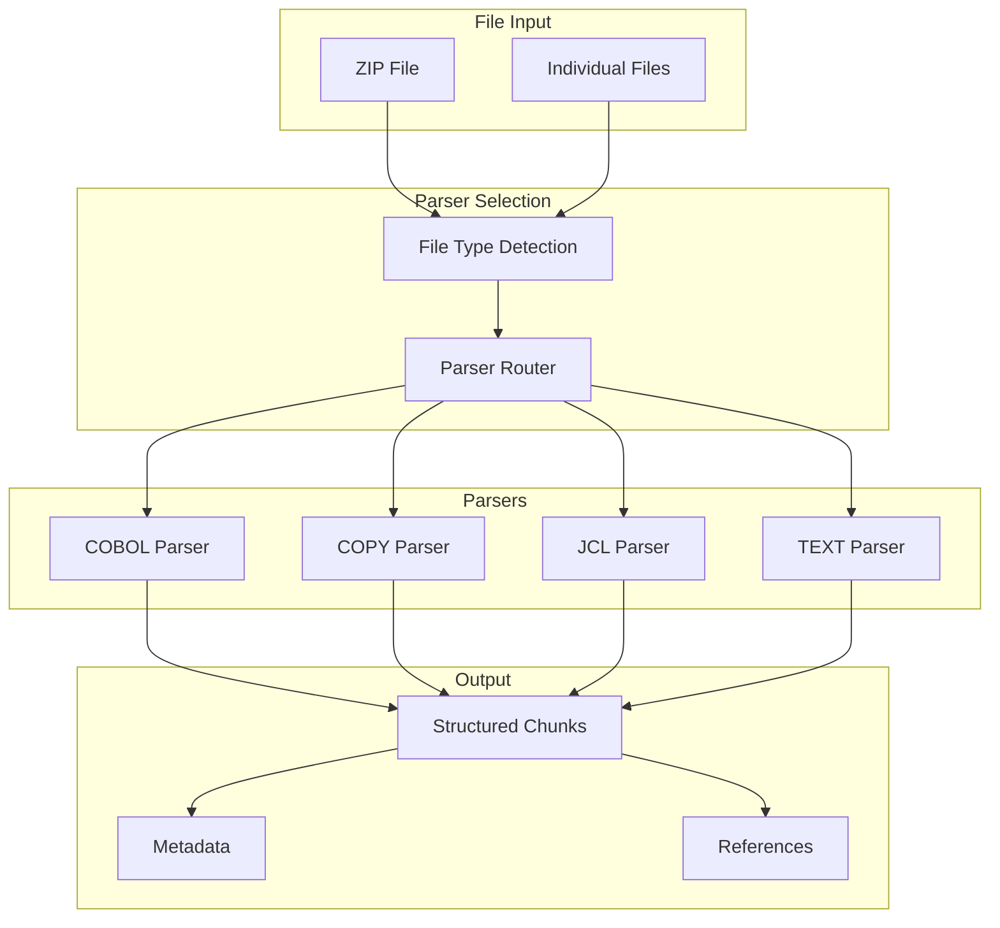

# Parsers

## 🎯 Mục đích

Tài liệu này mô tả chi tiết về các parsers trong hệ thống COBOL Assistant, bao gồm COBOL, COPY, JCL, và TEXT parsers.

## 🏗️ Parser Architecture

### Parser Overview



### Parser Types

| Parser | File Extensions | Purpose | Complexity |
|--------|----------------|---------|------------|
| **COBOL Parser** | .cob, .cbl, .cobol | Parse COBOL programs | High |
| **COPY Parser** | .cpy | Parse COPY files | Medium |
| **JCL Parser** | .jcl | Parse JCL jobs | High |
| **TEXT Parser** | .txt, .log | Parse text files | Low |

## 🔧 COBOL Parser

### Parser Implementation

#### Main Parser Class
```python
class CobolParserTool:
    def __init__(self, max_chunk_size: int = 6000):
        self.max_chunk_size = max_chunk_size
        self.supported_extensions = [".cob", ".cbl", ".cobol", ".sqb", ".ccp", ".pco", ".eco"]
    
    def parse(self, file_path: str, content: str, max_chunk_size: Optional[int] = None) -> List[Dict]:
        """Parse COBOL file into structured chunks"""
        chunk_size = max_chunk_size or self.max_chunk_size
        
        # Preprocess content
        content = self._preprocess(content)
        
        # Split by divisions
        divisions = self._split_by_divisions(content)
        
        chunks = []
        for division_name, division_content in divisions.items():
            if not division_content.strip():
                continue
            
            # Create chunks for this division
            division_chunks = self._create_chunks(
                division_content, 
                file_path, 
                division_name,
                chunk_size
            )
            chunks.extend(division_chunks)
        
        return chunks
```

#### Division Splitting
```python
def _split_by_divisions(self, content: str) -> Dict[str, str]:
    """Split COBOL content by divisions"""
    divisions = {}
    current_division = None
    current_content = []
    
    for line in content.split('\n'):
        line = line.strip()
        
        # Check for division start
        if line.endswith(' DIVISION.'):
            # Save previous division
            if current_division:
                divisions[current_division] = '\n'.join(current_content)
            
            # Start new division
            current_division = line
            current_content = [line]
        else:
            current_content.append(line)
    
    # Save last division
    if current_division:
        divisions[current_division] = '\n'.join(current_content)
    
    return divisions
```

#### Chunk Creation
```python
def _create_chunks(self, content: str, file_path: str, division: str, max_chunk_size: int) -> List[Dict]:
    """Create chunks from division content"""
    chunks = []
    
    # Split by sections within division
    sections = self._split_by_sections(content)
    
    for section_name, section_content in sections.items():
        # Create chunks for this section
        section_chunks = self._split_content_by_size(
            section_content, 
            max_chunk_size
        )
        
        for i, chunk_content in enumerate(section_chunks):
            chunk = {
                "content": chunk_content,
                "metadata": {
                    "file_path": file_path,
                    "file_type": "COBOL",
                    "division": division,
                    "section": section_name,
                    "chunk_index": i,
                    "line_start": self._get_line_start(content, chunk_content),
                    "line_end": self._get_line_end(content, chunk_content)
                }
            }
            chunks.append(chunk)
    
    return chunks
```

#### Dependency Extraction
```python
def extract_dependencies(self, content: str) -> Dict[str, List[str]]:
    """Extract dependencies from COBOL content"""
    dependencies = {
        "calls": [],
        "performs": [],
        "copys": []
    }
    
    # Extract CALL statements
    call_pattern = re.compile(r"CALL\s*'([^']+)'", re.IGNORECASE)
    calls = call_pattern.findall(content)
    dependencies["calls"] = list(set(calls))
    
    # Extract PERFORM statements
    perform_pattern = re.compile(r"\bPERFORM\s+([A-Z0-9\-]+)(?!\s+THRU|\s+UNTIL|\s+VARYING|\s+WITH)", re.IGNORECASE)
    performs = perform_pattern.findall(content)
    dependencies["performs"] = list(set(performs))
    
    # Extract COPY statements
    copy_pattern = re.compile(r"\bCOPY\s+([A-Z0-9\-]+)", re.IGNORECASE)
    copys = copy_pattern.findall(content)
    dependencies["copys"] = [f"{copy}.cpy" for copy in set(copys)]
    
    return dependencies
```

### COBOL Structure Analysis

#### Program Identification
```python
def identify_program_structure(self, content: str) -> Dict:
    """Identify COBOL program structure"""
    structure = {
        "program_id": None,
        "divisions": [],
        "sections": [],
        "paragraphs": [],
        "data_items": [],
        "procedures": []
    }
    
    # Extract PROGRAM-ID
    program_id_pattern = re.compile(r"PROGRAM-ID\.\s+([A-Z0-9\-]+)", re.IGNORECASE)
    program_id_match = program_id_pattern.search(content)
    if program_id_match:
        structure["program_id"] = program_id_match.group(1)
    
    # Extract divisions
    division_pattern = re.compile(r"([A-Z\s]+)\s+DIVISION\.", re.IGNORECASE)
    divisions = division_pattern.findall(content)
    structure["divisions"] = [div.strip() for div in divisions]
    
    # Extract sections
    section_pattern = re.compile(r"([A-Z0-9\s\-]+)\s+SECTION\.", re.IGNORECASE)
    sections = section_pattern.findall(content)
    structure["sections"] = [sec.strip() for sec in sections]
    
    return structure
```

## 🔧 COPY Parser

### Parser Implementation

#### Main Parser Class
```python
class CopyParserTool:
    def __init__(self, max_chunk_size: int = 6000):
        self.max_chunk_size = max_chunk_size
        self.supported_extensions = [".cpy"]
    
    def parse(self, file_path: str, content: str, max_chunk_size: Optional[int] = None) -> List[Dict]:
        """Parse COPY file into structured chunks"""
        chunk_size = max_chunk_size or self.max_chunk_size
        
        # Split by copybook sections
        sections = self._split_by_sections(content)
        
        chunks = []
        for section_name, section_content in sections.items():
            # Create chunks for this section
            section_chunks = self._split_content_by_size(
                section_content, 
                chunk_size
            )
            
            for i, chunk_content in enumerate(section_chunks):
                chunk = {
                    "content": chunk_content,
                    "metadata": {
                        "file_path": file_path,
                        "file_type": "COPY",
                        "section": section_name,
                        "chunk_index": i
                    }
                }
                chunks.append(chunk)
        
        return chunks
```

#### Section Splitting
```python
def _split_by_sections(self, content: str) -> Dict[str, str]:
    """Split COPY content by sections"""
    sections = {}
    current_section = None
    current_content = []
    
    for line in content.split('\n'):
        line = line.strip()
        
        # Check for section start (01 level items)
        if re.match(r"^\d{2}\s+", line):
            # Save previous section
            if current_section:
                sections[current_section] = '\n'.join(current_content)
            
            # Start new section
            current_section = line.split()[1] if len(line.split()) > 1 else f"Section_{len(sections)}"
            current_content = [line]
        else:
            current_content.append(line)
    
    # Save last section
    if current_section:
        sections[current_section] = '\n'.join(current_content)
    
    return sections
```

## 🔧 JCL Parser

### Parser Implementation

#### Main Parser Class
```python
class JclParserTool:
    def __init__(self, max_chunk_size: int = 6000):
        self.max_chunk_size = max_chunk_size
        self.supported_extensions = [".jcl"]
    
    def parse(self, file_path: str, content: str, max_chunk_size: Optional[int] = None) -> List[Dict]:
        """Parse JCL file into structured chunks"""
        chunk_size = max_chunk_size or self.max_chunk_size
        
        # Split by JCL jobs
        jobs = self._split_by_jobs(content)
        
        chunks = []
        for job_name, job_content in jobs.items():
            # Create chunks for this job
            job_chunks = self._split_content_by_size(
                job_content, 
                chunk_size
            )
            
            for i, chunk_content in enumerate(job_chunks):
                chunk = {
                    "content": chunk_content,
                    "metadata": {
                        "file_path": file_path,
                        "file_type": "JCL",
                        "job_name": job_name,
                        "chunk_index": i
                    }
                }
                chunks.append(chunk)
        
        return chunks
```

#### Job Splitting
```python
def _split_by_jobs(self, content: str) -> Dict[str, str]:
    """Split JCL content by jobs"""
    jobs = {}
    current_job = None
    current_content = []
    
    for line in content.split('\n'):
        line = line.strip()
        
        # Check for job start (//JOB statement)
        if line.startswith('//JOB') or line.startswith('//'):
            # Save previous job
            if current_job:
                jobs[current_job] = '\n'.join(current_content)
            
            # Start new job
            current_job = line.split()[0][2:] if len(line.split()) > 0 else f"Job_{len(jobs)}"
            current_content = [line]
        else:
            current_content.append(line)
    
    # Save last job
    if current_job:
        jobs[current_job] = '\n'.join(current_content)
    
    return jobs
```

#### JCL Analysis
```python
def analyze_jcl_structure(self, content: str) -> Dict:
    """Analyze JCL structure"""
    structure = {
        "jobs": [],
        "steps": [],
        "dd_statements": [],
        "procedures": []
    }
    
    # Extract job statements
    job_pattern = re.compile(r"//JOB\s+([A-Z0-9\-]+)", re.IGNORECASE)
    jobs = job_pattern.findall(content)
    structure["jobs"] = jobs
    
    # Extract step statements
    step_pattern = re.compile(r"//STEP\s+([A-Z0-9\-]+)", re.IGNORECASE)
    steps = step_pattern.findall(content)
    structure["steps"] = steps
    
    # Extract DD statements
    dd_pattern = re.compile(r"//([A-Z0-9\-]+)\s+DD", re.IGNORECASE)
    dds = dd_pattern.findall(content)
    structure["dd_statements"] = dds
    
    return structure
```

## 🔧 TEXT Parser

### Parser Implementation

#### Main Parser Class
```python
class TextParserTool:
    def __init__(self, max_chunk_size: int = 6000):
        self.max_chunk_size = max_chunk_size
        self.supported_extensions = [".txt", ".log", ".dat"]
    
    def parse(self, file_path: str, content: str, max_chunk_size: Optional[int] = None) -> List[Dict]:
        """Parse text file into structured chunks"""
        chunk_size = max_chunk_size or self.max_chunk_size
        
        # Split content by size
        chunks = self._split_content_by_size(content, chunk_size)
        
        result_chunks = []
        for i, chunk_content in enumerate(chunks):
            chunk = {
                "content": chunk_content,
                "metadata": {
                    "file_path": file_path,
                    "file_type": "TEXT",
                    "chunk_index": i
                }
            }
            result_chunks.append(chunk)
        
        return result_chunks
```

#### Content Splitting
```python
def _split_content_by_size(self, content: str, max_chunk_size: int) -> List[str]:
    """Split content by size with line boundaries"""
    if len(content) <= max_chunk_size:
        return [content]
    
    chunks = []
    current_chunk = ""
    
    for line in content.split('\n'):
        if len(current_chunk) + len(line) + 1 > max_chunk_size:
            if current_chunk:
                chunks.append(current_chunk.strip())
                current_chunk = line
            else:
                # Single line too long, split it
                chunks.append(line[:max_chunk_size])
                current_chunk = line[max_chunk_size:]
        else:
            current_chunk += line + '\n'
    
    if current_chunk:
        chunks.append(current_chunk.strip())
    
    return chunks
```

## 🔄 Parser Integration

### Parser Factory
```python
class ParserFactory:
    def __init__(self):
        self.parsers = {
            "COBOL": CobolParserTool(),
            "COPY": CopyParserTool(),
            "JCL": JclParserTool(),
            "TEXT": TextParserTool()
        }
    
    def get_parser(self, file_type: str) -> Optional[BaseParser]:
        """Get parser for file type"""
        return self.parsers.get(file_type.upper())
    
    def parse_file(self, file_path: str, content: str, file_type: str, max_chunk_size: int = 6000) -> List[Dict]:
        """Parse file using appropriate parser"""
        parser = self.get_parser(file_type)
        if not parser:
            raise ValueError(f"Unsupported file type: {file_type}")
        
        return parser.parse(file_path, content, max_chunk_size)
```

### Parser Router
```python
def route_parser(file_path: str) -> str:
    """Route file to appropriate parser"""
    extension = Path(file_path).suffix.lower()
    
    if extension in [".cob", ".cbl", ".cobol"]:
        return "COBOL"
    elif extension == ".cpy":
        return "COPY"
    elif extension == ".jcl":
        return "JCL"
    else:
        return "TEXT"
```

## 📊 Performance Optimization

### Chunking Strategy
```python
def optimize_chunking(content: str, max_chunk_size: int) -> List[str]:
    """Optimize chunking strategy"""
    # Try to split at logical boundaries first
    logical_chunks = split_by_logical_boundaries(content, max_chunk_size)
    
    # If chunks are still too large, split by size
    optimized_chunks = []
    for chunk in logical_chunks:
        if len(chunk) <= max_chunk_size:
            optimized_chunks.append(chunk)
        else:
            size_chunks = split_by_size(chunk, max_chunk_size)
            optimized_chunks.extend(size_chunks)
    
    return optimized_chunks
```

### Memory Management
```python
def parse_large_file(file_path: str, max_chunk_size: int = 6000):
    """Parse large file with memory management"""
    chunks = []
    
    with open(file_path, 'r', encoding='utf-8') as f:
        current_chunk = ""
        
        for line in f:
            if len(current_chunk) + len(line) > max_chunk_size:
                if current_chunk:
                    chunks.append(current_chunk.strip())
                    current_chunk = line
                else:
                    # Single line too long
                    chunks.append(line[:max_chunk_size])
                    current_chunk = line[max_chunk_size:]
            else:
                current_chunk += line
        
        if current_chunk:
            chunks.append(current_chunk.strip())
    
    return chunks
```

## 🔍 Error Handling

### Parser Error Handling
```python
def handle_parser_error(parser_name: str, file_path: str, error: Exception) -> List[Dict]:
    """Handle parser errors gracefully"""
    logger.error(f"Parser {parser_name} error for file {file_path}: {error}")
    
    # Return fallback chunk
    return [{
        "content": f"Error parsing file: {str(error)}",
        "metadata": {
            "file_path": file_path,
            "file_type": parser_name,
            "chunk_index": 0,
            "error": True
        }
    }]
```

### File Encoding Detection
```python
import chardet

def detect_file_encoding(file_path: str) -> str:
    """Detect file encoding"""
    with open(file_path, 'rb') as f:
        raw_data = f.read()
        encoding_result = chardet.detect(raw_data)
        return encoding_result.get('encoding', 'utf-8')
```

## 🔗 Liên kết

- [Embedding System](./embeddings.md)
- [Vector Search](./vector-search.md)
- [LLM Services](./llm-services.md)
- [Database Operations](./database-ops.md)
- [Core Workers Service](../services/core-workers.md)
