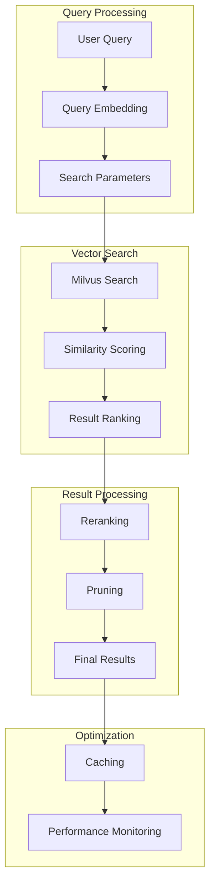

# Vector Search

## 🎯 Mục đích

Tài liệu này mô tả hệ thống vector search trong COBOL Assistant, bao gồm similarity search, reranking, và optimization techniques.

## 🏗️ Vector Search Architecture

### Search Overview



### Search Components

| Component | Purpose | Technology | Performance |
|-----------|---------|------------|-------------|
| **Vector Database** | Store embeddings | Milvus | High |
| **Similarity Search** | Find similar vectors | COSINE similarity | Fast |
| **Reranking** | Improve relevance | Cohere Rerank | Medium |
| **Caching** | Speed up repeated queries | Redis | Very Fast |

## 🔧 Implementation

### 1. Milvus Vector Search

#### Collection Configuration
```python
from pymilvus import Collection, CollectionSchema, FieldSchema, DataType

def setup_vector_collection(collection_name: str):
    """Setup vector collection for search"""
    
    # Define schema
    fields = [
        FieldSchema(name="id", dtype=DataType.VARCHAR, is_primary=True, max_length=100),
        FieldSchema(name="content", dtype=DataType.VARCHAR, max_length=65535),
        FieldSchema(name="embedding", dtype=DataType.FLOAT_VECTOR, dim=1536),
        FieldSchema(name="metadata", dtype=DataType.JSON)
    ]
    
    schema = CollectionSchema(
        fields=fields,
        description=f"Vector collection for {collection_name}"
    )
    
    # Create collection
    collection = Collection(
        name=collection_name,
        schema=schema,
        using='default',
        shards_num=2
    )
    
    # Create index
    index_params = {
        "metric_type": "COSINE",
        "index_type": "IVF_FLAT",
        "params": {"nlist": 1024}
    }
    
    collection.create_index(
        field_name="embedding",
        index_params=index_params
    )
    
    return collection
```

#### Search Implementation
```python
async def vector_search(
    collection_name: str,
    query_embedding: List[float],
    top_k: int = 10,
    search_params: Dict = None
) -> List[Dict]:
    """Perform vector search in Milvus"""
    try:
        collection = Collection(collection_name)
        
        # Load collection into memory
        collection.load()
        
        # Default search parameters
        if not search_params:
            search_params = {
                "metric_type": "COSINE",
                "params": {"nprobe": 10}
            }
        
        # Perform search
        results = collection.search(
            data=[query_embedding],
            anns_field="embedding",
            param=search_params,
            limit=top_k,
            output_fields=["content", "metadata"]
        )
        
        # Format results
        formatted_results = []
        for hit in results[0]:
            formatted_results.append({
                "id": hit.id,
                "content": hit.entity.get("content"),
                "metadata": hit.entity.get("metadata"),
                "score": hit.score,
                "collection": collection_name
            })
        
        return formatted_results
        
    except Exception as e:
        logger.error(f"Vector search error: {e}")
        raise
```

### 2. Multi-Collection Search

#### Parallel Search
```python
import asyncio
from typing import List, Dict

async def search_multiple_collections(
    collections: List[str],
    query_embedding: List[float],
    top_k_per_collection: int = 10
) -> Dict[str, List[Dict]]:
    """Search across multiple collections in parallel"""
    
    # Create search tasks
    tasks = []
    for collection in collections:
        task = asyncio.create_task(
            vector_search(collection, query_embedding, top_k_per_collection)
        )
        tasks.append((collection, task))
    
    # Wait for all searches to complete
    results = {}
    for collection, task in tasks:
        try:
            collection_results = await task
            results[collection] = collection_results
        except Exception as e:
            logger.error(f"Error searching collection {collection}: {e}")
            results[collection] = []
    
    return results
```

#### Result Combination
```python
def combine_search_results(results: Dict[str, List[Dict]]) -> List[Dict]:
    """Combine results from multiple collections"""
    all_results = []
    
    for collection, collection_results in results.items():
        for result in collection_results:
            result["collection"] = collection
            all_results.append(result)
    
    # Sort by score
    all_results.sort(key=lambda x: x.get("score", 0), reverse=True)
    
    return all_results
```

### 3. Reranking

#### Cohere Reranking
```python
import cohere

class RerankService:
    def __init__(self, api_key: str = None):
        self.api_key = api_key or os.getenv("COHERE_API_KEY")
        self.client = cohere.Client(api_key=self.api_key)
        self.model_name = "rerank-v3.5"
    
    async def rerank_results(
        self,
        query: str,
        documents: List[Dict],
        top_k: int = 10
    ) -> List[Dict]:
        """Rerank search results using Cohere"""
        try:
            if not documents:
                return []
            
            # Extract document content
            doc_contents = [doc["content"] for doc in documents]
            
            # Perform reranking
            response = self.client.rerank(
                model=self.model_name,
                query=query,
                documents=doc_contents,
                top_k=min(top_k, len(documents))
            )
            
            # Map reranked results back to original documents
            reranked_results = []
            for result in response.results:
                original_doc = documents[result.index]
                original_doc["rerank_score"] = result.relevance_score
                reranked_results.append(original_doc)
            
            return reranked_results
            
        except Exception as e:
            logger.error(f"Reranking error: {e}")
            # Return original results without reranking
            return documents[:top_k]
```

#### Reranking Integration
```python
async def search_with_reranking(
    query: str,
    collections: List[str],
    top_k: int = 10,
    rerank: bool = True
) -> List[Dict]:
    """Search with optional reranking"""
    
    # Generate query embedding
    embedding_tool = OpenAIEmbeddingTool()
    query_embedding = await embedding_tool.generate_embedding(query)
    
    # Search collections
    search_results = await search_multiple_collections(
        collections=collections,
        query_embedding=query_embedding,
        top_k_per_collection=top_k * 2  # Get more results for reranking
    )
    
    # Combine results
    combined_results = combine_search_results(search_results)
    
    # Rerank if requested
    if rerank and combined_results:
        rerank_service = RerankService()
        reranked_results = await rerank_service.rerank_results(
            query=query,
            documents=combined_results,
            top_k=top_k
        )
        return reranked_results
    
    return combined_results[:top_k]
```

### 4. Result Pruning

#### Score-Based Pruning
```python
def prune_results_by_score(results: List[Dict], threshold: float = 0.3) -> List[Dict]:
    """Prune results based on score threshold"""
    pruned_results = []
    
    for result in results:
        score = result.get("rerank_score", result.get("score", 0))
        if score >= threshold:
            pruned_results.append(result)
        else:
            break  # Results are sorted by score
    
    return pruned_results
```

#### Elbow Method Pruning
```python
def prune_results_elbow(results: List[Dict]) -> List[Dict]:
    """Prune results using elbow method"""
    if len(results) <= 2:
        return results
    
    scores = [result.get("rerank_score", result.get("score", 0)) for result in results]
    
    # Find elbow point
    elbow_point = find_elbow_point(scores)
    
    if elbow_point and elbow_point < len(results):
        return results[:elbow_point]
    
    return results

def find_elbow_point(scores: List[float]) -> Optional[int]:
    """Find elbow point in score curve"""
    if len(scores) < 3:
        return None
    
    # Calculate second derivative
    second_derivatives = []
    for i in range(1, len(scores) - 1):
        second_deriv = scores[i-1] - 2*scores[i] + scores[i+1]
        second_derivatives.append(second_deriv)
    
    # Find maximum second derivative (elbow point)
    if second_derivatives:
        elbow_index = second_derivatives.index(max(second_derivatives)) + 1
        return elbow_index
    
    return None
```

### 5. Caching

#### Search Result Caching
```python
import redis
import json
import hashlib

redis_client = redis.Redis(host='redis', port=6379, db=0)

def cache_search_results(
    query: str,
    collections: List[str],
    results: List[Dict],
    ttl: int = 1800
):
    """Cache search results"""
    try:
        cache_key = f"search:{hashlib.md5(f'{query}_{collections}'.encode()).hexdigest()}"
        cache_data = {
            "query": query,
            "collections": collections,
            "results": results,
            "timestamp": datetime.now().isoformat()
        }
        redis_client.setex(cache_key, ttl, json.dumps(cache_data))
    except Exception as e:
        logger.error(f"Error caching search results: {e}")

def get_cached_search_results(
    query: str,
    collections: List[str]
) -> Optional[List[Dict]]:
    """Get cached search results"""
    try:
        cache_key = f"search:{hashlib.md5(f'{query}_{collections}'.encode()).hexdigest()}"
        cached = redis_client.get(cache_key)
        if cached:
            cache_data = json.loads(cached)
            return cache_data["results"]
        return None
    except Exception as e:
        logger.error(f"Error getting cached search results: {e}")
        return None
```

#### Embedding Caching
```python
def cache_query_embedding(query: str, embedding: List[float], ttl: int = 3600):
    """Cache query embedding"""
    try:
        query_hash = hashlib.md5(query.encode()).hexdigest()
        cache_key = f"query_embedding:{query_hash}"
        redis_client.setex(cache_key, ttl, json.dumps(embedding))
    except Exception as e:
        logger.error(f"Error caching query embedding: {e}")

def get_cached_query_embedding(query: str) -> Optional[List[float]]:
    """Get cached query embedding"""
    try:
        query_hash = hashlib.md5(query.encode()).hexdigest()
        cache_key = f"query_embedding:{query_hash}"
        cached = redis_client.get(cache_key)
        if cached:
            return json.loads(cached)
        return None
    except Exception as e:
        logger.error(f"Error getting cached query embedding: {e}")
        return None
```

## 📊 Performance Optimization

### Index Optimization
```python
def optimize_milvus_index(collection_name: str):
    """Optimize Milvus index for better performance"""
    collection = Collection(collection_name)
    
    # Create optimized index
    index_params = {
        "metric_type": "COSINE",
        "index_type": "IVF_PQ",  # Product Quantization
        "params": {
            "nlist": 1024,
            "m": 8,  # Number of sub-vectors
            "nbits": 8  # Number of bits per sub-vector
        }
    }
    
    collection.create_index(
        field_name="embedding",
        index_params=index_params
    )
    
    # Load collection
    collection.load()
```

### Search Parameter Tuning
```python
def get_optimized_search_params(collection_size: int) -> Dict:
    """Get optimized search parameters based on collection size"""
    if collection_size < 1000:
        return {
            "metric_type": "COSINE",
            "params": {"nprobe": 1}
        }
    elif collection_size < 10000:
        return {
            "metric_type": "COSINE",
            "params": {"nprobe": 10}
        }
    else:
        return {
            "metric_type": "COSINE",
            "params": {"nprobe": 50}
        }
```

### Connection Pooling
```python
from pymilvus import connections

class MilvusConnectionPool:
    def __init__(self, host: str, port: int, max_connections: int = 10):
        self.host = host
        self.port = port
        self.max_connections = max_connections
        self.connections = []
    
    def get_connection(self):
        """Get connection from pool"""
        if not self.connections:
            connections.connect(
                alias="default",
                host=self.host,
                port=self.port
            )
        return connections.get_connection_addr("default")
    
    def return_connection(self, connection):
        """Return connection to pool"""
        # Milvus connections are managed automatically
        pass
```

## 🔍 Error Handling

### Search Error Handling
```python
async def safe_vector_search(
    collection_name: str,
    query_embedding: List[float],
    top_k: int = 10
) -> List[Dict]:
    """Safely perform vector search with error handling"""
    try:
        return await vector_search(collection_name, query_embedding, top_k)
    except Exception as e:
        logger.error(f"Vector search error for collection {collection_name}: {e}")
        
        # Return empty results instead of failing
        return []
```

### Reranking Error Handling
```python
async def safe_rerank_results(
    query: str,
    documents: List[Dict],
    top_k: int = 10
) -> List[Dict]:
    """Safely rerank results with error handling"""
    try:
        rerank_service = RerankService()
        return await rerank_service.rerank_results(query, documents, top_k)
    except Exception as e:
        logger.error(f"Reranking error: {e}")
        
        # Return original results without reranking
        return documents[:top_k]
```

## 📈 Monitoring & Metrics

### Search Performance Metrics
```python
def track_search_metrics(
    query: str,
    results_count: int,
    search_time: float,
    collections_searched: List[str]
):
    """Track search performance metrics"""
    metrics = {
        "query_length": len(query),
        "results_count": results_count,
        "search_time": search_time,
        "collections_searched": collections_searched,
        "timestamp": datetime.now().isoformat()
    }
    
    logger.info(f"Search Metrics: {json.dumps(metrics)}")
    
    # Send to monitoring system
    send_metrics_to_monitoring(metrics)
```

### Quality Metrics
```python
def track_result_quality(results: List[Dict]):
    """Track result quality metrics"""
    if not results:
        return
    
    scores = [r.get("score", 0) for r in results]
    rerank_scores = [r.get("rerank_score", 0) for r in results if "rerank_score" in r]
    
    quality_metrics = {
        "total_results": len(results),
        "average_score": sum(scores) / len(scores),
        "max_score": max(scores),
        "min_score": min(scores),
        "reranked_results": len(rerank_scores),
        "average_rerank_score": sum(rerank_scores) / len(rerank_scores) if rerank_scores else 0,
        "timestamp": datetime.now().isoformat()
    }
    
    logger.info(f"Result Quality Metrics: {json.dumps(quality_metrics)}")
```

## 🔗 Liên kết

- [Embeddings](./embeddings.md)
- [Parsers](./parsers.md)
- [LLM Services](./llm-services.md)
- [Database Operations](./database-ops.md)
- [Core Workers Service](../services/core-workers.md)
