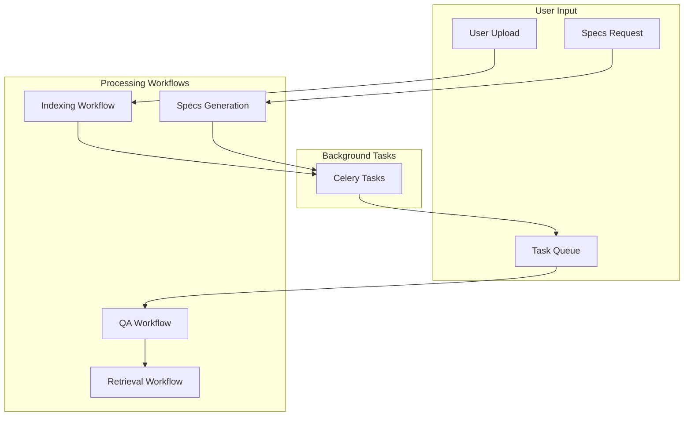

# Workflows Documentation

## 📋 Mục lục

- [Indexing Workflow](./indexing.md)
- [Specs Generation](./specs-generation.md)
- [QA Workflow](./qa.md)
- [Retrieval Workflow](./retrieval.md)
- [Task Processing](./tasks.md)

## 🎯 Mục đích

Tài liệu này mô tả các workflows chính trong hệ thống COBOL Assistant, bao gồm:
- Business logic flows
- Data processing pipelines
- Error handling
- Performance considerations

## 🔄 Workflow Overview

### Main Workflows

### Workflow Characteristics

| Workflow | Type | Duration | Complexity | Dependencies |
|----------|------|----------|------------|--------------|
| **Indexing** | Async | 30s-5min | High | File parsing, embedding, storage |
| **QA** | Sync/Async | 1-10s | Medium | Retrieval, LLM |
| **Specs Generation** | Async | 1-10min | High | File analysis, LLM, storage |
| **Retrieval** | Sync | 100-500ms | Low | Vector search, reranking |

## 🔧 Workflow Components

### 1. Indexing Workflow
- **Purpose**: Process uploaded files and create searchable content
- **Input**: ZIP files containing COBOL code
- **Output**: Indexed content in vector database
- **Steps**: Parse → Chunk → Embed → Store

### 2. QA Workflow
- **Purpose**: Answer questions about code
- **Input**: User questions
- **Output**: AI-generated answers
- **Steps**: Retrieve → Rerank → Generate → Respond

### 3. Specs Generation
- **Purpose**: Generate technical documentation
- **Input**: Code files or repository
- **Output**: Markdown documentation
- **Steps**: Analyze → Generate → Format → Store

### 4. Retrieval Workflow
- **Purpose**: Find relevant documents
- **Input**: Search queries
- **Output**: Ranked document list
- **Steps**: Embed → Search → Rerank → Return

## 📊 Performance Metrics

### Indexing Performance
- **Small Files** (<1MB): 10-30 seconds
- **Medium Files** (1-10MB): 1-3 minutes
- **Large Files** (>10MB): 3-10 minutes

### QA Performance
- **Simple Questions**: 1-3 seconds
- **Complex Questions**: 3-10 seconds
- **Streaming Responses**: Real-time

### Specs Generation
- **Repository Overview**: 2-5 minutes
- **Detailed Specs**: 5-15 minutes
- **Section Analysis**: 1-3 minutes

## 🔍 Error Handling

### Common Error Types
1. **File Processing Errors**: Invalid files, parsing failures
2. **API Errors**: External service failures
3. **Database Errors**: Connection issues, data corruption
4. **Timeout Errors**: Long-running operations

### Error Recovery
1. **Retry Logic**: Automatic retry for transient errors
2. **Fallback Mechanisms**: Alternative processing paths
3. **Error Logging**: Detailed error information
4. **User Notification**: Clear error messages

## 🔗 Liên kết

- [Indexing Workflow](./indexing.md) - File processing pipeline
- [QA Workflow](./qa.md) - Question answering system
- [Specs Generation](./specs-generation.md) - Documentation generation
- [Retrieval Workflow](./retrieval.md) - Document search system
- [Task Processing](./tasks.md) - Background task management
