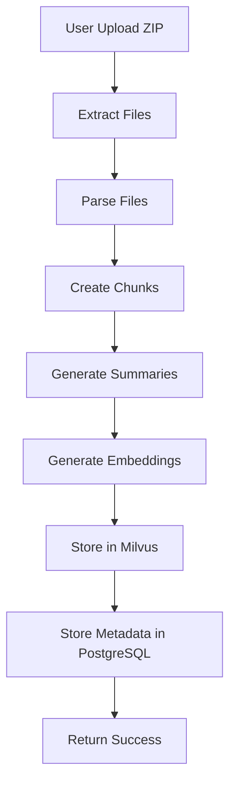
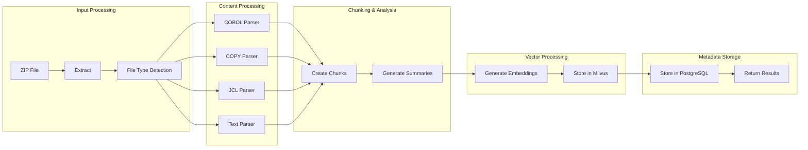

# Indexing Workflow

## 🎯 Mục đích

Indexing Workflow xử lý các file ZIP chứa mã COBOL, tạo ra nội dung có thể tìm kiếm được trong vector database.

## 🔄 Workflow Overview

### High-Level Flow



### Detailed Flow



## 🔧 Implementation Details

### 1. File Processing

#### File Type Detection
```python
def detect_file_type(filename: str) -> FileType:
    """Detect file type based on extension"""
    ext = Path(filename).suffix.lower()
    if ext in ['.cob', '.cbl', '.cobol']:
        return FileType.COBOL
    elif ext == '.cpy':
        return FileType.COPY
    elif ext == '.jcl':
        return FileType.JCL
    else:
        return FileType.TEXT
```

#### File Extraction
```python
async def extract_zip_file(zip_file: UploadFile) -> str:
    """Extract ZIP file to temporary directory"""
    with tempfile.TemporaryDirectory() as temp_dir:
        with zipfile.ZipFile(zip_file.file) as zip_ref:
            zip_ref.extractall(temp_dir)
        return temp_dir
```

### 2. Parsing Process

#### COBOL Parser
```python
class CobolParserTool:
    def parse(self, file_path: str, content: str) -> List[Dict]:
        """Parse COBOL file into structured chunks"""
        # Split by divisions
        divisions = self._split_by_divisions(content)
        
        # Create chunks for each division
        chunks = []
        for division_name, division_content in divisions.items():
            chunk = {
                'content': division_content,
                'metadata': {
                    'file_path': file_path,
                    'division': division_name,
                    'file_type': 'COBOL'
                }
            }
            chunks.append(chunk)
        
        return chunks
```

#### COPY Parser
```python
class CopyParserTool:
    def parse(self, file_path: str, content: str) -> List[Dict]:
        """Parse COPY file into structured chunks"""
        # Split by copybook sections
        sections = self._split_by_sections(content)
        
        chunks = []
        for section_name, section_content in sections.items():
            chunk = {
                'content': section_content,
                'metadata': {
                    'file_path': file_path,
                    'section': section_name,
                    'file_type': 'COPY'
                }
            }
            chunks.append(chunk)
        
        return chunks
```

### 3. Chunking Strategy

#### Chunk Size Management
```python
def create_chunks(content: str, max_chunk_size: int = 6000) -> List[str]:
    """Create chunks from content based on size"""
    chunks = []
    current_chunk = ""
    
    for line in content.split('\n'):
        if len(current_chunk) + len(line) > max_chunk_size:
            if current_chunk:
                chunks.append(current_chunk.strip())
                current_chunk = line
            else:
                # Single line too long, split it
                chunks.append(line[:max_chunk_size])
                current_chunk = line[max_chunk_size:]
        else:
            current_chunk += line + '\n'
    
    if current_chunk:
        chunks.append(current_chunk.strip())
    
    return chunks
```

### 4. Summary Generation

#### File Summary
```python
async def generate_file_summary(file_path: str, content: str) -> str:
    """Generate summary for entire file"""
    summary_request = SummaryRequest(
        content=content,
        file_path=file_path,
        summary_type="file"
    )
    
    response = await call_tools_inventory_api(
        "/llm/summary", 
        summary_request
    )
    
    return response.summary
```

#### Chunk Summary
```python
async def generate_chunk_summary(chunk: str, metadata: Dict) -> str:
    """Generate summary for individual chunk"""
    summary_request = SummaryRequest(
        content=chunk,
        file_path=metadata['file_path'],
        summary_type="chunk"
    )
    
    response = await call_tools_inventory_api(
        "/llm/summary", 
        summary_request
    )
    
    return response.summary
```

### 5. Embedding Generation

#### Batch Embedding
```python
async def generate_embeddings(chunks: List[Dict]) -> List[List[float]]:
    """Generate embeddings for all chunks"""
    embeddings = []
    
    for chunk in chunks:
        embedding_request = EmbeddingRequest(
            content=chunk['content'],
            file_path=chunk['metadata']['file_path']
        )
        
        response = await call_tools_inventory_api(
            "/embedding/generate",
            embedding_request
        )
        
        embeddings.append(response.embedding)
    
    return embeddings
```

### 6. Database Storage

#### Milvus Storage
```python
async def store_in_milvus(chunks: List[Dict], embeddings: List[List[float]]):
    """Store chunks and embeddings in Milvus"""
    documents = []
    
    for i, (chunk, embedding) in enumerate(zip(chunks, embeddings)):
        document = {
            'id': str(uuid.uuid4()),
            'content': chunk['content'],
            'embedding': embedding,
            'metadata': chunk['metadata']
        }
        documents.append(document)
    
    # Insert into Milvus collection
    await call_ai_databases_api(
        "/vector/insert",
        {"documents": documents}
    )
```

#### PostgreSQL Storage
```python
async def store_metadata(file_info: Dict, chunks: List[Dict]):
    """Store file metadata in PostgreSQL"""
    metadata = {
        'file_path': file_info['file_path'],
        'file_type': file_info['file_type'],
        'file_size': file_info['file_size'],
        'chunk_count': len(chunks),
        'created_at': datetime.now().isoformat()
    }
    
    await call_ai_databases_api(
        "/metadata/insert",
        metadata
    )
```

## 📊 Performance Optimization

### Batch Processing
```python
async def process_files_batch(files: List[Dict], batch_size: int = 10):
    """Process files in batches for better performance"""
    for i in range(0, len(files), batch_size):
        batch = files[i:i + batch_size]
        await asyncio.gather(*[
            process_single_file(file) for file in batch
        ])
```

### Memory Management
```python
async def process_large_file(file_path: str):
    """Process large files with memory management"""
    with open(file_path, 'r') as f:
        for chunk in read_file_in_chunks(f, chunk_size=1000):
            await process_chunk(chunk)
            # Clear memory after processing
            del chunk
```

## 🔍 Error Handling

### File Processing Errors
```python
async def process_file_with_retry(file_path: str, max_retries: int = 3):
    """Process file with retry logic"""
    for attempt in range(max_retries):
        try:
            return await process_file(file_path)
        except FileProcessingError as e:
            if attempt == max_retries - 1:
                raise
            await asyncio.sleep(2 ** attempt)  # Exponential backoff
```

### Database Errors
```python
async def store_with_retry(data: Dict, max_retries: int = 3):
    """Store data with retry logic"""
    for attempt in range(max_retries):
        try:
            return await store_data(data)
        except DatabaseError as e:
            if attempt == max_retries - 1:
                raise
            await asyncio.sleep(1)
```

## 📈 Monitoring & Metrics

### Performance Metrics
- **Processing Time**: Time per file/chunk
- **Memory Usage**: Memory consumption during processing
- **Error Rate**: Percentage of failed operations
- **Throughput**: Files processed per minute

### Health Checks
```python
async def check_indexing_health():
    """Check indexing workflow health"""
    return {
        'status': 'healthy',
        'pending_tasks': get_pending_tasks_count(),
        'processing_rate': get_processing_rate(),
        'error_rate': get_error_rate()
    }
```

## 🔗 Liên kết

- [Specs Generation Workflow](./specs-generation.md)
- [QA Workflow](./qa.md)
- [Retrieval Workflow](./retrieval.md)
- [Task Processing](./tasks.md)
