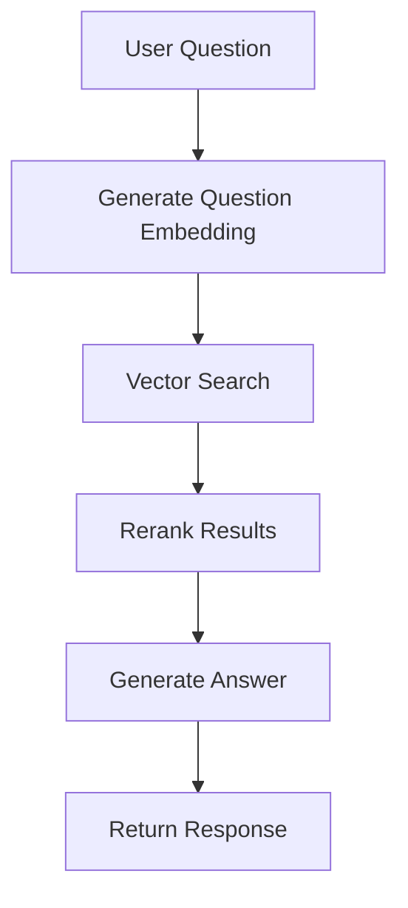
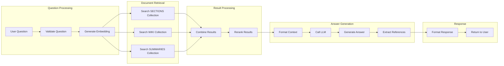

# QA Workflow

## 🎯 Mục đích

QA Workflow xử lý các câu hỏi của người dùng về mã COBOL, sử dụng vector search để tìm thông tin liên quan và LLM để tạo câu trả lời.

## 🔄 Workflow Overview

### High-Level Flow



### Detailed Flow



## 🔧 Implementation Details

### 1. Question Processing

#### Question Validation
```python
def validate_question(question: str) -> bool:
    """Validate user question"""
    if not question or len(question.strip()) < 3:
        return False
    
    # Check for potentially harmful content
    harmful_patterns = [
        r'<script',
        r'javascript:',
        r'data:',
        r'vbscript:'
    ]
    
    for pattern in harmful_patterns:
        if re.search(pattern, question, re.IGNORECASE):
            return False
    
    return True
```

#### Question Embedding Generation
```python
async def generate_question_embedding(question: str) -> List[float]:
    """Generate embedding for user question"""
    embedding_request = EmbeddingRequest(
        content=question,
        file_path="question",
        model_name="text-embedding-3-small"
    )
    
    response = await call_tools_inventory_api(
        "/embedding/generate",
        embedding_request
    )
    
    return response.data["embedding"]
```

### 2. Document Retrieval

#### Multi-Collection Search
```python
async def search_documents(question: str, collections: List[str], top_k: int = 10):
    """Search documents across multiple collections"""
    # Generate question embedding
    question_embedding = await generate_question_embedding(question)
    
    all_results = []
    
    for collection in collections:
        # Search in each collection
        search_request = VectorSearchRequest(
            query_embedding=question_embedding,
            collection_name=collection,
            top_k=top_k
        )
        
        response = await call_ai_databases_api(
            f"/vector/search",
            search_request
        )
        
        # Add collection info to results
        for result in response.data["results"]:
            result["collection"] = collection
            all_results.append(result)
    
    return all_results
```

#### Collection Selection
```python
def select_collections(question: str) -> List[str]:
    """Select relevant collections based on question type"""
    question_lower = question.lower()
    
    collections = ["sections"]  # Always include sections
    
    if any(keyword in question_lower for keyword in ["documentation", "wiki", "overview"]):
        collections.append("wiki")
    
    if any(keyword in question_lower for keyword in ["summary", "summarize", "overview"]):
        collections.append("summaries")
    
    return collections
```

### 3. Result Reranking

#### Rerank Results
```python
async def rerank_results(results: List[Dict], question: str) -> List[Dict]:
    """Rerank search results using Cohere"""
    if not results:
        return []
    
    rerank_request = RerankRequest(
        query=question,
        documents=results,
        top_k=min(10, len(results))
    )
    
    response = await call_tools_inventory_api(
        "/rerank/rerank",
        rerank_request
    )
    
    return response.data["reranked_results"]
```

#### Result Pruning
```python
def prune_results(results: List[Dict], max_results: int = 5) -> List[Dict]:
    """Prune results based on score thresholds"""
    if not results:
        return []
    
    # Sort by rerank score
    sorted_results = sorted(results, key=lambda x: x.get("rerank_score", 0), reverse=True)
    
    # Apply score threshold
    threshold = 0.3
    filtered_results = [r for r in sorted_results if r.get("rerank_score", 0) >= threshold]
    
    # Limit results
    return filtered_results[:max_results]
```

### 4. Answer Generation

#### Context Formatting
```python
def format_context_for_llm(results: List[Dict]) -> str:
    """Format search results as context for LLM"""
    if not results:
        return "No relevant context found."
    
    context_parts = []
    
    for i, result in enumerate(results, 1):
        content = result.get("content", "")
        metadata = result.get("metadata", {})
        file_path = metadata.get("file_path", "Unknown")
        collection = result.get("collection", "Unknown")
        
        context_part = f"---\nContext {i} (from {collection}):\nFile: {file_path}\nContent:\n{content}\n"
        context_parts.append(context_part)
    
    return "\n".join(context_parts)
```

#### LLM Answer Generation
```python
async def generate_answer(question: str, context: str) -> Dict:
    """Generate answer using LLM"""
    qa_request = QARequest(
        question=question,
        context=[{"content": context}],
        model_name="gpt-4",
        temperature=0.7,
        max_tokens=1000
    )
    
    response = await call_tools_inventory_api(
        "/llm/qa",
        qa_request
    )
    
    return response.data
```

#### Reference Extraction
```python
def extract_references(results: List[Dict]) -> List[Dict]:
    """Extract references from search results"""
    references = []
    
    for result in results:
        metadata = result.get("metadata", {})
        reference = {
            "file_path": metadata.get("file_path", "Unknown"),
            "line_start": metadata.get("line_start"),
            "line_end": metadata.get("line_end"),
            "score": result.get("rerank_score", 0),
            "collection": result.get("collection", "Unknown")
        }
        references.append(reference)
    
    return references
```

### 5. Streaming Response

#### Stream Answer Generation
```python
async def generate_streaming_answer(question: str, context: str):
    """Generate streaming answer"""
    qa_request = QARequest(
        question=question,
        context=[{"content": context}],
        model_name="gpt-4",
        temperature=0.7,
        max_tokens=1000,
        stream=True
    )
    
    async with httpx.AsyncClient() as client:
        async with client.stream(
            "POST",
            f"{TOOLS_INVENTORY_URL}/llm/qa-stream",
            json=qa_request.dict(),
            timeout=120.0
        ) as response:
            async for chunk in response.aiter_text():
                if chunk.strip():
                    yield chunk
```

## 📊 Performance Optimization

### Caching Strategy
```python
import redis

redis_client = redis.Redis(host='redis', port=6379, db=0)

async def get_cached_answer(question: str) -> Optional[Dict]:
    """Get cached answer for question"""
    cache_key = f"qa_answer:{hashlib.md5(question.encode()).hexdigest()}"
    cached = redis_client.get(cache_key)
    if cached:
        return json.loads(cached)
    return None

async def cache_answer(question: str, answer: Dict):
    """Cache answer for question"""
    cache_key = f"qa_answer:{hashlib.md5(question.encode()).hexdigest()}"
    redis_client.setex(cache_key, 3600, json.dumps(answer))  # 1 hour TTL
```

### Parallel Processing
```python
async def parallel_search(question: str, collections: List[str]) -> List[Dict]:
    """Search multiple collections in parallel"""
    tasks = []
    
    for collection in collections:
        task = asyncio.create_task(
            search_single_collection(question, collection)
        )
        tasks.append(task)
    
    results = await asyncio.gather(*tasks, return_exceptions=True)
    
    # Combine results and handle exceptions
    all_results = []
    for result in results:
        if isinstance(result, Exception):
            logger.error(f"Search error: {result}")
        else:
            all_results.extend(result)
    
    return all_results
```

### Result Caching
```python
async def get_cached_search_results(question: str, collections: List[str]) -> Optional[List[Dict]]:
    """Get cached search results"""
    cache_key = f"search_results:{hashlib.md5(f'{question}_{collections}'.encode()).hexdigest()}"
    cached = redis_client.get(cache_key)
    if cached:
        return json.loads(cached)
    return None

async def cache_search_results(question: str, collections: List[str], results: List[Dict]):
    """Cache search results"""
    cache_key = f"search_results:{hashlib.md5(f'{question}_{collections}'.encode()).hexdigest()}"
    redis_client.setex(cache_key, 1800, json.dumps(results))  # 30 minutes TTL
```

## 🔍 Error Handling

### Question Validation Errors
```python
def validate_question_with_error_handling(question: str) -> Tuple[bool, str]:
    """Validate question with detailed error messages"""
    if not question:
        return False, "Question cannot be empty"
    
    if len(question.strip()) < 3:
        return False, "Question too short"
    
    if len(question) > 1000:
        return False, "Question too long"
    
    # Check for harmful content
    harmful_patterns = [
        (r'<script', "Script tags not allowed"),
        (r'javascript:', "JavaScript not allowed"),
        (r'data:', "Data URLs not allowed")
    ]
    
    for pattern, message in harmful_patterns:
        if re.search(pattern, question, re.IGNORECASE):
            return False, message
    
    return True, "Valid question"
```

### Search Errors
```python
async def handle_search_errors(question: str, collections: List[str]) -> List[Dict]:
    """Handle search errors gracefully"""
    try:
        return await search_documents(question, collections)
    except Exception as e:
        logger.error(f"Search error for question '{question}': {e}")
        
        # Return empty results instead of failing
        return []
```

### LLM Errors
```python
async def handle_llm_errors(question: str, context: str) -> Dict:
    """Handle LLM errors gracefully"""
    try:
        return await generate_answer(question, context)
    except Exception as e:
        logger.error(f"LLM error for question '{question}': {e}")
        
        # Return fallback response
        return {
            "answer": "I apologize, but I'm unable to process your question at the moment. Please try again later.",
            "references": [],
            "error": "LLM service temporarily unavailable"
        }
```

## 📈 Monitoring & Metrics

### Performance Metrics
```python
def track_qa_metrics(question: str, processing_time: float, results_count: int):
    """Track QA performance metrics"""
    metrics = {
        "question_length": len(question),
        "processing_time": processing_time,
        "results_count": results_count,
        "timestamp": datetime.now().isoformat()
    }
    
    # Log metrics
    logger.info(f"QA Metrics: {json.dumps(metrics)}")
    
    # Send to monitoring system
    send_metrics_to_monitoring(metrics)
```

### Quality Metrics
```python
def track_answer_quality(question: str, answer: str, references: List[Dict]):
    """Track answer quality metrics"""
    quality_metrics = {
        "question_length": len(question),
        "answer_length": len(answer),
        "reference_count": len(references),
        "has_references": len(references) > 0,
        "timestamp": datetime.now().isoformat()
    }
    
    logger.info(f"QA Quality Metrics: {json.dumps(quality_metrics)}")
```

## 🔗 Liên kết

- [Indexing Workflow](./indexing.md)
- [Specs Generation Workflow](./specs-generation.md)
- [Retrieval Workflow](./retrieval.md)
- [Task Processing](./tasks.md)
- [Core Workers Service](../services/core-workers.md)
