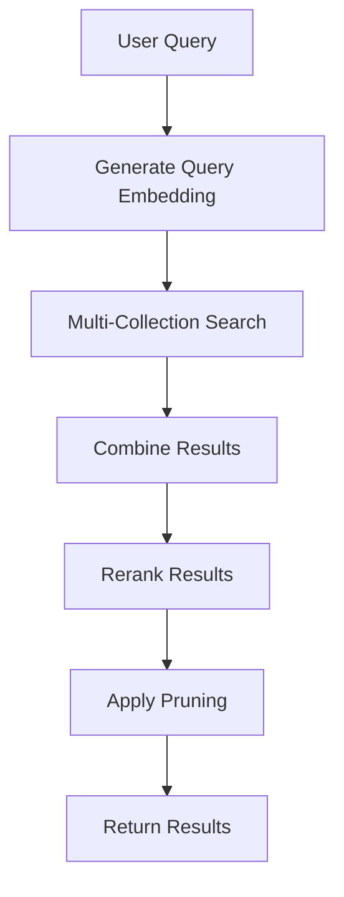
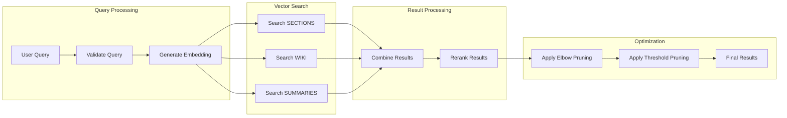

# Retrieval Workflow

## 🎯 Mục đích

Retrieval Workflow thực hiện tìm kiếm tài liệu thông minh sử dụng vector similarity search, reranking, và các kỹ thuật tối ưu hóa kết quả.

## 🔄 Workflow Overview

### High-Level Flow



### Detailed Flow



## 🔧 Implementation Details

### 1. Query Processing

#### Query Validation
```python
def validate_query(query: str) -> Tuple[bool, str]:
    """Validate search query"""
    if not query or len(query.strip()) < 2:
        return False, "Query too short"
    
    if len(query) > 1000:
        return False, "Query too long"
    
    # Check for potentially harmful content
    harmful_patterns = [
        r'<script',
        r'javascript:',
        r'data:',
        r'vbscript:'
    ]
    
    for pattern in harmful_patterns:
        if re.search(pattern, query, re.IGNORECASE):
            return False, "Query contains potentially harmful content"
    
    return True, "Valid query"
```

#### Query Embedding Generation
```python
async def generate_query_embedding(query: str) -> List[float]:
    """Generate embedding for search query"""
    embedding_request = EmbeddingRequest(
        content=query,
        file_path="query",
        model_name="text-embedding-3-small"
    )
    
    response = await call_tools_inventory_api(
        "/embedding/generate",
        embedding_request
    )
    
    return response.data["embedding"]
```

### 2. Multi-Collection Search

#### Collection Selection
```python
def select_collections(query: str, collections: List[str] = None) -> List[str]:
    """Select relevant collections based on query"""
    if collections:
        return collections
    
    query_lower = query.lower()
    selected_collections = ["sections"]  # Always include sections
    
    # Add collections based on query content
    if any(keyword in query_lower for keyword in ["documentation", "wiki", "overview", "spec"]):
        selected_collections.append("wiki")
    
    if any(keyword in query_lower for keyword in ["summary", "summarize", "overview"]):
        selected_collections.append("summaries")
    
    return selected_collections
```

#### Parallel Search
```python
async def search_collections_parallel(query_embedding: List[float], collections: List[str], top_k: int = 20) -> Dict[str, List[Dict]]:
    """Search multiple collections in parallel"""
    tasks = []
    
    for collection in collections:
        task = asyncio.create_task(
            search_single_collection(query_embedding, collection, top_k)
        )
        tasks.append((collection, task))
    
    results = {}
    for collection, task in tasks:
        try:
            collection_results = await task
            results[collection] = collection_results
        except Exception as e:
            logger.error(f"Error searching collection {collection}: {e}")
            results[collection] = []
    
    return results
```

#### Single Collection Search
```python
async def search_single_collection(query_embedding: List[float], collection: str, top_k: int) -> List[Dict]:
    """Search single collection"""
    search_request = VectorSearchRequest(
        query_embedding=query_embedding,
        collection_name=collection,
        top_k=top_k,
        search_params={
            "metric_type": "COSINE",
            "params": {"nprobe": 10}
        }
    )
    
    response = await call_ai_databases_api(
        "/vector/search",
        search_request
    )
    
    # Add collection info to results
    for result in response.data["results"]:
        result["collection"] = collection
    
    return response.data["results"]
```

### 3. Result Processing

#### Result Combination
```python
def combine_search_results(results: Dict[str, List[Dict]]) -> List[Dict]:
    """Combine results from multiple collections"""
    all_results = []
    
    for collection, collection_results in results.items():
        for result in collection_results:
            result["collection"] = collection
            all_results.append(result)
    
    # Sort by score
    all_results.sort(key=lambda x: x.get("score", 0), reverse=True)
    
    return all_results
```

#### Result Deduplication
```python
def deduplicate_results(results: List[Dict]) -> List[Dict]:
    """Remove duplicate results based on content similarity"""
    if not results:
        return []
    
    # Group by content hash
    content_groups = {}
    for result in results:
        content_hash = hashlib.md5(result["content"].encode()).hexdigest()
        if content_hash not in content_groups:
            content_groups[content_hash] = []
        content_groups[content_hash].append(result)
    
    # Keep best result from each group
    deduplicated = []
    for group in content_groups.values():
        best_result = max(group, key=lambda x: x.get("score", 0))
        deduplicated.append(best_result)
    
    return deduplicated
```

### 4. Reranking

#### Rerank Results
```python
async def rerank_results(query: str, results: List[Dict], top_k: int = 10) -> List[Dict]:
    """Rerank search results using Cohere"""
    if not results:
        return []
    
    rerank_request = RerankRequest(
        query=query,
        documents=results,
        top_k=min(top_k, len(results))
    )
    
    response = await call_tools_inventory_api(
        "/rerank/rerank",
        rerank_request
    )
    
    return response.data["reranked_results"]
```

### 5. Result Pruning

#### Elbow Pruning
```python
def apply_elbow_pruning(results: List[Dict]) -> List[Dict]:
    """Apply elbow method to prune results"""
    if len(results) <= 2:
        return results
    
    scores = [result.get("rerank_score", result.get("score", 0)) for result in results]
    
    # Find elbow point
    elbow_point = find_elbow_point(scores)
    
    if elbow_point and elbow_point < len(results):
        return results[:elbow_point]
    
    return results

def find_elbow_point(scores: List[float]) -> Optional[int]:
    """Find elbow point in score curve"""
    if len(scores) < 3:
        return None
    
    # Calculate second derivative
    second_derivatives = []
    for i in range(1, len(scores) - 1):
        second_deriv = scores[i-1] - 2*scores[i] + scores[i+1]
        second_derivatives.append(second_deriv)
    
    # Find maximum second derivative (elbow point)
    if second_derivatives:
        elbow_index = second_derivatives.index(max(second_derivatives)) + 1
        return elbow_index
    
    return None
```

#### Threshold Pruning
```python
def apply_threshold_pruning(results: List[Dict], threshold: float = 0.3) -> List[Dict]:
    """Apply threshold pruning to results"""
    pruned_results = []
    
    for result in results:
        score = result.get("rerank_score", result.get("score", 0))
        if score >= threshold:
            pruned_results.append(result)
        else:
            break  # Results are sorted by score, so we can stop here
    
    return pruned_results
```

### 6. Result Formatting

#### Format Results
```python
def format_search_results(results: List[Dict]) -> List[Dict]:
    """Format search results for display"""
    formatted_results = []
    
    for i, result in enumerate(results, 1):
        formatted_result = {
            "rank": i,
            "content": result["content"],
            "metadata": result.get("metadata", {}),
            "score": result.get("rerank_score", result.get("score", 0)),
            "collection": result.get("collection", "Unknown"),
            "file_path": result.get("metadata", {}).get("file_path", "Unknown"),
            "line_start": result.get("metadata", {}).get("line_start"),
            "line_end": result.get("metadata", {}).get("line_end")
        }
        formatted_results.append(formatted_result)
    
    return formatted_results
```

## 📊 Performance Optimization

### Caching Strategy
```python
import redis

redis_client = redis.Redis(host='redis', port=6379, db=0)

async def cache_search_results(query: str, collections: List[str], results: List[Dict], ttl: int = 1800):
    """Cache search results"""
    cache_key = f"search:{hashlib.md5(f'{query}_{collections}'.encode()).hexdigest()}"
    cache_data = {
        "query": query,
        "collections": collections,
        "results": results,
        "timestamp": datetime.now().isoformat()
    }
    redis_client.setex(cache_key, ttl, json.dumps(cache_data))

async def get_cached_search_results(query: str, collections: List[str]) -> Optional[List[Dict]]:
    """Get cached search results"""
    cache_key = f"search:{hashlib.md5(f'{query}_{collections}'.encode()).hexdigest()}"
    cached = redis_client.get(cache_key)
    if cached:
        cache_data = json.loads(cached)
        return cache_data["results"]
    return None
```

### Query Optimization
```python
def optimize_query(query: str) -> str:
    """Optimize search query"""
    # Remove stop words
    stop_words = {"the", "a", "an", "and", "or", "but", "in", "on", "at", "to", "for", "of", "with", "by"}
    words = query.lower().split()
    optimized_words = [word for word in words if word not in stop_words]
    
    # Remove special characters
    optimized_query = re.sub(r'[^\w\s]', '', ' '.join(optimized_words))
    
    return optimized_query.strip()
```

### Batch Processing
```python
async def batch_search_queries(queries: List[str]) -> List[List[Dict]]:
    """Process multiple queries in batch"""
    tasks = []
    
    for query in queries:
        task = asyncio.create_task(search_documents(query))
        tasks.append(task)
    
    results = await asyncio.gather(*tasks, return_exceptions=True)
    
    # Handle exceptions
    processed_results = []
    for result in results:
        if isinstance(result, Exception):
            logger.error(f"Search error: {result}")
            processed_results.append([])
        else:
            processed_results.append(result)
    
    return processed_results
```

## 🔍 Error Handling

### Search Errors
```python
async def handle_search_error(query: str, error: Exception) -> List[Dict]:
    """Handle search errors gracefully"""
    logger.error(f"Search error for query '{query}': {error}")
    
    # Return empty results instead of failing
    return []

async def handle_collection_error(collection: str, error: Exception) -> List[Dict]:
    """Handle collection search errors"""
    logger.error(f"Error searching collection {collection}: {error}")
    
    # Return empty results for this collection
    return []
```

### Reranking Errors
```python
async def handle_reranking_error(query: str, results: List[Dict], error: Exception) -> List[Dict]:
    """Handle reranking errors"""
    logger.error(f"Reranking error for query '{query}': {error}")
    
    # Return original results without reranking
    return results
```

## 📈 Monitoring & Metrics

### Search Metrics
```python
def track_search_metrics(query: str, results: List[Dict], search_time: float):
    """Track search performance metrics"""
    metrics = {
        "query_length": len(query),
        "results_count": len(results),
        "search_time": search_time,
        "average_score": sum(r.get("score", 0) for r in results) / len(results) if results else 0,
        "timestamp": datetime.now().isoformat()
    }
    
    logger.info(f"Search Metrics: {json.dumps(metrics)}")
```

### Quality Metrics
```python
def track_result_quality(results: List[Dict]):
    """Track result quality metrics"""
    if not results:
        return
    
    quality_metrics = {
        "total_results": len(results),
        "high_score_results": len([r for r in results if r.get("score", 0) > 0.8]),
        "medium_score_results": len([r for r in results if 0.5 <= r.get("score", 0) <= 0.8]),
        "low_score_results": len([r for r in results if r.get("score", 0) < 0.5]),
        "average_score": sum(r.get("score", 0) for r in results) / len(results),
        "score_std": calculate_std([r.get("score", 0) for r in results]),
        "timestamp": datetime.now().isoformat()
    }
    
    logger.info(f"Result Quality Metrics: {json.dumps(quality_metrics)}")
```

## 🔗 Liên kết

- [Indexing Workflow](./indexing.md)
- [QA Workflow](./qa.md)
- [Specs Generation Workflow](./specs-generation.md)
- [Task Processing](./tasks.md)
- [Core Workflows Service](../services/core-workflows.md)
