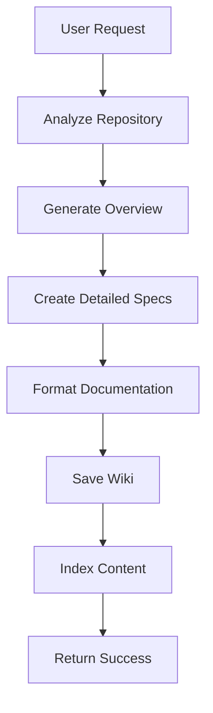

# Specs Generation Workflow

## 🎯 Mục đích

Specs Generation Workflow tạo ra tài liệu kỹ thuật tự động từ mã COBOL, bao gồm repository overview, detailed analysis, và code structure documentation.

## 🔄 Workflow Overview

### High-Level Flow



### Detailed Flow

```mermaid
graph LR
    subgraph "Repository Analysis"
        A[ZIP File] --> B[Extract Files]
        B --> C[Parse Files]
        C --> D[Analyze Structure]
    end
    
    subgraph "Content Generation"
        D --> E[Generate Overview]
        E --> F[Create Sections]
        F --> G[Generate Details]
    end
    
    subgraph "Documentation"
        G --> H[Format Markdown]
        H --> I[Add Diagrams]
        I --> J[Create Index]
    end
    
    subgraph "Storage"
        J --> K[Save to File]
        K --> L[Index in Milvus]
        L --> M[Update Metadata]
    end
```



## 🔧 Implementation Details

### 1. Repository Analysis

#### File Structure Analysis
```python
async def analyze_repository_structure(zip_file: UploadFile) -> Dict:
    """Analyze repository structure"""
    # Extract ZIP file
    with tempfile.TemporaryDirectory() as temp_dir:
        with zipfile.ZipFile(zip_file.file) as zip_ref:
            zip_ref.extractall(temp_dir)
        
        # Analyze file structure
        structure = {
            "files": [],
            "directories": [],
            "file_types": {},
            "total_size": 0
        }
        
        for root, dirs, files in os.walk(temp_dir):
            for file in files:
                file_path = os.path.join(root, file)
                file_size = os.path.getsize(file_path)
                
                # Determine file type
                file_type = detect_file_type(file)
                
                structure["files"].append({
                    "path": file_path,
                    "name": file,
                    "size": file_size,
                    "type": file_type
                })
                
                structure["file_types"][file_type] = structure["file_types"].get(file_type, 0) + 1
                structure["total_size"] += file_size
        
        return structure
```

#### Code Analysis
```python
async def analyze_code_content(files: List[Dict]) -> Dict:
    """Analyze code content"""
    analysis = {
        "programs": [],
        "copybooks": [],
        "jcl_jobs": [],
        "dependencies": {},
        "complexity_metrics": {}
    }
    
    for file in files:
        if file["type"] == "COBOL":
            # Analyze COBOL program
            program_analysis = await analyze_cobol_program(file)
            analysis["programs"].append(program_analysis)
            
        elif file["type"] == "COPY":
            # Analyze COPY file
            copy_analysis = await analyze_copy_file(file)
            analysis["copybooks"].append(copy_analysis)
            
        elif file["type"] == "JCL":
            # Analyze JCL file
            jcl_analysis = await analyze_jcl_file(file)
            analysis["jcl_jobs"].append(jcl_analysis)
    
    return analysis
```

### 2. Content Generation

#### Repository Overview Generation
```python
async def generate_repository_overview(structure: Dict, analysis: Dict) -> str:
    """Generate repository overview"""
    overview_prompt = f"""
    Generate a comprehensive repository overview for a COBOL codebase with the following structure:
    
    Files: {len(structure['files'])} files
    File Types: {structure['file_types']}
    Total Size: {structure['total_size']} bytes
    
    Programs: {len(analysis['programs'])} COBOL programs
    Copybooks: {len(analysis['copybooks'])} COPY files
    JCL Jobs: {len(analysis['jcl_jobs'])} JCL files
    
    Please provide:
    1. Repository summary
    2. Architecture overview
    3. Key components
    4. Data flow
    5. Dependencies
    """
    
    response = await call_tools_inventory_api(
        "/llm/specs",
        {
            "content": overview_prompt,
            "spec_type": "Repository Overview",
            "model_name": "gpt-4"
        }
    )
    
    return response["data"]["specs"]
```

#### Detailed Section Generation
```python
async def generate_detailed_sections(analysis: Dict) -> List[Dict]:
    """Generate detailed sections for each component"""
    sections = []
    
    # Generate program documentation
    for program in analysis["programs"]:
        section = await generate_program_section(program)
        sections.append(section)
    
    # Generate copybook documentation
    for copybook in analysis["copybooks"]:
        section = await generate_copybook_section(copybook)
        sections.append(section)
    
    # Generate JCL documentation
    for jcl_job in analysis["jcl_jobs"]:
        section = await generate_jcl_section(jcl_job)
        sections.append(section)
    
    return sections
```

#### Program Section Generation
```python
async def generate_program_section(program: Dict) -> Dict:
    """Generate detailed section for COBOL program"""
    section_prompt = f"""
    Generate detailed documentation for this COBOL program:
    
    Program ID: {program['program_id']}
    File Path: {program['file_path']}
    Divisions: {program['divisions']}
    Sections: {program['sections']}
    Data Items: {program['data_items']}
    Procedures: {program['procedures']}
    
    Please provide:
    1. Program purpose and functionality
    2. Data structure analysis
    3. Procedure flow
    4. Input/Output specifications
    5. Dependencies and calls
    6. Code examples
    """
    
    response = await call_tools_inventory_api(
        "/llm/specs",
        {
            "content": section_prompt,
            "spec_type": "Program Documentation",
            "model_name": "gpt-4"
        }
    )
    
    return {
        "title": f"Program: {program['program_id']}",
        "content": response["data"]["specs"],
        "type": "program",
        "file_path": program["file_path"]
    }
```

### 3. Documentation Formatting

#### Markdown Formatting
```python
def format_wiki_content(overview: str, sections: List[Dict]) -> str:
    """Format wiki content as Markdown"""
    wiki_content = []
    
    # Add title and overview
    wiki_content.append("# COBOL Repository Documentation")
    wiki_content.append("")
    wiki_content.append("## Overview")
    wiki_content.append("")
    wiki_content.append(overview)
    wiki_content.append("")
    
    # Add table of contents
    wiki_content.append("## Table of Contents")
    wiki_content.append("")
    for i, section in enumerate(sections, 1):
        wiki_content.append(f"{i}. [{section['title']}](#{section['title'].lower().replace(' ', '-')})")
    wiki_content.append("")
    
    # Add sections
    for section in sections:
        wiki_content.append(f"## {section['title']}")
        wiki_content.append("")
        wiki_content.append(section["content"])
        wiki_content.append("")
    
    return "\n".join(wiki_content)
```

#### Diagram Generation
```python
def generate_diagrams(analysis: Dict) -> List[str]:
    """Generate Mermaid diagrams for documentation"""
    diagrams = []
    
    # Data flow diagram
    data_flow_diagram = generate_data_flow_diagram(analysis)
    diagrams.append(data_flow_diagram)
    
    # Program call diagram
    call_diagram = generate_call_diagram(analysis)
    diagrams.append(call_diagram)
    
    # JCL workflow diagram
    jcl_diagram = generate_jcl_workflow_diagram(analysis)
    diagrams.append(jcl_diagram)
    
    return diagrams

def generate_data_flow_diagram(analysis: Dict) -> str:
    """Generate data flow diagram"""
    diagram = ["```mermaid", "graph TD"]
    
    for program in analysis["programs"]:
        diagram.append(f"    {program['program_id']}[{program['program_id']}]")
    
    for program in analysis["programs"]:
        for call in program.get("calls", []):
            diagram.append(f"    {program['program_id']} --> {call}")
    
    diagram.append("```")
    return "\n".join(diagram)
```

### 4. Content Storage

#### Wiki File Saving
```python
async def save_wiki_content(content: str, hash_dir: str) -> str:
    """Save wiki content to file"""
    wiki_dir = f"/app/shared/wiki_v2/{hash_dir[:8]}"
    os.makedirs(wiki_dir, exist_ok=True)
    
    wiki_path = os.path.join(wiki_dir, "wiki_v2.md")
    
    with open(wiki_path, 'w', encoding='utf-8') as f:
        f.write(content)
    
    return wiki_path
```

#### Content Indexing
```python
async def index_wiki_content(content: str, hash_dir: str):
    """Index wiki content in Milvus"""
    # Split content into sections
    sections = split_content_into_sections(content)
    
    # Generate embeddings for each section
    embeddings = []
    for section in sections:
        embedding = await call_tools_inventory_api(
            "/embedding/generate",
            {"content": section["content"]}
        )
        embeddings.append(embedding["data"]["embedding"])
    
    # Store in Milvus
    documents = []
    for i, (section, embedding) in enumerate(zip(sections, embeddings)):
        document = {
            "id": f"{hash_dir}_{i}",
            "content": section["content"],
            "embedding": embedding,
            "metadata": {
                "hash_dir": hash_dir,
                "section_title": section["title"],
                "section_index": i,
                "wiki_type": "generated"
            }
        }
        documents.append(document)
    
    await call_ai_databases_api(
        "/vector/insert",
        {"collection_name": "wiki", "documents": documents}
    )
```

## 📊 Performance Optimization

### Batch Processing
```python
async def batch_generate_sections(sections: List[Dict]) -> List[Dict]:
    """Generate sections in batches for better performance"""
    batch_size = 5
    results = []
    
    for i in range(0, len(sections), batch_size):
        batch = sections[i:i + batch_size]
        
        # Process batch concurrently
        tasks = [generate_section_async(section) for section in batch]
        batch_results = await asyncio.gather(*tasks)
        
        results.extend(batch_results)
    
    return results
```

### Caching
```python
import redis

redis_client = redis.Redis(host='redis', port=6379, db=0)

async def get_cached_analysis(hash_dir: str) -> Optional[Dict]:
    """Get cached analysis results"""
    cache_key = f"analysis:{hash_dir}"
    cached = redis_client.get(cache_key)
    if cached:
        return json.loads(cached)
    return None

async def cache_analysis(hash_dir: str, analysis: Dict):
    """Cache analysis results"""
    cache_key = f"analysis:{hash_dir}"
    redis_client.setex(cache_key, 3600, json.dumps(analysis))  # 1 hour TTL
```

## 🔍 Error Handling

### Content Generation Errors
```python
async def handle_content_generation_error(section: Dict, error: Exception) -> Dict:
    """Handle content generation errors"""
    logger.error(f"Error generating content for section {section['title']}: {error}")
    
    # Return fallback content
    return {
        "title": section["title"],
        "content": f"Error generating content: {str(error)}",
        "type": section["type"],
        "file_path": section.get("file_path", "Unknown"),
        "error": True
    }
```

### File Processing Errors
```python
async def handle_file_processing_error(file_path: str, error: Exception) -> Dict:
    """Handle file processing errors"""
    logger.error(f"Error processing file {file_path}: {error}")
    
    return {
        "path": file_path,
        "name": os.path.basename(file_path),
        "size": 0,
        "type": "ERROR",
        "error": str(error)
    }
```

## 📈 Monitoring & Metrics

### Generation Metrics
```python
def track_generation_metrics(hash_dir: str, metrics: Dict):
    """Track specs generation metrics"""
    generation_metrics = {
        "hash_dir": hash_dir,
        "files_processed": metrics.get("files_processed", 0),
        "sections_generated": metrics.get("sections_generated", 0),
        "generation_time": metrics.get("generation_time", 0),
        "content_length": metrics.get("content_length", 0),
        "timestamp": datetime.now().isoformat()
    }
    
    logger.info(f"Specs Generation Metrics: {json.dumps(generation_metrics)}")
```

### Quality Metrics
```python
def track_content_quality(content: str, sections: List[Dict]):
    """Track content quality metrics"""
    quality_metrics = {
        "total_length": len(content),
        "section_count": len(sections),
        "average_section_length": sum(len(s["content"]) for s in sections) / len(sections) if sections else 0,
        "has_diagrams": "```mermaid" in content,
        "has_code_examples": "```cobol" in content or "```" in content,
        "timestamp": datetime.now().isoformat()
    }
    
    logger.info(f"Content Quality Metrics: {json.dumps(quality_metrics)}")
```

## 🔗 Liên kết

- [Indexing Workflow](./indexing.md)
- [QA Workflow](./qa.md)
- [Retrieval Workflow](./retrieval.md)
- [Task Processing](./tasks.md)
- [Core Workflows Service](../services/core-workflows.md)
