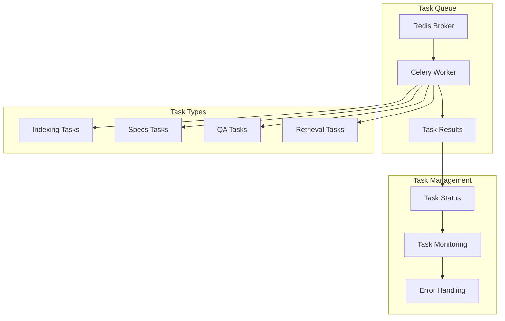

# Task Processing

## 🎯 Mục đích

Task Processing quản lý các background tasks sử dụng Celery, bao gồm indexing, specs generation, QA processing, và các long-running operations.

## 🏗️ Task Architecture

### Task Overview



### Task Categories

| Task Type | Purpose | Duration | Complexity |
|-----------|---------|----------|------------|
| **Indexing** | Process files and create searchable content | 30s-5min | High |
| **Specs Generation** | Generate technical documentation | 1-10min | High |
| **QA Processing** | Answer user questions | 1-10s | Medium |
| **Retrieval** | Search and retrieve documents | 100-500ms | Low |

## 🔧 Implementation

### 1. Celery Configuration

#### Celery App Setup
```python
from celery import Celery
import os

# Redis configuration
REDIS_URL = os.getenv("REDIS_URL", "redis://redis:6379/0")

# Create Celery app
celery_app = Celery(
    "core_workflows_tasks",
    broker=REDIS_URL,
    backend=REDIS_URL
)

# Configure Celery
celery_app.conf.update(
    task_serializer='json',
    accept_content=['json'],
    result_serializer='json',
    timezone='UTC',
    enable_utc=True,
    task_track_started=True,
    task_time_limit=30 * 60,  # 30 minutes
    task_soft_time_limit=25 * 60,  # 25 minutes
    worker_prefetch_multiplier=1,
    worker_max_tasks_per_child=1000
)
```

#### Task Registration
```python
# Register tasks
from celery_tasks.index_and_specs_tasks import index_zip_task, generate_specs_v2_with_index_task
from celery_tasks.qa_tasks import retrieval_task, generate_answer_task

# Task routing
celery_app.conf.task_routes = {
    'indexing.*': {'queue': 'indexing'},
    'specs_v2.*': {'queue': 'specs'},
    'qa.*': {'queue': 'qa'},
    'retrieval.*': {'queue': 'retrieval'}
}
```

### 2. Indexing Tasks

#### Index ZIP Task
```python
@celery_app.task(bind=True, name="indexing.index_zip")
def index_zip_task(self, zip_file_path: str, chunk_size: int = 6000, batch_size: int = 100):
    """Index ZIP file task"""
    try:
        # Update task status
        self.update_state(
            state='PROGRESS',
            meta={'message': 'Starting indexing...', 'progress': 0}
        )
        
        # Process ZIP file
        result = process_zip_file(zip_file_path, chunk_size, batch_size)
        
        # Update progress
        self.update_state(
            state='PROGRESS',
            meta={'message': 'Indexing completed', 'progress': 100}
        )
        
        return {
            'status': 'SUCCESS',
            'result': result,
            'message': 'Indexing completed successfully'
        }
        
    except Exception as exc:
        # Update task state on failure
        self.update_state(
            state='FAILURE',
            meta={'error': str(exc)}
        )
        raise exc
```

#### Progress Tracking
```python
def track_indexing_progress(task_id: str, progress: int, message: str):
    """Track indexing progress"""
    from celery_app_instance import celery_app
    
    celery_app.update_state(
        task_id=task_id,
        state='PROGRESS',
        meta={
            'progress': progress,
            'message': message,
            'timestamp': datetime.now().isoformat()
        }
    )
```

### 3. Specs Generation Tasks

#### Generate Specs Task
```python
@celery_app.task(bind=True, name="specs_v2.generate_specs_with_index")
def generate_specs_v2_with_index_task(
    self,
    zip_file_path: str,
    spec_type: str = "Repository Overview",
    output_path: str = "/app/shared/wiki_v2",
    index_first: bool = True,
    chunk_size: int = 6000,
    batch_size: int = 100
):
    """Generate specs with optional indexing"""
    try:
        # Update task status
        self.update_state(
            state='PROGRESS',
            meta={'message': 'Starting specs generation...', 'progress': 0}
        )
        
        # Index first if requested
        if index_first:
            self.update_state(
                state='PROGRESS',
                meta={'message': 'Indexing files...', 'progress': 20}
            )
            
            index_result = index_zip_file(zip_file_path, chunk_size, batch_size)
            
            if not index_result['success']:
                raise Exception(f"Indexing failed: {index_result['error']}")
        
        # Generate specs
        self.update_state(
            state='PROGRESS',
            meta={'message': 'Generating specifications...', 'progress': 50}
        )
        
        specs_result = generate_specs(zip_file_path, spec_type, output_path)
        
        # Index specs content
        self.update_state(
            state='PROGRESS',
            meta={'message': 'Indexing specifications...', 'progress': 80}
        )
        
        index_specs_result = index_specs_content(specs_result['content'])
        
        # Complete
        self.update_state(
            state='PROGRESS',
            meta={'message': 'Specs generation completed', 'progress': 100}
        )
        
        return {
            'status': 'SUCCESS',
            'result': {
                'specs_content': specs_result['content'],
                'output_path': specs_result['output_path'],
                'indexed': index_specs_result['success']
            },
            'message': 'Specs generation completed successfully'
        }
        
    except Exception as exc:
        self.update_state(
            state='FAILURE',
            meta={'error': str(exc)}
        )
        raise exc
```

### 4. QA Tasks

#### Retrieval Task
```python
@celery_app.task(bind=True, name="qa.retrieval")
def retrieval_task(self, question: str, top_k: int = 10):
    """Retrieval task for QA workflow"""
    try:
        # Generate question embedding
        embedding = generate_question_embedding(question)
        if not embedding:
            raise Exception("Failed to generate embedding for question")
        
        # Vector search in sections collection
        search_results = vector_search_sections(embedding, top_k)
        if not search_results:
            logger.warning("No search results found")
            search_results = []
        
        # Rerank results
        reranked_results = rerank_results(search_results, question)
        
        # Extract references
        references = extract_references(reranked_results)
        
        # Store references in Redis
        redis_key = f"references:{self.request.id}"
        redis_client.setex(redis_key, 300, json.dumps(references))
        
        logger.info(f"Retrieval task {self.request.id} completed: {len(references.get('documents', []))} references found")
        
        return references
        
    except Exception as e:
        logger.error(f"Error in retrieval task {self.request.id}: {e}")
        raise
```

#### Generate Answer Task
```python
@celery_app.task(bind=True, name="qa.generate_answer")
def generate_answer_task(self, question: str, top_k: int, retrieval_task_id: str):
    """Generate answer task for QA workflow"""
    try:
        # Get references from Redis
        redis_key = f"references:{retrieval_task_id}"
        references_data = redis_client.get(redis_key)
        
        if not references_data:
            raise Exception("No references found for question")
        
        references = json.loads(references_data)
        
        # Format context for LLM
        context = format_context_for_llm(references.get('documents', []))
        
        # Generate answer using LLM
        answer = generate_llm_answer(question, context)
        
        # Extract references
        answer_references = extract_answer_references(references.get('documents', []))
        
        result = {
            'answer': answer,
            'references': answer_references,
            'processing_time': time.time() - self.request.time_start
        }
        
        logger.info(f"Answer generation task {self.request.id} completed")
        
        return result
        
    except Exception as e:
        logger.error(f"Error in answer generation task {self.request.id}: {e}")
        raise
```

### 5. Task Management

#### Task Status Monitoring
```python
def get_task_status(task_id: str) -> Dict:
    """Get task status"""
    from celery_app_instance import celery_app
    
    result = celery_app.AsyncResult(task_id)
    
    return {
        'task_id': task_id,
        'status': result.status,
        'result': result.result if result.ready() else None,
        'info': result.info if result.info else {},
        'traceback': result.traceback if result.failed() else None
    }
```

#### Task Cancellation
```python
def cancel_task(task_id: str) -> bool:
    """Cancel running task"""
    from celery_app_instance import celery_app
    
    try:
        celery_app.control.revoke(task_id, terminate=True)
        return True
    except Exception as e:
        logger.error(f"Error cancelling task {task_id}: {e}")
        return False
```

#### Task Cleanup
```python
def cleanup_completed_tasks():
    """Cleanup completed tasks"""
    from celery_app_instance import celery_app
    
    # Get completed tasks
    completed_tasks = celery_app.control.inspect().active()
    
    # Cleanup old completed tasks
    for worker, tasks in completed_tasks.items():
        for task in tasks:
            if task['time_start'] < time.time() - 3600:  # 1 hour ago
                celery_app.control.revoke(task['id'])
```

## 📊 Performance Optimization

### Task Batching
```python
@celery_app.task(bind=True, name="batch.process_files")
def batch_process_files_task(self, file_paths: List[str], batch_size: int = 10):
    """Process multiple files in batch"""
    try:
        results = []
        
        for i in range(0, len(file_paths), batch_size):
            batch = file_paths[i:i + batch_size]
            
            # Process batch
            batch_results = process_file_batch(batch)
            results.extend(batch_results)
            
            # Update progress
            progress = (i + len(batch)) / len(file_paths) * 100
            self.update_state(
                state='PROGRESS',
                meta={'progress': progress, 'processed': i + len(batch)}
            )
        
        return {
            'status': 'SUCCESS',
            'results': results,
            'total_processed': len(results)
        }
        
    except Exception as exc:
        self.update_state(
            state='FAILURE',
            meta={'error': str(exc)}
        )
        raise exc
```

### Task Prioritization
```python
# Configure task priorities
celery_app.conf.task_routes = {
    'qa.*': {'queue': 'high_priority'},
    'retrieval.*': {'queue': 'high_priority'},
    'indexing.*': {'queue': 'low_priority'},
    'specs_v2.*': {'queue': 'low_priority'}
}

# Set queue priorities
celery_app.conf.task_default_priority = 5
celery_app.conf.worker_prefetch_multiplier = 1
```

### Resource Management
```python
@celery_app.task(bind=True, name="resource_management.cleanup")
def cleanup_resources_task(self):
    """Cleanup system resources"""
    try:
        # Cleanup temporary files
        cleanup_temp_files()
        
        # Cleanup old task results
        cleanup_old_results()
        
        # Cleanup Redis cache
        cleanup_redis_cache()
        
        return {'status': 'SUCCESS', 'message': 'Resources cleaned up'}
        
    except Exception as exc:
        logger.error(f"Resource cleanup failed: {exc}")
        raise exc
```

## 🔍 Error Handling

### Task Error Handling
```python
@celery_app.task(bind=True, autoretry_for=(Exception,), retry_kwargs={'max_retries': 3, 'countdown': 60})
def resilient_task(self, data):
    """Task with automatic retry"""
    try:
        # Task implementation
        result = process_data(data)
        return result
        
    except Exception as exc:
        logger.error(f"Task failed: {exc}")
        
        # Retry with exponential backoff
        raise self.retry(exc=exc)
```

### Error Notification
```python
def notify_task_error(task_id: str, error: Exception):
    """Notify about task errors"""
    error_notification = {
        'task_id': task_id,
        'error_type': type(error).__name__,
        'error_message': str(error),
        'timestamp': datetime.now().isoformat()
    }
    
    # Send notification
    send_error_notification(error_notification)
    
    # Log error
    logger.error(f"Task {task_id} failed: {error}")
```

## 📈 Monitoring & Metrics

### Task Metrics
```python
def track_task_metrics(task_name: str, duration: float, success: bool):
    """Track task performance metrics"""
    metrics = {
        'task_name': task_name,
        'duration': duration,
        'success': success,
        'timestamp': datetime.now().isoformat()
    }
    
    logger.info(f"Task Metrics: {json.dumps(metrics)}")
    
    # Send to monitoring system
    send_metrics_to_monitoring(metrics)
```

### Queue Monitoring
```python
def monitor_queue_status():
    """Monitor queue status"""
    from celery_app_instance import celery_app
    
    # Get queue lengths
    queue_lengths = celery_app.control.inspect().active_queues()
    
    # Get worker status
    worker_status = celery_app.control.inspect().stats()
    
    return {
        'queue_lengths': queue_lengths,
        'worker_status': worker_status,
        'timestamp': datetime.now().isoformat()
    }
```

## 🔗 Liên kết

- [Indexing Workflow](./indexing.md)
- [QA Workflow](./qa.md)
- [Specs Generation Workflow](./specs-generation.md)
- [Retrieval Workflow](./retrieval.md)
- [Core Workflows Service](../services/core-workflows.md)
