# 1. Overview

## 1.1 Introduction & Purpose
> Use File/Folder tree

## 1.2 File & Directory Structure
> Link to detail of JCL, COBOL, COPY // (2.1) | (2.2) | (2.3)

## 1.3 System Architecture & Key Components
> CALL among COBOL files to COBOL/COPY -> draw by engineer, zoom-in by file-context + sub-graph (node, k-hop neighbor)

#### Solutions

```mermaid
graph TD
    subgraph COBOL_Programs["COBOL Programs"]
        CBACT01C["CBACT01C"]
        CBACT02C["CBACT02C"]
        CBACT03C["CBACT03C"]
        CBACT04C["CBACT04C"]
        CBCUS01C["CBCUS01C"]
        CBEXPORT["CBEXPORT"]
        CBIMPORT["CBIMPORT"]
        CBSTM03A["CBSTM03A"]
        CBSTM03B["CBSTM03B"]
        CBTRN01C["CBTRN01C"]
        CBTRN02C["CBTRN02C"]
        CBTRN03C["CBTRN03C"]
        COACCT01["COACCT01"]
        COBSWAIT["COBSWAIT"]
        COBTUPDT["COBTUPDT"]
        CODATE01["CODATE01"]
        COMEN01C["COMEN01C"]
        COPAUA0C["COPAUA0C"]
        CORPT00C["CORPT00C"]
        COTRN02C["COTRN02C"]
        COUSR02C["COUSR02C"]
        COUSR03C["COUSR03C"]
        CSUTLDTC["CSUTLDTC"]
        DBUNLDGS["DBUNLDGS"]
        PAUDBLOD["PAUDBLOD"]
        PAUDBUNL["PAUDBUNL"]
    end
    subgraph System_Calls["System/External Calls"]
        CBLTDLI["CBLTDLI"]
        CEE3ABD["CEE3ABD"]
        CEEDAYS["CEEDAYS"]
        COBDATFT["COBDATFT"]
        MQCLOSE["MQCLOSE"]
        MQGET["MQGET"]
        MQOPEN["MQOPEN"]
        MQPUT["MQPUT"]
        MQPUT1["MQPUT1"]
        MVSWAIT["MVSWAIT"]
    end

    CBACT01C -->|"L231"| COBDATFT
    CBACT01C -->|"L410"| CEE3ABD
    CBACT02C -->|"L158"| CEE3ABD
    CBACT03C -->|"L158"| CEE3ABD
    CBACT04C -->|"L632"| CEE3ABD
    CBCUS01C -->|"L158"| CEE3ABD
    CBEXPORT -->|"L579"| CEE3ABD
    CBIMPORT -->|"L484"| CEE3ABD
    CBSTM03A -->|"L351"| CBSTM03B
    CBSTM03A -->|"L923"| CEE3ABD
    CBTRN01C -->|"L473"| CEE3ABD
    CBTRN02C -->|"L711"| CEE3ABD
    CBTRN03C -->|"L630"| CEE3ABD
    COACCT01 -->|"L233"| MQOPEN
    COACCT01 -->|"L267"| MQOPEN
    COACCT01 -->|"L302"| MQOPEN
    COACCT01 -->|"L352"| MQGET
    COACCT01 -->|"L479"| MQPUT
    COACCT01 -->|"L516"| MQPUT
    COACCT01 -->|"L557"| MQCLOSE
    COBSWAIT -->|"L38"| MVSWAIT
    CODATE01 -->|"L182"| MQOPEN
    CODATE01 -->|"L216"| MQOPEN
    CODATE01 -->|"L251"| MQOPEN
    CODATE01 -->|"L301"| MQGET
    CODATE01 -->|"L383"| MQPUT
    CODATE01 -->|"L420"| MQPUT
    CODATE01 -->|"L461"| MQCLOSE
    COPAUA0C -->|"L262"| MQOPEN
    COPAUA0C -->|"L400"| MQGET
    COPAUA0C -->|"L758"| MQPUT1
    COPAUA0C -->|"L956"| MQCLOSE
    CORPT00C -->|"L392"| CSUTLDTC
    CORPT00C -->|"L412"| CSUTLDTC
    COTRN02C -->|"L393"| CSUTLDTC
    COTRN02C -->|"L413"| CSUTLDTC
    CSUTLDTC -->|"L116"| CEEDAYS
    DBUNLDGS -->|"L222"| CBLTDLI
    DBUNLDGS -->|"L267"| CBLTDLI
    DBUNLDGS -->|"L302"| CBLTDLI
    DBUNLDGS -->|"L321"| CBLTDLI
    PAUDBLOD -->|"L244"| CBLTDLI
    PAUDBLOD -->|"L296"| CBLTDLI
    PAUDBLOD -->|"L321"| CBLTDLI
    PAUDBUNL -->|"L213"| CBLTDLI
    PAUDBUNL -->|"L257"| CBLTDLI
```

- Graph Reduction -> Gently remove non-important node & aggregate sub-graph -> do it multiple times back to Introduction & Purpose (**increasing latency**)
  - Separate external CALL & internal CALL
  - Pruning isolated node, duplicate edge
  - Display isolated sub-graph as independent diagram
  - Clustering nodes to k-cluster -> summarize the k-cluster (can do it multiple time)
  - Searching for important node (which has many neighbors in k-hop)
  - Tagging node (by its function) -> grouping by the tags
- Re-implement new template as C4 Design or DDD (**high development cost**)
- Keep current specs as Assistant knowledge & build new module for generating Docs (Java version) from the knowledge

## 1.4 Overall Data Flow
> Parsing I/O for each file -> draw by engineer, zoom-in by file-context + sub-graph (node, k-hop neighbor)

## 1.5 Overall Control Flow 
> Parsing JCL control flow -> draw by engineer // (2.3)
- 1.5.1 <JCL 001> Diagram
  > draw by engineer, zoom-in by file-context + sub-graph (node, k-hop neighbor) 
- 1.5.2 <JCL 002> Diagram 
  > draw by engineer, zoom-in by file-context + sub-graph (node, k-hop neighbor) 
- 1.5.3 ...

# 2. Detail Source code 
> Will be children of (1)
## 2.1 <File 001> (COBOL)
- 2.1.1 Metadata
- 2.1.2 Program Structure Highlights
- 2.1.3 Data Flow
- 2.1.4 Control Flow
- 2.1.5 Interactions

## 2.2 <File 002> (COPY)
- 2.2.1 Metadata
- 2.2.2 Program Structure Highlights
- 2.2.3 Data Flow
- 2.2.4 Control Flow
- 2.2.5 Interactions

## 2.3 <File 003> (JCL, shell)
- 2.3.1 Summary
- 2.3.2 Metadata Content
- 2.3.3 Dependency
- 2.3.4 Business Process
