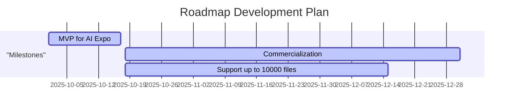

# Roadmap

## MVP for AI Expo
- Support integration
- Adjust interface for appropriate UI visualization
- Bug fixing

## Commercialization
- Support integration
- Adjust interface for appropriate UI visualization
- Bug fixing
- Officialy support Glossary/Term
- Officialy support Zoom-in for Keyword
- Allow user remove inappropriate zoom-in doc
- Prompt tuning
- Optimize processing time
- Add paging mechanism to API for lazy-loading on FE

## Support up to 10000 files
- Sizing Database
- Performance test
- Guardrail for long document (source code file)

