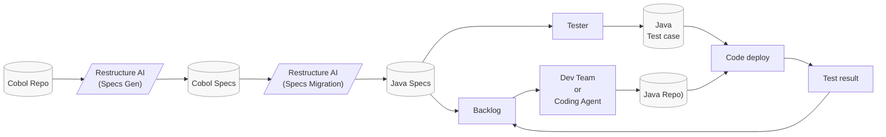
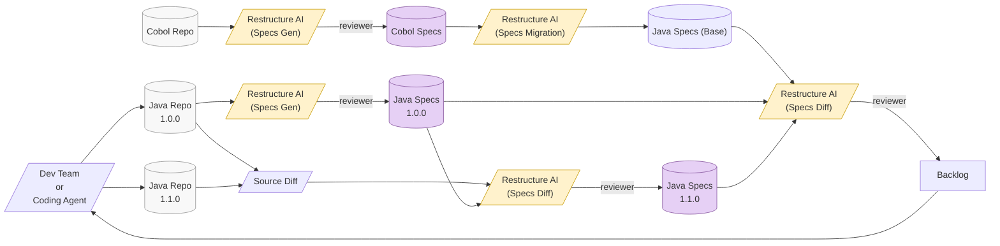

# 1. Dự án phát triển from scratch

### Luồng chính (Cobol → Java)
- **Cobol Repo** → **Restructure AI (Specs Gen)**: Source code Cobol ban đầu được đưa vào AI để tạo đặc tả (Specs Gen).
- **Restructure AI (Specs Gen)** → **Cobol Specs**: AI sinh ra tài liệu đặc tả từ code Cobol.
- **Cobol Specs** → **Restructure AI (Specs Migration)**: AI tiếp tục chuyển đổi đặc tả Cobol sang đặc tả Java (Specs Migration).
- **Restructure AI (Specs Migration)** → **Java Specs**: Kết quả là bộ đặc tả cho hệ thống Java.
- **Java Specs** → **Backlog**: Các Java specs được đưa vào backlog để thực thi.

### Nhánh kiểm thử
- **Java Specs** → **Tester**: Tester sử dụng Java specs để viết test.
- **Tester** → **Java Test case**: Sinh ra các test case cho Java.
- **Java Test case** → **Code deploy**: Test case được deploy cùng code.
- **Code deploy** → **Test result**: Chạy test và thu kết quả.
- **Test result** → **Backlog**: Kết quả test (fail/pass, bug) quay lại backlog để xử lý tiếp.

### Nhánh phát triển
- **Backlog** → **Dev Team / Coding Agent**: Backlog được xử lý bởi dev hoặc AI coding agent.
- **Dev Team / Coding Agent** → **Java Repo**: Code Java được implement và commit vào repo.
- **Java Repo** → **Code deploy**: Code mới được deploy để chạy test.

# 2. Dự án đang migration

- Quy trình quản lý chuyển đổi và phát triển hệ thống từ Cobol sang Java theo hướng “spec-driven”, có kiểm soát thay đổi qua nhiều phiên bản.
- Góc nhìn cho PO/PM là: mọi thay đổi đều được theo dõi qua specs, và backlog được tạo ra từ việc so sánh (diff) giữa các phiên bản.

### 1. Luồng chuyển đổi từ Cobol (baseline)
- Cobol Repo → AI (Specs Gen) → Cobol Specs: AI đọc code Cobol và tạo tài liệu đặc tả, có reviewer kiểm tra.
- Cobol Specs → AI (Specs Migration) → Java Specs (Base): chuyển đặc tả Cobol sang đặc tả Java (baseline ban đầu).
- Java Specs (Base) → AI (Specs Diff) → Backlog: so sánh với trạng thái Java hiện tại để tạo backlog công việc.
- Ý nghĩa: tạo “đích đến” cho hệ Java dựa trên hệ Cobol cũ.

### 2. Luồng hệ Java hiện tại (versioning)
- Dev/Coding Agent → Java Repo 1.0.0 → AI (Specs Gen) → Java Specs 1.0.0: hệ Java hiện tại được “dịch ngược” thành specs, có reviewer xác nhận.
- Ý nghĩa: luôn có một bản đặc tả phản ánh đúng trạng thái code hiện tại.

### 3. Luồng thay đổi phiên bản (1.0.0 → 1.1.0)
- Dev → Java Repo 1.1.0: team phát triển phiên bản mới.
- So sánh code: Java Repo 1.0.0 vs 1.1.0 → Source Diff.
- Source Diff + Java Specs 1.0.0 → AI (Specs Diff) → Java Specs 1.1.0 (có reviewer).
- Ý nghĩa: mọi thay đổi trong code được “dịch” thành thay đổi trong specs, giúp theo dõi rõ ràng impact.

### 4. Tạo và quản lý Backlog
- Java Specs (Base) + Java Specs 1.0.0 + Java Specs 1.1.0 → AI (Specs Diff) → Backlog (có reviewer).
- Backlog → Dev: team thực thi và tiếp tục vòng lặp.
- Ý nghĩa:
- Backlog không tạo thủ công mà sinh ra từ việc so sánh các specs.
- Đảm bảo backlog luôn bám sát mục tiêu (Cobol → Java) và trạng thái thực tế.

### 5. Vai trò reviewer
- Xuất hiện ở nhiều bước (tạo specs, diff specs, backlog).
- Đảm bảo chất lượng và tính đúng đắn trước khi đưa vào backlog hoặc release.

### Giá trị cho PO/PM
- Minh bạch: luôn biết hệ thống đang ở đâu so với mục tiêu.
- Traceability: mọi thay đổi đều có dấu vết từ code → specs → backlog.
- Kiểm soát scope: backlog được sinh có cơ sở, giảm phụ thuộc vào cảm tính.
- Tăng tốc: AI tự động hóa phần lớn việc phân tích và tài liệu hóa.
