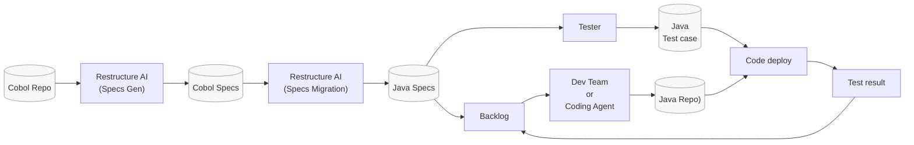
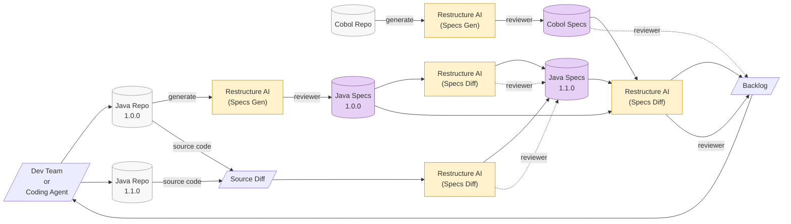

# 1. Dự án phát triển from scratch

### Luồng chính (Cobol → Java)
- **Cobol Repo** → **Restructure AI (Specs Gen)**: Source code Cobol ban đầu được đưa vào AI để tạo đặc tả (Specs Gen).
- **Restructure AI (Specs Gen)** → **Cobol Specs**: AI sinh ra tài liệu đặc tả từ code Cobol.
- **Cobol Specs** → **Restructure AI (Specs Migration)**: AI tiếp tục chuyển đổi đặc tả Cobol sang đặc tả Java (Specs Migration).
- **Restructure AI (Specs Migration)** → **Java Specs**: Kết quả là bộ đặc tả cho hệ thống Java.
- **Java Specs** → **Backlog**: Các Java specs được đưa vào backlog để thực thi.

### Nhánh kiểm thử
- **Java Specs** → **Tester**: Tester sử dụng Java specs để viết test.
- **Tester** → **Java Test case**: Sinh ra các test case cho Java.
- **Java Test case** → **Code deploy**: Test case được deploy cùng code.
- **Code deploy** → **Test result**: Chạy test và thu kết quả.
- **Test result** → **Backlog**: Kết quả test (fail/pass, bug) quay lại backlog để xử lý tiếp.

### Nhánh phát triển
- **Backlog** → **Dev Team / Coding Agent**: Backlog được xử lý bởi dev hoặc AI coding agent.
- **Dev Team / Coding Agent** → **Java Repo**: Code Java được implement và commit vào repo.
- **Java Repo** → **Code deploy**: Code mới được deploy để chạy test.

# 2. Dự án đang migration

