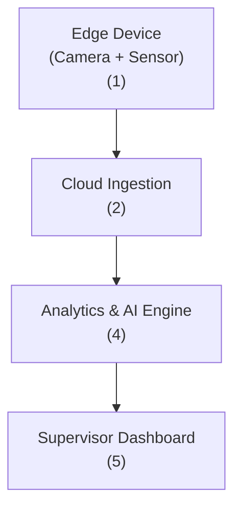

# 1. Problem:
- Ghi lại dữ liệu từ Driver và Vehicle bằng Edge Device được cài đặt trên Vehicle. Cụ thể:
  - Dữ liệu định danh của Driver (chẳng hạn khuôn mặt) để xác định Driver đang điều khiển Vehicle là ai trong ~10000 drivers
  - Dữ liệu vận hành của Vehicle để xác định hành vi và hoàn cảnh của Driver tại từng thời điểm tham gia giao thông
- Dữ liệu được ghi lại từ Edge Device sẽ được gửi lên Cloud Storage để lưu lại.
- Police định kỳ gửi Report thống kê về các vấn đề an toàn trên các cung đường khác nhau
- Supervisor truy xuất dữ liệu để làm báo cáo đánh giá độ an toàn của Driver, Team của Driver, Department của Driver,... từ các nguồn:
  - Dữ liệu của Driver và Vehicle đã được lưu trên Cloud Storage
  - Dữ liệu Report từ phía Police

=> Vấn đề cần giải quyết: Tự động hoá công việc của Supervisor

# 2. Propose Solution:

## Terms:
- **Driver**: Who drive the vehicle
- **Vehicle**: vehicle is recorded
- **Edge Device**: special device is set up on vehicle
- **Police**: who wrote stats reports
- **Supervisor**: who wrote report about safety of Driver
- **Cloud Storage**: place store data from Edge Device

## Solution Architecture:

### (1): Ghi lại dữ liệu hoạt động của Driver và Vehicle 
- Đã được thực hiện
### (2):  
- Đã được thực hiện
### (3): 
- Pre-compute: tính toán trước các feature cần thiết và store lại. Cách làm này giúp giảm latency khi sử dụng feature làm báo cáo, nhưng tăng chi phí lưu trữ.
- On-the-fly compute: Chỉ tính toán khi được yêu cầu. Cách làm này làm tăng latency nhưng giảm chi phí lưu trữ

### (4):
- Sử dụng GenAI phân tích dữ liệu vận hành thu được từ Edge Device và tạo report kèm với Evidence khi Supervisor yêu cầu

### (5):
- Application cho Supervisor sử dụng:
  - Yêu cầu tạo report trên Driver/Team/Department
  - Review report dựa trên evidence mà GenAI cung cấp  

