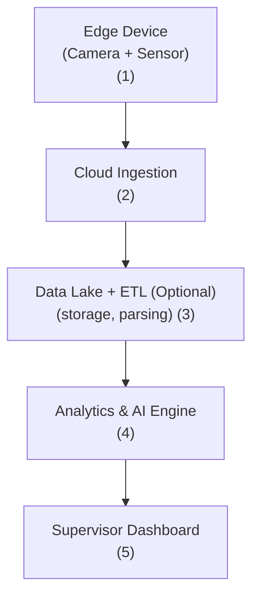

# 🚧 1. Problem

* Data from **Driver** and **Vehicle** is captured using **Edge Devices** installed on vehicles. Specifically:

  * **Driver Identification Data** (e.g. face recognition) is used to determine which driver is operating the vehicle (from \~10,000 drivers).
  * **Vehicle Operational Data** (e.g. speed, braking, GPS, environment) is used to understand the behavior and context of the driver at any given moment.
* All data from Edge Devices is uploaded to **Cloud Storage** for archival and further processing.
* **Police Reports** are submitted periodically, detailing safety risks across different road segments.
* **Supervisors** access this combined data to generate safety evaluations for each **Driver**, **Driver Team**, or **Department**, based on:

  * Driver and Vehicle data from Cloud Storage
  * Reports from Police authorities

> ✅ **Core Problem to Solve**: Automate the report generation and evaluation work traditionally handled by human Supervisors.

---

# 💡 2. Proposed Solution

## Glossary

| Term              | Definition                                              |
| ----------------- | ------------------------------------------------------- |
| **Driver**        | The individual operating the vehicle                    |
| **Vehicle**       | The asset being monitored                               |
| **Edge Device**   | Device installed on the vehicle (camera, sensors, etc.) |
| **Police**        | Source of external safety reports                       |
| **Supervisor**    | Person responsible for evaluating Driver and Teams      |
| **Cloud Storage** | Centralized storage for data collected from vehicles    |

---

## 🧠 Solution Architecture



### (1) Edge Data Capture

* Captures real-time identity and behavior of Driver + Vehicle.
* Already implemented and deployed.

### (2) Cloud Ingestion

* Securely uploads and stores raw data to Cloud Storage.
* Already implemented and functioning.

### (3) Data Preparation Strategies (Optional)

* **Pre-compute**: Pre-process and store important features; reduces latency during report generation but increases storage costs.
* **On-the-fly compute**: Compute features only when required; increases latency but reduces storage cost.

### (4) GenAI-Powered Analytics Engine

* Leverages **ChatGPT API** to analyze vehicle data and generate reports.
* Outputs include summaries, driver scores, and highlighted evidence (video, logs, GPS anomalies).

### (5) Supervisor Dashboard

* A web-based application to:

  * Request reports for Driver / Team / Department
  * Review GenAI-generated reports along with supporting evidence
  * Ask questions in natural language (RAG or ChatGPT API backend)
 
 ```mermaid

flowchart TD
    A["Department Report<br/>(Summary View)"]
    B["Team/Group Report<br/>(Within Department)"]
    C["Driver Report<br/>(Within Group)"]
    D["View Report Details<br/>• Safety Score<br/>• Violations<br/>• Timeline<br/>• Evidence"]

    A -->|Request report for Team| B
    B -->|Request report for Driver| C
    A --> D
    B --> D
    C --> D


``` 

---

# 💰 3. Cost Estimation

### 🛠️ Development Cost (One-time)

| Item             | Estimate                        |
| ---------------- | ------------------------------- |
| FE Engineer | 1 |
| BE Engineer | 1 |
| AI Engineer | 2 |
| Technical Leader | 1 |
| Product Owner | 1 |

---

### 📦 Monthly Operational Cost 

| Category                  | Description                                                         | Rough Estimation                  
| ------------------------- | -------------------------------------------------                   | -------------------------------------------------
| **Storage**               | Store pre-compute features extracted from Edge Device data          | N/A                  
| **Compute**               | CPU/GPU for non-genAI model (Optional), CPU for Web Application                | 1000$                             
| **GenAI (ChatGPT API)**   | Depend on amount of driver, data period, number of generated report | 0.1$/1000 data, 10$/1 generated report
| **Dashboard Maintenance** | Hosting, monitoring                                                 | N/A


---
