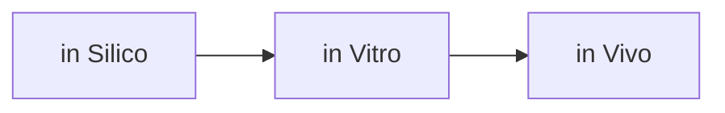

# Overview
- Drug repurposing (tái sử dụng thuốc) là chiến lược tìm chỉ định điều trị mới cho các thuốc đã tồn tại, giúp rút ngắn thời gian, giảm chi phí và tận dụng dữ liệu an toàn sẵn có so với phát triển thuốc hoàn toàn mới. Hiện nay nó đã trở thành hướng nghiên cứu rất “computational”, nơi AI, knowledge graph và các phương pháp in silico đóng vai trò trung tâm trong sàng lọc ứng viên trước khi đưa sang in vitro, in vivo và thử nghiệm lâm sàng.
- Drug repurposing (drug repositioning, reprofiling, tái sử dụng thuốc) là quá trình tìm kiếm các ứng dụng điều trị mới cho các thuốc đã được phê duyệt, đang dùng lâm sàng, hoặc từng được phát triển nhưng bị “xếp xó” vì lý do chiến lược hay hiệu quả không như kỳ vọng ở chỉ định ban đầu. Khác với phát triển thuốc truyền thống phải đi từ khám phá phân tử đến các giai đoạn tiền lâm sàng và lâm sàng đầy đủ, repurposing tận dụng hồ sơ an toàn, dược động – dược lực học và dữ liệu lâm sàng sẵn có để bỏ qua hoặc rút gọn nhiều bước ban đầu.
- Các nghiên cứu cho thấy phát triển một thuốc mới từ đầu thường mất hơn một thập kỷ, chi phí rất lớn và tỷ lệ thất bại cao, đặc biệt ở giai đoạn thử nghiệm lâm sàng. Trong khi đó, repurposing thường rút ngắn thời gian, giảm chi phí, và giảm rủi ro vì hồ sơ an toàn đã được chứng minh ở chỉ định cũ; nội dung này được WHO và nhiều bài tổng quan nhấn mạnh như một “champion underrated” trong hệ sinh thái thuốc.

# Drug timeline

| Mốc thời gian  | Giai đoạn                  | Hoạt động chính                                                                                                                                                         | Kết quả / quyết định                                                      |
| -------------- | -------------------------- | ----------------------------------------------------------------------------------------------------------------------------------------------------------------------- | ------------------------------------------------------------------------- |
| Năm 0–2        | Hiểu bệnh & xác định đích  | Nghiên cứu cơ chế bệnh; chọn “đích” như protein, enzyme, thụ thể, gene hoặc tác nhân gây bệnh                                                                           | Đích phải có bằng chứng rằng can thiệp vào nó có thể tạo lợi ích điều trị |
| Năm 1–4        | Khám phá thuốc (discovery) | Sàng lọc hàng nghìn–triệu phân tử; thiết kế phân tử, mô phỏng, AI/ML; tìm hit rồi tối ưu thành lead                                                                     | Chọn được ứng viên thuốc có hoạt tính và tính chất ban đầu phù hợp        |
| Năm 3–6        | Tối ưu ứng viên            | Tinh chỉnh hiệu lực, độ chọn lọc, hấp thu–phân bố–chuyển hóa–thải trừ (ADME), độc tính, khả năng bào chế và tổng hợp                                                    | Chọn “drug candidate” chính thức để tiến vào tiền lâm sàng                |
| Năm 4–7        | Tiền lâm sàng              | Thử nghiệm in vitro và trên động vật: dược lực học, dược động học, độc tính cấp/mạn, độc tính sinh sản, nguy cơ ung thư…; phát triển quy trình sản xuất và dạng bào chế | Đủ dữ liệu lợi ích–rủi ro để xin phép thử trên người                      |
| Khoảng năm 6–7 | Xin phép thử lâm sàng      | Nộp hồ sơ cho cơ quan quản lý (ví dụ IND ở Mỹ; tại Việt Nam theo yêu cầu của Bộ Y tế/Cục Quản lý Dược) cùng hồ sơ chất lượng, tiền lâm sàng và đề cương thử nghiệm      | Được phép khởi động thử nghiệm trên người                                 |
| Năm 7–8        | Lâm sàng Pha I             | Thường vài chục đến ~100 người, thường là người khỏe mạnh; đánh giá an toàn, dung nạp, PK/PD và khoảng liều                                                             | Chọn liều hợp lý, phát hiện sớm tín hiệu độc tính                         |
| Năm 8–10       | Lâm sàng Pha II            | Vài trăm bệnh nhân mắc bệnh mục tiêu; tìm bằng chứng hiệu quả ban đầu, tối ưu liều/chế độ dùng, tiếp tục đánh giá an toàn                                               | Chứng minh “proof of concept” và chọn liều cho pha III                    |
| Năm 10–13      | Lâm sàng Pha III           | Thử nghiệm lớn, thường hàng trăm đến hàng nghìn bệnh nhân; so sánh với placebo hoặc điều trị chuẩn; xác nhận hiệu quả và hồ sơ an toàn                                  | Bộ dữ liệu then chốt cho đăng ký lưu hành                                 |
| Năm 12–14      | Đăng ký & thẩm định        | Nộp hồ sơ đăng ký thuốc mới: toàn bộ dữ liệu chất lượng–sản xuất, tiền lâm sàng, lâm sàng, nhãn thuốc và kế hoạch quản lý rủi ro                                        | Cơ quan quản lý phê duyệt, yêu cầu bổ sung, hoặc từ chối                  |
| Năm 13+        | Sản xuất & ra thị trường   | Scale-up sản xuất theo GMP, định giá/hoàn trả, phân phối, đào tạo sử dụng an toàn                                                                                       | Thuốc bắt đầu tiếp cận bệnh nhân                                          |
| Sau phê duyệt  | Pha IV / cảnh giác dược    | Theo dõi tác dụng bất lợi hiếm hoặc dài hạn trong thực tế; nghiên cứu hiệu quả thực tế, tương tác thuốc, nhóm bệnh nhân mới                                             | Có thể cập nhật nhãn, giới hạn chỉ định, mở rộng chỉ định hoặc rút thuốc  |

### In Silico (Trên máy tính)
- Là phương pháp dùng phần mềm và mô hình toán học
- Chạy mô phỏng trên máy tính
- Giúp sàng lọc nhanh hàng triệu hợp chất hóa học
- Tiết kiệm chi phí và thời gian ở giai đoạn đầu

### In Vitro (Trong ống nghiệm)
- Là phương pháp nghiên cứu trong môi trường nhân tạo.
- Dùng ống nghiệm, đĩa nuôi cấy hoặc đĩa petri.
- Thử nghiệm trên tế bào, mô hoặc enzyme tách rời khỏi cơ thể.
- Dễ kiểm soát các yếu tố tác động nhưng thiếu bức tranh toàn diện của cơ thể.

### In Vivo (Trên cơ thể sống)
- Là phương pháp thử nghiệm trên toàn bộ sinh vật sống.
- Thường thực hiện trên động vật thí nghiệm hoặc con người.
- Phản ánh chính xác cách cơ thể sống phản ứng với thuốc hoặc tác nhân.
- Tốn kém, mất nhiều thời gian và vướng các vấn đề đạo đức nghiêm ngặt.

| Hướng              | Dựa vào dữ liệu gì?                                             | Ví dụ cách làm                               |
| ------------------ | --------------------------------------------------------------- | -------------------------------------------- |
| Drug-oriented      | Cấu trúc hóa học, target, tác dụng phụ, nhãn phê duyệt          | Off-label use, phenotypic screening, docking |
| Disease-oriented   | Pathway bệnh, genomics, proteomics, protein interaction network | Disease signature, pathway/network analysis  |
| Treatment-oriented | Omics trước/sau điều trị, chiến lược điều trị                   | Phân tích cơ chế và drug resistance          |

# Drug repurposing approaches

- **Blinded/phenotypic**: sàng lọc theo phenotype (ví dụ thay đổi hành vi tế bào, mô, hoặc động vật) mà không cần biết rõ cơ chế, thường dùng high‑throughput screening trên thư viện thuốc hiện có.
- **Target‑based**: yêu cầu thông tin cấu trúc 3D của target, cấu trúc hoá học của thuốc/ligand để thực hiện docking, screening cấu trúc và các phương pháp liên quan.
- **Knowledge‑based**: dựa trên drug–target, cấu trúc, ADR, label regulatory, dữ liệu pathway,… để trích luật, mô hình suy luận hoặc thiết kế scoring cho cặp thuốc–bệnh tiềm năng.
- **Signature‑based**: yêu cầu dữ liệu omics của bệnh và của thuốc (ví dụ profile biểu hiện gen khi dùng thuốc), từ đó so khớp hoặc tối ưu tiêu chuẩn “đảo chiều” profile bệnh.
- **Pathway/network-based**: tận dụng protein interaction network, signaling/metabolic pathway để tìm target/pathway then chốt.
- **Targeted mechanism-based**: dùng dữ liệu omics trước–sau khi điều trị để tìm off-target, cơ chế tác dụng và cơ chế kháng thuốc.

# 
