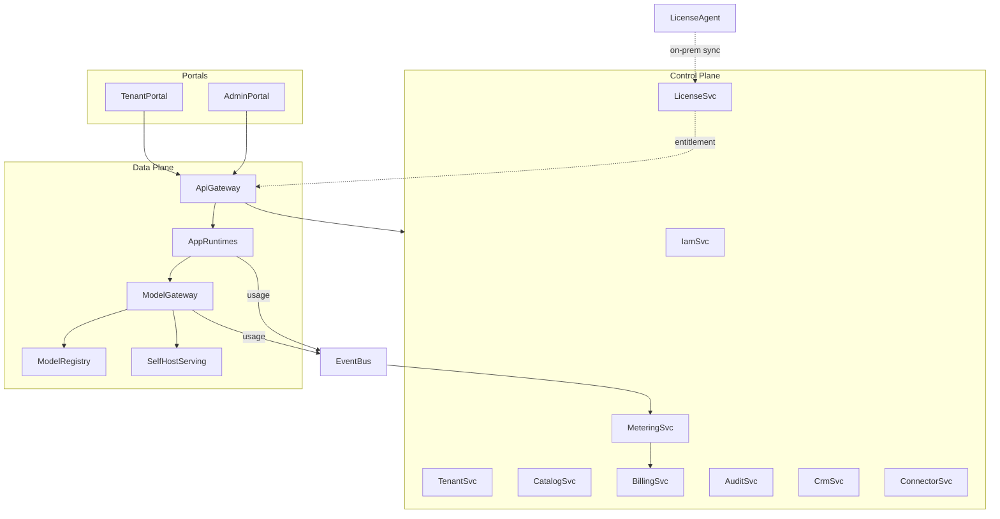

# 1. Context

```mermaid
flowchart LR
  NTAdmin --> NTOmni
  TenantUser --> NTOmni
  EndCustomer --> TenantApp["Tenant App </br> (Phone, Zalo, Web,...)"]
  TenantApp --> |"chat, call, upload"| NTOmni
  NTOmni --> ExternalLLM[External LLM Providers]
  NTOmni --> PaymentGW[Payment Gateways]
  NTOmni --> TenantCRM[Tenant CRM/ERP]
  NTOmni --> Channels["Channels: Zalo, Facebook, SIP, Web"]
```

# 2. Container

```mermaid
flowchart TB
  subgraph portals [Portals]
    AdminPortal
    TenantPortal
  end

  subgraph control [Control Plane]
    IamSvc
    TenantSvc
    CatalogSvc
    LicenseSvc
    MeteringSvc
    BillingSvc
    AuditSvc
    CrmSvc
    ConnectorSvc
  end
  subgraph data [Data Plane]
    ApiGateway
    AppRuntimes
    ModelGateway
    ModelRegistry
    SelfHostServing
  end
  EventBus
  LicenseAgent
  AdminPortal --> ApiGateway
  TenantPortal --> ApiGateway
  ApiGateway --> control
  ApiGateway --> AppRuntimes
  AppRuntimes --> ModelGateway
  ModelGateway --> ModelRegistry
  ModelGateway --> SelfHostServing
  AppRuntimes -->|usage| EventBus
  ModelGateway -->|usage| EventBus
  EventBus --> MeteringSvc
  MeteringSvc --> BillingSvc
  LicenseSvc -.->|entitlement| ApiGateway
  LicenseAgent -.->|on-prem sync| LicenseSvc
```
