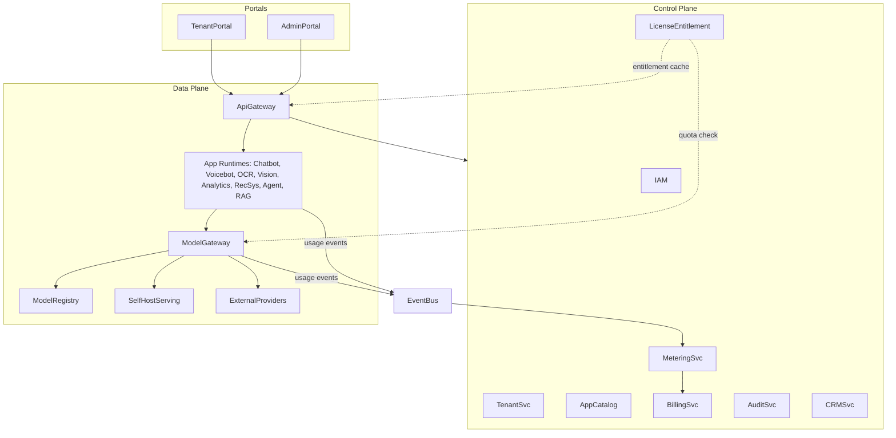

# Kiến trúc tổng thể

```mermaid
flowchart TB
  subgraph portals [Portals]
    AdminPortal
    TenantPortal
  end
  subgraph controlPlane [Control Plane]
    IAM
    TenantSvc
    AppCatalog
    LicenseEntitlement
    BillingSvc
    MeteringSvc
    AuditSvc
    CRMSvc
  end
  subgraph dataPlane [Data Plane]
    ApiGateway
    AppRuntimes["App Runtimes: Chatbot, Voicebot, OCR, Vision, Analytics, RecSys, Agent, RAG"]
    ModelGateway
    ModelRegistry
    SelfHostServing
    ExternalProviders
  end
  EventBus
  AdminPortal --> ApiGateway
  TenantPortal --> ApiGateway
  ApiGateway --> controlPlane
  ApiGateway --> AppRuntimes
  AppRuntimes --> ModelGateway
  ModelGateway --> ModelRegistry
  ModelGateway --> SelfHostServing
  ModelGateway --> ExternalProviders
  AppRuntimes -->|usage events| EventBus
  ModelGateway -->|usage events| EventBus
  EventBus --> MeteringSvc
  MeteringSvc --> BillingSvc
  LicenseEntitlement -.->|entitlement cache| ApiGateway
  LicenseEntitlement -.->|quota check| ModelGateway
```
