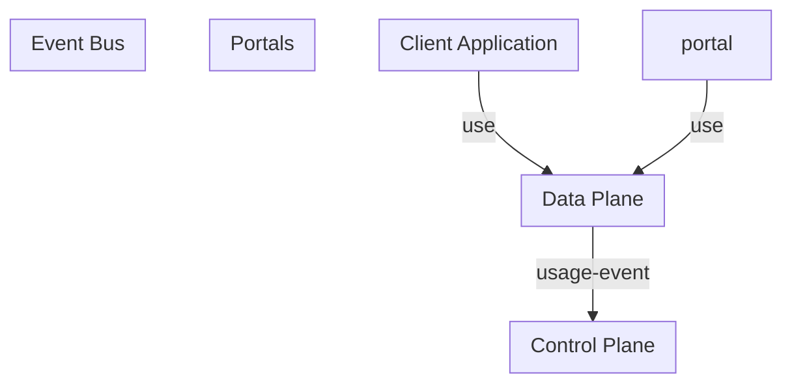

# Kiến trúc tổng thể

```mermaid

flowchart TB
  subgraph clientApp [Client Application]
    
  end

  subgraph portals [Portals]

  end

  subgraph controlPlane [Control Plane]
    
  end

  subgraph eventBus [Event Bus]

  end

  subgraph dataPlane [Data Plane]
    
  end

  clientApp --use--> dataPlane
  portal --use--> dataPlane
  dataPlane --usage-event--> controlPlane
  
  

```
