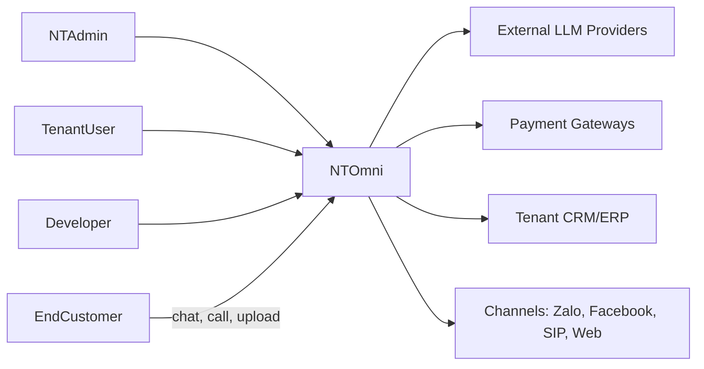

# System Context

```mermaid
flowchart LR
  NTAdmin --> NTOmni
  TenantUser --> NTOmni
  Developer --> NTOmni
  EndCustomer -->|"chat, call, upload"| NTOmni
  NTOmni --> ExternalLLM[External LLM Providers]
  NTOmni --> PaymentGW[Payment Gateways]
  NTOmni --> TenantCRM[Tenant CRM/ERP]
  NTOmni --> Channels["Channels: Zalo, Facebook, SIP, Web"]
```
