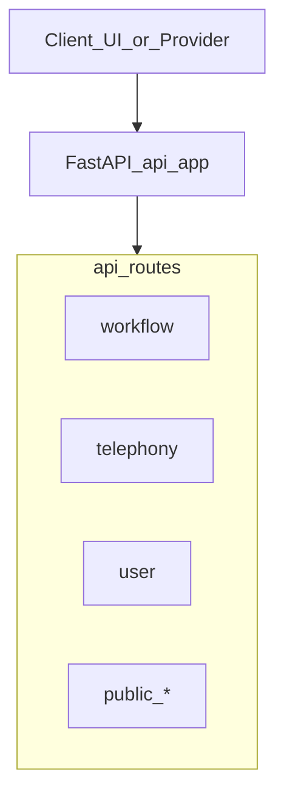

# NuiTruc API Reference

## Tổng quan

| Mục | Giá trị |
|-----|---------|
| Base URL | `http://localhost:8000/api/v1` |
| Swagger UI | `http://localhost:8000/docs` |
| OpenAPI JSON | `http://localhost:8000/api/v1/openapi.json` |
| Tổng endpoint | 110 (HTTP + WebSocket) |
| Ngày cập nhật | 2026-08-09 |

Tất cả route được mount tại prefix `/api/v1` qua [`api/app.py`](api/app.py). Router được tổng hợp trong [`api/routes/main.py`](api/routes/main.py).

**Không bao gồm:** `api/routes/stasis_rtp.py` (không có router), `api/services/smart_turn/app.py` (FastAPI app độc lập).

## Chú giải xác thực

| Ký hiệu | Mô tả |
|---------|-------|
| `get_user` | Bearer token (Stack Auth) — người dùng đã đăng nhập |
| `get_superuser` | Chỉ super-admin |
| `get_user_ws` | Bearer token qua WebSocket (WebRTC authenticated) |
| `API key` | Header `X-API-Key` |
| `public` | Không cần đăng nhập |
| `embed token` | Token embed hợp lệ + kiểm tra domain |
| `provider` | Webhook/callback từ nhà cung cấp telephony (chữ ký/token provider) |
| `*(internal)*` | Ẩn khỏi Swagger (`include_in_schema=False`) |

## Sơ đồ kiến trúc



---

## Danh sách API theo nhóm

### 1. Health

Prefix: — | Số endpoint: 1

| Method | Path | Chức năng | Auth |
|--------|------|-----------|------|
| GET | `/health` | Kiểm tra trạng thái API, phiên bản và backend endpoint | `public` |

---

### 2. Campaign

Prefix: `/campaign` | Số endpoint: 9

| Method | Path | Chức năng | Auth |
|--------|------|-----------|------|
| POST | `/campaign/create` | Tạo campaign outbound mới (CSV hoặc Google Sheet) | `get_user` |
| GET | `/campaign/` | Liệt kê campaign của tổ chức | `get_user` |
| GET | `/campaign/{campaign_id}` | Lấy chi tiết một campaign | `get_user` |
| POST | `/campaign/{campaign_id}/start` | Bắt đầu chạy campaign | `get_user` |
| POST | `/campaign/{campaign_id}/pause` | Tạm dừng campaign đang chạy | `get_user` |
| POST | `/campaign/{campaign_id}/resume` | Tiếp tục campaign đã tạm dừng | `get_user` |
| GET | `/campaign/{campaign_id}/runs` | Lấy danh sách workflow run của campaign | `get_user` |
| GET | `/campaign/{campaign_id}/progress` | Lấy tiến độ và thống kê campaign | `get_user` |
| GET | `/campaign/{campaign_id}/source-download-url` | Lấy URL tải file CSV nguồn (chỉ source_type=csv) | `get_user` |

---

### 3. Credentials

Prefix: `/credentials` | Số endpoint: 5

| Method | Path | Chức năng | Auth |
|--------|------|-----------|------|
| GET | `/credentials/` | Liệt kê webhook credential của tổ chức | `get_user` |
| POST | `/credentials/` | Tạo webhook credential mới (API key, Bearer, Basic Auth, v.v.) | `get_user` |
| GET | `/credentials/{credential_uuid}` | Lấy chi tiết credential theo UUID | `get_user` |
| PUT | `/credentials/{credential_uuid}` | Cập nhật credential | `get_user` |
| DELETE | `/credentials/{credential_uuid}` | Xóa mềm credential | `get_user` |

---

### 4. Integration

Prefix: `/integration` | Số endpoint: 5

Module quản lý **kết nối dịch vụ bên thứ ba** (OAuth) cho tổ chức, thông qua [Nango](https://www.nango.dev/) làm trung gian xác thực. Dữ liệu kết nối được lưu trong bảng `integrations`, scope theo `user.selected_organization_id`.

#### Tổng quan

| Khái niệm | Mô tả |
|-----------|-------|
| **Nango** | Dịch vụ OAuth — xử lý luồng đăng nhập Google/Slack, lưu refresh token, cấp access token |
| **Integration** | Một kết nối đã authorize giữa tổ chức và provider (ví dụ: Google Sheet, Slack) |
| **`integration_id`** | ID nội bộ (integer, primary key trong DB) — dùng trong URL API |
| **`integration_id` (field response)** | Nango Connection ID (string UUID) — dùng khi gọi Nango API |
| **`connection_details`** | JSON metadata từ Nango (channel Slack, file Google Sheet đã chọn, v.v.) |

#### Provider hỗ trợ

Danh sách provider được phép kết nối cấu hình qua biến môi trường `NANGO_ALLOWED_INTEGRATIONS` (mặc định: `slack`, phân tách bằng dấu phẩy).

| Provider | Giá trị `provider` | Mục đích trong hệ thống |
|----------|-------------------|-------------------------|
| Slack | `slack` | Thông báo kết quả cuộc gọi (channel lấy từ `connection_details`) |
| Google Sheet | `google-sheet` | Nguồn dữ liệu campaign outbound (đọc số điện thoại + context) |
| Google Mail | `google-mail` | Tích hợp Gmail (UI có trang search riêng) |

#### Luồng kết nối integration mới

```
UI (Create Integration)
  → POST /integration/session          # Lấy session_token từ Nango
  → Nango Connect UI (frontend)        # User authorize OAuth
  → Nango gọi POST /integration/webhook  # Backend lưu integration vào DB
  → UI refresh danh sách
```

1. Frontend gọi `POST /integration/session` để lấy `session_token`.
2. Mở Nango Connect UI (`@nangohq/frontend`) với token đó.
3. Sau khi user authorize, Nango gửi webhook tới `POST /integration/webhook`.
4. Backend verify chữ ký `X-Nango-Signature`, tạo bản ghi `integrations` trong DB.

#### Response schema chung (`IntegrationResponse`)

| Field | Kiểu | Mô tả |
|-------|------|-------|
| `id` | int | ID nội bộ |
| `integration_id` | string | Nango Connection ID |
| `organisation_id` | int | ID tổ chức sở hữu |
| `created_by` | int \| null | User tạo kết nối |
| `provider` | string | Tên provider (`slack`, `google-sheet`, …) |
| `is_active` | bool | Trạng thái active |
| `created_at` | string (ISO) | Thời điểm tạo |
| `action` | string | Hành động trigger (`All Calls` / `Qualified Calls`) |
| `provider_data` | object | Dữ liệu provider-specific (xem bảng dưới) |

**`provider_data` theo provider:**

| Provider | Field trong `provider_data` |
|----------|----------------------------|
| `google-sheet` | `selected_files` — danh sách file đã chọn |
| `slack` | `channel` — tên channel từ `incoming_webhook.channel` |

#### Bảng endpoint

| Method | Path | Chức năng | Auth |
|--------|------|-----------|------|
| GET | `/integration/` | Liệt kê integration của tổ chức | `get_user` |
| POST | `/integration/session` | Tạo Nango session để kết nối integration mới | `get_user` |
| PUT | `/integration/{integration_id}` | Cập nhật file đã chọn (chỉ Google Sheet) | `get_user` |
| GET | `/integration/{integration_id}/access-token` | Lấy access token mới nhất từ Nango | `get_user` |
| POST | `/integration/webhook` | Nhận webhook từ Nango khi kết nối OAuth thành công *(internal)* | `provider` |

---

#### `GET /integration/`

Liệt kê tất cả integration của tổ chức đang chọn.

**Auth:** `get_user` (Bearer token)

**Response:** `IntegrationResponse[]`

**Lỗi thường gặp:**

| Status | `detail` | Nguyên nhân |
|--------|----------|-------------|
| 400 | `No organization selected for the user` | User chưa có `selected_organization_id` |
| 401 | `Unauthorized` | Thiếu hoặc token không hợp lệ |

---

#### `POST /integration/session`

Tạo Nango Connect session — bước đầu tiên khi user nhấn "Create Integration" trên UI.

**Auth:** `get_user`

**Request body:** Không có

**Response:**

```json
{
  "session_token": "<nango_connect_token>",
  "expires_at": "2026-08-09T12:00:00.000Z"
}
```

**Cách hoạt động:** Backend gọi Nango API `POST https://api.nango.dev/connect/sessions` với payload:

- `end_user.id` = `user.id`
- `organization.id` = `selected_organization_id`
- `allowed_integrations` = giá trị từ `NANGO_ALLOWED_INTEGRATIONS`

**Lỗi thường gặp:**

| Status | Nguyên nhân |
|--------|-------------|
| 400 | Chưa chọn tổ chức |
| 500 | `NANGO_API_KEY` chưa cấu hình hoặc Nango API lỗi |

---

#### `PUT /integration/{integration_id}`

Cập nhật danh sách file Google Sheet đã chọn cho integration.

**Auth:** `get_user`

**Path param:** `integration_id` — ID nội bộ (integer), **không phải** Nango Connection ID

**Request body:**

```json
{
  "selected_files": [
    { "id": "...", "name": "...", "url": "..." }
  ]
}
```

**Giới hạn:** Chỉ hỗ trợ `provider === "google-sheet"`. Các provider khác trả `400`.

**Response:** `IntegrationResponse` đã cập nhật

**Lỗi thường gặp:**

| Status | `detail` |
|--------|----------|
| 404 | `Integration not found` |
| 400 | `This endpoint only supports updating Google Sheet integrations` |
| 500 | `Failed to update integration` |

---

#### `GET /integration/{integration_id}/access-token`

Lấy OAuth access token mới nhất từ Nango — dùng khi frontend cần gọi API provider trực tiếp (ví dụ: Google Picker để chọn spreadsheet).

**Auth:** `get_user`

**Path param:** `integration_id` — ID nội bộ (integer)

**Response:**

```json
{
  "access_token": "ya29....",
  "refresh_token": "1//....",
  "expires_at": "2026-08-09T13:00:00.000Z",
  "connection_id": "<nango_connection_id>"
}
```

**Lưu ý:** Token được fetch realtime từ Nango (`GET /connection/{connection_id}`), không lưu trong DB.

**Lỗi thường gặp:**

| Status | Nguyên nhân |
|--------|-------------|
| 404 | Integration không thuộc tổ chức |
| 500 | Nango API lỗi hoặc connection đã revoke |

---

#### `POST /integration/webhook` *(internal)*

Endpoint nhận webhook từ Nango sau khi user hoàn tất OAuth. **Ẩn khỏi Swagger** (`include_in_schema=False`).

**Auth:** Chữ ký `X-Nango-Signature` (SHA256 của `NANGO_API_KEY + raw_body`)

**Request body (từ Nango):**

| Field | Mô tả |
|-------|-------|
| `type` | Loại sự kiện (ví dụ: `auth`) |
| `connectionId` | Nango Connection ID — lưu vào `integration_id` |
| `provider` | Tên provider (`slack`, `google-sheet`, …) |
| `endUser.endUserId` | User ID nội bộ |
| `endUser.organizationId` | Organization ID nội bộ |
| `success` | OAuth thành công hay không |

**Response:**

```json
{
  "status": "success",
  "message": "Integration created successfully with ID: 42"
}
```

**Hành vi:** Khi `type === "auth"`, backend fetch thêm `connection_details` từ Nango (đặc biệt cho Slack) rồi gọi `db_client.create_integration(...)`.

**Lỗi thường gặp:**

| Status | Nguyên nhân |
|--------|-------------|
| 401 | Chữ ký webhook không hợp lệ |
| 400 | JSON sai format hoặc thiếu `endUser` |

---

#### Use case trong hệ thống

| Tính năng | Provider dùng | Endpoint liên quan |
|-----------|--------------|-------------------|
| **Campaign outbound (Google Sheet)** | `google-sheet` | `GET /integration/`, `GET .../access-token`, `PUT .../` |
| **Thông báo Slack** | `slack` | Webhook tạo integration + `connection_details.channel` |
| **Gmail search** | `google-mail` | `GET .../access-token` (qua UI `/integrations/{id}/gmail`) |

Khi tạo campaign với `source_type: "google-sheet"`, hệ thống:
1. Tìm integration `google-sheet` active của tổ chức
2. Lấy access token qua Nango
3. Đọc dữ liệu từ Google Sheets API (`GoogleSheetsSyncService`)

#### Biến môi trường

| Biến | Mô tả |
|------|-------|
| `NANGO_API_KEY` | Secret key để gọi Nango API và verify webhook |
| `NANGO_ALLOWED_INTEGRATIONS` | Danh sách provider cho phép (mặc định: `slack`) |

**Source code:** [`api/routes/integration.py`](api/routes/integration.py), [`api/services/integrations/nango.py`](api/services/integrations/nango.py)

---

### 5. Knowledge Base

Prefix: `/knowledge-base` | Số endpoint: 6

| Method | Path | Chức năng | Auth |
|--------|------|-----------|------|
| POST | `/knowledge-base/upload-url` | Lấy presigned URL để upload tài liệu | `get_user` |
| POST | `/knowledge-base/process-document` | Tạo bản ghi và kích hoạt xử lý/chunking tài liệu | `get_user` |
| GET | `/knowledge-base/documents` | Liệt kê tài liệu của tổ chức | `get_user` |
| GET | `/knowledge-base/documents/{document_uuid}` | Lấy chi tiết một tài liệu | `get_user` |
| DELETE | `/knowledge-base/documents/{document_uuid}` | Xóa mềm tài liệu và các chunk | `get_user` |
| POST | `/knowledge-base/search` | Tìm kiếm chunk tương tự (vector search RAG) | `get_user` |

---

### 6. LoopTalk

Prefix: `/looptalk` | Số endpoint: 10

| Method | Path | Chức năng | Auth |
|--------|------|-----------|------|
| POST | `/looptalk/test-sessions` | Tạo phiên test LoopTalk (actor vs adversary workflow) | `get_user` |
| GET | `/looptalk/test-sessions` | Liệt kê phiên test | `get_user` |
| GET | `/looptalk/test-sessions/{test_session_id}` | Lấy chi tiết phiên test | `get_user` |
| POST | `/looptalk/test-sessions/{test_session_id}/start` | Bắt đầu chạy phiên test | `get_user` |
| POST | `/looptalk/test-sessions/{test_session_id}/stop` | Dừng phiên test đang chạy | `get_user` |
| GET | `/looptalk/test-sessions/{test_session_id}/conversation` | Lấy thông tin hội thoại của phiên test | `get_user` |
| POST | `/looptalk/load-tests` | Tạo và chạy load test (nhiều phiên song song) | `get_user` |
| GET | `/looptalk/load-tests/{load_test_group_id}/stats` | Lấy thống kê nhóm load test | `get_user` |
| GET | `/looptalk/active-tests` | Lấy danh sách phiên test đang hoạt động | `get_user` |
| WS | `/looptalk/test-sessions/{test_session_id}/audio-stream` | Stream audio realtime từ phiên test *(TODO: chưa implement)* | `public` |

---

### 7. Organization

Prefix: `/organizations` | Số endpoint: 3

| Method | Path | Chức năng | Auth |
|--------|------|-----------|------|
| GET | `/organizations/telephony-config` | Lấy cấu hình telephony (ẩn trường nhạy cảm) | `get_user` |
| POST | `/organizations/telephony-config` | Lưu cấu hình telephony (Twilio/Vonage/Vobiz/Cloudonix) | `get_user` |
| GET | `/organizations/campaign-limits` | Lấy giới hạn campaign của tổ chức | `get_user` |

---

### 8. Organization Usage

Prefix: `/organizations/usage` | Số endpoint: 3

| Method | Path | Chức năng | Auth |
|--------|------|-----------|------|
| GET | `/organizations/usage/current-period` | Lấy mức sử dụng kỳ billing hiện tại | `get_user` |
| GET | `/organizations/usage/runs` | Lấy lịch sử workflow run kèm usage (phân trang, lọc) | `get_user` |
| GET | `/organizations/usage/daily-breakdown` | Lấy breakdown usage theo ngày (cần có pricing) | `get_user` |

---

### 9. Reports

Prefix: `/organizations/reports` | Số endpoint: 3

| Method | Path | Chức năng | Auth |
|--------|------|-----------|------|
| GET | `/organizations/reports/daily` | Báo cáo ngày (metrics, disposition, duration) | `get_user` |
| GET | `/organizations/reports/workflows` | Lấy danh sách workflow cho dropdown báo cáo | `get_user` |
| GET | `/organizations/reports/daily/runs` | Chi tiết workflow run trong ngày (dùng export CSV) | `get_user` |

---

### 10. S3 / Storage

Prefix: `/s3` | Số endpoint: 3

| Method | Path | Chức năng | Auth |
|--------|------|-----------|------|
| GET | `/s3/signed-url` | Tạo signed URL tải recording/transcript | `get_user` |
| GET | `/s3/file-metadata` | Lấy metadata file (debug) | `get_user` |
| POST | `/s3/presigned-upload-url` | Tạo presigned URL upload CSV trực tiếp lên storage | `get_user` |

---

### 11. Service Keys

Prefix: `/user/service-keys` | Số endpoint: 4

| Method | Path | Chức năng | Auth |
|--------|------|-----------|------|
| GET | `/user/service-keys` | Liệt kê service key của tổ chức | `get_user` |
| POST | `/user/service-keys` | Tạo service key mới (MPS) | `get_user` |
| DELETE | `/user/service-keys/{service_key_id}` | Lưu trữ (archive) service key | `get_user` |
| PUT | `/user/service-keys/{service_key_id}/reactivate` | Kích hoạt lại service key *(không hỗ trợ — trả 501)* | `get_user` |

---

### 12. User

Prefix: `/user` | Số endpoint: 10

| Method | Path | Chức năng | Auth |
|--------|------|-----------|------|
| GET | `/user/configurations/defaults` | Lấy schema cấu hình mặc định (LLM, TTS, STT, embeddings) | `public` |
| GET | `/user/auth/user` | Lấy thông tin user đang đăng nhập | `get_user` |
| GET | `/user/configurations/user` | Lấy cấu hình user (đã mask API key) | `get_user` |
| PUT | `/user/configurations/user` | Cập nhật cấu hình user | `get_user` |
| GET | `/user/configurations/user/validate` | Kiểm tra tính hợp lệ API key cấu hình | `get_user` |
| GET | `/user/api-keys` | Liệt kê API key của tổ chức | `get_user` |
| POST | `/user/api-keys` | Tạo API key mới | `get_user` |
| DELETE | `/user/api-keys/{api_key_id}` | Lưu trữ API key | `get_user` |
| PUT | `/user/api-keys/{api_key_id}/reactivate` | Kích hoạt lại API key đã archive | `get_user` |
| GET | `/user/configurations/voices/{provider}` | Lấy danh sách giọng TTS theo provider | `get_user` |

---

### 13. Tools

Prefix: `/tools` | Số endpoint: 6

| Method | Path | Chức năng | Auth |
|--------|------|-----------|------|
| GET | `/tools/` | Liệt kê tool của tổ chức (lọc status, category) | `get_user` |
| POST | `/tools/` | Tạo tool mới (HTTP API, end_call, v.v.) | `get_user` |
| GET | `/tools/{tool_uuid}` | Lấy chi tiết tool theo UUID | `get_user` |
| PUT | `/tools/{tool_uuid}` | Cập nhật tool | `get_user` |
| DELETE | `/tools/{tool_uuid}` | Lưu trữ (archive) tool | `get_user` |
| POST | `/tools/{tool_uuid}/unarchive` | Khôi phục tool đã archive | `get_user` |

---

### 14. Workflow

Prefix: `/workflow` | Số endpoint: 14

| Method | Path | Chức năng | Auth |
|--------|------|-----------|------|
| POST | `/workflow/{workflow_id}/validate` | Kiểm tra tính hợp lệ workflow (node, edge) | `get_user` |
| POST | `/workflow/create/definition` | Tạo workflow từ định nghĩa ReactFlow | `get_user` |
| POST | `/workflow/create/template` | Tạo workflow từ mô tả ngôn ngữ tự nhiên (MPS API) | `get_user` |
| GET | `/workflow/count` | Đếm số workflow (active/archived) | `get_user` |
| GET | `/workflow/fetch` | Liệt kê workflow (response nhẹ) | `get_user` |
| GET | `/workflow/fetch/{workflow_id}` | Lấy chi tiết đầy đủ một workflow | `get_user` |
| GET | `/workflow/summary` | Lấy danh sách tối giản (id, name) | `get_user` |
| PUT | `/workflow/{workflow_id}/status` | Cập nhật trạng thái (active/archived) | `get_user` |
| PUT | `/workflow/{workflow_id}` | Cập nhật workflow (tên, definition, config) | `get_user` |
| POST | `/workflow/{workflow_id}/runs` | Tạo workflow run mới (chat/voice) | `get_user` |
| GET | `/workflow/{workflow_id}/runs` | Liệt kê workflow run (phân trang, lọc) | `get_user` |
| GET | `/workflow/{workflow_id}/runs/{run_id}` | Lấy chi tiết một workflow run | `get_user` |
| GET | `/workflow/templates` | Liệt kê template workflow có sẵn | `public` |
| POST | `/workflow/templates/duplicate` | Nhân bản template thành workflow mới | `get_user` |

---

### 15. Workflow Embed

Prefix: `/workflow/{workflow_id}/embed-token` | Số endpoint: 3

Module **quản trị embed token** — cho phép nhúng voice widget của workflow lên website bên ngoài qua thẻ `<script>`. Đây là API **dành cho admin** (đã đăng nhập); runtime phía visitor dùng nhóm **[20. Public Embed](#20-public-embed)** và WebSocket **[17. WebRTC Signaling](#17-webrtc-signaling)** (`/ws/public/signaling/...`).

#### Tổng quan

| Khái niệm | Mô tả |
|-----------|-------|
| **Embed token** | Chuỗi bí mật (`emb_...`) gắn với một workflow — nhúng vào URL script widget |
| **Embed session** | Phiên tạm thời (`emb_session_...`) tạo khi visitor bắt đầu cuộc gọi — dùng cho WebRTC signaling |
| **Widget** | `dograh-widget.js` — script JS load từ UI app, gọi API public để khởi tạo cuộc gọi |
| **Giới hạn** | Mỗi workflow chỉ có **một** embed token active tại một thời điểm |

#### Luồng end-to-end

```
[Admin — UI Workflow Editor]
  POST /workflow/{id}/embed-token     # Tạo/cấu hình token, nhận embed_script
  → Copy <script> vào website khách

[Visitor — Website nhúng widget]
  Load dograh-widget.js?token=emb_...&apiEndpoint=...
    → GET  /public/embed/config/{token}       # Lấy theme, position, button (không tạo run)
    → POST /public/embed/init                   # Tạo workflow_run + session_token
    → WS   /ws/public/signaling/{session_token} # WebRTC voice call (SmallWebRTC)
```

Mỗi lần visitor bắt đầu cuộc gọi:
1. `POST /public/embed/init` tạo `workflow_run` (mode `smallwebrtc`)
2. Tạo `embed_session` (hết hạn sau **1 giờ**)
3. Tăng `usage_count` trên embed token
4. Widget kết nối WebSocket public signaling với `session_token`

#### Data model

**`embed_tokens`** (`EmbedTokenModel`):

| Field | Kiểu | Mô tả |
|-------|------|-------|
| `id` | int | ID nội bộ |
| `token` | string | Token công khai (`emb_{urlsafe}`) — dùng trong script URL |
| `workflow_id` | int | Workflow được nhúng |
| `organization_id` | int | Tổ chức sở hữu |
| `allowed_domains` | string[] \| null | Whitelist domain (`null` = cho phép tất cả) |
| `settings` | object \| null | Cấu hình widget (theme, position, button, v.v.) |
| `is_active` | bool | Token còn hoạt động hay đã deactivate |
| `usage_limit` | int \| null | Giới hạn số lần init (null = không giới hạn) |
| `usage_count` | int | Số lần đã init thành công |
| `expires_at` | datetime \| null | Thời điểm hết hạn token |
| `created_by` | int | User tạo token |

**`embed_sessions`** (`EmbedSessionModel`) — tạo bởi Public Embed, không qua API này:

| Field | Mô tả |
|-------|-------|
| `session_token` | `emb_session_{urlsafe}` — dùng cho WebRTC WS |
| `workflow_run_id` | Run được tạo khi visitor bắt đầu gọi |
| `expires_at` | Hết hạn sau 1 giờ |

#### `settings` — cấu hình widget

Object JSON tùy chỉnh giao diện widget. UI (`EmbedDialog`) gửi các field sau:

| Field | Kiểu | Mặc định | Mô tả |
|-------|------|----------|-------|
| `embedMode` | string | `"floating"` | `"floating"` (nút góc màn hình) hoặc `"inline"` (nhúng trong div) |
| `position` | string | `"bottom-right"` | Vị trí nút: `bottom-right`, `bottom-left`, `top-right`, `top-left` |
| `buttonText` | string | `"Start Voice Call"` | Text trên nút floating |
| `buttonColor` | string | `"#3B82F6"` | Màu nút (hex) |
| `size` | string | `"medium"` | Kích thước widget |
| `autoStart` | bool | `false` | Tự động bắt đầu cuộc gọi khi load |
| `containerId` | string | `"dograh-inline-container"` | ID div chứa widget (chế độ inline) |
| `theme` | string | `"light"` | Theme giao diện |

#### `allowed_domains` — whitelist domain

Kiểm tra qua header `Origin` hoặc `Referer` khi gọi Public Embed API.

| Pattern | Ví dụ | Khớp |
|---------|-------|------|
| `null` / `[]` | — | Mọi domain |
| `*` | `*` | Mọi domain |
| Exact domain | `example.com` | `example.com`, `www.example.com` (tự normalize www) |
| Wildcard subdomain | `*.example.com` | `app.example.com`, `example.com` |

#### Bảng endpoint

| Method | Path | Chức năng | Auth |
|--------|------|-----------|------|
| POST | `/workflow/{workflow_id}/embed-token` | Tạo hoặc cập nhật embed token | `get_user` |
| GET | `/workflow/{workflow_id}/embed-token` | Lấy embed token active (kèm embed script) | `get_user` |
| DELETE | `/workflow/{workflow_id}/embed-token` | Vô hiệu hóa embed token | `get_user` |

---

#### `POST /workflow/{workflow_id}/embed-token`

Tạo token mới hoặc **cập nhật token đã tồn tại** (upsert). Nếu workflow đã có token (kể cả inactive), endpoint sẽ update token cũ và reactivate (`is_active=True`).

**Auth:** `get_user`

**Path param:** `workflow_id` — workflow thuộc tổ chức đang chọn

**Request body (`EmbedTokenRequest`):**

```json
{
  "allowed_domains": ["example.com", "*.app.example.com"],
  "settings": {
    "embedMode": "floating",
    "position": "bottom-right",
    "buttonText": "Start Voice Call",
    "buttonColor": "#3B82F6",
    "size": "medium",
    "autoStart": false
  },
  "usage_limit": 1000,
  "expires_in_days": 30
}
```

| Field | Bắt buộc | Mô tả |
|-------|----------|-------|
| `allowed_domains` | Không | `null` = cho phép mọi domain |
| `settings` | Không | Cấu hình widget (xem bảng trên) |
| `usage_limit` | Không | Giới hạn số lần init; `null` = không giới hạn |
| `expires_in_days` | Không | Số ngày hết hạn; mặc định `30`; `null` = không hết hạn |

**Response (`EmbedTokenResponse`):**

```json
{
  "id": 1,
  "token": "emb_xxxxxxxx",
  "allowed_domains": ["example.com"],
  "settings": { "embedMode": "floating", "position": "bottom-right" },
  "is_active": true,
  "usage_count": 0,
  "usage_limit": 1000,
  "expires_at": "2026-09-08T00:00:00Z",
  "created_at": "2026-08-09T00:00:00Z",
  "embed_script": "<!-- Dograh Voice Widget -->\n<script>...</script>"
}
```

**`embed_script`** — snippet HTML sẵn dùng, load widget từ UI app:

```html
<script src="{UI_APP_URL}/embed/dograh-widget.js?token={token}&environment={ENV}&apiEndpoint={BACKEND_API_ENDPOINT}"></script>
```

Thay đổi `settings` sau khi nhúng **không cần** cập nhật script — widget fetch config realtime qua `GET /public/embed/config/{token}`.

**Lỗi thường gặp:**

| Status | `detail` |
|--------|----------|
| 404 | `Workflow with id {id} not found` |
| 401 | Token không hợp lệ |

---

#### `GET /workflow/{workflow_id}/embed-token`

Lấy embed token **đang active** của workflow. Trả `null` (HTTP 200, body `null`) nếu chưa có token active.

**Auth:** `get_user`

**Response:** `EmbedTokenResponse | null` — kèm `embed_script` nếu có token

**Dùng khi:** UI mở dialog "Deploy Workflow" để hiển thị cấu hình và embed code hiện tại.

---

#### `DELETE /workflow/{workflow_id}/embed-token`

Vô hiệu hóa (deactivate) embed token — widget trên website sẽ không init được (`403 Embed token is inactive`).

**Auth:** `get_user`

**Response:**

```json
{ "message": "Embed token deactivated successfully" }
```

**Lỗi thường gặp:**

| Status | `detail` |
|--------|----------|
| 404 | `Workflow with id {id} not found` hoặc `No active embed token found for this workflow` |
| 500 | `Failed to deactivate embed token` |

**Lưu ý:** Deactivate **không xóa** bản ghi — `POST` lại sẽ reactivate token cũ thay vì tạo token mới.

---

#### API liên quan (runtime — không cần auth user)

Sau khi admin tạo token, visitor website dùng các endpoint sau (chi tiết tại mục 20):

| Method | Path | Khi nào gọi |
|--------|------|-------------|
| GET | `/public/embed/config/{token}` | Widget load — lấy giao diện |
| POST | `/public/embed/init` | Visitor nhấn "Start Call" — tạo session |
| WS | `/ws/public/signaling/{session_token}` | Thiết lập WebRTC audio |

**Kiểm tra khi init (Public Embed):**

- Token tồn tại, `is_active`, chưa hết `expires_at`
- `usage_count < usage_limit` (nếu có limit)
- Domain nằm trong `allowed_domains`

---

#### Biến môi trường ảnh hưởng embed script

| Biến | Dùng trong |
|------|-----------|
| `UI_APP_URL` | URL host file `dograh-widget.js` |
| `BACKEND_API_ENDPOINT` | Param `apiEndpoint` trong script URL |
| `ENVIRONMENT` | Param `environment` (local/production) |

#### Source code

| File | Vai trò |
|------|---------|
| [`api/routes/workflow_embed.py`](api/routes/workflow_embed.py) | 3 endpoint quản trị token |
| [`api/routes/public_embed.py`](api/routes/public_embed.py) | Init session + config (visitor) |
| [`api/routes/webrtc_signaling.py`](api/routes/webrtc_signaling.py) | WebRTC public signaling |
| [`api/db/embed_token_client.py`](api/db/embed_token_client.py) | CRUD token & session |
| [`ui/public/embed/dograh-widget.js`](ui/public/embed/dograh-widget.js) | Widget runtime |
| [`ui/src/app/workflow/.../EmbedDialog.tsx`](ui/src/app/workflow/[workflowId]/components/EmbedDialog.tsx) | UI cấu hình embed |

---

### 16. Telephony

Prefix: `/telephony` | Số endpoint: 14

| Method | Path | Chức năng | Auth |
|--------|------|-----------|------|
| POST | `/telephony/initiate-call` | Khởi tạo cuộc gọi outbound qua provider đã cấu hình | `get_user` |
| POST | `/telephony/twiml` | Webhook Twilio trả TwiML kết nối audio *(internal)* | `provider` |
| GET | `/telephony/ncco` | Webhook Vonage trả NCCO JSON *(internal)* | `provider` |
| WS | `/telephony/ws/{workflow_id}/{user_id}/{workflow_run_id}` | WebSocket stream audio cuộc gọi telephony | `provider` |
| POST | `/telephony/twilio/status-callback/{workflow_run_id}` | Callback trạng thái cuộc gọi Twilio | `provider` |
| POST | `/telephony/vonage/events/{workflow_run_id}` | Sự kiện cuộc gọi Vonage | `provider` |
| POST | `/telephony/vobiz-xml` | Webhook Vobiz trả XML kết nối audio *(internal)* | `provider` |
| POST | `/telephony/vobiz/hangup-callback/{workflow_run_id}` | Callback kết thúc cuộc gọi Vobiz | `provider` |
| POST | `/telephony/vobiz/ring-callback/{workflow_run_id}` | Callback đổ chuông Vobiz | `provider` |
| POST | `/telephony/cloudonix/status-callback/{workflow_run_id}` | Callback trạng thái cuộc gọi Cloudonix | `provider` |
| POST | `/telephony/vobiz/hangup-callback/workflow/{workflow_id}` | Callback hangup Vobiz theo workflow | `provider` |
| POST | `/telephony/inbound/{workflow_id}` | Webhook inbound từ Twilio/Vonage/Vobiz/Cloudonix | `provider` |
| POST | `/telephony/inbound/fallback` | Fallback khi không xử lý được cuộc gọi inbound | `provider` |
| POST | `/telephony/cloudonix/cdr` | Webhook CDR (Call Detail Record) Cloudonix | `provider` |

---

### 17. WebRTC Signaling

Prefix: `/ws` | Số endpoint: 2

| Method | Path | Chức năng | Auth |
|--------|------|-----------|------|
| WS | `/ws/signaling/{workflow_id}/{workflow_run_id}` | WebRTC signaling có xác thực (ICE trickling) | `get_user_ws` |
| WS | `/ws/public/signaling/{session_token}` | WebRTC signaling cho widget embed (session token) | `embed token` |

---

### 18. Public Agent

Prefix: `/public/agent` | Số endpoint: 1

| Method | Path | Chức năng | Auth |
|--------|------|-----------|------|
| POST | `/public/agent/{uuid}` | Kích hoạt cuộc gọi outbound qua API trigger | `API key` |

---

### 19. Public Download

Prefix: `/public/download` | Số endpoint: 1

| Method | Path | Chức năng | Auth |
|--------|------|-----------|------|
| GET | `/public/download/workflow/{token}/{artifact_type}` | Tải recording hoặc transcript qua public token | `public` |

`artifact_type`: `recording` | `transcript`

---

### 20. Public Embed

Prefix: `/public/embed` | Số endpoint: 4

| Method | Path | Chức năng | Auth |
|--------|------|-----------|------|
| POST | `/public/embed/init` | Khởi tạo phiên embed (tạo workflow run + session token) | `embed token` |
| GET | `/public/embed/config/{token}` | Lấy cấu hình widget mà không tạo phiên | `embed token` |
| OPTIONS | `/public/embed/init` | CORS preflight cho endpoint init | `public` |
| OPTIONS | `/public/embed/config/{token}` | CORS preflight cho endpoint config | `public` |

---

### 21. Superuser

Prefix: `/superuser` | Số endpoint: 3

| Method | Path | Chức năng | Auth |
|--------|------|-----------|------|
| POST | `/superuser/impersonate` | Mạo danh user (tạo session Stack Auth) | `get_superuser` |
| GET | `/superuser/workflow-runs` | Liệt kê tất cả workflow run (phân trang, lọc) | `get_superuser` |
| POST | `/superuser/workflow-runs/{run_id}/comment` | Thêm/cập nhật comment admin cho workflow run | `get_superuser` |

---

## Ghi chú bổ sung

### Endpoint ẩn khỏi Swagger

Các endpoint sau vẫn hoạt động nhưng không hiển thị trong Swagger UI:

- `POST /integration/webhook`
- `POST /telephony/twiml`
- `GET /telephony/ncco`
- `POST /telephony/vobiz-xml`

### WebSocket endpoints (4)

| Path đầy đủ | Mục đích |
|-------------|----------|
| `/api/v1/telephony/ws/{workflow_id}/{user_id}/{workflow_run_id}` | Audio stream cuộc gọi telephony |
| `/api/v1/ws/signaling/{workflow_id}/{workflow_run_id}` | WebRTC signaling (authenticated) |
| `/api/v1/ws/public/signaling/{session_token}` | WebRTC signaling (embed public) |
| `/api/v1/looptalk/test-sessions/{id}/audio-stream` | Audio stream LoopTalk *(chưa implement)* |

### Telephony — luồng chính

1. **Outbound:** `POST /telephony/initiate-call` hoặc `POST /public/agent/{uuid}` → provider gọi webhook (`twiml`/`ncco`/`vobiz-xml`) → client kết nối WebSocket `/telephony/ws/...`
2. **Inbound:** Provider gọi `POST /telephony/inbound/{workflow_id}` → tạo workflow run → trả response kết nối WebSocket
3. **Callbacks:** Provider gửi status/event tới các endpoint callback tương ứng (Twilio, Vonage, Vobiz, Cloudonix)
