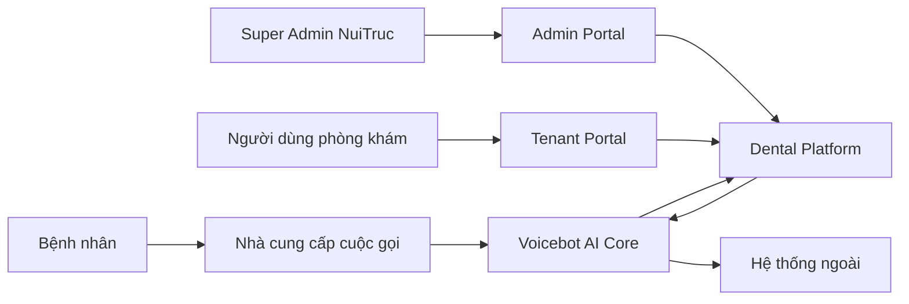
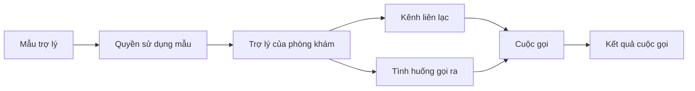

# Tài liệu tổng quan nghiệp vụ Dental Platform + Voicebot

> Đối tượng đọc: Business Analyst, Product Owner, vận hành và các bên liên quan  
> Phạm vi: toàn bộ Dental Platform và Voicebot  
> Hiện trạng được chốt tại: 13/08/2026  
> Mục đích: thống nhất cách hiểu về hệ thống, năng lực hiện có và các vấn đề còn tồn đọng

## 1. Tóm tắt điều hành

Dental Platform + Voicebot là nền tảng hỗ trợ phòng khám nha khoa tự động hóa giao tiếp bằng giọng nói với bệnh nhân.

Hệ thống hướng đến các bài toán chính:

- tiếp nhận cuộc gọi đến và trả lời câu hỏi thường gặp;
- thu thập nhu cầu và thông tin đặt lịch;
- gọi ra để nhắc lịch, chăm sóc lại hoặc thực hiện chiến dịch;
- quản lý danh sách bệnh nhân phục vụ gọi ra;
- lưu lịch sử cuộc gọi, bản ghi âm, nội dung hội thoại và dữ liệu AI thu thập;
- cho phép NuiTruc chuẩn hóa các mẫu trợ lý rồi cấp cho nhiều phòng khám sử dụng;
- theo dõi mức sử dụng của từng phòng khám.

Hệ thống hiện đã đủ nền tảng để thí điểm với cuộc gọi Phone, quản lý nhiều phòng khám, tạo trợ lý từ mẫu, cấu hình kênh, quản lý tài liệu tri thức, khách hàng và chiến dịch gọi ra.

Tuy nhiên, sản phẩm chưa phải một hệ thống quản lý phòng khám hoàn chỉnh. Một số năng lực mới dừng ở mức hỗ trợ vận hành hoặc cần thao tác thủ công, đặc biệt là:

- nhắc lịch tự động chưa kết nối đầy đủ với cách phòng khám cấu hình kịch bản gọi ra;
- chưa có bộ mẫu nghiệp vụ nha khoa chuẩn để dùng ngay khi onboard;
- lịch hẹn hiện chỉ là dữ liệu AI ghi nhận, chưa phải hệ thống lịch hẹn đầy đủ;
- Zalo mới là phần cấu hình giao diện, chưa có luồng vận hành thực tế;
- chưa tích hợp sẵn PMS, CRM, Calendar, SMS hoặc Email;
- chính sách chia sẻ mẫu và tài nguyên dùng chung giữa NuiTruc với phòng khám còn một số điểm cần chốt.

## 2. Bức tranh tổng thể

### 2.1 Hai phần chính của hệ thống

**Dental Platform** là lớp nghiệp vụ và vận hành dành cho NuiTruc và phòng khám. Phần này quản lý:

- phòng khám và người dùng;
- quyền truy cập;
- danh mục mẫu trợ lý;
- việc cấp mẫu cho từng phòng khám;
- trợ lý của phòng khám;
- cấu hình kênh liên lạc;
- khách hàng, lịch hẹn ghi nhận và lịch sử cuộc gọi;
- chiến dịch gọi ra;
- báo cáo sử dụng.

**Voicebot** là bộ máy thực thi hội thoại. Phần này đảm nhiệm:

- nghe và nhận dạng lời nói;
- xử lý hội thoại bằng AI;
- đọc câu trả lời bằng giọng nói;
- chạy kịch bản hội thoại;
- nhận và thực hiện cuộc gọi;
- tra cứu tài liệu tri thức;
- gọi công cụ hoặc hệ thống bên ngoài;
- lưu transcript, recording và dữ liệu của từng phiên gọi.

Người dùng nghiệp vụ thông thường làm việc trên Admin Portal hoặc Tenant Portal. Voicebot hoạt động phía sau như một engine thực thi.

### 2.2 Nguyên tắc đa phòng khám

Mỗi phòng khám là một tenant độc lập.

- Dữ liệu vận hành của các phòng khám phải tách biệt.
- Mỗi phòng khám có người dùng, trợ lý, kênh, tài liệu, khách hàng và lịch sử riêng.
- NuiTruc có thể tạo tài nguyên dùng chung và mẫu chuẩn ở cấp toàn hệ thống.
- Phòng khám chỉ vận hành trên phạm vi được cấp cho mình.

## 3. Vai trò sử dụng

### 3.1 Bệnh nhân

Bệnh nhân không đăng nhập hệ thống. Họ tương tác qua:

- cuộc gọi đến phòng khám;
- cuộc gọi ra từ phòng khám;
- WebRTC trên website;
- trong tương lai có thể qua Zalo hoặc các kênh khác.

### 3.2 Super Admin NuiTruc

Super Admin là đội vận hành nền tảng, có trách nhiệm:

- tạo và quản lý phòng khám;
- tạo tài khoản quản trị phòng khám;
- kích hoạt kết nối Voicebot cho phòng khám;
- tạo, kiểm thử và phát hành mẫu trợ lý;
- cấp mẫu cho phòng khám;
- cấu hình AI dùng chung;
- hỗ trợ phòng khám bằng chức năng đăng nhập giả lập;
- theo dõi usage toàn hệ thống.

### 3.3 Tenant Admin

Tenant Admin là quản trị viên của một phòng khám, có thể:

- cập nhật thông tin phòng khám;
- thêm trợ lý từ mẫu đã được cung cấp;
- điều chỉnh kịch bản nếu được phép;
- tải tài liệu tri thức;
- cấu hình kênh Phone và WebRTC;
- gán trợ lý cho cuộc gọi đến hoặc tình huống gọi ra;
- quản lý người dùng Operator;
- quản lý khách hàng và chiến dịch;
- xem cuộc gọi, lịch hẹn ghi nhận và usage.

### 3.4 Operator

Operator là nhân viên vận hành, lễ tân hoặc chăm sóc khách hàng.

Phạm vi hiện tại chủ yếu là:

- xem dashboard;
- xem lịch sử và chi tiết cuộc gọi;
- nghe recording, đọc transcript;
- xem lịch hẹn AI ghi nhận;
- xem usage.

Operator không có quyền thay đổi các cấu hình quan trọng của phòng khám.

## 4. Các khái niệm cốt lõi

### 4.1 Tenant hoặc Clinic

Tenant là một phòng khám sử dụng nền tảng.

Mỗi tenant có:

- người dùng riêng;
- một không gian Voicebot riêng;
- trợ lý và kênh riêng;
- dữ liệu khách hàng và cuộc gọi riêng;
- trạng thái hoạt động hoặc tạm ngưng.

### 4.2 Agent Template - Mẫu trợ lý

Agent Template là mẫu kịch bản chuẩn do NuiTruc xây dựng.

Ví dụ:

- lễ tân nhận cuộc gọi;
- hỏi đáp dịch vụ nha khoa;
- tiếp nhận nhu cầu đặt lịch;
- nhắc lịch trước 24 giờ;
- gọi chăm sóc sau điều trị;
- gọi mời tái khám.

Template là bản gốc để tái sử dụng, không phải trợ lý đang trực tiếp phục vụ một phòng khám.

Template có vòng đời:

1. soạn bản nháp;
2. kiểm thử;
3. phát hành một phiên bản;
4. đưa vào danh mục;
5. cấp quyền sử dụng cho phòng khám;
6. tạo trợ lý của phòng khám từ phiên bản đã phát hành.

### 4.3 Grant - Quyền sử dụng mẫu

Grant là việc NuiTruc cho phép một phòng khám sử dụng một template.

Theo định hướng nghiệp vụ ban đầu:

- phòng khám chỉ nhìn thấy mẫu đã được cấp;
- Super Admin có thể cấp hoặc thu hồi quyền;
- việc cấp mẫu không tự tạo trợ lý;
- phòng khám vẫn phải thực hiện Add Agent.

Hiện chính sách này chưa hoàn toàn thống nhất với hành vi danh mục thực tế. Đây là một quyết định sản phẩm cần chốt, được nêu tại phần tồn đọng.

### 4.4 Agent - Trợ lý ảo của phòng khám

Agent là một trợ lý cụ thể thuộc về một phòng khám.

Agent có thể:

- được tạo từ template;
- được đặt tên theo mục đích vận hành;
- được điều chỉnh riêng cho phòng khám;
- được gán vào một kênh hoặc tình huống gọi ra;
- chạy độc lập với bản template gốc.

Một template có thể tạo ra nhiều Agent trong cùng một phòng khám.

Ví dụ, từ một mẫu “Nhắc lịch”, phòng khám có thể tạo:

- “Nhắc lịch chi nhánh Quận 1”;
- “Nhắc lịch nha khoa trẻ em”;
- “Nhắc lịch khách VIP”.

Khi template được cập nhật, các Agent đã tạo trước đó hiện không tự động nhận thay đổi. Cơ chế này giúp tránh làm gián đoạn kịch bản đang vận hành, nhưng tạo ra nhu cầu quản lý phiên bản và nâng cấp thủ công.

### 4.5 Workflow - Kịch bản hội thoại

Workflow là luồng các bước mà Agent thực hiện trong một cuộc hội thoại.

Một workflow có thể gồm:

- lời chào;
- hỏi và xác nhận thông tin;
- trả lời câu hỏi bằng AI;
- tra cứu tài liệu;
- rẽ nhánh theo câu trả lời;
- gọi hệ thống bên ngoài;
- chuyển cuộc gọi cho người thật;
- tổng hợp kết quả sau cuộc gọi;
- kết thúc cuộc gọi.

Trong ngôn ngữ vận hành, BA nên dùng “Agent” khi nói về trợ lý của phòng khám và dùng “Workflow” khi nói về logic hội thoại phía sau Agent.

### 4.6 Global Resource - Tài nguyên dùng chung

NuiTruc có thể quản lý các tài nguyên dùng chung để template tái sử dụng:

- Tool;
- Knowledge Base;
- Credential;
- Variable;
- Workflow Template;
- cấu hình AI mặc định.

Tài nguyên dùng chung có hai mục tiêu:

1. giảm công sức cấu hình lặp lại cho từng phòng khám;
2. đảm bảo mẫu trợ lý dùng đúng phiên bản tài nguyên đã được kiểm thử.

Khi một template tham chiếu tài nguyên dùng chung, việc “ghim phiên bản” giúp một thay đổi mới ở cấp NuiTruc không làm hỏng ngay Agent đang chạy.

### 4.7 Knowledge Base - Tài liệu tri thức

Knowledge Base là tập tài liệu để AI tra cứu trong hội thoại.

Ví dụ:

- dịch vụ và chính sách của phòng khám;
- câu hỏi thường gặp;
- hướng dẫn trước và sau điều trị;
- bảng thông tin cơ bản về bác sĩ hoặc chi nhánh.

Hiện có hai nhóm:

- tài liệu dùng chung do NuiTruc chuẩn bị;
- tài liệu riêng do phòng khám tải lên.

Khi Add Agent, tài liệu riêng của phòng khám không tự động được tạo đầy đủ từ template. Phòng khám vẫn cần kiểm tra, tải lên và gắn tài liệu phù hợp.

### 4.8 Tool - Công cụ tích hợp

Tool là hành động mà Agent có thể gọi trong lúc hội thoại.

Ví dụ:

- kiểm tra một thông tin từ CRM;
- gửi dữ liệu sang hệ thống khác;
- tra cứu lịch trống;
- tạo một yêu cầu chăm sóc;
- chuyển dữ liệu vào Google Sheet hoặc API.

Tool là khả năng tái sử dụng. Việc một workflow được phép gọi Tool nào cần được quản lý rõ theo phạm vi toàn hệ thống hoặc phòng khám.

### 4.9 Webhook Node

Webhook Node là một bước trong workflow dùng để gửi dữ liệu sang một hệ thống khác.

Webhook có thể được dùng để:

- gửi thông tin bệnh nhân sau cuộc gọi;
- thông báo một yêu cầu đặt lịch;
- cập nhật CRM;
- kích hoạt quy trình nội bộ;
- gửi kết quả phân loại cuộc gọi.

Webhook không tự tạo ra nghiệp vụ hoàn chỉnh. Nó chỉ là điểm kết nối giữa Voicebot và hệ thống nhận dữ liệu.

Một webhook thường cần:

- địa chỉ nơi nhận;
- dữ liệu cần gửi;
- thời điểm gửi;
- thông tin xác thực nếu hệ thống nhận yêu cầu đăng nhập.

Điểm cần BA lưu ý là quyền sử dụng Credential của webhook khi template được dùng bởi nhiều phòng khám. Cần chốt tài khoản tích hợp là tài khoản chung của NuiTruc hay tài khoản riêng của từng phòng khám.

### 4.10 Credential - Thông tin xác thực tích hợp

Credential là thông tin bí mật dùng để Tool hoặc Webhook đăng nhập vào hệ thống bên ngoài.

Ví dụ:

- API key;
- bearer token;
- tài khoản/mật khẩu;
- header xác thực riêng.

Credential khác với cấu hình AI:

- Credential dùng cho tích hợp nghiệp vụ;
- cấu hình AI dùng cho nhà cung cấp nhận dạng giọng nói, mô hình hội thoại và tổng hợp giọng nói.

### 4.11 Provider - Nhà cung cấp AI

Provider cung cấp các năng lực:

- chuyển giọng nói thành văn bản;
- xử lý hội thoại bằng mô hình AI;
- chuyển văn bản thành giọng nói.

Định hướng hiện tại là Super Admin cấu hình nhà cung cấp dùng chung và đồng bộ xuống các phòng khám. Tenant chỉ xem trạng thái đã được cấu hình, không xem khóa bí mật.

### 4.12 Variable - Biến dữ liệu

Variable là dữ liệu workflow sử dụng hoặc thu thập.

Ví dụ:

- tên bệnh nhân;
- số điện thoại;
- ngày giờ mong muốn;
- dịch vụ quan tâm;
- chi nhánh;
- kết quả xác nhận lịch.

Cần phân biệt:

- ngữ cảnh ban đầu: dữ liệu đã biết trước khi gọi;
- dữ liệu thu thập: dữ liệu AI lấy được trong cuộc hội thoại;
- biến dùng chung: định nghĩa chuẩn để các template dùng nhất quán.

### 4.13 Channel - Kênh liên lạc

Hệ thống định hướng hỗ trợ:

- Phone;
- WebRTC trên website;
- Zalo OA.

Trạng thái hiện tại:

- Phone hỗ trợ inbound và campaign outbound;
- WebRTC hỗ trợ tương tác trên website, chưa phải kênh campaign hoàn chỉnh;
- Zalo mới ở mức giao diện cấu hình, chưa có runtime vận hành.

### 4.14 Outbound Use Case - Tình huống gọi ra

Outbound Use Case là một mục đích gọi ra được đặt tên và gắn với một Agent.

Ví dụ:

- nhắc lịch trước 24 giờ;
- gọi xác nhận lịch;
- gọi chăm sóc sau nhổ răng;
- gọi mời tái khám;
- gọi giới thiệu chương trình ưu đãi.

Campaign chọn Channel và Outbound Use Case. Người dùng nghiệp vụ không cần chọn trực tiếp workflow kỹ thuật.

### 4.15 Campaign - Chiến dịch gọi ra

Campaign là một đợt gọi ra cho nhiều người.

Nguồn danh sách có thể là:

- nhập trực tiếp;
- tải tệp CSV hoặc Excel;
- chọn từ danh sách khách hàng đã lưu.

Trong MVP, campaign thực tế chỉ chạy qua Phone.

### 4.16 Customer - Khách hàng hoặc bệnh nhân

Customer là bản ghi liên hệ của phòng khám, dùng chủ yếu cho campaign.

Thông tin cơ bản gồm:

- số điện thoại;
- tên;
- email nếu có;
- nguồn nhập.

Customer hiện chưa phải hồ sơ bệnh nhân đầy đủ và chưa được liên kết thành một hành trình điều trị thống nhất với lịch hẹn, cuộc gọi và PMS.

### 4.17 Call và Workflow Run

Mỗi lần Agent thực hiện một cuộc hội thoại được ghi nhận là một lần chạy.

Kết quả có thể gồm:

- trạng thái cuộc gọi;
- thời lượng;
- transcript;
- recording;
- dữ liệu AI thu thập;
- chi phí hoặc usage;
- kết quả các bước tích hợp.

Dental Platform nhận kết quả cần thiết từ Voicebot để hiển thị cho phòng khám.

### 4.18 Appointment - Lịch hẹn ghi nhận

Appointment hiện là thông tin lịch hẹn do AI thu thập sau cuộc gọi.

Đây chưa phải hệ thống quản lý lịch hẹn đầy đủ vì chưa có:

- kiểm tra lịch trống theo bác sĩ hoặc ghế;
- xử lý trùng lịch;
- sửa, hủy hoặc đổi lịch đầy đủ;
- xác nhận hai chiều với PMS;
- trạng thái khám và điều trị;
- đồng bộ Calendar.

BA nên sử dụng tên “Lịch hẹn ghi nhận” để tránh tạo kỳ vọng rằng đây là lịch vận hành chính thức của phòng khám.

### 4.19 Reminder - Nhắc lịch

Reminder là việc hệ thống gọi cho bệnh nhân trước lịch hẹn.

Một reminder cần:

- nguồn lịch hẹn đáng tin cậy;
- thời điểm kích hoạt;
- Agent nhắc lịch;
- Channel gọi;
- dữ liệu bệnh nhân và lịch hẹn;
- kết quả gọi và quy tắc thử lại.

Nền tảng đã có các thành phần cho gọi ra, nhưng luồng tự động từ lịch hẹn đến Agent được cấu hình trên Channel chưa hoàn thiện end-to-end.

### 4.20 Usage

Usage phản ánh mức sử dụng Voicebot, ví dụ:

- số cuộc gọi;
- tổng số phút;
- số phiên chạy;
- chi phí ước tính nếu có dữ liệu;
- phân bổ theo tenant, workflow hoặc channel.

Usage hiện phục vụ giám sát. Đây chưa phải hệ thống billing, hóa đơn hoặc quản lý gói dịch vụ hoàn chỉnh.

## 5. Quan hệ giữa Template, Agent, Channel và Call

Quy tắc cần nhớ:

- Template là bản gốc do NuiTruc quản lý.
- Grant là quyền để phòng khám dùng Template.
- Add Agent tạo một bản phục vụ riêng cho phòng khám.
- Agent không tự chạy nếu chưa được gán vào Channel hoặc Outbound Use Case.
- Mỗi Call tạo ra kết quả và dữ liệu thu thập.

## 6. Các luồng nghiệp vụ chính

### 6.1 Onboard một phòng khám

1. Super Admin tạo phòng khám.
2. Super Admin tạo tài khoản Tenant Admin.
3. Super Admin kích hoạt không gian Voicebot cho phòng khám.
4. Super Admin cấu hình hoặc đồng bộ Provider AI.
5. Super Admin cấp các Template phù hợp.
6. Tenant Admin đăng nhập Tenant Portal.
7. Tenant Admin thêm Agent từ Template.
8. Tenant Admin tải tài liệu tri thức riêng.
9. Tenant Admin cấu hình Phone hoặc WebRTC.
10. Tenant Admin gán Agent cho cuộc gọi đến và các tình huống gọi ra.
11. Hai bên thực hiện cuộc gọi kiểm thử trước khi vận hành.

Điểm kiểm soát nghiệp vụ:

- phòng khám đã được provision;
- Provider AI đã sẵn sàng;
- Template đã publish;
- Agent đã được tạo;
- tài liệu đúng phòng khám;
- Agent đã được gán vào Channel;
- webhook sau cuộc gọi truy cập được Dental Platform;
- đã kiểm thử transcript, recording và dữ liệu lịch hẹn.

### 6.2 NuiTruc tạo và phát hành Template

1. Xác định use case và kết quả mong muốn.
2. Chuẩn hóa dữ liệu đầu vào và dữ liệu cần thu thập.
3. Thiết kế hội thoại.
4. Gắn Tool, Knowledge Base, Variable và Credential cần thiết.
5. Kiểm thử các nhánh chính và trường hợp lỗi.
6. Publish một phiên bản.
7. Đưa vào catalog.
8. Cấp cho các phòng khám phù hợp.

Template mới không tự động thay thế Agent đã tồn tại tại phòng khám.

### 6.3 Phòng khám Add Agent

1. Tenant Admin chọn Template có sẵn.
2. Đặt tên cho Agent.
3. Hệ thống tạo một Agent thuộc phòng khám.
4. Các tham chiếu tài nguyên được kiểm tra hoặc chuyển sang phạm vi phù hợp.
5. Tenant Admin bổ sung Knowledge Base và cấu hình riêng nếu cần.
6. Tenant Admin gán Agent vào Channel hoặc Outbound Use Case.
7. Kiểm thử trước khi publish/vận hành.

Nếu phụ thuộc của Template chưa sẵn sàng, việc Add Agent có thể thất bại hoặc Agent không hoạt động đúng. Vì vậy, Template cần có checklist publish và dependency rõ ràng.

### 6.4 Cuộc gọi đến

1. Bệnh nhân gọi số của phòng khám.
2. Nhà cung cấp Phone chuyển cuộc gọi tới Voicebot.
3. Voicebot chọn Agent inbound đã gán cho Channel.
4. Agent trò chuyện, tra cứu tài liệu và thu thập dữ liệu.
5. Agent có thể gọi Tool/Webhook hoặc chuyển sang người thật.
6. Sau cuộc gọi, Voicebot gửi kết quả về Dental Platform.
7. Phòng khám xem transcript, recording và lịch hẹn ghi nhận.

### 6.5 Ghi nhận lịch hẹn

1. Workflow hỏi tên, số điện thoại và thời gian mong muốn.
2. AI đưa dữ liệu vào các Variable chuẩn.
3. Kết thúc cuộc gọi, kết quả được gửi về Dental Platform.
4. Nếu đủ trường dữ liệu, hệ thống tạo một lịch hẹn ghi nhận.
5. Nhân viên kiểm tra lại thông tin.

Hiện chất lượng của bước này phụ thuộc vào việc các workflow sử dụng đúng tên biến và đúng định dạng dữ liệu.

### 6.6 Nhắc lịch tự động

Luồng nghiệp vụ mong muốn:

1. Hệ thống tìm lịch hẹn sắp đến.
2. Xác định phòng khám, bệnh nhân và thời điểm cần nhắc.
3. Chọn Agent “Nhắc lịch” đã được cấu hình trên Phone Channel.
4. Khởi tạo cuộc gọi với ngữ cảnh lịch hẹn.
5. Ghi nhận bệnh nhân xác nhận, yêu cầu đổi lịch hoặc không nghe máy.
6. Thử lại hoặc chuyển nhân viên theo quy tắc.

Luồng này chưa hoàn thiện do bộ kích hoạt reminder hiện chưa dùng cùng nguồn cấu hình với Outbound Use Case trên Channel.

### 6.7 Campaign gọi ra

1. Tenant Admin chọn Phone.
2. Chọn Outbound Use Case.
3. Chọn danh sách từ nhập tay, file hoặc Customer Database.
4. Hệ thống chuẩn hóa và loại số trùng.
5. Tạo Campaign.
6. Voicebot thực hiện các cuộc gọi.
7. Người dùng theo dõi tiến độ và xem kết quả từng cuộc gọi.

Campaign hiện là phương án thực tế để chạy các đợt reminder hoặc chăm sóc hàng loạt khi automation theo lịch chưa hoàn chỉnh.

### 6.8 Quản lý tài liệu tri thức

1. NuiTruc chuẩn bị tài liệu dùng chung nếu phù hợp.
2. Phòng khám tải tài liệu riêng.
3. Tài liệu được xử lý để AI có thể tra cứu.
4. Người cấu hình gắn tài liệu vào đúng Agent hoặc node hội thoại.
5. Kiểm thử câu hỏi thực tế.
6. Khi tài liệu thay đổi, kiểm thử lại các câu trả lời quan trọng.

## 7. Hiện trạng năng lực

### 7.1 Đang có thể sử dụng

- quản lý nhiều phòng khám;
- tạo Tenant Admin và Operator;
- kích hoạt không gian Voicebot cho tenant;
- Admin Portal và Tenant Portal theo role;
- tạo, publish và sử dụng workflow;
- tạo Agent từ Template;
- cho phép nhiều Agent từ một Template;
- chỉnh sửa workflow trên portal;
- cấu hình Phone và WebRTC;
- gán Agent inbound và Outbound Use Case;
- cuộc gọi Phone inbound và outbound;
- WebRTC embed;
- tải và sử dụng Knowledge Base;
- quản lý Tool và Credential ở mức Voicebot;
- lưu transcript và recording;
- danh sách lịch hẹn AI ghi nhận;
- quản lý Customer;
- import CSV/Excel;
- Campaign gọi ra qua Phone;
- báo cáo usage cơ bản;
- Super Admin đăng nhập giả lập để hỗ trợ tenant.

### 7.2 Đã có nền tảng nhưng còn giới hạn

**Agent Template**

- Có cơ chế template, publish và Add Agent.
- Chưa có đầy đủ bộ template nha khoa chuẩn được xác nhận sẵn để triển khai hàng loạt.
- Agent đã tạo không tự cập nhật khi template thay đổi.

**Tài nguyên dùng chung**

- Tool, Knowledge Base, Credential và Variable đã có một phần cơ chế global/organization.
- Việc tham chiếu, ghim phiên bản và chuyển phạm vi khi copy đã được cải thiện.
- Quy tắc riêng cho Credential, đặc biệt với Webhook, vẫn cần được mô tả thống nhất theo nghiệp vụ.

**AI Provider**

- Super Admin có thể cấu hình global và đồng bộ xuống tenant.
- Định hướng đã chốt trong `new_interface.md` là dùng cấu hình global mặc định và cho phép tenant override.
- Dental Portal hiện chủ yếu cho tenant xem trạng thái; trải nghiệm tự cấu hình override và cách xác định ownership theo tenant chưa đồng nhất với định hướng này.

**Appointment**

- Có thể tạo lịch hẹn ghi nhận từ dữ liệu sau cuộc gọi.
- Chưa có kiểm tra lịch trống, sửa/hủy, xác nhận, đồng bộ PMS hoặc Calendar.

**Reminder**

- Có dữ liệu lịch hẹn, bộ kích hoạt và năng lực gọi ra.
- Chưa nối hoàn chỉnh với Agent nhắc lịch được tenant cấu hình tại Channel.

**Fallback to Human**

- Có thể chuyển cuộc gọi sang một số điện thoại.
- Chưa có hàng đợi công việc, phân công Operator và theo dõi xử lý trên Portal.

**Reporting**

- Có số cuộc gọi, thời lượng và usage cơ bản.
- Chưa có KPI nha khoa như tỷ lệ đặt lịch, tỷ lệ xác nhận, no-show, recall conversion hoặc upsell conversion.

**RBAC và hỗ trợ**

- Có ba role chính và giới hạn quyền cơ bản.
- Chưa có audit trail đầy đủ cho mọi thao tác hoặc phiên impersonate.

### 7.3 Chưa thuộc MVP hiện tại

- Zalo OA voice runtime;
- campaign chạy qua Zalo hoặc WebRTC;
- PMS/CRM connector chuyên biệt cho nha khoa;
- Google Calendar integration;
- SMS, Email và Zalo reminder;
- Appointment Management đầy đủ;
- Recall service tự động theo quy tắc điều trị;
- Upsell engine theo dịch vụ;
- FAQ triage thành ticket nghiệp vụ;
- Operator fallback queue;
- AI Coach hoặc Shadow Mode;
- billing, invoice và gói Basic/Pro;
- dashboard KPI nha khoa;
- hồ sơ bệnh nhân thống nhất;
- hệ thống tìm kiếm văn bản hoặc knowledge graph riêng.

Các mục này là phạm vi phát triển tương lai, không nên được ghi nhận như bug của MVP trừ khi Product chính thức đưa vào cam kết.

## 8. Tồn đọng cần theo dõi

### 8.1 Mức ưu tiên 1 - Ảnh hưởng trực tiếp đến pilot

#### O-01. Reminder tự động chưa nối với cấu hình Channel

**Hiện trạng**

Tenant cấu hình Agent nhắc lịch trong Outbound Use Case của Phone Channel, nhưng bộ kích hoạt reminder đang đọc một cấu hình cũ khác.

**Ảnh hưởng nghiệp vụ**

- lịch hẹn có thể không được gọi nhắc tự động;
- tenant thấy đã cấu hình nhưng hệ thống vẫn bỏ qua;
- khó cam kết use case “nhắc lịch tự động”.

**Giải pháp tạm thời**

- tạo Campaign gọi ra thủ công;
- hoặc vận hành cấu hình bổ sung ngoài giao diện.

**Cần thực hiện**

Engineering nối reminder trigger với Phone Channel và Outbound Use Case. Product cần chốt cách chọn use case mặc định và quy tắc thử lại.

#### O-02. Chưa có bộ Dental Template chuẩn

**Hiện trạng**

Hạ tầng Template đã có nhưng backlog vẫn còn việc tạo các mẫu nha khoa dùng ngay.

**Ảnh hưởng nghiệp vụ**

- onboard mỗi phòng khám mất nhiều công sức;
- chất lượng hội thoại không đồng nhất;
- khó kiểm thử và đo hiệu quả theo một baseline chung.

**Giải pháp tạm thời**

Ops tạo workflow thủ công hoặc sao chép từ workflow đã thử nghiệm.

**Cần thực hiện**

Product và BA định nghĩa bộ mẫu tối thiểu. Đề xuất bắt đầu với:

1. Inbound Reception/FAQ;
2. Appointment Intake;
3. Appointment Reminder;
4. Post-treatment Follow-up;
5. Recall.

Mỗi mẫu cần có mục tiêu, dữ liệu đầu vào, dữ liệu đầu ra, tình huống chuyển người thật và tiêu chí nghiệm thu.

#### O-03. Chính sách Grant và catalog chưa thống nhất

**Hiện trạng**

Thiết kế nghiệp vụ yêu cầu tenant chỉ dùng Template đã được grant. Hành vi catalog hiện tại có thể cho tenant nhìn thấy hoặc sử dụng rộng hơn phạm vi grant.

**Ảnh hưởng nghiệp vụ**

- Super Admin có thao tác grant nhưng quyền có thể không tạo ra khác biệt;
- tenant có thể dùng mẫu chưa phù hợp với gói dịch vụ;
- khó quản lý rollout theo nhóm khách hàng.

**Giải pháp tạm thời**

Ops chỉ publish các Template sẵn sàng cho mọi tenant.

**Quyết định cần chốt**

- Phương án A: bắt buộc grant theo từng tenant;
- Phương án B: mọi Template published đều mở cho mọi tenant;
- Phương án C: catalog mở theo gói hoặc nhóm tenant.

Product sở hữu quyết định; Engineering đồng bộ UI, API và tài liệu theo một phương án duy nhất.

#### O-04. Migration tenant cũ chưa hoàn tất

**Hiện trạng**

Một số tenant cũ có thể được provision theo mô hình workflow/adopt trước khi có Agent và Channel model hiện tại.

**Ảnh hưởng nghiệp vụ**

- workflow cũ không xuất hiện đúng trong danh sách Agent;
- Channel có thể giữ cấu hình cũ;
- reminder và campaign có thể trỏ sai workflow;
- hỗ trợ tenant cũ tốn thao tác thủ công.

**Giải pháp tạm thời**

Re-onboard, Add Agent và gán lại Channel thủ công.

**Cần thực hiện**

Ops lập danh sách tenant cũ. Engineering chuẩn bị migration hoặc checklist chuyển đổi có kiểm chứng.

#### O-05. Chuẩn dữ liệu Appointment chưa được quản trị

**Hiện trạng**

Appointment chỉ được tạo khi workflow trả đúng các trường dữ liệu kỳ vọng.

**Ảnh hưởng nghiệp vụ**

- AI đã hỏi được lịch nhưng portal không tạo bản ghi;
- dữ liệu sai định dạng hoặc thiếu trường;
- khó dùng chung nhiều template.

**Giải pháp tạm thời**

Kiểm thử từng workflow và kiểm tra transcript thủ công.

**Cần thực hiện**

BA định nghĩa data dictionary chuẩn cho appointment, quy tắc validate và tình huống thiếu dữ liệu. Product chốt lịch hẹn có cần nhân viên xác nhận trước khi coi là chính thức hay không.

### 8.2 Mức ưu tiên 2 - Cần chốt trước khi mở rộng nhiều tenant

#### O-06. Mô hình Global AI Config và Tenant Override

**Hiện trạng**

Định hướng sản phẩm đã chốt là cấu hình của tenant được ưu tiên, nếu tenant không cấu hình thì dùng global default. Tuy nhiên, Dental Platform hiện thiên về mô hình Super Admin cấu hình rồi Sync All; tenant chủ yếu chỉ xem trạng thái. Cách gắn override với toàn tenant, cách thao tác trên Portal và cách ghi nhận nguồn cấu hình trong usage chưa hoàn chỉnh.

**Ảnh hưởng nghiệp vụ**

- không rõ ai chịu chi phí Provider;
- khó hỗ trợ khi một tenant dùng cấu hình khác;
- khó xây dựng gói dịch vụ và quota;
- có thể khác nhau giữa các user trong cùng tenant nếu ownership không thống nhất.

**Quyết định cần chốt**

- một override áp dụng cho toàn phòng khám hay theo từng tài khoản;
- ai được phép nhập và thay đổi khóa riêng;
- usage phải thể hiện rõ đang dùng global hay tenant override;
- NuiTruc hỗ trợ và tính phí thế nào cho hai nguồn cấu hình.

Product, Finance/Ops và Engineering cần cụ thể hóa mô hình đã chốt trước khi xây billing.

#### O-07. Quyền sở hữu Credential của Tool và Webhook

**Hiện trạng**

Template có thể dùng Credential chung, trong khi Agent chạy trong phạm vi tenant. Cơ chế copy/rebind đã được bổ sung nhưng ý nghĩa nghiệp vụ chưa thống nhất hoàn toàn với spec.

**Ảnh hưởng nghiệp vụ**

- tenant có thể vô tình dùng tài khoản tích hợp của NuiTruc;
- Credential chung có thể gửi dữ liệu nhiều tenant vào cùng một hệ thống;
- Credential riêng có thể thiếu khi Add Agent;
- khó xác định ai chịu trách nhiệm khi token hết hạn.

**Quyết định cần chốt**

Mỗi Tool/Webhook phải được phân loại:

- dùng Credential nền tảng;
- dùng Credential riêng từng tenant;
- không cần xác thực.

BA cần bổ sung quy tắc dữ liệu được phép gửi, chủ sở hữu Credential và cách xử lý khi Credential không còn hợp lệ.

#### O-08. Dependency của Template chưa có checklist nghiệp vụ

**Hiện trạng**

Một Template có thể phụ thuộc vào Tool, KB, Credential, Variable và Provider. Không phải phụ thuộc nào cũng tự chuyển thành cấu hình sẵn sàng cho tenant.

**Ảnh hưởng nghiệp vụ**

- Add Agent thành công nhưng chưa dùng được;
- lỗi chỉ xuất hiện khi kiểm thử hoặc gọi thật;
- onboard không nhất quán.

**Cần thực hiện**

Mỗi Template cần “deployment manifest” ở góc nhìn nghiệp vụ:

- tài nguyên đi kèm;
- tài nguyên tenant phải cung cấp;
- Provider bắt buộc;
- dữ liệu đầu vào;
- webhook đích;
- checklist kiểm thử;
- owner hỗ trợ.

#### O-09. Template update không tự cập nhật Agent

**Hiện trạng**

Agent là bản sao độc lập. Template phát hành phiên bản mới không thay đổi Agent đang chạy.

**Ảnh hưởng nghiệp vụ**

- bản sửa lỗi không tự đến tenant;
- nhiều phiên bản Agent tồn tại;
- khó biết tenant nào cần nâng cấp.

**Giải pháp tạm thời**

Ops thông báo, tạo Agent mới hoặc sửa thủ công.

**Quyết định cần chốt**

Product cần xác định có cần chức năng:

- thông báo “có phiên bản mới”;
- so sánh phiên bản;
- nâng cấp có kiểm soát;
- rollback;
- bắt buộc nâng cấp cho lỗi nghiêm trọng.

#### O-10. Tài liệu hiện trạng đang không đồng nhất

**Hiện trạng**

Một số tài liệu cũ vẫn ghi rằng Portal, NT Backend hoặc Workflow Builder chưa có, trong khi F01-F06 đã triển khai. Mô hình Adopt cũ cũng còn xuất hiện trong tài liệu.

**Ảnh hưởng nghiệp vụ**

- BA có thể lập roadmap dựa trên hiện trạng sai;
- Dev và QA hiểu khác nhau về luồng Add Agent;
- stakeholder đánh giá thiếu hoặc thừa phạm vi.

**Cần thực hiện**

Chỉ định một source of truth cho:

- product scope;
- business requirements;
- implementation status;
- API contract;
- decision log.

Các tài liệu cũ cần được đánh dấu “superseded” hoặc cập nhật.

#### O-11. Vòng đời Global Resource chưa hoàn chỉnh

**Hiện trạng**

Định hướng yêu cầu Tool, Knowledge Base, Credential và Variable dùng chung có bản nháp, bản phát hành, lịch sử phiên bản, soft-delete và chỉ hard-delete khi không còn workflow tham chiếu. Implementation hiện mới đáp ứng từng phần và chưa đồng đều giữa các loại tài nguyên.

**Ảnh hưởng nghiệp vụ**

- Super Admin khó biết thay đổi nào đang ảnh hưởng tenant nào;
- thao tác xóa có thể khác nhau giữa các loại tài nguyên;
- chưa có trải nghiệm đầy đủ để xem phiên bản cũ hoặc khôi phục;
- tên tài nguyên global có thể không được kiểm soát nhất quán;
- khó dọn dữ liệu mà vẫn đảm bảo Agent cũ tiếp tục chạy.

**Cần thực hiện**

BA và Product thống nhất vòng đời chung cho mọi Global Resource. Engineering hoàn thiện cùng một bộ quy tắc publish, version, deprecate, restore, usage count và hard-delete có kiểm soát.

#### O-12. Các giao diện chưa dùng thống nhất một luồng copy Template

**Hiện trạng**

Dental Platform đã dùng luồng Add Agent mới có kiểm tra dependency. Một luồng copy cũ vẫn còn trong Core UI và có thể bỏ qua một số quy tắc về version pinning, dependency hoặc metadata nguồn.

**Ảnh hưởng nghiệp vụ**

- cùng một Template nhưng tạo từ hai giao diện có thể cho kết quả khác nhau;
- khó hỗ trợ và điều tra lỗi;
- Agent được tạo từ luồng cũ có thể thiếu tài nguyên cần thiết;
- tài liệu hướng dẫn không thể đưa ra một quy trình duy nhất.

**Giải pháp tạm thời**

Đối với tenant nha khoa, chỉ sử dụng Add Agent từ Dental Portal.

**Cần thực hiện**

Engineering hợp nhất về một luồng copy chính thức hoặc loại bỏ luồng cũ. Product xác nhận giao diện nào được phép sử dụng trong vận hành.

### 8.3 Mức ưu tiên 3 - Hạn chế vận hành và sản phẩm

#### O-13. Zalo hiển thị nhưng chưa vận hành

**Ảnh hưởng**

Người dùng có thể hiểu nhầm rằng đã hỗ trợ Zalo đầy đủ.

**Đề xuất**

Gắn nhãn “Chưa hỗ trợ” rõ ràng hoặc ẩn khỏi tenant pilot cho đến khi có runtime.

#### O-14. Campaign chỉ chạy qua Phone

**Ảnh hưởng**

Không thể tạo campaign WebRTC hoặc Zalo dù các Channel có thể xuất hiện trên giao diện.

**Đề xuất**

Giới hạn lựa chọn trên UI theo năng lực thật và đưa các kênh khác vào roadmap riêng.

#### O-15. Knowledge Base không tự hoàn thiện khi Add Agent

**Ảnh hưởng**

Agent mới có thể trả lời kém hoặc không có thông tin riêng của phòng khám.

**Đề xuất**

Thêm checklist bắt buộc upload/gắn KB trước khi đưa Agent vào vận hành.

#### O-16. Provider Sync phụ thuộc thao tác vận hành

**Ảnh hưởng**

Tenant có Agent nhưng không thể gọi nếu Provider chưa được cấu hình hoặc đồng bộ.

**Đề xuất**

Hiển thị readiness rõ ràng và đưa Provider Sync vào checklist provision.

#### O-17. Post-call webhook cần địa chỉ truy cập được

**Ảnh hưởng**

Nếu Voicebot không gửi được kết quả, Portal có thể thiếu lịch sử hoặc lịch hẹn ghi nhận.

**Đề xuất**

Thêm health check và cảnh báo khi webhook thất bại.

#### O-18. Dữ liệu phân tán giữa Dental Platform và Voicebot

**Ảnh hưởng**

Không có một hồ sơ bệnh nhân duy nhất chứa toàn bộ khách hàng, cuộc gọi, lịch hẹn và điều trị.

**Đề xuất**

Trong MVP, định nghĩa rõ hệ thống nào là nguồn dữ liệu chính cho từng loại dữ liệu. Về dài hạn, thiết kế Patient/Appointment domain và đồng bộ PMS.

#### O-19. Thiếu KPI nghiệp vụ

**Ảnh hưởng**

Usage cho biết hệ thống được dùng bao nhiêu, nhưng chưa chứng minh hiệu quả kinh doanh.

**KPI nên ưu tiên**

- tỷ lệ cuộc gọi được AI xử lý hoàn tất;
- tỷ lệ chuyển người thật;
- tỷ lệ thu thập đủ thông tin;
- tỷ lệ tạo lịch hẹn;
- tỷ lệ xác nhận reminder;
- tỷ lệ không nghe máy;
- tỷ lệ no-show;
- recall conversion;
- chi phí trên một lịch hẹn thành công.

## 9. Các quyết định Product/BA cần chốt

### D-01. Chiến lược sản phẩm

Khuyến nghị xác nhận chính thức “MVP trước, Domain Platform sau”:

- giai đoạn hiện tại tập trung Phone, Portal, Agent Template, Campaign và pilot;
- giai đoạn sau mới xây Appointment domain, PMS, Zalo, billing và KPI nâng cao.

### D-02. Quyền truy cập Template

Chọn một trong ba mô hình:

1. cấp riêng từng tenant;
2. catalog mở cho mọi tenant;
3. catalog theo gói dịch vụ hoặc nhóm tenant.

### D-03. Chính sách nâng cấp Agent

Chốt Agent là:

- bản sao độc lập vĩnh viễn;
- bản sao có thể nâng cấp;
- hoặc tham chiếu trực tiếp tới Template với một số phần override.

Mô hình hiện tại là bản sao độc lập và không tự cập nhật.

### D-04. Ownership của AI Provider

Giữ nguyên nguyên tắc global default và tenant override đã thống nhất, đồng thời chốt cách vận hành:

- override thuộc toàn tenant hay từng user;
- role nào được nhập khóa riêng;
- tenant dùng khóa riêng được tính phí thế nào;
- khi khóa tenant lỗi có được fallback về global hay phải dừng;
- usage hiển thị nguồn cấu hình ra sao.

### D-05. Ownership của Credential tích hợp

Với từng tích hợp, chốt:

- tài khoản chung hay riêng;
- dữ liệu nào được gửi;
- ai xoay vòng token;
- xử lý tenant bị suspend;
- xử lý token hết hạn;
- audit thao tác sử dụng Credential.

### D-06. Appointment có phải lịch chính thức hay không

Chọn:

- chỉ là lead/yêu cầu đặt lịch;
- là lịch tạm chờ nhân viên xác nhận;
- hoặc là lịch chính thức sau khi kiểm tra PMS.

### D-07. Reminder vận hành theo cách nào

Chốt:

- gọi từng lịch theo cron;
- gom thành Campaign;
- hay để PMS phát sự kiện.

Đồng thời chốt window, số lần retry, khoảng cách retry và escalation sang nhân viên.

### D-08. Phạm vi Zalo

Chốt Zalo là:

- voice;
- messaging;
- hay cả hai.

Không nên chỉ dùng tên “Zalo Channel” nếu chưa xác định loại tương tác.

### D-09. Bộ KPI thành công của pilot

Trước khi mở rộng tenant, Product và BA cần đặt mục tiêu định lượng cho:

- thời gian onboard;
- tỷ lệ cuộc gọi thành công;
- tỷ lệ thu thập đủ dữ liệu;
- số lịch hẹn ghi nhận;
- tỷ lệ reminder thành công;
- tỷ lệ chuyển người thật;
- mức hài lòng của nhân viên phòng khám;
- chi phí trên cuộc gọi.

## 10. Đề xuất thứ tự xử lý

### Giai đoạn 1 - Làm pilot vận hành ổn định

1. nối reminder với Channel/Outbound Use Case;
2. tạo ba Dental Template đầu tiên;
3. chuẩn hóa Variable và Appointment data dictionary;
4. chốt Grant policy;
5. kiểm kê và migrate tenant cũ;
6. hoàn thiện checklist onboarding và go-live.

### Giai đoạn 2 - Mở rộng nhiều phòng khám

1. chuẩn hóa dependency manifest cho Template;
2. chốt Global AI và tenant override;
3. chốt Credential ownership;
4. thêm cảnh báo Provider/Webhook/KB readiness;
5. bổ sung quản lý phiên bản và nâng cấp Agent;
6. hợp nhất tài liệu và API contract.

### Giai đoạn 3 - Mở rộng nghiệp vụ nha khoa

1. Appointment domain và PMS/Calendar;
2. reminder đa kênh;
3. Recall và chăm sóc sau điều trị;
4. fallback queue cho Operator;
5. KPI nghiệp vụ;
6. billing và gói dịch vụ;
7. Zalo runtime.

## 11. Checklist BA cho một use case mới

Trước khi đưa một use case vào phát triển, BA cần trả lời:

### Mục tiêu

- Ai sử dụng?
- Vấn đề nghiệp vụ nào được giải quyết?
- Kết quả thành công là gì?
- KPI nào đo được?

### Dữ liệu

- Dữ liệu ban đầu lấy từ đâu?
- Dữ liệu nào AI phải thu thập?
- Trường nào bắt buộc?
- Hệ thống nào là nguồn dữ liệu chính?
- Dữ liệu được giữ trong bao lâu?

### Hội thoại

- Các nhánh chính là gì?
- Khi nào phải xác nhận lại?
- Khi nào chuyển người thật?
- Khi người dùng không nghe hoặc không trả lời thì làm gì?
- Ngôn ngữ và giọng nói nào được dùng?

### Tích hợp

- Có gọi Tool hoặc Webhook không?
- Credential thuộc NuiTruc hay tenant?
- Hệ thống đích trả lỗi thì xử lý thế nào?
- Có dữ liệu nhạy cảm nào được gửi ra ngoài?

### Vận hành

- Ai publish Template?
- Ai cấp Template?
- Ai bổ sung KB?
- Ai gán Channel?
- Ai theo dõi lỗi?
- Agent cũ được nâng cấp thế nào?

### Nghiệm thu

- Có bộ cuộc hội thoại mẫu không?
- Có dữ liệu kiểm thử không?
- Có test trường hợp lỗi không?
- Có kiểm tra transcript, recording và dữ liệu đầu ra không?
- Có phương án quay lại phiên bản trước không?

## 12. Từ điển thuật ngữ ngắn

**Add Agent**  
Tạo một trợ lý riêng cho phòng khám từ một Template hoặc từ bản trống.

**Agent**  
Trợ lý ảo cụ thể thuộc một phòng khám.

**Agent Template**  
Mẫu trợ lý do NuiTruc quản lý và tái sử dụng.

**Campaign**  
Đợt gọi ra cho nhiều khách hàng.

**Channel**  
Kênh tương tác như Phone, WebRTC hoặc Zalo.

**Credential**  
Thông tin bí mật để đăng nhập hệ thống tích hợp.

**Global Resource**  
Tài nguyên dùng chung ở cấp nền tảng.

**Grant**  
Quyền một tenant được sử dụng Template.

**Knowledge Base**  
Tập tài liệu để AI tra cứu.

**Outbound Use Case**  
Mục đích gọi ra được đặt tên và gắn với một Agent.

**Provider**  
Nhà cung cấp năng lực AI cho nghe, hiểu và nói.

**Tenant**  
Một phòng khám trên nền tảng.

**Tool**  
Hành động tích hợp mà workflow có thể gọi.

**Variable**  
Dữ liệu workflow nhận vào, sử dụng hoặc thu thập.

**Webhook Node**  
Bước gửi dữ liệu từ workflow sang hệ thống khác.

**Workflow**  
Logic hội thoại phía sau Agent.

**Workflow Run**  
Một lần thực thi workflow, thường tương ứng một cuộc gọi.

## 13. Nguồn tham chiếu và nguyên tắc đọc

Tài liệu này tổng hợp từ:

- [Đề xuất tích hợp Dental Platform và Voicebot](nt-dental-platform-mvp/proposal.md);
- [Định hướng giao diện và tài nguyên dùng chung](new_interface.md);
- [API Reference](API_REFERENCE.md);
- [Project Backlog F01-F06](nt-dental-platform-mvp/specs/BACKLOG.md);
- các requirements, design và decision log trong `nt-dental-platform-mvp/specs/`;
- implementation audit cập nhật đến ngày 13/08/2026.

Lưu ý:

- [mvp.md](nt-dental-platform-mvp/mvp.md) là đánh giá tại một thời điểm cũ và chưa phản ánh đầy đủ F01-F06 đã triển khai.
- Mô hình “Adopt Template” trong một số tài liệu cũ đã được thay bằng “Add Agent”.
- Khi tài liệu và hành vi hiện tại khác nhau, cần mở một business decision hoặc gap; không nên tự ngầm chọn một phía.
- Tài liệu này mô tả hiện trạng và quyết định cần chốt, không thay thế requirements chi tiết hoặc acceptance criteria của từng feature.
